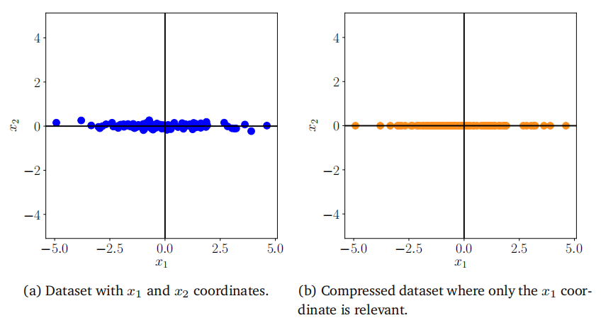
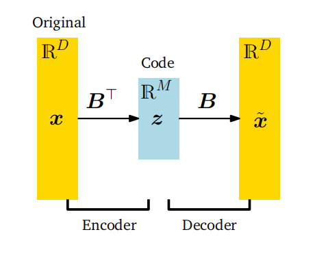

# 第10章 主成分分析与降维

直接处理高维数据（如图像）会带来一些困难：难以分析、解释困难、几乎不可能可视化，而且（从实际角度来看）数据向量的存储成本可能很高。然而，高维数据往往具有我们可以利用的特性。例如，高维数据通常是冗余的，即许多维度是多余的，可以通过其他维度的组合来解释。此外，高维数据中的维度往往相互关联，从而使数据具有固有的低维结构。降维利用这种结构和相关性，使我们能够使用更紧凑的数据表示方式，理想情况下不会丢失信息。我们可以将降维视为一种压缩技术，类似于jpeg或mp3，这些是图像和音乐的压缩算法。

在本章中，我们将讨论主成分分析（PCA），这是一种线性降维算法。PCA由皮尔逊（Pearson, 1901）和霍特林（Hotelling, 1933）提出，至今已有100多年的历史，仍然是数据压缩和数据可视化最常用的技术之一。它还用于识别高维数据的简单模式、潜在因素和结构。在信号处理领域，PCA也被称为Karhunen-Loève变换。在本章中，我们将从基本原理出发推导PCA，利用我们对基和基变换（第2.6.1节和第2.7.2节）、投影（第3.8节）、特征值（第4.2节）、高斯分布（第6.5节）和约束优化（第7.2节）的理解。

降维通常利用高维数据（如图像）的一个特性，即它通常位于低维子空间上。图10.1给出了一个二维示例。尽管图10.1(a)中的数据并不完全位于一条直线上，但数据在$x_2$方向上的变化不大，因此我们可以将其视为几乎无损地位于一条直线上；见图10.1(b)。为了描述图10.1(b)中的数据，仅需要$x_1$坐标，且数据位于R$^2$的一个一维子空间中。

**图10.1说明：降维。(a)原始数据集在x2方向上变化不大。(b)来自(a)的数据可以单独用x1-坐标来表示，几乎没有损失。**

## 10.1 问题设定

在PCA（主成分分析）中，我们关注的是找到数据点$x_n$的投影$\tilde{x}_n$，这些投影应尽可能与原始数据点相似，但具有显著降低的内在维度。图10.1给出了这种情况的一个示意图。

更具体地说，我们考虑一个独立同分布的数据集$\mathcal{X}=\{x_1,\ldots,x_N\}$，其中$x_n\in\mathbb{R}^D$，均值为0，且具有数据协方差矩阵（6.42）

(10.1)
$$S=\frac{1}{N}\sum_{n=1}^{N}\boldsymbol{x}_{n}\boldsymbol{x}_{n}^{\top}\:.$$

此外，我们假设存在一个低维压缩表示（编码）

(10.2)
$$z_n=B^\top x_n\in\mathbb{R}^M$$

其中，$x_n$的投影矩阵定义为

(10.3)
$$B:=[b_1,\ldots,b_M]\in\mathbb{R}^{D\times M}\:.$$

我们假设$B$的列是标准正交的（根据定义3.7），即$\boldsymbol{b}_i^\top\boldsymbol{b}_j=0$当且仅当$i\neq j$，且$\boldsymbol{b}_i^\top\boldsymbol{b}_i=1$。我们寻找一个$M$维子空间$U\subseteq\mathbb{R}^D$，其中$\dim(U)=M<D$，以便将数据投影到这个子空间上。我们用$\tilde{x}_n\in U$表示投影后的数据，其坐标（相对于$U$的基向量$b_1, \ldots, b_M$）由$z_n$给出。我们的目标是找到$\bar{x}_n\in\mathbb{R}^D$（或等价地，找到编码$z_n$和基向量$b_1, \ldots, b_M$），使得它们由于压缩而与原始数据$x_n$尽可能相似。

**图10.2PCA。在PCA中，我们找到了原始数据x的压缩版本z。压缩后的数据可以重建成˜x，它存在于原始数据空间中，但具有比x内在的低维表示。**

> **示例10.1（坐标表示/编码）**
>
> 考虑$\mathbb{R}^2$，其标准基为$\boldsymbol e_1=[1,0]^\top,\boldsymbol{e}_2=[0,1]^\top$。根据第2章的内容，我们知道$x\in\mathbb{R}^2$可以表示为这些基向量的线性组合，例如
>
> (10.4)
> $$\begin{bmatrix}5\\3\end{bmatrix}=5\boldsymbol{e}_1+3\boldsymbol{e}_2\:.$$
>
> 然而，当我们考虑形式为
>
> (10.5)
> $$\tilde{\boldsymbol{x}}=\begin{bmatrix}0\\z\end{bmatrix}\in\mathbb{R}^2\:,\quad z\in\mathbb{R}\:,$$
>
> 的向量时，它们总可以表示为$0\boldsymbol{e}_1+z\boldsymbol{e}_2$。为了表示这些向量，只需记住/存储$\tilde{x}$相对于$e_2$向量的坐标/编码$z$。
>
> 更准确地说，$\tilde{x}$向量的集合（具有标准的向量加法和标量乘法）形成了一个向量子空间$U$（参见第2.4节），其中$\dim(U)=1$，因为$U=\operatorname{span}[\boldsymbol{e}_2]$。

在10.2节中，我们将找到保留尽可能多信息并最小化压缩损失的低维表示。在10.3节中，我们将给出PCA的另一种推导，即最小化原始数据$x_n$与其投影$\tilde{x}_n$之间的平方重构误差$\|x_n-\tilde{x}_n\|^2$。

图10.2展示了我们在主成分分析（PCA）中考虑的设置，其中$z$代表压缩数据$\tilde{x}$的低维表示，并扮演瓶颈的角色，控制着$x$和$\tilde{x}$之间可以流动的信息量。在PCA中，我们考虑原始数据$x$与其低维编码$z$之间的线性关系，使得$z=B^\top x$且$\tilde{x}=Bz$，其中$B$是一个合适的矩阵。基于将PCA视为数据压缩技术的动机，我们可以将图10.2中的箭头解释为表示编码器和解码器的一对操作。由$B$表示的线性映射可以视为解码器，它将低维编码$z\in\mathbb{R}^M$映射回原始数据空间$\mathbb{R}^D$。类似地，$B^\top$可以视为编码器，它将原始数据$x$编码为低维（压缩）编码$z$。

在本章中，我们将使用MNIST数字数据集作为反复出现的示例，该数据集包含60,000个手写数字0到9的示例。每个数字都是大小为28$\times28$的灰度图像，即它包含784个像素，因此我们可以将该数据集中的每个图像解释为向量$x\in\mathbb{R}^{784}$。这些数字的一些示例如图10.3所示。

**图10.3来自MNIST数据集的手写数字示例。http: //yann.lecun.com/exdb/mnist/.**

## 10.2 最大方差视角

图10.1给出了一个二维数据集如何使用单个坐标来表示的例子。在图10.1(b)中，我们选择忽略数据的$x_2$坐标，因为它没有增加太多信息，所以压缩后的数据与图10.1(a)中的原始数据相似。我们也可以选择忽略$x_1$坐标，但那样压缩后的数据将与原始数据非常不同，数据中的大量信息将会丢失。

如果我们将数据中的信息量解释为数据集“填充空间”的程度，那么我们可以通过观察数据的散布来描述数据中包含的信息。从第6.4.1节我们知道，方差是数据散布的一个指标，我们可以将PCA推导为一种降维算法，它通过最大化数据低维表示中的方差来尽可能保留信息。图10.4对此进行了说明。

考虑到第10.1节中讨论的设置，我们的目标是找到一个矩阵$B$（见（10.3）），当通过将数据投影到由$B$的列$b_1, \ldots, b_M$张成的子空间上来压缩数据时，该矩阵能够尽可能多地保留信息。在数据压缩后保留大部分信息，等价于在低维编码中捕获最大的方差量（Hotelling, 1933）。

备注。（数据中心化）对于（10.1）中的数据协方差矩阵，我们假设数据已经中心化。我们可以不失一般性地做出这个假设：假设$\mu$是数据的均值。利用我们在第6.4.4节中讨论的方差的性质，我们得到

$$\mathrm{V}_{z}[z]=\mathrm{V}_{x}[B^{\top}(x-\mu)]=\mathrm{V}_{x}[B^{\top}x-B^{\top}\mu]=\mathrm{V}_{x}[B^{\top}x]\:,$$
(10.6)

即，低维编码的方差不依赖于数据的均值。因此，在本节的其余部分中，我们不失一般性地假设数据的均值为0。在这个假设下，由于$\mathbb{E}_z[z]=\mathbb{E}_x[B^\top x]=B^\top\mathbb{E}_x[x]=\mathbf{0}$，低维编码的均值也为0。

### 10.2.1 最大方差方向

**图10.4 PCA找到了一个低维子空间（线），当数据（蓝色）投影到这个子空间（橙色）时，它保持尽可能多的方差（数据的分布）。**

我们使用顺序方法来最大化低维编码的方差。首先，我们寻找一个单独的向量$b_1\in\mathbb{R}^D$，该向量能够最大化投影数据的方差，即我们旨在最大化$z\in\mathbb{R}^M$的第一个坐标$z_1$的方差，使得

(10.7)
$$V_1:=\mathrm{V}[z_1]=\frac{1}{N}\sum_{n=1}^Nz_{1n}^2$$
达到最大，其中我们利用了数据的独立同分布（i.i.d.）假设，并将$z_{1n}$定义为$x_n\in\mathbb{R}^D$的低维表示$\boldsymbol{z}_n\in\mathbb{R}^M$的第一个坐标。注意，$z_n$的第一个分量由下式给出：
$$z_{1n}=b_1^\top x_n\:,$$
(10.8)

即，它是$x_n$在由$b_1$张成的一维子空间上的正交投影的坐标（第3.8节）。我们将(10.8)代入(10.7)，得到

(10.9a)
$$V_{1}=\frac{1}{N}\sum_{n=1}^{N}(\boldsymbol{b}_{1}^{\top}\boldsymbol{x}_{n})^{2}=\frac{1}{N}\sum_{n=1}^{N}\boldsymbol{b}_{1}^{\top}\boldsymbol{x}_{n}\boldsymbol{x}_{n}^{\top}\boldsymbol{b}_{1}\\=\boldsymbol{b}_{1}^{\top}\left(\frac{1}{N}\sum_{n=1}^{N}\boldsymbol{x}_{n}x_{n}^{\top}\right)\boldsymbol{b}_{1}=\boldsymbol{b}_{1}^{\top}\boldsymbol{S}\boldsymbol{b}_{1}\:,$$
(10.9b)

其中$S$是在(10.1)中定义的数据协方差矩阵。在(10.9a)中，我们使用了两个向量的点积关于其参数是对称的这一事实，即$\boldsymbol b_1^\top x_n=x_n^\top\boldsymbol b_1$。

注意到，任意增加向量$b_1$的幅度都会增加$V_1$，即一个长度为两倍的$b_1$向量可能导致$V_1$潜在地增加到四倍。因此，我们将所有解的范数限制为$\|\boldsymbol{b}_1\|^2=1$，这导致了一个约束优化问题，我们在这个问题中寻求数据变化最大的方向。

在将解空间限制为单位向量的条件下，指向最大方差方向的向量$b_1$可以通过以下约束优化问题找到：

(10.10)
$$\max_{b_{1}}b_{1}^{\top}Sb_{1}\\\text{subject to}\:\|\boldsymbol{b}_1\|^{2}=1$$

根据第7.2节，我们得到拉格朗日函数
$$\mathfrak{L}(\boldsymbol{b}_1,\lambda)=\boldsymbol{b}_1^\top\boldsymbol{S}\boldsymbol{b}_1+\lambda_1(1-\boldsymbol{b}_1^\top\boldsymbol{b}_1)$$
(10.11)

来解决这个约束优化问题。$\mathfrak{L}$关于$b_1$和$\lambda_1$的偏导数分别为
$$\frac{\partial\mathcal{L}}{\partial\boldsymbol{b}_1}=2\boldsymbol{b}_1^\top\boldsymbol{S}-2\lambda_1\boldsymbol{b}_1^\top,\quad\frac{\partial\mathcal{L}}{\partial\lambda_1}=1-\boldsymbol{b}_1^\top\boldsymbol{b}_1\:,$$
(10.12)

分别设置这些偏导数为0，我们得到关系式
$$Sb_1=\lambda_1b_1\:,$$
(10.13)
$$b_1^\top b_1=1\:.$$
(10.14)

通过与特征值分解的定义（第4.4节）进行比较，我们发现$b_1$是数据协方差矩阵$S$的一个特征向量，而拉格朗日乘子$\lambda_1$则扮演了相应特征值的角色。这个特征向量属性(10.13)允许我们将方差目标(10.10)重写为
$$V_1=b_1^\top Sb_1=\lambda_1b_1^\top b_1=\lambda_1\:,$$
(10.15)

即，将数据投影到一维子空间上的方差等于与该子空间所跨越的基向量$b_1$相关联的特征值。因此，为了最大化低维编码的方差，我们选择数据协方差矩阵中最大特征值所关联的基向量。这个特征向量被称为第一主成分。我们可以通过将坐标$z_{1n}$映射回数据空间来确定主成分$b_1$在原始数据空间中的效果/贡献，这给了我们投影后的数据点在原始数据空间中。

$$\tilde{x}_{n}=b_{1}z_{1n}=b_{1}b_{1}^{\top}x_{n}\in\mathbb{R}^{D}$$

(10.16)

备注：尽管$\tilde{x}_n$是一个$D$维向量，但它仅需要关于基向量$\boldsymbol{b}_1\in \mathbb{R} ^D$的一个坐标$z_{1n}$来表示。

### 10.2.2 最大方差M维子空间

假设我们已经找到了与最大的$m-1$个特征值相关联的$S$的$m-1$个特征向量，即前$m-1$个主成分。由于$S$是对称的，根据谱定理（定理4.15），我们可以使用这些特征向量来构造一个$(m-1)$维子空间的正交特征基，该子空间位于$\mathbb{R}^D$中。一般来说，第$m$个主成分可以通过从数据中减去前$m-1$个主成分$b_1,\ldots,b_{m-1}$的影响来找到，从而尝试找到能够压缩剩余信息的主成分。然后我们得到新的数据矩阵

$$\hat{X}:=X-\sum_{i=1}^{m-1}b_ib_i^\top X=X-B_{m-1}X\:,$$
(10.17)

其中$X=[x_1,\ldots,x_N]\in\mathbb{R}^{D\times N}$包含作为列向量的数据点，而$B_{m- 1}: = \sum _{i= 1}^{m- 1}b_{i}b_{i}^{\top }$是一个投影矩阵，它将数据投影到由$b_{1}, \ldots , b_{m- 1}$所跨越的子空间上。备注（符号）。在本章中，我们没有遵循将数据$x_1,\ldots,x_N$作为数据矩阵的行的惯例，而是将它们定义为$X$的列。这意味着我们的数据矩阵$X$是一个$D\times N$矩阵，而不是传统的$N\times D$矩阵。我们选择这样做的原因是代数运算可以平滑地进行，而无需转置矩阵或将向量重新定义为左乘矩阵的行向量。

为了找到第$m$个主成分，我们最大化方差

(10.18)
$$V_{m}=\mathrm{V}[z_{m}]=\frac{1}{N}\sum_{n=1}^{N}z_{mn}^{2}=\frac{1}{N}\sum_{n=1}^{N}(\boldsymbol{b}_{m}^{\top}\boldsymbol{x}_{n})^{2}=\boldsymbol{b}_{m}^{\top}\hat{\boldsymbol{S}}\boldsymbol{b}_{m}\:,$$
受约束于$\|\boldsymbol{b}_m\|^2=1$，其中我们遵循了与(10.9b)中相同的步骤，并将$\hat{S}$定义为变换数据集$\hat{\mathcal{X}}:=\{\hat{\boldsymbol{x}}_1,\ldots,\hat{\boldsymbol{x}}_N\}$的数据协方差矩阵。与之前单独查看第一个主成分时一样，我们解决了一个约束优化问题，并发现最优解$b_m$是$\hat{S}$的特征向量，该特征向量与$\hat{S}$的最大特征值相关联。

结果证明，$b_m$也是$S$的特征向量。更一般地说，$S$和$\hat{S}$的特征向量集是相同的。由于$S$和$\hat{S}$都是对称的，我们可以找到特征向量的正交归一基（谱定理4.15），即$S$和$\hat{S}$都存在$D$个不同的特征向量。接下来，我们证明$S$的每个特征向量都是$\hat{S}$的特征向量。假设我们已经找到了$\hat{S}$的特征向量$b_1,\ldots,b_{m-1}$。考虑$\tilde{S}$（这里应该是$S$的笔误）的一个特征向量$b_i$，即$Sb_i=\lambda_i\boldsymbol{b}_i$。一般来说，

$$\hat{S}\boldsymbol{b}_{i}=\frac{1}{N}\hat{\boldsymbol{X}}\hat{\boldsymbol{X}}^{\top}\boldsymbol{b}_{i}=\frac{1}{N}(\boldsymbol{X}-\boldsymbol{B}_{m-1}\boldsymbol{X})(\boldsymbol{X}-\boldsymbol{B}_{m-1}\boldsymbol{X})^{\top}\boldsymbol{b}_{i}\\=(\boldsymbol{S}-\boldsymbol{S}\boldsymbol{B}_{m-1}-\boldsymbol{B}_{m-1}\boldsymbol{S}+\boldsymbol{B}_{m-1}\boldsymbol{S}\boldsymbol{B}_{m-1})\boldsymbol{b}_{i}\:.$$

我们区分两种情况。如果 $i\geqslant m$，即 $b_i$ 是前 $m-1$ 个主成分之外的特征向量，那么 $b_i$ 与前 $m-1$ 个主成分正交，且 $B_{m-1}b_i=\mathbf{0}$。如果 $i<m$，即 $b_i$ 是前 $m-1$ 个主成分之一，那么 $b_i$ 是主子空间的基础向量，该子空间是 $B_{m-1}$ 投影的目标。由于 $b_1,\ldots,b_{m-1}$ 是该主子空间的正交归一基（ONB），我们得到 $B_{m-1}b_i=b_i$。这两种情况可以总结如下：
$$B_{m-1}b_{i}=b_{i}\quad\text{如果}\:i<m\:,\quad B_{m-1}b_{i}=0\quad\text{如果}\:i\geqslant m\:.$$
(10.20)

在 $i\geqslant m$ 的情况下，将 (10.20) 代入 (10.19b)，我们得到 $\hat{S}\boldsymbol b_i=(\boldsymbol{S}-B_{m-1}S)b_i=Sb_i=\lambda_ib_i$，即 $b_i$ 也是 $\hat{S}$ 的特征向量，对应的特征值为 $\lambda_i$。具体来说，
$$\hat{S}b_m=Sb_m=\lambda_mb_m\:.$$
(10.21)

方程 (10.21) 表明 $b_m$ 不仅是 $S$ 的特征向量，也是 $\hat{S}$ 的特征向量。具体来说，$\lambda_m$ 是 $\hat{S}$ 的最大特征值，并且是 $S$ 的第 $m$ 大特征值，两者都与特征向量 $b_m$ 相关联。

在 $i<m$ 的情况下，将 (10.20) 代入 (10.19b)，我们得到

(10.22)
$$\hat{S}b_i=(S-SB_{m-1}-B_{m-1}S+B_{m-1}SB_{m-1})b_i=0=0b_i$$
这意味着 $b_1,\ldots,b_{m-1}$ 也是 $\hat{S}$ 的特征向量，但它们与特征值 0 相关联，因此 $b_1,\ldots,b_{m-1}$ 构成了 $\hat{S}$ 的零空间。总的来说，$S$ 的每个特征向量也是 $\hat{S}$ 的特征向量。但是，如果 $S$ 的特征向量是 $(m-1)$ 维主子空间的一部分，那么 $\hat{S}$ 的相关特征值为 0。

利用关系 (10.21) 和 $\boldsymbol b_m^\top\boldsymbol b_m=1$，数据投影到第 $m$ 个主成分上的方差是
$$V_{m}=\boldsymbol{b}_{m}^{\top}\boldsymbol{Sb}_{m}\stackrel{(10.21)}{=}\lambda_{m}\boldsymbol{b}_{m}^{\top}\boldsymbol{b}_{m}=\lambda_{m}\:.$$
(10.23)

这意味着当数据投影到 $M$ 维子空间时，其方差等于数据协方差矩阵对应特征向量的特征值之和。

> **例10.2 数字8的特征值**
>
> 
>
> **图10.5 MNIST“8”的训练数据的属性。(a)特征值按降序排列；(b)由与最大特征值相关联的主成分捕获的方差。**
>
> 我们取 MNIST 训练数据中所有的“8”数字，计算数据协方差矩阵的特征值。图 10.5(a) 显示了数据协方差矩阵的 200 个最大特征值。我们看到只有少数几个特征值显著不同于 0。因此，当数据投影到由相应特征向量张成的子空间时，大部分方差仅由少数几个主成分捕获，如图 10.5(b) 所示。

**图10.6投影方法说明：找到一个子空间（线），尽量减少投影（橙色）和原始（蓝色）数据之间的差向量的长度。**

总的来说，为了找到 R$^D$ 中的一个 $M$ 维子空间，该子空间尽可能多地保留信息，PCA 告诉我们选择矩阵 $B$（在 (10.3) 中）的列作为数据协方差矩阵 $S$ 的 $M$ 个特征向量，这些特征向量与 $M$ 个最大特征值相关联。PCA 用前 $M$ 个主成分可以捕获的最大方差是

(10.24)
$$V_M=\sum_{m=1}^M\lambda_m\:,$$
其中 $\lambda_m$ 是数据协方差矩阵 $S$ 的 $M$ 个最大特征值。因此，通过 PCA 进行数据压缩时损失的方差是

(10.25)

Instead of these absolute quantities, we can define the relative variance captured as $\frac V{M}{V_{D}}$, and the relative variance lost by compression as $1-\frac{V_{M}}{V_{D}}.$

## 10.3 投影视角

接下来，我们将推导主成分分析（PCA）作为一种直接最小化平均重构误差的算法。这一视角使我们能够将PCA解释为实现最优线性自编码器的方法。我们将大量借鉴第2章和第3章的内容。

在上一节中，我们通过最大化投影空间中的方差来推导PCA，以便尽可能多地保留信息。接下来，我们将关注原始数据$x_n$与其重构$\tilde{x}_n$之间的差向量，并最小化这一距离，以便$x_n$和$\tilde{x}_n$尽可能接近。图10.6展示了这一设置。

**图10.7简化的投影设置。(a) A向量x∈R2（红十字）应投影到由b跨越的一维子空间U⊆R2上。(b)表示x和一些候选项˜x之间的差分向量。**

### 10.3.1 设定与目标

假设有一个（有序的）正交归一基（ONB）$B=(\boldsymbol b_1,\ldots,\boldsymbol b_D)$在$\mathbb{R}^D$上，即当且仅当$i=j$时，$b_i^\top\boldsymbol{b}_j=1$，否则为0。从第2.5节我们知道，对于$\mathbb{R}^D$的一个基$(\boldsymbol b_1,\ldots,\boldsymbol b_D)$，任何$x\in\mathbb{R}^D$都可以表示为该基向量的线性组合，即

$$\boldsymbol{x}=\sum\limits_{d=1}^D\zeta_d\boldsymbol{b}_d=\sum\limits_{m=1}^M\zeta_m\boldsymbol{b}_m+\sum\limits_{j=M+1}^D\zeta_j\boldsymbol{b}_j$$
(10.26)

其中，$\zeta_d\in\mathbb{R}$是适当的坐标。

我们感兴趣的是找到向量$\tilde{x}\in\mathbb{R}^D$，这些向量位于较低维度的子空间$U\subseteq\mathbb{R}^D$中，且$\dim(U)=M$，使得

(10.27)
$$\bar{\boldsymbol{x}}=\sum_{m=1}^Mz_m\boldsymbol{b}_m\in U\subseteq\mathbb{R}^D$$

尽可能接近$x$。请注意，此时我们需要假设$\tilde{x}$的坐标$z_m$与$x$的坐标$\zeta_m$不相同。接下来，我们将使用这种$\tilde{x}$的表示方式，来找到最优的坐标$z$和基向量$\boldsymbol b_1,\ldots,\dot{\boldsymbol{b}}_M$，使得$\tilde{x}$尽可能接近原始数据点$x$，即我们的目标是最小化（欧几里得）距离$\|x-\bar{x}\|$。图10.7展示了这一设定。

不失一般性，我们假设数据集$\mathcal{X}=\{\tilde{x_1,\ldots,x_N}\}$，其中$x_n\in\mathbb{R}^D$，以0为中心，即$E[X]=\mathbf{0}$。如果不假设均值为0，我们也能得到相同的解，但表示会更加复杂。

我们感兴趣的是找到$\chi$到较低维度子空间$U\subseteq\mathbb{R}^D$（其中$\dim(U)=M$）的最佳线性投影，该子空间具有正交归一基向量$b_1,\ldots,b_M$。我们将这个子空间$U$称为主子空间。数据点的投影表示为

(10.28)
$$\tilde{x}_n:=\sum_{m=1}^Mz_{mn}b_m=Bz_n\in\mathbb{R}^D\:,$$

其中$z_n:=[z_{1n},\ldots,z_{Mn}]^\top\in\mathbb{R}^M$是$\tilde{x}_n$相对于基$(b_1,\ldots,b_M)$的坐标向量。更具体地说，我们希望$\tilde{x}_n$尽可能接近$x_n$。

在后续中，我们使用的相似度度量是$x$和$\tilde{x}$之间的平方距离（欧几里得范数）$\left\|x-\tilde{x}\right\|^2$。因此，我们将目标定义为最小化平均平方欧几里得距离（重构误差）（Pearson, 1901）

$$J_M:=\frac{1}{N}\sum_{n=1}^N\|\boldsymbol{x}_n-\bar{\boldsymbol{x}}_n\|^2,$$
(10.29)

其中我们明确指出，我们将数据投影到的子空间的维度是$M$。为了找到这种最优线性投影，我们需要找到主子空间的正交归一基以及在该基下投影的坐标$z_n\in\mathbb{R}^M$。

为了找到坐标$z_n$和主子空间的正交归一基，我们采用两步法。首先，我们针对给定的正交归一基$(\boldsymbol b_1,\ldots,\boldsymbol b_M)$优化坐标$z_n$；其次，我们找到最优的正交归一基。

**图10.8向量x∈R2在一维子空间上的最优投影（从图10.7开始的延续）。(a)距离kx−˜xk˜为一些x∈U。(b)正交投影和最优坐标。**

### 10.3.2 寻找最优坐标

让我们首先找到投影 $\tilde{x}_n$ 的最优坐标 $z_{1n},\ldots,z_{Mn}$，其中 $n=1,\ldots,N$。考虑图 10.7(b)，其中主子空间由单个向量 $b$ 张成。从几何上讲，找到最优坐标 $z$ 对应于找到线性投影 $\tilde{x}$ 相对于 $b$ 的表示，这种表示使 $\bar{x}-x$ 之间的距离最小化。从图 10.7(b) 可以清楚地看出，这将是正交投影，接下来我们将确切地展示这一点。

我们假设 $U\subseteq\mathbb{R}^D$ 的一个标准正交基（ONB）为 $(\boldsymbol{b}_1,\ldots,\boldsymbol{b}_M)$。为了找到关于这个基的最优坐标 $z_m$，我们需要偏导数

(10.30a)
$$\begin{aligned}
&\frac{\partial J_{M}}{\partial z_{in}}=\frac{\partial J_{M}}{\partial\tilde{x}_{n}}\frac{\partial\tilde{x}_{n}}{\partial z_{in}}\:,\\
&\frac{\partial J_{M}}{\partial\tilde{x}_{n}}=-\frac{2}{N}(\boldsymbol{x}_{n}-\tilde{\boldsymbol{x}}_{n})^{\top}\in\mathbb{R}^{1\times D}\:,
\end{aligned}$$
(10.30b)

(10.30c)
$$\frac{\partial\tilde{\boldsymbol{x}}_n}{\partial z_{in}}\stackrel{(10.28)}{=}\frac{\partial}{\partial z_{in}}\left(\sum_{m=1}^Mz_{mn}\boldsymbol{b}_m\right)=\boldsymbol{b}_i$$
对于 $i=1,\ldots,M$，我们得到
$$\frac{\partial J_{M}}{\partial z_{in}}\stackrel{(10.30\mathbf{b})}{=}-\frac{2}{N}(\boldsymbol{x}_{n}-\bar{\boldsymbol{x}}_{n})^{\top}\boldsymbol{b}_{i}\stackrel{(10.28)}{=}-\frac{2}{N}\left(\boldsymbol{x}_{n}-\sum_{m=1}^{M}z_{mn}\boldsymbol{b}_{m}\right)^{\top}\boldsymbol{b}_{i}$$
(10.31a)
$$\stackrel{\mathrm{ONB}}{=}-\frac{2}{N}(\boldsymbol{x}_{n}^{\top}\boldsymbol{b}_{i}-z_{in}\boldsymbol{b}_{i}^{\top}\boldsymbol{b}_{i})=-\frac{2}{N}(\boldsymbol{x}_{n}^{\top}\boldsymbol{b}_{i}-z_{in})\:.$$
(10.31b)

由于 $\boldsymbol{b}_i^\top\boldsymbol{b}_i=1$。将偏导数设为 0 立即得到最优坐标
$$z_{in}=x_n^\top b_i=b_i^\top x_n$$
(10.32)

对于 $i=1,\ldots,M$ 和 $n=1,\ldots,N$。这意味着投影 $\tilde{x}_n$ 的最优坐标 $z_{in}$ 是原始数据点 $x_n$ 在由 $b_i$ 张成的一维子空间上的正交投影的坐标（见第 3.8 节）。因此：

- $x_n$ 的最优线性投影 $\tilde{x}_n$ 是正交投影
- $\tilde{x}_n$ 相对于基 $(\boldsymbol b_1,\ldots,\boldsymbol b_M)$ 的坐标是 $x_n$ 在主子空间上的正交投影的坐标
- 正交投影是在给定目标（10.29）下的最佳线性映射
- $x$ 在（10.26）中的坐标 $\zeta_m$ 和 $\tilde{x}$ 在（10.27）中的坐标 $z_m$ 对于 $m=1,\ldots,M$ 必须相同，因为 $U^\perp=\operatorname{span}[\boldsymbol{b}_{M+1},\ldots,\boldsymbol{b}_D]$ 是 $U=\operatorname{span}[\boldsymbol{b}_1,\ldots,\boldsymbol{b}_M]$ 的正交补（见第 3.6 节）

**注记（具有标准正交基向量的正交投影）**。让我们简要回顾一下第3.8节中的正交投影。如果$(\boldsymbol{b}_1,\ldots,\boldsymbol{b}_D)$是$\mathbb{R}^{D}$的一个**标准正交基**，那么

$$\tilde{\boldsymbol{x}}=\boldsymbol{b}_j(\boldsymbol{b}_j^\top\boldsymbol{b}_j)^{-1}\boldsymbol{b}_j^\top\boldsymbol{x}=\boldsymbol{b}_j\boldsymbol{b}_j^\top\boldsymbol{x}\in\mathbb{R}^D$$

(10.33)

是向量$x$在第$j$个基向量所张成的子空间上的正交投影，并且$z_j=\boldsymbol{b}_j^\top x$是该投影相对于基向量$b_j$（该基向量张成该子空间）的坐标，因为$z_j\boldsymbol{b}_j=\tilde{x}$。图10.8(b)展示了这种设置。

更一般地，如果我们想要将向量投影到$\mathbb{R}^D$的一个$M$维子空间上，我们可以得到向量$x$在由标准正交基向量$b_1,\ldots,b_M$所张成的$M$维子空间上的正交投影为

(10.34)

$$\tilde{\boldsymbol{x}}=B(\underbrace{\boldsymbol{B}^{\top}\boldsymbol{B}}_{=I})^{-1}B^{\top}\boldsymbol{x}=BB^{\top}\boldsymbol{x}\:,$$

其中我们定义了$B:=[b_1,\ldots,b_M]\in\mathbb{R}^{D\times M}$。关于有序基$(\boldsymbol b_1,\ldots,\boldsymbol b_M)$的该投影的坐标是$z:=B^\top x$，如第3.8节所述。

我们可以将这些坐标视为投影向量在由$(\boldsymbol{b}_1,\ldots,\boldsymbol{b}_M)$定义的新坐标系中的表示。注意，虽然$\tilde{x}\in\mathbb{R}^D$，但我们只需要$M$个坐标$z_1,\ldots,z_M$来表示这个向量；关于基向量$(\boldsymbol{b}_{M+1},\ldots,\boldsymbol{b}_D)$的其他$D-M$个坐标总是0。

到目前为止，我们已经证明了对于给定的标准正交基（ONB），我们可以通过将向量正交投影到主子空间上来找到$\tilde{x}$的最优坐标。接下来，我们将确定什么是最好的基。

### 10.3.3 寻找主子空间的基

**图10.9正交投影和位移向量。当将数据点xn（蓝色）投影到子空间U1上时，我们得到了˜xn（橙色）。位移向量˜xn−xn完全位于U1的正交补体U2中**

为了确定主子空间的基向量$b_1,\ldots,b_M$，我们使用到目前为止的结果重新表述损失函数（10.29），这将有助于我们更容易地找到基向量。为了重新表述损失函数，我们利用之前的结果得到

$$\tilde{\boldsymbol{x}}_n=\sum_{m=1}^Mz_{mn}\boldsymbol{b}_m\stackrel{(10.32)}{=}\sum_{m=1}^M(\boldsymbol{x}_n^\top\boldsymbol{b}_m)\boldsymbol{b}_m\:.$$
(10.35)

现在我们利用点积的对称性，得到

(10.36)

$$\tilde{\boldsymbol{x}}_n=\left(\sum_{m=1}^M\boldsymbol{b}_m\boldsymbol{b}_m^\top\right)\boldsymbol{x}_n\:.$$

由于我们一般可以将原始数据点$x_n$表示为所有基向量的线性组合，因此有

$$\begin{aligned}\boldsymbol{x}_{n}&=\sum_{d=1}^{D}z_{dn}\boldsymbol{b}_{d}\stackrel{(10.32)}{=}\sum_{d=1}^{D}(\boldsymbol{x}_{n}^{\top}\boldsymbol{b}_{d})\boldsymbol{b}_{d}=\left(\sum_{d=1}^{D}\boldsymbol{b}_{d}\boldsymbol{b}_{d}^{\top}\right)\boldsymbol{x}_{n}&\text{(10.37}\\&=\left(\sum_{m=1}^{M}\boldsymbol{b}_{m}\boldsymbol{b}_{m}^{\top}\right)\boldsymbol{x}_{n}+\left(\sum_{j=M+1}^{D}\boldsymbol{b}_{j}\boldsymbol{b}_{j}^{\top}\right)\boldsymbol{x}_{n}\:,&\text{(10.37}\end{aligned}$$

其中我们将包含$D$项的求和拆分为$M$项和$D-M$项的求和。根据这个结果，我们发现位移向量$x_n-\tilde{x}_n$，即原始数据点与其投影之间的差向量是

(10.38a)

$$\begin{aligned}\boldsymbol{x}_{n}-\bar{\boldsymbol{x}}_{n}&=\left(\sum_{j=M+1}^{D}\boldsymbol{b}_{j}\boldsymbol{b}_{j}^{\top}\right)\boldsymbol{x}_{n}\\&=\sum_{j=M+1}^{D}(\boldsymbol{x}_{n}^{\top}\boldsymbol{b}_{j})\boldsymbol{b}_{j}\:.\end{aligned}$$
(10.38b)

这意味着这个差正好是数据点在主子空间正交补上的投影：我们识别出(10.38a)中的矩阵$\sum_{j=M+1}^{D}b_{j}b_{j}^{\top}$是执行这个投影的投影矩阵。因此，位移向量$x_n-\tilde{x}_n$位于与主子空间正交的子空间中，如图10.9所示。

**注记（低秩近似）**。在(10.38a)中，我们看到将$x$投影到$\tilde{x}$的投影矩阵由

(10.39)

$$\sum_{m=1}^Mb_mb_m^\top=BB^\top\:.$$

给出。由于它是由秩一矩阵$b_mb_m^\top$的和构成的，我们可以看到$BB^\top$是对称的且秩为$M$。因此，平均平方重建误差也可以写为

$$\begin{aligned}&\frac{1}{N}\sum_{n=1}^{N}\left\|\boldsymbol{x}_{n}-\bar{\boldsymbol{x}}_{n}\right\|^{2}=\frac{1}{N}\sum_{n=1}^{N}\left\|\boldsymbol{x}_{n}-\boldsymbol{B}\boldsymbol{B}^{\top}\boldsymbol{x}_{n}\right\|^{2}\\&=\frac{1}{N}\sum_{n=1}^{N}\left\|(\boldsymbol{I}-\boldsymbol{B}\boldsymbol{B}^{\top})\boldsymbol{x}_{n}\right\|^{2}\:.\end{aligned}$$
(10.40a)

寻找正交归一基向量$b_1,\ldots,b_M$，以最小化原始数据$x_n$与其投影$\tilde{x}_n$之间的差异，等价于找到单位矩阵$I$的最佳秩$M$近似$BB^\top$（参见第4.6节）。

(10.40b)

寻找正交归一化基向量$b_1,\ldots,b_M$，这些向量能最小化原始数据$x_n$与它们投影$\tilde{x}_n$之间的差异，这等价于找到单位矩阵$I$的最佳秩$M$近似$BB^\top$（参见第4.6节）。

现在我们有了所有工具来重新表述损失函数（10.29）。

(10.41)
$$J_M=\dfrac{1}{N}\sum_{n=1}^N\|\boldsymbol{x}_n-\bar{\boldsymbol{x}}_n\|^2\stackrel{(10.38\mathbf{b})}{=}\dfrac{1}{N}\sum_{n=1}^N\left\|\sum_{j=M+1}^D(\boldsymbol{b}_j^\top\boldsymbol{x}_n)\boldsymbol{b}_j\right\|^2.$$
我们现在明确计算平方范数，并利用$b_j$形成正交归一基（ONB）的事实，得到

(10.42a)
$$\begin{aligned}J_{M}&=\frac{1}{N}\sum_{n=1}^{N}\sum_{j=M+1}^{D}(\boldsymbol{b}_{j}^{\top}\boldsymbol{x}_{n})^{2}=\frac{1}{N}\sum_{n=1}^{N}\sum_{j=M+1}^{D}\boldsymbol{b}_{j}^{\top}\boldsymbol{x}_{n}\boldsymbol{b}_{j}^{\top}\boldsymbol{x}_{n}\\&=\frac{1}{N}\sum_{n=1}^{N}\sum_{j=M+1}^{D}\boldsymbol{b}_{j}^{\top}\boldsymbol{x}_{n}\boldsymbol{x}_{n}^{\top}\boldsymbol{b}_{j}\:,\end{aligned}$$
(10.42b)

在最后一步中，我们利用了点积的对称性来写作$b_j^\top x_n=x_n^\top b_j$。现在我们交换求和顺序，得到
$$\begin{aligned}J_{M}&=\sum_{j=M+1}^{D}\boldsymbol{b}_{j}^{\top}\underbrace{\left(\frac{1}{N}\sum_{n=1}^{N}\boldsymbol{x}_{n}\boldsymbol{x}_{n}^{\top}\right)}_{=:\boldsymbol{S}}\boldsymbol{b}_{j}=\sum_{j=M+1}^{D}\boldsymbol{b}_{j}^{\top}\boldsymbol{S}\boldsymbol{b}_{j}&\text{(10.43a}\\&=\sum_{j=M+1}^{D}\mathrm{tr}(\boldsymbol{b}_{j}^{\top}\boldsymbol{S}\boldsymbol{b}_{j})=\sum_{j=M+1}^{D}\mathrm{tr}(\boldsymbol{S}\boldsymbol{b}_{j}\boldsymbol{b}_{j}^{\top})=\mathrm{tr}\Big(\underbrace{\Big(\sum_{j=M+1}^{D}\boldsymbol{b}_{j}\boldsymbol{b}_{j}^{\top}\Big)}_{\text{投影矩阵}}\boldsymbol{S}\Big),\end{aligned}$$
这里我们利用了迹算子tr(·)（见(4.18)）的线性性质以及对其参数循环置换的不变性。由于我们假设数据集是居中的，即$\mathbb{E}[\mathcal{X}]=\mathbf{0}$，我们将$S$识别为数据协方差矩阵。由于（10.43b）中的投影矩阵是秩一矩阵$b_jb_j^\top$的和，因此它自身的秩为$D-M$。

方程（10.43a）表明，我们可以将平均平方重构误差等价地表述为数据协方差矩阵投影到主子空间正交补上的矩阵。因此，最小化平均平方重构误差等价于最小化当我们忽略某个子空间（即主子空间的正交补）时数据的方差。等价地，我们最大化保留在主子空间中的投影的方差，这立即将投影损失与第10.2节中讨论的最大方差PCA公式联系起来。但这也意味着我们将获得与最大方差视角相同的解。因此，我们省略了与第10.2节中给出的推导相同的部分，并根据投影视角总结了前面的结果。

投影到$M$维主子空间上的平均平方重构误差为

(10.44)
$$J_M=\sum_{j=M+1}^D\lambda_j\:,$$
其中$\lambda_j$是数据协方差矩阵的特征值。因此，为了最小化（10.44），我们需要选择最小的$D-M$个特征值，这意味着它们对应的特征向量是主子空间正交补的基。Consequently, this means that the basis of the principal subspace comprises the eigenvectors $b_1,\ldots,b_M$ that are associated with the largest $M$ eigenvalues of the data covariance matrix.

> **例 10.3（MNIST 数字嵌入）**
>
> 
>
> **图10.10使用PCA将MNIST数字0（蓝色）和1（橙色）嵌入到二维主子空间中。主子空间中的数字“0”和“1”的四个嵌入用红色和它们对应的原始数字突出显示。**
>
> 图 10.10 展示了 MNIST 数字“0”和“1”的训练数据，这些数据被嵌入到由前两个主成分构成的向量子空间中。我们观察到“0”（蓝色点）和“1”（橙色点）之间相对清晰的分离，并且可以看到每个单独集群内的变化。在主成分子空间中，数字“0”和“1”的四个嵌入示例被用红色突出显示，并附有它们对应的原始数字。该图表明，“0”集合内的变化显著大于“1”集合内的变化。

## 10.4 特征向量计算和低秩近似 

在前面的章节中，我们获得了主成分子空间的基础，即与数据协方差矩阵最大特征值相关联的特征向量

(10.45)
$$S=\frac{1}{N}\sum_{n=1}^{N}x_{n}x_{n}^{\top}=\frac{1}{N}XX^{\top}\:,\\X=[x_{1},\ldots,x_{N}]\in\mathbb{R}^{D\times N}\:.$$
(10.46)

注意，$X$ 是一个 $D\times N$ 矩阵，即它是“典型”数据矩阵的转置（Bishop, 2006; Murphy, 2012）。为了得到 $S$ 的特征值（以及对应的特征向量），我们可以采用两种方法：

$\bullet$ 我们进行特征分解（参见第 4.2 节）并直接计算 $S$ 的特征值和特征向量。

$\bullet$ 我们使用奇异值分解（参见第 4.5 节）。由于 $S$ 是对称的，并且可以分解为 $XX^\top$（忽略因子 $\frac1N$），因此 $S$ 的特征值是 $X$ 的奇异值的平方。

更具体地说，$X$ 的奇异值分解（SVD）由下式给出：

(10.47)
$$\underbrace{X}_{D\times N}=\underbrace{U}_{D\times D}\underbrace{\Sigma}_{D\times N}\underbrace{V^{\top}}_{N\times N},$$
其中 $U\in \mathbb{R} ^{D\times D}$ 和 $V^\top\in\mathbb{R}^{N\times N}$ 是正交矩阵，$\Sigma\in$ $\mathbb{R}^{D\times N}$ 是一个矩阵，其非零元素是奇异值 $\sigma_i$（$i\geqslant 0$）。由此可得

(10.48)
$$S=\frac{1}{N}\boldsymbol{X}\boldsymbol{X}^{\top}=\frac{1}{N}\boldsymbol{U}\boldsymbol{\Sigma}\underbrace{\boldsymbol{V}^{\top}\boldsymbol{V}}_{=\boldsymbol{I}_{N}}\boldsymbol{\Sigma}^{\top}\boldsymbol{U}^{\top}=\frac{1}{N}\boldsymbol{U}\boldsymbol{\Sigma}\boldsymbol{\Sigma}^{\top}\boldsymbol{U}^{\top}\:.$$

根据第 4.5 节的结果，我们得到 $U$ 的列是 $XX^\top$（因此也是 $S$）的特征向量。此外，$S$ 的特征值 $\lambda_d$ 与 $X$ 的奇异值之间的关系为

$$\lambda_d=\frac{\sigma_d^2}{N}\:.$$
(10.49)

$S$ 的特征值与 $X$ 的奇异值之间的这种关系，将最大方差观点（第 10.2 节）与奇异值分解联系起来。

### 10.4.1 使用低秩矩阵近似的PCA

为了最大化投影数据的方差（或最小化平均平方重建误差），PCA选择在（10.48）中的$U$的列作为与数据协方差矩阵$S$的$M$个最大特征值相关联的特征向量，这样我们就可以将$U$识别为（10.3）中的投影矩阵$B$，它将原始数据投影到维度为$M$的低维子空间上。Eckart-Young定理（第4.6节中的定理4.25）提供了一种直接估计低维表示的方法。考虑最佳秩-$M$近似

(10.50)
$$\bar{\boldsymbol{X}}_{M}:=\mathrm{argmin}_{\mathrm{rk}(\boldsymbol{A})\leqslant M}\left\|\boldsymbol{X}-\boldsymbol{A}\right\|_{2}\in\mathbb{R}^{D\times N}$$

其中$X$的$\|\cdot\|_2$是在（4.93）中定义的谱范数。Eckart-Young定理指出，$\tilde{X}_M$是通过在SVD中截断前$M$个奇异值得到的。换句话说，我们得到

(10.51)
$$\tilde{\boldsymbol{X}}_{M}=\underbrace{\boldsymbol{U}_{M}}_{D\times M}\underbrace{\boldsymbol{\Sigma}_{M}}_{M\times M}\underbrace{\boldsymbol{V}_{M}^{\top}}_{M\times N}\in\mathbb{R}^{D\times N}$$

其中，$U_M:=[u_1,\ldots,u_M]\in\mathbb{R}^{D\times M}$和$V_M:=[\boldsymbol{v}_1,\ldots,\boldsymbol{v}_M]\in\mathbb{R}^{N\times M}$是正交矩阵，$\boldsymbol\Sigma_M\in\mathbb{R}^{M\times M}$是对角矩阵，其对角线上的元素是$X$的$M$个最大奇异值。

### 10.4.2 实际应用方面

寻找特征值和特征向量在其他需要矩阵分解的基础机器学习方法中也非常重要。在理论上，正如我们在第4.2节中讨论的那样，我们可以将特征值作为特征多项式的根来求解。然而，对于大于$4\times4$的矩阵，这是不可能的，因为我们需要找到5次或更高次多项式的根。然而，阿贝尔-鲁菲尼定理（Ruffini, 1799; Abel, 1826）指出，对于5次或更高次的多项式，这个问题不存在代数解。因此，在实际应用中，我们使用迭代方法来求解特征值或奇异值，这些方法在所有现代线性代数包中都有实现。

在许多应用（如本章介绍的PCA）中，我们只需要少数几个特征向量。计算完整的分解然后丢弃所有特征值不在前几位的特征向量将是浪费的。事实证明，如果我们只对前几个特征向量（具有最大的特征值）感兴趣，那么直接优化这些特征向量的迭代过程在计算上比完整的特征分解（或SVD）更高效。在只需要第一个特征向量的极端情况下，一种称为幂迭代的简单方法非常有效。幂迭代选择一个不在$S$的零空间中的随机向量$x_0$，并遵循迭代

(10.52)
$$x_{k+1}=\frac{Sx_{k}}{\|Sx_{k}\|},\quad k=0,1,\ldots\:.$$

这意味着在每个迭代中，向量$x_k$都与$S$相乘，然后进行归一化，即我们始终有$\|x_k\|=1$。这个向量序列收敛到与$S$的最大特征值相关联的特征向量。原始的Google PageRank算法（Page等，1999）就使用了这样的算法来根据网页的超链接对它们进行排名。

## 10.5 高维PCA

为了进行PCA，我们需要计算数据的协方差矩阵。在$D$维空间中，数据协方差矩阵是一个$D\times D$的矩阵。计算这个矩阵的特征值和特征向量在计算上是昂贵的，因为它与$D$的三次方成正比。因此，正如我们之前讨论的那样，PCA在非常高维的情况下是不可行的。例如，如果我们的$x_n$是包含10,0000个像素的图像（例如，$100\times100$像素的图像），那么我们需要计算一个$10,000\times10,000$的协方差矩阵的特征分解。以下，我们针对数据点数量远小于维度的情况（即$N\ll D$）提供了一种解决方案。

假设我们有一个已居中的数据集$x_1,\ldots,x_N$，其中$x_n\in\mathbb{R}^D$。那么，
数据的协方差矩阵定义为
$$S=\frac{1}{N}XX^{\top}\in\mathbb{R}^{D\times D}\:,$$
(10.53)

其中$X=[x_1,\ldots,x_N]$是一个$D\times N$的矩阵，其列是数据点。

我们现在假设$N\ll D$，即数据点的数量小于数据的维度。如果没有重复的数据点，协方差矩阵$S$的秩为$N$，因此它有$D-N+1$个特征值为0。直观地说，这意味着存在一些冗余。接下来，我们将利用这一点，将$D\times D$的协方差矩阵转换为一个$N\times N$的协方差矩阵，其所有特征值都是正的。

在PCA中，我们最终得到了特征向量方程

(10.54)
$$Sb_{m}=\lambda_{m}b_{m}\:,\quad m=1,\ldots,M\:,$$
其中$b_m$是主子空间的一个基向量。让我们重写这个方程：根据(10.53)中定义的$S$，我们得到
$$Sb_{m}=\frac{1}{N}XX^{\top}b_{m}=\lambda_{m}b_{m}\:.$$
(10.55)

我们现在从左侧乘以$X^\top\in\mathbb{R}^{N\times D}$，得到
(10.56)
$$\frac{1}{N}\underbrace{X^{\top}X}_{N\times N}\underbrace{X^{\top}b_{m}}_{=:e_{m}}=\lambda_{m}X^{\top}b_{m}\iff\frac{1}{N}X^{\top}Xc_{m}=\lambda_{m}c_{m}\:,$$

我们得到了一个新的特征向量/特征值方程：$\lambda_m$仍然是特征值，这证实了我们在第4.5.3节中的结果，即$XX^\top$的非零特征值等于$X^\top X$的非零特征值。我们得到与$\lambda_m$相关联的矩阵$\frac1NX^\top X\in\mathbb{R}^{N\times N}$的特征向量为$\boldsymbol{c}_m:=\boldsymbol{X}^\top\boldsymbol{b}_m$。假设我们没有重复的数据点，则该矩阵的秩为$N$且是可逆的。这也意味着$\frac1NX^\top X$与数据协方差矩阵$S$具有相同的（非零）特征值。但现在这是一个$N\times N$的矩阵，因此我们可以比原始的$D\times D$数据协方差矩阵更有效地计算特征值和特征向量。既然我们已经得到了$\frac1NX^\top X$的特征向量，我们接下来将恢复原始的特征向量，这在PCA中仍然需要。目前，我们知道$\frac1NX^\top X$的特征向量。如果我们用$X$左乘我们的特征值/特征向量方程，我们得到

(10.57)
$$\underbrace{\frac{1}{N}XX^\top}_{S}Xc_m=\lambda_mXc_m$$
并且我们再次恢复了数据协方差矩阵。这也意味着我们现在恢复了$Xc_m$作为$S$的一个特征向量。

备注：如果我们想应用我们在第10.6节中讨论的PCA算法，我们需要将$S$的特征向量$Xc_m$归一化，使它们的范数为1。

## 10.6 实践中PCA的关键步骤

接下来，我们将通过一个连续的例子来逐步介绍PCA的各个步骤，这些步骤总结在图10.11中。我们有一个二维数据集（图10.11(a)），我们想要使用PCA将其投影到一个一维子空间上。

**图10.11PCA.(a)原始数据集的步骤；(b)定中；(c)除以标准差；(d)特征分解；(e)投影；(f)映射回原始数据空间。**

1. **均值归零**：我们首先通过计算数据集的均值$\mu$，并从每个数据点中减去这个均值来中心化数据。这确保了数据集的平均值为0（图10.11(b)）。均值归零虽然不是严格必要的，但它降低了数值问题的风险。

2. **标准化**：对于每个维度$d=1,\ldots,D$，我们将数据点除以数据集的标准差$\sigma_d$。现在数据是无单位的，并且每个轴上的方差为1，这在图10.11(c)中用两个箭头表示。这一步完成了数据的标准化。

3. **协方差矩阵的特征分解**：计算数据的协方差矩阵及其特征值和对应的特征向量。由于协方差矩阵是对称的，根据谱定理（定理4.15），我们可以找到一组正交归一的特征向量基（ONB）。在图10.11(d)中，特征向量按其对应的特征值的大小进行缩放。较长的向量跨越了主子空间，我们将其表示为$U$。数据的协方差矩阵由椭圆表示。

4. **投影**：我们可以将任何数据点$x_*\in\mathbb{R}^D$投影到主子空间上：为了正确执行此操作，我们需要使用训练数据在第$d$维的均值$\mu_d$和标准差$\sigma_d$来标准化$x_*$，以便

(10.58)
$$x_*^{(d)}\leftarrow\frac{x_*^{(d)}-\mu_d}{\sigma_d}\:,\quad d=1,\ldots,D\:,$$
其中$x_*^{(d)}$是$x_*$的第$d$个分量。我们得到的投影为
(10.59)
$$\tilde{x}_*=BB^\top x_*$$
其坐标为
$$z_*=B^\top x_*$$
(10.60)

这是相对于主子空间基底的坐标。这里，$B$是一个矩阵，其列包含与数据协方差矩阵最大特征值相关联的特征向量。PCA返回的是坐标（10.60），而不是投影$x_*$。

在标准化数据集后，（10.59）仅给出了在标准化数据集上下文中的投影。为了获得原始数据空间（即标准化之前）中的投影，我们需要撤销标准化（10.58），并在添加均值之前乘以标准差，以便我们得到
$$\bar{x}_{*}^{(d)}\leftarrow\bar{x}_{*}^{(d)}\sigma_{d}+\mu_{d}\:,\quad d=1,\ldots,D\:.$$
(10.61)

图10.11(f)展示了在原始数据空间中的投影。

> **示例 10.4（MNIST 数字：重建）**
>
> 在以下示例中，我们将PCA应用于MNIST数字数据集，该数据集包含0到9的手写数字示例共60,000个。每个数字都是一张大小为$28\times28$的图像，即包含784个像素，因此我们可以将该数据集中的每张图像解释为向量$x\in\mathbb{R}^{784}$。这些数字的一些示例如图10.3所示。
>
> 
>
> **图10.12增加主成分数量对重建的影响**
>
> 为了说明目的，我们将PCA应用于MNIST数字的一个子集，并专注于数字“8”。我们使用了5,389张数字“8”的训练图像，并根据本章中的详细说明确定了主子空间。然后，我们使用学习到的投影矩阵来重建一组测试图像，如图10.12所示。图10.12的第一行显示了一组来自测试集的四个原始数字。接下来的几行分别展示了当使用维度为1、10、100和500的主子空间时，这些数字的精确重建结果。我们可以看到，即使使用一维主子空间，我们也能得到原始数字的半程像样的重建，但图像模糊且通用。随着主成分（PCs）数量的增加，重建图像变得更加清晰，并保留了更多细节。使用500个主成分时，我们几乎可以完美重建图像。如果我们选择784个主成分，我们将能够无压缩损失地恢复出精确的数字。
>
> 图10.13显示了平均平方重建误差，其公式为
>
> (10.62)
> $$\frac{1}{N}\sum_{n=1}^{N}\left\|\boldsymbol{x}_{n}-\bar{\boldsymbol{x}}_{n}\right\|^{2}=\sum_{i=M+1}^{D}\lambda_{i}\:,$$
>
> 该误差是主成分数量$M$的函数。我们可以看到，主成分的重要性迅速下降，添加更多主成分只能获得微不足道的增益。这与我们在图10.5中的观察结果完全一致，我们发现投影数据的大部分方差仅由少数几个主成分捕获。使用大约550个主成分，我们基本上可以完全重建包含数字“8”的训练数据（数据集中一些边界周围的像素没有变化，因为它们始终是黑色的）。
>
> 
>
> **图10.13 平均平方重构误差作为主成分数量的函数。平均平方重建误差是主子空间的正交补中的特征值的和。**

## **10.7 潜在变量视角**

在前面的章节中，我们从最大方差和投影视角出发，推导了PCA，而没有引入任何概率模型的概念。一方面，这种方法可能很有吸引力，因为它使我们能够避开与概率论相关的所有数学难题；但另一方面，概率模型会为我们提供更多灵活性和有用的见解。更具体地说，概率模型会：

- 附带一个似然函数，我们可以明确地处理含噪声的观测值（这是我们之前甚至都没有讨论过的）

- 允许我们通过边缘似然度进行贝叶斯模型比较，如第8.6节所述

- 将PCA视为生成模型，使我们能够模拟新数据

- 允许我们直接联系到相关算法

- 通过应用贝叶斯定理处理随机缺失的数据维度

- 给出新数据点的新颖性概念

- 为我们提供扩展模型的原则性方法，例如扩展到PCA模型的混合形式

- 将我们在前面章节中推导的PCA作为特殊情况

- 通过边缘化模型参数实现完全贝叶斯处理

通过引入连续值的潜在变量$z\in\mathbb{R}^M$，可以将PCA表述为概率潜在变量模型。Tipping和Bishop（1999）提出了这种潜在变量模型，即概率PCA（PPCA）。PPCA解决了上述大部分问题，而我们通过最大化投影空间中的方差或最小化重建误差所获得的PCA解，是在无噪声设置下的最大似然估计的特殊情况。

### **10.7.1 生成过程和概率模型**

在概率PCA（PPCA）中，我们明确写出了线性降维的概率模型。为此，我们假设存在一个连续的潜在变量$z\in\mathbb{R}^M$，它遵循标准正态先验$p(\boldsymbol{z})=\mathcal{N}(\mathbf{0},\boldsymbol{I})$，并且潜在变量与观测到的$x$数据之间存在线性关系，其中

(10.63)
$$x=Bz+\mu+\epsilon\in\mathbb{R}^{D}\:,$$
其中，$\epsilon\sim\mathcal{N}(0,\sigma^2\boldsymbol{I})$是高斯观测噪声，$B\in\mathbb{R}^{D\times M}$和$\mu\in\mathbb{R}^D$描述了从潜在变量到观测变量的线性/仿射映射。因此，PPCA通过以下方式将潜在变量和观测变量联系起来：
$$p(\boldsymbol{x}|\boldsymbol{z},\boldsymbol{B},\boldsymbol{\mu},\sigma^{2})=\mathcal{N}\big(\boldsymbol{x}\:|\:\boldsymbol{Bz}+\boldsymbol{\mu},\:\sigma^{2}\boldsymbol{I}\big)\:.$$
(10.64)

总体而言，PPCA诱导了以下生成过程：

(10.65)
$$z_{n}\sim\mathcal{N}\left(\boldsymbol{z}\mid\boldsymbol{0},\boldsymbol{I}\right)\\x_{n}\mid z_{n}\sim\mathcal{N}(\boldsymbol{x}\mid B\boldsymbol{z}_{n}+\boldsymbol{\mu},\:\sigma^{2}\boldsymbol{I})$$
(10.66)

为了在给定模型参数的情况下生成一个典型的数据点，我们遵循一个祖先采样方案：首先，我们从$p(\boldsymbol{z})$中采样一个潜在变量$z_n$。然后，我们在(10.64)中使用$\boldsymbol{z}_n$来根据采样得到的$z_n$条件采样一个数据点，即$x_n\sim p(x\mid\boldsymbol{z}_n,\boldsymbol{B},\boldsymbol{\mu},\sigma^2)$。

这个生成过程允许我们写下概率模型（即所有随机变量的联合分布；参见第8.4节）为

(10.67)
$$p(\boldsymbol{x},\boldsymbol{z}|B,\boldsymbol{\mu},\sigma^{2})=p(\boldsymbol{x}|\boldsymbol{z},\boldsymbol{B},\boldsymbol{\mu},\sigma^{2})p(\boldsymbol{z})\:,$$
这立即导致了使用第8.5节结果的图10.14中的图形模型。

**图10.14概率PCA的图形模型。观测值xn明确地依赖于相应的潜在变量zn∼N**

备注。注意连接潜在变量z和观测数据x的箭头的方向：箭头指向从z到x，这意味着PPCA模型假定了高维观测x的低维潜在原因z。最后，根据一些观察结果，我们显然对发现z很感兴趣。为了达到这个目的，我们将应用贝叶斯推理隐式地“反转”箭头，并从观察到潜在变量。

> **示例 10.5（使用潜在变量生成新数据）**
>
> 
>
> **图10.15生成新的MNIST数字。潜在变量z可以用来生成新的数据˜x=Bz。我们离训练数据越近，生成的数据就越真实。**
>
> 图10.15展示了当使用二维主成分子空间时，PCA找到的MNIST数字“8”的潜在坐标（蓝色点）。我们可以在这个潜在空间中查询任何向量$z_*$，并生成一个图像$\tilde{x}_*=Bz_*$，该图像类似于数字“8”。我们展示了八个这样的生成图像及其对应的潜在空间表示。根据我们在潜在空间中查询的位置不同，生成的图像看起来会有所不同（形状、旋转、大小等）。如果我们查询的位置远离训练数据，我们会看到越来越多的伪影，例如左上角和右上角的数字。请注意，这些生成图像的内在维度只有两个。

### **10.7.2 似然函数和联合分布**

利用第6章的结果，我们通过积分出潜在变量$z$（参见第8.4.3节）来得到这个概率模型的似然函数，即
$$\begin{aligned}p(\boldsymbol{x}\mid\boldsymbol{B},\boldsymbol{\mu},\sigma^{2})&=\int p(\boldsymbol{x}\mid\boldsymbol{z},\boldsymbol{B},\boldsymbol{\mu},\sigma^{2})p(\boldsymbol{z})\mathrm{d}\boldsymbol{z}\\&=\int\mathcal{N}(x\mid Bz+\mu,\:\sigma^{2}\boldsymbol{I})\mathcal{N}(z\mid\boldsymbol{0},\:\boldsymbol{I})\mathrm{d}z\:.\end{aligned}$$
(10.68a)

(10.68b)

从第6.5节我们知道，这个积分的解是一个高斯分布，其均值为
$$\mathrm{E}_{x}[x]=\mathrm{E}_{z}[Bz+\mu]+\mathrm{E}_{\epsilon}[\epsilon]=\mu $$
(10.69)

协方差矩阵为

(10.70a)
$$\begin{aligned}\mathbb{V}[x]&=\mathrm{V}_{z}[Bz+\mu]+\mathrm{V}_{\epsilon}[\epsilon]=\mathrm{V}_{z}[Bz]+\sigma^{2}I\\&=B\mathrm{V}_{z}[z]B^{\top}+\sigma^{2}\boldsymbol{I}=\boldsymbol{B}\boldsymbol{B}^{\top}+\sigma^{2}\boldsymbol{I}\:.\end{aligned}$$
(10.70b)

(10.68b)中的似然函数可用于模型参数的最大似然估计或MAP估计。

**备注**：我们不能使用(10.64)中的条件分布进行最大似然估计，因为它仍然依赖于潜在变量。我们用于最大似然（或MAP）估计的似然函数只应是数据$x$和模型参数的函数，而不应依赖于潜在变量。

$\diamondsuit$

从第6.5节我们知道，高斯随机变量$z$及其线性/仿射变换$x=Bz$是联合高斯分布的。我们已经知道边缘分布$p(\boldsymbol{z})=\mathcal{N}(\boldsymbol{z}\mid\boldsymbol{0},\boldsymbol{I})$和$p(\boldsymbol{x})=\mathcal{N}(x\mid\mu,BB^\top+\sigma^2\boldsymbol{I})$。缺失的互协方差为
$$\mathrm{Cov}[x,z]=\mathrm{Cov}_{z}[Bz+\mu]=B\:\mathrm{Cov}_{z}[z,z]=B\:.$$
(10.71)

因此，PPCA的概率模型，即潜在变量和观测随机变量的联合分布明确给出为
$$p(\boldsymbol{x},\boldsymbol{z}\mid\boldsymbol{B},\boldsymbol{\mu},\sigma^{2})=\mathcal{N}\left(\begin{bmatrix}\boldsymbol{x}\\\boldsymbol{z}\end{bmatrix}\:\bigg|\begin{bmatrix}\boldsymbol{\mu}\\\boldsymbol{0}\end{bmatrix},\begin{bmatrix}\boldsymbol{B}\boldsymbol{B}^{\top}+\sigma^{2}\boldsymbol{I}&\boldsymbol{B}\\\boldsymbol{B}^{\top}&\boldsymbol{I}\end{bmatrix}\right),$$
(10.72)

其中均值向量的长度为$D+M$，协方差矩阵的大小为$(D+M)\times(D+M)$。

### 10.7.3 后验分布

(10.72)中的联合高斯分布$p(x,z\mid B,\mu,\sigma^2)$允许我们立即通过应用第6.5.1节中高斯条件分布的规则来确定后验分布$p(\boldsymbol{z}\mid\boldsymbol{x})$。给定观测值$x$时，潜在变量的后验分布为
$$\begin{aligned}p(\boldsymbol{z}\mid\boldsymbol{x})&=\mathcal{N}(\boldsymbol{z}\mid\boldsymbol{m},\boldsymbol{C})\:,\\\boldsymbol{m}&=\boldsymbol{B}^{\top}(\boldsymbol{B}\boldsymbol{B}^{\top}+\sigma^{2}\boldsymbol{I})^{-1}(\boldsymbol{x}-\boldsymbol{\mu})\:,\\\boldsymbol{C}&=\boldsymbol{I}-\boldsymbol{B}^{\top}(\boldsymbol{B}\boldsymbol{B}^{\top}+\sigma^{2}\boldsymbol{I})^{-1}\boldsymbol{B}\:.\end{aligned}$$
(10.73) (10.74) (10.75)

注意，后验协方差并不依赖于观测数据$x$。对于数据空间中的新观测值$x_*$，我们使用(10.73)来确定相应潜在变量$z_*$的后验分布。协方差矩阵$C$允许我们评估嵌入的置信度。协方差矩阵$C$的行列式较小（测量体积）意味着潜在嵌入$z_*$相当确定。如果我们得到的后验分布$p(z_*\mid x_*)$方差很大，那么我们可能遇到了一个异常值。然而，我们可以探索这个后验分布，以了解在这个后验下哪些其他数据点$x$是合理的。为此，我们利用PPCA背后的生成过程，它允许我们通过生成在这个后验下合理的新数据来探索潜在变量的后验分布：

1. 从潜在变量的后验分布(10.73)中采样一个潜在变量$z_*\sim p(z\mid x_*)$。
2. 从(10.64)中采样一个重构向量$\tilde{x}_*\sim p(\boldsymbol{x}\mid\boldsymbol{z}_*,\boldsymbol{B},\boldsymbol{\mu},\sigma^2)$。

如果我们多次重复这个过程，就可以探索潜在变量$z_*$的后验分布(10.73)及其对观测数据的影响。采样过程有效地假设了数据，这些数据在后验分布下是合理的。

## 10.8 深入阅读

我们从两个角度推导了PCA：（a）最大化投影空间中的方差；（b）最小化平均重构误差。然而，PCA也可以从不同角度进行解释。让我们回顾一下我们所做的：我们采用了高维数据$x\in\mathbb{R}^D$，并使用矩阵$B^\top$来找到一个低维表示$z\in\mathbb{R}^M$。矩阵$B$的列是数据协方差矩阵$S$与最大特征值相关联的特征向量。一旦我们有了低维表示$z$，我们就可以通过$x\approx\tilde{x}=Bz=BB^\top x\in\mathbb{R}^D$得到其高维版本（在原始数据空间中），其中$BB^\top$是一个投影矩阵。

我们还可以将PCA视为如图10.16所示的线性自编码器。自编码器将数据$x_n\in\mathbb{R}^D$编码为代码$\boldsymbol z_n\in\mathbb{R}^M$，并将其解码为与$x_n$相似的$\tilde{x}_n$。从数据到代码的映射称为编码器，而从代码返回原始数据空间的映射称为解码器。如果我们考虑线性映射，其中代码由$z_n=B^\top x_n\in\mathbb{R}^M$给出，并且我们关注于最小化数据$x_n$与其重构$\tilde{x}_n=B\boldsymbol{z}_n,n=1,\ldots,N$之间的平均平方误差，我们得到

(10.76)
$$\dfrac{1}{N}\sum\limits_{n=1}^{N}\|\boldsymbol{x}_{n}-\bar{\boldsymbol{x}}_{n}\|^{2}=\dfrac{1}{N}\sum\limits_{n=1}^{N}\left\|\boldsymbol{x}_{n}-\boldsymbol{B}\boldsymbol{B}^{\top}\boldsymbol{x}_{n}\right\|^{2}\:.$$

这意味着我们最终得到了与第10.3节中讨论的(10.29)相同的目标函数，因此当我们最小化平方自编码损失时，我们得到了PCA的解。如果我们用非线性映射替换PCA的线性映射，我们得到一个非线性自编码器。这种情况的一个突出例子是深度自编码器，其中线性函数被深度神经网络所替代。在这种情况下，编码器也被称为识别网络或推理网络，而解码器也被称为生成器。

**图10.16 PCA可以看作是一个线性的自动编码器。它将高维数据x编码为低维表示（代码）z∈RM，并使用解码器对z进行解码。解码的向量˜x是原始数据x在m维主子空间上的正交投影。**

PCA的另一种解释与信息论有关。我们可以将代码视为原始数据点的较小或压缩版本。当我们使用代码重构原始数据时，我们不会得到完全相同的数据点，而是其稍微失真或带有噪声的版本。这意味着我们的压缩是“有损”的。直观地说，我们希望最大化原始数据与低维代码之间的相关性。更正式地说，这与互信息有关。然后，我们可以通过最大化互信息（信息论中的一个核心概念，MacKay, 2003）来得到我们在第10.3节中讨论的PCA的相同解。

在关于PPCA的讨论中，我们假设了模型的参数，即$B$、$\mu$和似然参数$\sigma^2$是已知的。Tipping和Bishop（1999）描述了如何在PPCA设置中推导出这些参数的最大似然估计（请注意，我们在本章中使用了不同的符号）。当将$D$维数据投影到$M$维子空间时，最大似然参数为

(10.77)
$$\begin{aligned}
&\mu_{\mathrm{ML}}=\frac{1}{N}\sum_{n=1}^{N}x_{n}\:,\\
&B_{\mathrm{ML}}=T(\Lambda-\sigma^{2}I)^{\frac{1}{2}}R\:,\\
&\sigma_{\mathrm{ML}}^{2}=\frac{1}{D-M}\sum_{j=M+1}^{D}\lambda_{j}\:,
\end{aligned}$$

其中$T\in\mathbb{R}^{D\times M}$包含数据协方差矩阵的$M$个特征向量，矩阵$\Lambda-\sigma^2I$中，$\Lambda=\operatorname{diag}(\lambda_1,\ldots,\lambda_M)\in\mathbb{R}^{M\times M}$是一个对角矩阵，其对角线上的元素是与主成分相对应的特征值（见(10.78)），而$R\in\mathbb{R}^{M\times M}$保证是任意正交矩阵。最大似然解$B_\mathrm{ML}$在任意正交变换下是唯一的，例如，我们可以将$B_\mathrm{ML}$与任意旋转矩阵$R$右乘，所以(10.78)本质上是数据协方差矩阵的奇异值分解（见第4.5节）。Tipping和Bishop（1999）给出了证明的概要。

(10.77)中给出的$\mu$的最大似然估计是数据的样本均值。(10.79)中给出的观测噪声方差$\sigma^2$的最大似然估计是在主成分子空间的正交补空间中的平均方差，即我们不能用前$M$个主成分捕获的平均剩余方差被视为观测噪声。

在无噪声极限下，即$\sigma\to0$时，PPCA和PCA提供相同的解：由于数据协方差矩阵$S$是对称的，它可以被对角化（见第4.4节），即存在$S$的特征向量矩阵$T$，使得
$$S=T\Lambda T^{-1}\:.$$

在PPCA模型中，数据协方差矩阵是高斯似然$p(\boldsymbol x_{\perp}\boldsymbol{B},\boldsymbol{\mu},\sigma^{2})$的协方差矩阵，即$\boldsymbol B\boldsymbol B^\top+\sigma^{2}\boldsymbol I$，见(10.70b)。对于$\sigma\to0$，我们得到$\hat{B}B^+$，因此这个数据协方差必须等于PCA的数据协方差（以及其在(10.80)中给出的分解），从而
$$\mathrm{Cov}[\mathcal{X}]=T\Lambda T^{-1}=BB^{\top}\iff B=T\Lambda^{\frac{1}{2}}R\:,$$
(10.81)

即，我们在(10.78)中获得了$\sigma=0$时的最大似然估计。从(10.78)和(10.80)可以看出，(P)PCA对数据协方差矩阵进行了分解。

在数据流设置中，数据是顺序到达的，建议使用迭代期望最大化(EM)算法进行最大似然估计(Roweis, 1998)。

为了确定潜在变量的维度（即代码的长度，或我们将数据投影到的低维子空间的维度），Gavish和Donoho(2014)提出了一种启发式方法：如果我们能够估计数据的噪声方差$\sigma^2$，则应丢弃所有小于$\frac{4\sigma\sqrt D}{\sqrt3}$的奇异值。或者，我们可以使用（嵌套）交叉验证（第8.6.1节）或贝叶斯模型选择标准（第8.6.2节讨论）来确定数据内在维度的一个良好估计（Minka, 2001b）。

类似于我们在第9章关于线性回归的讨论，我们可以在模型的参数上放置一个先验分布，并将其积分出来。这样做可以（a）避免参数的点估计以及这些点估计带来的问题（见第8.6节），（b）允许自动选择潜在空间的适当维度$M$。在Bishop(1999)提出的贝叶斯PCA中，模型参数上放置了一个先验$p(\boldsymbol{\mu},\boldsymbol{B},\sigma^{2})$。生成过程允许我们积分出模型参数而不是对其进行条件化，这解决了过拟合问题。由于这种积分在解析上是不可行的，Bishop(1999)建议使用近似推理方法，如MCMC或变分推理。关于这些近似推理技术的更多细节，请参考Gilks等人(1996)和Blei等人(2017)的工作。

在PPCA中，我们考虑了线性模型$p(x_n\mid z_n)=\mathcal{N}(x_n\mid\boldsymbol{B}z_n+\boldsymbol{\mu},\sigma^{2}\boldsymbol{I})$，其中先验$p(\boldsymbol{z}_{n})=\mathcal{N}(\boldsymbol{0},\boldsymbol{I})$，所有观测维度都受到相同数量的噪声影响。如果我们允许每个观测维度$d$具有不同的方差$\sigma_d^2$，则得到因子分析(FA)(Spearman, 1904; Bartholomew等人, 2011)。这意味着FA比PPCA在似然上提供了更多的灵活性，但仍然迫使数据由模型参数$B,\mu$来解释。然而，FA不再允许封闭形式的最大似然解，因此我们需要使用迭代方案（如期望最大化算法）来估计模型参数。在PPCA中，所有驻点都是全局最优解，但在FA中则不然。与PPCA相比，如果我们缩放数据，FA不会改变，但如果我们旋转数据，FA会返回不同的解。

与PCA紧密相关的另一种算法是独立成分分析（ICA，Hyvarinen等人，2001）。再次从潜在变量的角度出发$p(x_n\mid z_n)=\mathcal{N}(x_n\mid Bz_n+\mu,\sigma^2\boldsymbol{I})$，我们现在将$z_n$的先验改为非高斯分布。ICA可用于盲源分离。想象一下你身处一个繁忙的火车站，周围有很多人说话。你的耳朵充当麦克风的作用，它们会线性地混合火车站中的不同语音信号。盲源分离的目标是识别出混合信号中的组成部分。正如之前在讨论PPCA的最大似然估计时所提到的，原始的PCA解决方案对任何旋转都是不变的。因此，PCA可以识别出信号所在的最佳低维子空间，但无法识别信号本身（Murphy，2012）。ICA通过修改潜在源上的先验分布$p(\boldsymbol{z})$来解决这个问题，要求非高斯先验$p(\boldsymbol{z})$。关于ICA的更多细节，请参考Hyvarinen等人（2001）和Murphy（2012）的著作。

PCA、因子分析和ICA是使用线性模型进行降维的三个例子。Cunningham和Ghahramani（2015）对线性降维进行了更广泛的综述。

我们在这里讨论的（P）PCA模型允许几个重要的扩展。在第10.5节中，我们解释了当输入维度$D$远大于数据点数量$N$时如何进行PCA。通过利用PCA可以通过计算（许多）内积来执行的见解，这个想法可以通过考虑无限维特征而被推向极端。核技巧是核PCA的基础，它允许我们隐式地计算无限维特征之间的内积（Schölkopf等人，1998；Schölkopf和Smola，2002）。

有一些从PCA衍生出的非线性降维技术（Burges，2010提供了一个很好的概述）。我们在本节前面讨论的PCA的自编码器视角可以将其呈现为深度自编码器的一个特例。在深度自编码器中，编码器和解码器都由多层前馈神经网络表示，这些神经网络本身是非线性映射。如果我们将这些神经网络中的激活函数设置为恒等函数，则该模型变得与PCA等价。非线性降维的另一种方法是Lawrence（2005）提出的高斯过程潜在变量模型（GP-LVM）。GP-LVM从我们用于推导PPCA的潜在变量视角出发，将潜在变量$z$与观测值$x$之间的线性关系替换为高斯过程（GP）。与我们在PPCA中估计映射参数不同，GP-LVM对模型参数进行边缘化，并对潜在变量$z$进行点估计。与贝叶斯PCA类似，Titsias和Lawrence（2010）提出的贝叶斯GP-LVM在潜在变量$z$上保持一个分布，并使用近似推理来将其积分出来。
