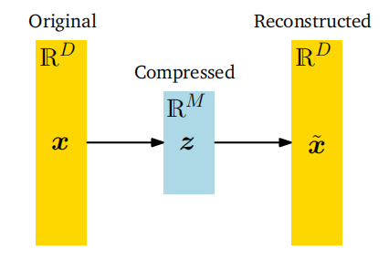
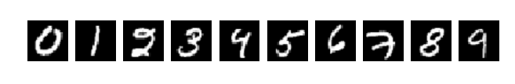

## 10.1 问题设定

在PCA（主成分分析）中，我们关注的是找到数据点$x_n$的投影$\tilde{x}_n$，这些投影应尽可能与原始数据点相似，但具有显著降低的内在维度。图10.1给出了这种情况的一个示意图。

更具体地说，我们考虑一个独立同分布的数据集$\mathcal{X}=\{x_1,\ldots,x_N\}$，其中$x_n\in\mathbb{R}^D$，均值为0，且具有数据协方差矩阵（6.42）

(10.1)
$$S=\frac{1}{N}\sum_{n=1}^{N}\boldsymbol{x}_{n}\boldsymbol{x}_{n}^{\top}\:.$$

此外，我们假设存在一个低维压缩表示（编码）

(10.2)
$$z_n=B^\top x_n\in\mathbb{R}^M$$

其中，$x_n$的投影矩阵定义为

(10.3)
$$B:=[b_1,\ldots,b_M]\in\mathbb{R}^{D\times M}\:.$$

我们假设$B$的列是标准正交的（根据定义3.7），即$\boldsymbol{b}_i^\top\boldsymbol{b}_j=0$当且仅当$i\neq j$，且$\boldsymbol{b}_i^\top\boldsymbol{b}_i=1$。我们寻找一个$M$维子空间$U\subseteq\mathbb{R}^D$，其中$\dim(U)=M<D$，以便将数据投影到这个子空间上。我们用$\tilde{x}_n\in U$表示投影后的数据，其坐标（相对于$U$的基向量$b_1, \ldots, b_M$）由$z_n$给出。我们的目标是找到$\bar{x}_n\in\mathbb{R}^D$（或等价地，找到编码$z_n$和基向量$b_1, \ldots, b_M$），使得它们由于压缩而与原始数据$x_n$尽可能相似。

**图10.2PCA。在PCA中，我们找到了原始数据x的压缩版本z。压缩后的数据可以重建成˜x，它存在于原始数据空间中，但具有比x内在的低维表示。**

> **示例10.1（坐标表示/编码）**
>
> 考虑$\mathbb{R}^2$，其标准基为$\boldsymbol e_1=[1,0]^\top,\boldsymbol{e}_2=[0,1]^\top$。根据第2章的内容，我们知道$x\in\mathbb{R}^2$可以表示为这些基向量的线性组合，例如
>
> (10.4)
> $$\begin{bmatrix}5\\3\end{bmatrix}=5\boldsymbol{e}_1+3\boldsymbol{e}_2\:.$$
>
> 然而，当我们考虑形式为
>
> (10.5)
> $$\tilde{\boldsymbol{x}}=\begin{bmatrix}0\\z\end{bmatrix}\in\mathbb{R}^2\:,\quad z\in\mathbb{R}\:,$$
>
> 的向量时，它们总可以表示为$0\boldsymbol{e}_1+z\boldsymbol{e}_2$。为了表示这些向量，只需记住/存储$\tilde{x}$相对于$e_2$向量的坐标/编码$z$。
>
> 更准确地说，$\tilde{x}$向量的集合（具有标准的向量加法和标量乘法）形成了一个向量子空间$U$（参见第2.4节），其中$\dim(U)=1$，因为$U=\operatorname{span}[\boldsymbol{e}_2]$。

在10.2节中，我们将找到保留尽可能多信息并最小化压缩损失的低维表示。在10.3节中，我们将给出PCA的另一种推导，即最小化原始数据$x_n$与其投影$\tilde{x}_n$之间的平方重构误差$\|x_n-\tilde{x}_n\|^2$。

图10.2展示了我们在主成分分析（PCA）中考虑的设置，其中$z$代表压缩数据$\tilde{x}$的低维表示，并扮演瓶颈的角色，控制着$x$和$\tilde{x}$之间可以流动的信息量。在PCA中，我们考虑原始数据$x$与其低维编码$z$之间的线性关系，使得$z=B^\top x$且$\tilde{x}=Bz$，其中$B$是一个合适的矩阵。基于将PCA视为数据压缩技术的动机，我们可以将图10.2中的箭头解释为表示编码器和解码器的一对操作。由$B$表示的线性映射可以视为解码器，它将低维编码$z\in\mathbb{R}^M$映射回原始数据空间$\mathbb{R}^D$。类似地，$B^\top$可以视为编码器，它将原始数据$x$编码为低维（压缩）编码$z$。

在本章中，我们将使用MNIST数字数据集作为反复出现的示例，该数据集包含60,000个手写数字0到9的示例。每个数字都是大小为28$\times28$的灰度图像，即它包含784个像素，因此我们可以将该数据集中的每个图像解释为向量$x\in\mathbb{R}^{784}$。这些数字的一些示例如图10.3所示。

**图10.3来自MNIST数据集的手写数字示例。http: //yann.lecun.com/exdb/mnist/.**

