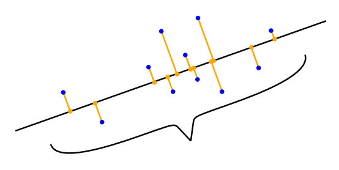
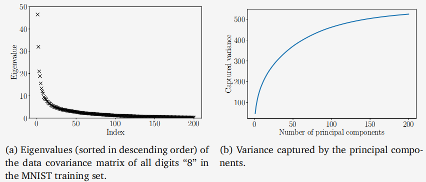
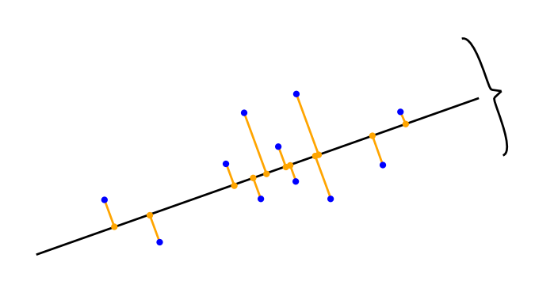

## 10.2 最大方差视角

图10.1给出了一个二维数据集如何使用单个坐标来表示的例子。在图10.1(b)中，我们选择忽略数据的$x_2$坐标，因为它没有增加太多信息，所以压缩后的数据与图10.1(a)中的原始数据相似。我们也可以选择忽略$x_1$坐标，但那样压缩后的数据将与原始数据非常不同，数据中的大量信息将会丢失。

如果我们将数据中的信息量解释为数据集“填充空间”的程度，那么我们可以通过观察数据的散布来描述数据中包含的信息。从第6.4.1节我们知道，方差是数据散布的一个指标，我们可以将PCA推导为一种降维算法，它通过最大化数据低维表示中的方差来尽可能保留信息。图10.4对此进行了说明。

考虑到第10.1节中讨论的设置，我们的目标是找到一个矩阵$B$（见（10.3）），当通过将数据投影到由$B$的列$b_1, \ldots, b_M$张成的子空间上来压缩数据时，该矩阵能够尽可能多地保留信息。在数据压缩后保留大部分信息，等价于在低维编码中捕获最大的方差量（Hotelling, 1933）。

备注。（数据中心化）对于（10.1）中的数据协方差矩阵，我们假设数据已经中心化。我们可以不失一般性地做出这个假设：假设$\mu$是数据的均值。利用我们在第6.4.4节中讨论的方差的性质，我们得到

$$\mathrm{V}_{z}[z]=\mathrm{V}_{x}[B^{\top}(x-\mu)]=\mathrm{V}_{x}[B^{\top}x-B^{\top}\mu]=\mathrm{V}_{x}[B^{\top}x]\:,$$
(10.6)

即，低维编码的方差不依赖于数据的均值。因此，在本节的其余部分中，我们不失一般性地假设数据的均值为0。在这个假设下，由于$\mathbb{E}_z[z]=\mathbb{E}_x[B^\top x]=B^\top\mathbb{E}_x[x]=\mathbf{0}$，低维编码的均值也为0。

### 10.2.1 最大方差方向

**图10.4 PCA找到了一个低维子空间（线），当数据（蓝色）投影到这个子空间（橙色）时，它保持尽可能多的方差（数据的分布）。**

我们使用顺序方法来最大化低维编码的方差。首先，我们寻找一个单独的向量$b_1\in\mathbb{R}^D$，该向量能够最大化投影数据的方差，即我们旨在最大化$z\in\mathbb{R}^M$的第一个坐标$z_1$的方差，使得

(10.7)
$$V_1:=\mathrm{V}[z_1]=\frac{1}{N}\sum_{n=1}^Nz_{1n}^2$$
达到最大，其中我们利用了数据的独立同分布（i.i.d.）假设，并将$z_{1n}$定义为$x_n\in\mathbb{R}^D$的低维表示$\boldsymbol{z}_n\in\mathbb{R}^M$的第一个坐标。注意，$z_n$的第一个分量由下式给出：
$$z_{1n}=b_1^\top x_n\:,$$
(10.8)

即，它是$x_n$在由$b_1$张成的一维子空间上的正交投影的坐标（第3.8节）。我们将(10.8)代入(10.7)，得到

(10.9a)
$$V_{1}=\frac{1}{N}\sum_{n=1}^{N}(\boldsymbol{b}_{1}^{\top}\boldsymbol{x}_{n})^{2}=\frac{1}{N}\sum_{n=1}^{N}\boldsymbol{b}_{1}^{\top}\boldsymbol{x}_{n}\boldsymbol{x}_{n}^{\top}\boldsymbol{b}_{1}\\=\boldsymbol{b}_{1}^{\top}\left(\frac{1}{N}\sum_{n=1}^{N}\boldsymbol{x}_{n}x_{n}^{\top}\right)\boldsymbol{b}_{1}=\boldsymbol{b}_{1}^{\top}\boldsymbol{S}\boldsymbol{b}_{1}\:,$$
(10.9b)

其中$S$是在(10.1)中定义的数据协方差矩阵。在(10.9a)中，我们使用了两个向量的点积关于其参数是对称的这一事实，即$\boldsymbol b_1^\top x_n=x_n^\top\boldsymbol b_1$。

注意到，任意增加向量$b_1$的幅度都会增加$V_1$，即一个长度为两倍的$b_1$向量可能导致$V_1$潜在地增加到四倍。因此，我们将所有解的范数限制为$\|\boldsymbol{b}_1\|^2=1$，这导致了一个约束优化问题，我们在这个问题中寻求数据变化最大的方向。

在将解空间限制为单位向量的条件下，指向最大方差方向的向量$b_1$可以通过以下约束优化问题找到：

(10.10)
$$\max_{b_{1}}b_{1}^{\top}Sb_{1}\\\text{subject to}\:\|\boldsymbol{b}_1\|^{2}=1$$

根据第7.2节，我们得到拉格朗日函数
$$\mathfrak{L}(\boldsymbol{b}_1,\lambda)=\boldsymbol{b}_1^\top\boldsymbol{S}\boldsymbol{b}_1+\lambda_1(1-\boldsymbol{b}_1^\top\boldsymbol{b}_1)$$
(10.11)

来解决这个约束优化问题。$\mathfrak{L}$关于$b_1$和$\lambda_1$的偏导数分别为
$$\frac{\partial\mathcal{L}}{\partial\boldsymbol{b}_1}=2\boldsymbol{b}_1^\top\boldsymbol{S}-2\lambda_1\boldsymbol{b}_1^\top,\quad\frac{\partial\mathcal{L}}{\partial\lambda_1}=1-\boldsymbol{b}_1^\top\boldsymbol{b}_1\:,$$
(10.12)

分别设置这些偏导数为0，我们得到关系式
$$Sb_1=\lambda_1b_1\:,$$
(10.13)
$$b_1^\top b_1=1\:.$$
(10.14)

通过与特征值分解的定义（第4.4节）进行比较，我们发现$b_1$是数据协方差矩阵$S$的一个特征向量，而拉格朗日乘子$\lambda_1$则扮演了相应特征值的角色。这个特征向量属性(10.13)允许我们将方差目标(10.10)重写为
$$V_1=b_1^\top Sb_1=\lambda_1b_1^\top b_1=\lambda_1\:,$$
(10.15)

即，将数据投影到一维子空间上的方差等于与该子空间所跨越的基向量$b_1$相关联的特征值。因此，为了最大化低维编码的方差，我们选择数据协方差矩阵中最大特征值所关联的基向量。这个特征向量被称为第一主成分。我们可以通过将坐标$z_{1n}$映射回数据空间来确定主成分$b_1$在原始数据空间中的效果/贡献，这给了我们投影后的数据点在原始数据空间中。

$$\tilde{x}_{n}=b_{1}z_{1n}=b_{1}b_{1}^{\top}x_{n}\in\mathbb{R}^{D}$$

(10.16)

备注：尽管$\tilde{x}_n$是一个$D$维向量，但它仅需要关于基向量$\boldsymbol{b}_1\in \mathbb{R} ^D$的一个坐标$z_{1n}$来表示。

### 10.2.2 最大方差M维子空间

假设我们已经找到了与最大的$m-1$个特征值相关联的$S$的$m-1$个特征向量，即前$m-1$个主成分。由于$S$是对称的，根据谱定理（定理4.15），我们可以使用这些特征向量来构造一个$(m-1)$维子空间的正交特征基，该子空间位于$\mathbb{R}^D$中。一般来说，第$m$个主成分可以通过从数据中减去前$m-1$个主成分$b_1,\ldots,b_{m-1}$的影响来找到，从而尝试找到能够压缩剩余信息的主成分。然后我们得到新的数据矩阵

$$\hat{X}:=X-\sum_{i=1}^{m-1}b_ib_i^\top X=X-B_{m-1}X\:,$$
(10.17)

其中$X=[x_1,\ldots,x_N]\in\mathbb{R}^{D\times N}$包含作为列向量的数据点，而$B_{m- 1}: = \sum _{i= 1}^{m- 1}b_{i}b_{i}^{\top }$是一个投影矩阵，它将数据投影到由$b_{1}, \ldots , b_{m- 1}$所跨越的子空间上。备注（符号）。在本章中，我们没有遵循将数据$x_1,\ldots,x_N$作为数据矩阵的行的惯例，而是将它们定义为$X$的列。这意味着我们的数据矩阵$X$是一个$D\times N$矩阵，而不是传统的$N\times D$矩阵。我们选择这样做的原因是代数运算可以平滑地进行，而无需转置矩阵或将向量重新定义为左乘矩阵的行向量。

为了找到第$m$个主成分，我们最大化方差

(10.18)
$$V_{m}=\mathrm{V}[z_{m}]=\frac{1}{N}\sum_{n=1}^{N}z_{mn}^{2}=\frac{1}{N}\sum_{n=1}^{N}(\boldsymbol{b}_{m}^{\top}\boldsymbol{x}_{n})^{2}=\boldsymbol{b}_{m}^{\top}\hat{\boldsymbol{S}}\boldsymbol{b}_{m}\:,$$
受约束于$\|\boldsymbol{b}_m\|^2=1$，其中我们遵循了与(10.9b)中相同的步骤，并将$\hat{S}$定义为变换数据集$\hat{\mathcal{X}}:=\{\hat{\boldsymbol{x}}_1,\ldots,\hat{\boldsymbol{x}}_N\}$的数据协方差矩阵。与之前单独查看第一个主成分时一样，我们解决了一个约束优化问题，并发现最优解$b_m$是$\hat{S}$的特征向量，该特征向量与$\hat{S}$的最大特征值相关联。

结果证明，$b_m$也是$S$的特征向量。更一般地说，$S$和$\hat{S}$的特征向量集是相同的。由于$S$和$\hat{S}$都是对称的，我们可以找到特征向量的正交归一基（谱定理4.15），即$S$和$\hat{S}$都存在$D$个不同的特征向量。接下来，我们证明$S$的每个特征向量都是$\hat{S}$的特征向量。假设我们已经找到了$\hat{S}$的特征向量$b_1,\ldots,b_{m-1}$。考虑$\tilde{S}$（这里应该是$S$的笔误）的一个特征向量$b_i$，即$Sb_i=\lambda_i\boldsymbol{b}_i$。一般来说，

$$\hat{S}\boldsymbol{b}_{i}=\frac{1}{N}\hat{\boldsymbol{X}}\hat{\boldsymbol{X}}^{\top}\boldsymbol{b}_{i}=\frac{1}{N}(\boldsymbol{X}-\boldsymbol{B}_{m-1}\boldsymbol{X})(\boldsymbol{X}-\boldsymbol{B}_{m-1}\boldsymbol{X})^{\top}\boldsymbol{b}_{i}\\=(\boldsymbol{S}-\boldsymbol{S}\boldsymbol{B}_{m-1}-\boldsymbol{B}_{m-1}\boldsymbol{S}+\boldsymbol{B}_{m-1}\boldsymbol{S}\boldsymbol{B}_{m-1})\boldsymbol{b}_{i}\:.$$

我们区分两种情况。如果 $i\geqslant m$，即 $b_i$ 是前 $m-1$ 个主成分之外的特征向量，那么 $b_i$ 与前 $m-1$ 个主成分正交，且 $B_{m-1}b_i=\mathbf{0}$。如果 $i<m$，即 $b_i$ 是前 $m-1$ 个主成分之一，那么 $b_i$ 是主子空间的基础向量，该子空间是 $B_{m-1}$ 投影的目标。由于 $b_1,\ldots,b_{m-1}$ 是该主子空间的正交归一基（ONB），我们得到 $B_{m-1}b_i=b_i$。这两种情况可以总结如下：
$$B_{m-1}b_{i}=b_{i}\quad\text{如果}\:i<m\:,\quad B_{m-1}b_{i}=0\quad\text{如果}\:i\geqslant m\:.$$
(10.20)

在 $i\geqslant m$ 的情况下，将 (10.20) 代入 (10.19b)，我们得到 $\hat{S}\boldsymbol b_i=(\boldsymbol{S}-B_{m-1}S)b_i=Sb_i=\lambda_ib_i$，即 $b_i$ 也是 $\hat{S}$ 的特征向量，对应的特征值为 $\lambda_i$。具体来说，
$$\hat{S}b_m=Sb_m=\lambda_mb_m\:.$$
(10.21)

方程 (10.21) 表明 $b_m$ 不仅是 $S$ 的特征向量，也是 $\hat{S}$ 的特征向量。具体来说，$\lambda_m$ 是 $\hat{S}$ 的最大特征值，并且是 $S$ 的第 $m$ 大特征值，两者都与特征向量 $b_m$ 相关联。

在 $i<m$ 的情况下，将 (10.20) 代入 (10.19b)，我们得到

(10.22)
$$\hat{S}b_i=(S-SB_{m-1}-B_{m-1}S+B_{m-1}SB_{m-1})b_i=0=0b_i$$
这意味着 $b_1,\ldots,b_{m-1}$ 也是 $\hat{S}$ 的特征向量，但它们与特征值 0 相关联，因此 $b_1,\ldots,b_{m-1}$ 构成了 $\hat{S}$ 的零空间。总的来说，$S$ 的每个特征向量也是 $\hat{S}$ 的特征向量。但是，如果 $S$ 的特征向量是 $(m-1)$ 维主子空间的一部分，那么 $\hat{S}$ 的相关特征值为 0。

利用关系 (10.21) 和 $\boldsymbol b_m^\top\boldsymbol b_m=1$，数据投影到第 $m$ 个主成分上的方差是
$$V_{m}=\boldsymbol{b}_{m}^{\top}\boldsymbol{Sb}_{m}\stackrel{(10.21)}{=}\lambda_{m}\boldsymbol{b}_{m}^{\top}\boldsymbol{b}_{m}=\lambda_{m}\:.$$
(10.23)

这意味着当数据投影到 $M$ 维子空间时，其方差等于数据协方差矩阵对应特征向量的特征值之和。

> **例10.2 数字8的特征值**
>
> 
>
> **图10.5 MNIST“8”的训练数据的属性。(a)特征值按降序排列；(b)由与最大特征值相关联的主成分捕获的方差。**
>
> 我们取 MNIST 训练数据中所有的“8”数字，计算数据协方差矩阵的特征值。图 10.5(a) 显示了数据协方差矩阵的 200 个最大特征值。我们看到只有少数几个特征值显著不同于 0。因此，当数据投影到由相应特征向量张成的子空间时，大部分方差仅由少数几个主成分捕获，如图 10.5(b) 所示。

**图10.6投影方法说明：找到一个子空间（线），尽量减少投影（橙色）和原始（蓝色）数据之间的差向量的长度。**

总的来说，为了找到 R$^D$ 中的一个 $M$ 维子空间，该子空间尽可能多地保留信息，PCA 告诉我们选择矩阵 $B$（在 (10.3) 中）的列作为数据协方差矩阵 $S$ 的 $M$ 个特征向量，这些特征向量与 $M$ 个最大特征值相关联。PCA 用前 $M$ 个主成分可以捕获的最大方差是

(10.24)
$$V_M=\sum_{m=1}^M\lambda_m\:,$$
其中 $\lambda_m$ 是数据协方差矩阵 $S$ 的 $M$ 个最大特征值。因此，通过 PCA 进行数据压缩时损失的方差是

(10.25)

Instead of these absolute quantities, we can define the relative variance captured as $\frac V{M}{V_{D}}$, and the relative variance lost by compression as $1-\frac{V_{M}}{V_{D}}.$

