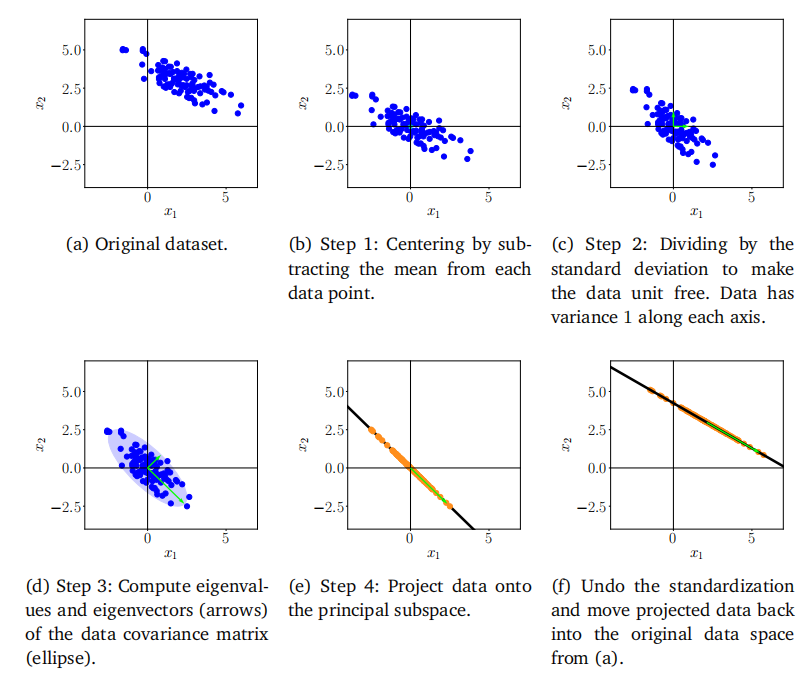
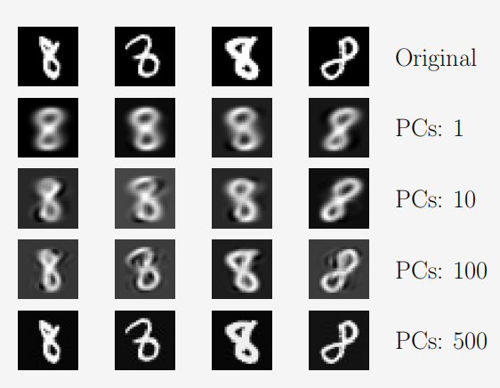
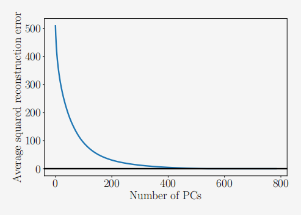

## 10.6 实践中PCA的关键步骤

接下来，我们将通过一个连续的例子来逐步介绍PCA的各个步骤，这些步骤总结在图10.11中。我们有一个二维数据集（图10.11(a)），我们想要使用PCA将其投影到一个一维子空间上。

图10.11PCA.(a)原始数据集的步骤；(b)定中；(c)除以标准差；(d)特征分解；(e)投影；(f)映射回原始数据空间。

1. **均值归零**：我们首先通过计算数据集的均值$\mu$，并从每个数据点中减去这个均值来中心化数据。这确保了数据集的平均值为0（图10.11(b)）。均值归零虽然不是严格必要的，但它降低了数值问题的风险。

2. **标准化**：对于每个维度$d=1,\ldots,D$，我们将数据点除以数据集的标准差$\sigma_d$。现在数据是无单位的，并且每个轴上的方差为1，这在图10.11(c)中用两个箭头表示。这一步完成了数据的标准化。

3. **协方差矩阵的特征分解**：计算数据的协方差矩阵及其特征值和对应的特征向量。由于协方差矩阵是对称的，根据谱定理（定理4.15），我们可以找到一组正交归一的特征向量基（ONB）。在图10.11(d)中，特征向量按其对应的特征值的大小进行缩放。较长的向量跨越了主子空间，我们将其表示为$U$。数据的协方差矩阵由椭圆表示。

4. **投影**：我们可以将任何数据点$x_*\in\mathbb{R}^D$投影到主子空间上：为了正确执行此操作，我们需要使用训练数据在第$d$维的均值$\mu_d$和标准差$\sigma_d$来标准化$x_*$，以便

(10.58)
$$x_*^{(d)}\leftarrow\frac{x_*^{(d)}-\mu_d}{\sigma_d}\:,\quad d=1,\ldots,D\:,$$
其中$x_*^{(d)}$是$x_*$的第$d$个分量。我们得到的投影为
(10.59)
$$\tilde{x}_*=BB^\top x_*$$
其坐标为
$$z_*=B^\top x_*$$
(10.60)

这是相对于主子空间基底的坐标。这里，$B$是一个矩阵，其列包含与数据协方差矩阵最大特征值相关联的特征向量。PCA返回的是坐标（10.60），而不是投影$x_*$。

在标准化数据集后，（10.59）仅给出了在标准化数据集上下文中的投影。为了获得原始数据空间（即标准化之前）中的投影，我们需要撤销标准化（10.58），并在添加均值之前乘以标准差，以便我们得到
$$\bar{x}_{*}^{(d)}\leftarrow\bar{x}_{*}^{(d)}\sigma_{d}+\mu_{d}\:,\quad d=1,\ldots,D\:.$$
(10.61)

图10.11(f)展示了在原始数据空间中的投影。

> **示例 10.4（MNIST 数字：重建）**
>
> 在以下示例中，我们将PCA应用于MNIST数字数据集，该数据集包含0到9的手写数字示例共60,000个。每个数字都是一张大小为$28\times28$的图像，即包含784个像素，因此我们可以将该数据集中的每张图像解释为向量$x\in\mathbb{R}^{784}$。这些数字的一些示例如图10.3所示。
>
> 
>
> 
图10.12增加主成分数量对重建的影响

>
> 为了说明目的，我们将PCA应用于MNIST数字的一个子集，并专注于数字“8”。我们使用了5,389张数字“8”的训练图像，并根据本章中的详细说明确定了主子空间。然后，我们使用学习到的投影矩阵来重建一组测试图像，如图10.12所示。图10.12的第一行显示了一组来自测试集的四个原始数字。接下来的几行分别展示了当使用维度为1、10、100和500的主子空间时，这些数字的精确重建结果。我们可以看到，即使使用一维主子空间，我们也能得到原始数字的半程像样的重建，但图像模糊且通用。随着主成分（PCs）数量的增加，重建图像变得更加清晰，并保留了更多细节。使用500个主成分时，我们几乎可以完美重建图像。如果我们选择784个主成分，我们将能够无压缩损失地恢复出精确的数字。
>
> 图10.13显示了平均平方重建误差，其公式为
>
> (10.62)
> $$\frac{1}{N}\sum_{n=1}^{N}\left\|\boldsymbol{x}_{n}-\bar{\boldsymbol{x}}_{n}\right\|^{2}=\sum_{i=M+1}^{D}\lambda_{i}\:,$$
>
> 该误差是主成分数量$M$的函数。我们可以看到，主成分的重要性迅速下降，添加更多主成分只能获得微不足道的增益。这与我们在图10.5中的观察结果完全一致，我们发现投影数据的大部分方差仅由少数几个主成分捕获。使用大约550个主成分，我们基本上可以完全重建包含数字“8”的训练数据（数据集中一些边界周围的像素没有变化，因为它们始终是黑色的）。
>
> 
>
> 
图10.13 平均平方重构误差作为主成分数量的函数。平均平方重建误差是主子空间的正交补中的特征值的和。

