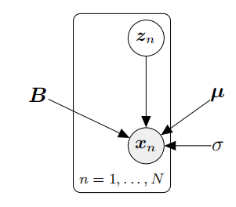
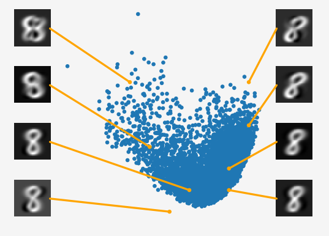

## **10.7 潜在变量视角**

在前面的章节中，我们从最大方差和投影视角出发，推导了PCA，而没有引入任何概率模型的概念。一方面，这种方法可能很有吸引力，因为它使我们能够避开与概率论相关的所有数学难题；但另一方面，概率模型会为我们提供更多灵活性和有用的见解。更具体地说，概率模型会：

- 附带一个似然函数，我们可以明确地处理含噪声的观测值（这是我们之前甚至都没有讨论过的）

- 允许我们通过边缘似然度进行贝叶斯模型比较，如第8.6节所述

- 将PCA视为生成模型，使我们能够模拟新数据

- 允许我们直接联系到相关算法

- 通过应用贝叶斯定理处理随机缺失的数据维度

- 给出新数据点的新颖性概念

- 为我们提供扩展模型的原则性方法，例如扩展到PCA模型的混合形式

- 将我们在前面章节中推导的PCA作为特殊情况

- 通过边缘化模型参数实现完全贝叶斯处理

通过引入连续值的潜在变量$z\in\mathbb{R}^M$，可以将PCA表述为概率潜在变量模型。Tipping和Bishop（1999）提出了这种潜在变量模型，即概率PCA（PPCA）。PPCA解决了上述大部分问题，而我们通过最大化投影空间中的方差或最小化重建误差所获得的PCA解，是在无噪声设置下的最大似然估计的特殊情况。

### **10.7.1 生成过程和概率模型**

在概率PCA（PPCA）中，我们明确写出了线性降维的概率模型。为此，我们假设存在一个连续的潜在变量$z\in\mathbb{R}^M$，它遵循标准正态先验$p(\boldsymbol{z})=\mathcal{N}(\mathbf{0},\boldsymbol{I})$，并且潜在变量与观测到的$x$数据之间存在线性关系，其中

(10.63)
$$x=Bz+\mu+\epsilon\in\mathbb{R}^{D}\:,$$
其中，$\epsilon\sim\mathcal{N}(0,\sigma^2\boldsymbol{I})$是高斯观测噪声，$B\in\mathbb{R}^{D\times M}$和$\mu\in\mathbb{R}^D$描述了从潜在变量到观测变量的线性/仿射映射。因此，PPCA通过以下方式将潜在变量和观测变量联系起来：
$$p(\boldsymbol{x}|\boldsymbol{z},\boldsymbol{B},\boldsymbol{\mu},\sigma^{2})=\mathcal{N}\big(\boldsymbol{x}\:|\:\boldsymbol{Bz}+\boldsymbol{\mu},\:\sigma^{2}\boldsymbol{I}\big)\:.$$
(10.64)

总体而言，PPCA诱导了以下生成过程：

(10.65)
$$z_{n}\sim\mathcal{N}\left(\boldsymbol{z}\mid\boldsymbol{0},\boldsymbol{I}\right)\\x_{n}\mid z_{n}\sim\mathcal{N}(\boldsymbol{x}\mid B\boldsymbol{z}_{n}+\boldsymbol{\mu},\:\sigma^{2}\boldsymbol{I})$$
(10.66)

为了在给定模型参数的情况下生成一个典型的数据点，我们遵循一个祖先采样方案：首先，我们从$p(\boldsymbol{z})$中采样一个潜在变量$z_n$。然后，我们在(10.64)中使用$\boldsymbol{z}_n$来根据采样得到的$z_n$条件采样一个数据点，即$x_n\sim p(x\mid\boldsymbol{z}_n,\boldsymbol{B},\boldsymbol{\mu},\sigma^2)$。

这个生成过程允许我们写下概率模型（即所有随机变量的联合分布；参见第8.4节）为

(10.67)
$$p(\boldsymbol{x},\boldsymbol{z}|B,\boldsymbol{\mu},\sigma^{2})=p(\boldsymbol{x}|\boldsymbol{z},\boldsymbol{B},\boldsymbol{\mu},\sigma^{2})p(\boldsymbol{z})\:,$$
这立即导致了使用第8.5节结果的图10.14中的图形模型。

**图10.14概率PCA的图形模型。观测值xn明确地依赖于相应的潜在变量zn∼N**

备注。注意连接潜在变量z和观测数据x的箭头的方向：箭头指向从z到x，这意味着PPCA模型假定了高维观测x的低维潜在原因z。最后，根据一些观察结果，我们显然对发现z很感兴趣。为了达到这个目的，我们将应用贝叶斯推理隐式地“反转”箭头，并从观察到潜在变量。

> **示例 10.5（使用潜在变量生成新数据）**
>
> 
>
> **图10.15生成新的MNIST数字。潜在变量z可以用来生成新的数据˜x=Bz。我们离训练数据越近，生成的数据就越真实。**
>
> 图10.15展示了当使用二维主成分子空间时，PCA找到的MNIST数字“8”的潜在坐标（蓝色点）。我们可以在这个潜在空间中查询任何向量$z_*$，并生成一个图像$\tilde{x}_*=Bz_*$，该图像类似于数字“8”。我们展示了八个这样的生成图像及其对应的潜在空间表示。根据我们在潜在空间中查询的位置不同，生成的图像看起来会有所不同（形状、旋转、大小等）。如果我们查询的位置远离训练数据，我们会看到越来越多的伪影，例如左上角和右上角的数字。请注意，这些生成图像的内在维度只有两个。

### **10.7.2 似然函数和联合分布**

利用第6章的结果，我们通过积分出潜在变量$z$（参见第8.4.3节）来得到这个概率模型的似然函数，即
$$\begin{aligned}p(\boldsymbol{x}\mid\boldsymbol{B},\boldsymbol{\mu},\sigma^{2})&=\int p(\boldsymbol{x}\mid\boldsymbol{z},\boldsymbol{B},\boldsymbol{\mu},\sigma^{2})p(\boldsymbol{z})\mathrm{d}\boldsymbol{z}\\&=\int\mathcal{N}(x\mid Bz+\mu,\:\sigma^{2}\boldsymbol{I})\mathcal{N}(z\mid\boldsymbol{0},\:\boldsymbol{I})\mathrm{d}z\:.\end{aligned}$$
(10.68a)

(10.68b)

从第6.5节我们知道，这个积分的解是一个高斯分布，其均值为
$$\mathrm{E}_{x}[x]=\mathrm{E}_{z}[Bz+\mu]+\mathrm{E}_{\epsilon}[\epsilon]=\mu $$
(10.69)

协方差矩阵为

(10.70a)
$$\begin{aligned}\mathbb{V}[x]&=\mathrm{V}_{z}[Bz+\mu]+\mathrm{V}_{\epsilon}[\epsilon]=\mathrm{V}_{z}[Bz]+\sigma^{2}I\\&=B\mathrm{V}_{z}[z]B^{\top}+\sigma^{2}\boldsymbol{I}=\boldsymbol{B}\boldsymbol{B}^{\top}+\sigma^{2}\boldsymbol{I}\:.\end{aligned}$$
(10.70b)

(10.68b)中的似然函数可用于模型参数的最大似然估计或MAP估计。

**备注**：我们不能使用(10.64)中的条件分布进行最大似然估计，因为它仍然依赖于潜在变量。我们用于最大似然（或MAP）估计的似然函数只应是数据$x$和模型参数的函数，而不应依赖于潜在变量。

$\diamondsuit$

从第6.5节我们知道，高斯随机变量$z$及其线性/仿射变换$x=Bz$是联合高斯分布的。我们已经知道边缘分布$p(\boldsymbol{z})=\mathcal{N}(\boldsymbol{z}\mid\boldsymbol{0},\boldsymbol{I})$和$p(\boldsymbol{x})=\mathcal{N}(x\mid\mu,BB^\top+\sigma^2\boldsymbol{I})$。缺失的互协方差为
$$\mathrm{Cov}[x,z]=\mathrm{Cov}_{z}[Bz+\mu]=B\:\mathrm{Cov}_{z}[z,z]=B\:.$$
(10.71)

因此，PPCA的概率模型，即潜在变量和观测随机变量的联合分布明确给出为
$$p(\boldsymbol{x},\boldsymbol{z}\mid\boldsymbol{B},\boldsymbol{\mu},\sigma^{2})=\mathcal{N}\left(\begin{bmatrix}\boldsymbol{x}\\\boldsymbol{z}\end{bmatrix}\:\bigg|\begin{bmatrix}\boldsymbol{\mu}\\\boldsymbol{0}\end{bmatrix},\begin{bmatrix}\boldsymbol{B}\boldsymbol{B}^{\top}+\sigma^{2}\boldsymbol{I}&\boldsymbol{B}\\\boldsymbol{B}^{\top}&\boldsymbol{I}\end{bmatrix}\right),$$
(10.72)

其中均值向量的长度为$D+M$，协方差矩阵的大小为$(D+M)\times(D+M)$。

### 10.7.3 后验分布

(10.72)中的联合高斯分布$p(x,z\mid B,\mu,\sigma^2)$允许我们立即通过应用第6.5.1节中高斯条件分布的规则来确定后验分布$p(\boldsymbol{z}\mid\boldsymbol{x})$。给定观测值$x$时，潜在变量的后验分布为
$$\begin{aligned}p(\boldsymbol{z}\mid\boldsymbol{x})&=\mathcal{N}(\boldsymbol{z}\mid\boldsymbol{m},\boldsymbol{C})\:,\\\boldsymbol{m}&=\boldsymbol{B}^{\top}(\boldsymbol{B}\boldsymbol{B}^{\top}+\sigma^{2}\boldsymbol{I})^{-1}(\boldsymbol{x}-\boldsymbol{\mu})\:,\\\boldsymbol{C}&=\boldsymbol{I}-\boldsymbol{B}^{\top}(\boldsymbol{B}\boldsymbol{B}^{\top}+\sigma^{2}\boldsymbol{I})^{-1}\boldsymbol{B}\:.\end{aligned}$$
(10.73) (10.74) (10.75)

注意，后验协方差并不依赖于观测数据$x$。对于数据空间中的新观测值$x_*$，我们使用(10.73)来确定相应潜在变量$z_*$的后验分布。协方差矩阵$C$允许我们评估嵌入的置信度。协方差矩阵$C$的行列式较小（测量体积）意味着潜在嵌入$z_*$相当确定。如果我们得到的后验分布$p(z_*\mid x_*)$方差很大，那么我们可能遇到了一个异常值。然而，我们可以探索这个后验分布，以了解在这个后验下哪些其他数据点$x$是合理的。为此，我们利用PPCA背后的生成过程，它允许我们通过生成在这个后验下合理的新数据来探索潜在变量的后验分布：

1. 从潜在变量的后验分布(10.73)中采样一个潜在变量$z_*\sim p(z\mid x_*)$。
2. 从(10.64)中采样一个重构向量$\tilde{x}_*\sim p(\boldsymbol{x}\mid\boldsymbol{z}_*,\boldsymbol{B},\boldsymbol{\mu},\sigma^2)$。

如果我们多次重复这个过程，就可以探索潜在变量$z_*$的后验分布(10.73)及其对观测数据的影响。采样过程有效地假设了数据，这些数据在后验分布下是合理的。

