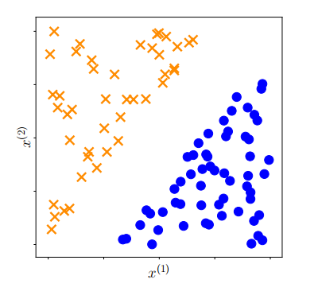

# 第12章 支持向量机分类

在许多情况下，我们希望机器学习算法能够预测多个（离散）结果中的一个。例如，电子邮件客户端将邮件分类为个人邮件和垃圾邮件，这就有两种结果。另一个例子是望远镜识别夜空中的对象是星系、恒星还是行星。通常结果的数量很少，而且更重要的是，这些结果之间通常没有额外的结构。在本章中，我们考虑输出二进制值的预测器，即只有两个可能的结果。这种机器学习任务被称为二分类。这与第9章不同，第9章我们考虑的是具有连续值输出的预测问题。

对于二分类，标签/输出可能取得的值集合是二进制的，在本章中我们用${+1, -1}$来表示它们。换句话说，我们考虑的预测器形式为
$$f:\mathbb{R}^{D}\to\{+1,-1\}\:.$$
(12.1)

回顾第8章，我们将每个示例（数据点）$x_n$表示为一个$D$个实数的特征向量。标签通常分别称为正类和负类。需要注意的是，不要从+1类的正性中推断出直观的属性。例如，在癌症检测任务中，患有癌症的患者通常被标记为+1。原则上，可以使用任何两个不同的值，例如${True,False}$、${0,1}$或${red,blue}$。二分类问题已经被广泛研究，我们将在第12.6节介绍其他方法。

我们介绍了一种称为支持向量机（SVM）的方法，它解决了二分类任务。与回归一样，我们有一个监督学习任务，其中我们有一组示例$x_n\in\mathbb{R}^D$以及它们对应的（二进制）标签$y_n\in{+1,-1}$。给定一个由示例-标签对${(\boldsymbol{x}_1,y_1),\ldots,(\boldsymbol{x}_N,y_N)}$组成的训练数据集，我们希望估计模型参数，以便给出最小的分类错误。与第9章类似，我们考虑一个线性模型，并将非线性隐藏在示例的变换$\phi$中（9.13）。我们将在第12.4节重新讨论$\phi$。

SVM在许多应用中提供了最先进的结果，并具有可靠的理论保证（Steinwart和Christmann，2008）。我们选择使用SVM来说明二分类有两个主要原因。首先，SVM允许我们通过几何方式思考监督机器学习。虽然在第9章中我们从概率模型的角度考虑了机器学习问题，并使用最大似然估计和贝叶斯推断来攻击它，但在这里我们将考虑一种替代方法，即我们对机器学习任务进行几何推理。它大量依赖于我们在第3章中讨论的内积和投影等概念。其次，我们发现SVM具有启发性是因为与第9章不同，SVM的优化问题不允许解析解，因此我们需要求助于第7章中介绍的各种优化工具。

**图12.1例子2D数据，说明了数据的直觉，我们可以找到一个线性分类器，分离橙色交叉和蓝色圆盘。**

SVM对机器学习的看法与第9章的最大似然观点略有不同。最大似然观点基于数据的概率分布模型提出一个模型，并从中推导出优化问题。相比之下，SVM观点则是从基于几何直觉的设计一个特定函数开始，该函数在训练过程中需要被优化。我们在第10章中已经看到了类似的东西，其中我们从几何原理推导出PCA。在SVM的情况下，我们首先从设计一个损失函数开始，该损失函数在训练数据上需要被最小化，遵循经验风险最小化原则（第8.2节）。

让我们推导出与在样本-标签对上训练支持向量机（SVM）相对应的优化问题。直观上，我们想象二分类数据，这些数据可以通过一个超平面进行分离，如图12.1所示。在这里，每个样本$x_n$（一个二维向量）是一个二维位置（由$x_n^{(1)}$和$x_n^{(2)}$组成），而对应的二分类标签$y_n$是两种不同符号之一（橙色叉或蓝色圆）。“超平面”是机器学习中常用的术语，我们在第2.8节已经遇到过超平面。超平面是维度为$D-1$的仿射子空间（如果对应的向量空间维度为$D$）。样本由两类组成（有两个可能的标签），这些样本的特征（表示样本的向量的分量）以这样的方式排列，使得我们可以通过画一条直线来分离/分类它们。

接下来，我们将寻找两个类别之间线性分隔器的想法形式化。我们引入间隔的概念，然后将线性分隔器扩展到允许样本落在“错误”的一侧，从而产生分类错误。我们提出了两种等价的方式来形式化SVM：几何视角（第12.2.4节）和损失函数视角（第12.2.5节）。我们使用拉格朗日乘数法推导出SVM的对偶形式（第7.2节）。对偶SVM使我们能够观察到第三种形式化SVM的方式：即基于每个类别样本的凸包（第12.3.2节）。最后，我们简要介绍了核函数以及如何数值求解非线性核SVM优化问题。

