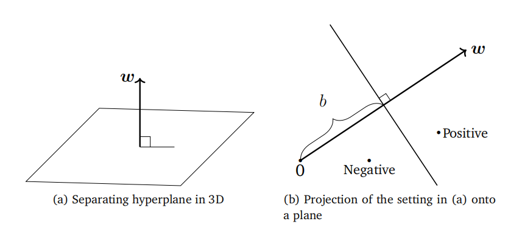

## 12.1 分隔超平面

给定两个以向量形式表示的样本$x_i$和$x_j$，计算它们之间相似度的一种方法是使用内积$\langle x_i,x_j\rangle$。回顾第3.2节，内积与两个向量之间的角度紧密相关。两个向量之间的内积值取决于每个向量的长度（范数）。此外，内积使我们能够严格定义诸如正交性和投影等几何概念。

许多分类算法背后的主要思想是将数据表示为R$^D$中的点，然后对这个空间进行划分，理想情况下是使得具有相同标签的样本（且没有其他样本）位于同一划分中。在二分类的情况下，空间将被分成两部分，分别对应于正类和负类。我们考虑一种特别方便的划分方式，即使用超平面（线性地）将空间分成两半。设样本$x\in\mathbb{R}^D$是数据空间中的一个元素。考虑一个函数
$$
\begin{aligned}
&f:\mathbb{R}^{D}\to\mathbb{R}\\
&x\mapsto f(x):=\langle\boldsymbol{w},\boldsymbol{x}\rangle+b\:,
\end{aligned}
$$
(12.2a) (12.2b)

其中参数为$w\in\mathbb{R}^D$和$b\in\mathbb{R}$。回顾第2.8节，超平面是仿射子空间。因此，我们将二分类问题中分隔两个类别的超平面定义为
$$
\left\{x\in\mathbb{R}^{D}:f(x)=0\right\}\:.
$$
(12.3)

超平面的一个图示如图12.2所示，其中向量$w$是超平面的法向量，$b$是截距。我们可以通过选择超平面上的任意两个样本$x_a$和$x_b$，并证明它们之间的向量与$w$正交，来推导出$w$是超平面(12.3)的法向量。以方程的形式表示，
$$
\begin{aligned}
f(\boldsymbol{x}_{a})-f(\boldsymbol{x}_{b})&=\langle\boldsymbol{w},\boldsymbol{x}_{a}\rangle+b-(\langle\boldsymbol{w},\boldsymbol{x}_{b}\rangle+b)\\
&=\langle\boldsymbol{w},\boldsymbol{x}_{a}-\boldsymbol{x}_{b}\rangle\:,
\end{aligned}
$$

其中第二行是通过内积的线性性质（第3.2节）得到的。由于我们已经选择$x_a$和$x_b$在超平面上，这意味着$f(\boldsymbol{x}_a)=0$和$f(\boldsymbol{x}_b)=0$，因此$\langle\boldsymbol{w},\boldsymbol{x}_a-\boldsymbol{x}_b\rangle=0$。回忆两个向量当且仅当它们的内积为零时正交。因此，我们得到$w$与超平面上的任何向量都正交。

注：回顾第2章，我们知道可以以不同的方式思考向量。在本章中，我们将参数向量$w$视为指示方向的箭头，即我们将$w$视为几何向量。相比之下，我们将样本向量$x$视为数据点（由其坐标指示），即我们认为$x$是相对于标准基向量的向量坐标。

当给出一个测试样本时，我们根据它位于超平面的哪一侧来将其分类为正或负。请注意，(12.3)不仅定义了一个超平面；它还定义了一个方向。换句话说，它定义了超平面的正面和负面。因此，为了对测试样本$x_{\text{test}}$进行分类，我们计算函数$f(x_{\text{test}})$的值，并在$f(\boldsymbol{x}_{\text{test}})\geqslant0$时将其分类为+1，否则分类为-1。从几何角度来看，正样本位于超平面的“上方”，而负样本位于超平面的“下方”。

在训练分类器时，我们希望确保带有正标签的样本位于超平面的正面，即

(12.5)
$$\langle\boldsymbol{w},\boldsymbol{x}_n\rangle+b\geqslant0\quad\text{当}\quad y_n=+1$$

并且带有负标签的样本位于超平面的负面，即

(12.6)
$$\langle\boldsymbol{w},\boldsymbol{x}_n\rangle+b<0\quad\text{当}\quad y_n=-1\:.$$

参考图12.2，可以获得正负样本的几何直观理解。这两个条件通常可以合并为一个方程

(12.7)
$$y_n(\langle\boldsymbol{w},\boldsymbol{x}_n\rangle+b)\geqslant0\:.$$

当我们分别在(12.5)和(12.6)的两边乘以$y_n=1$和$y_n=-1$时，方程(12.7)与(12.5)和(12.6)是等价的。

图12.2 分隔超平面(12.3)的方程（a）3D中方程的标准表示方式（b）为了便于绘制，我们从侧面查看超平面。

