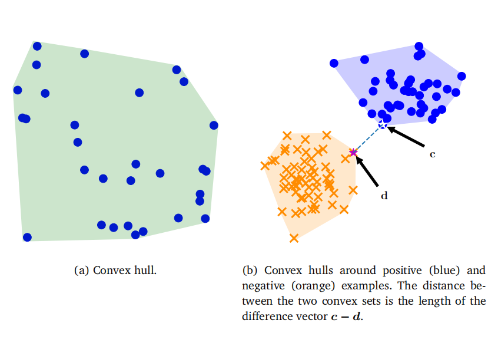

## 12.3 对偶支持向量机

前面几节中对支持向量机（SVM）的描述，涉及变量$w$和$b$，这被称为原始SVM。回想一下，我们考虑的输入$x\in\mathbb{R}^D$具有$D$个特征。由于$w$与$x$具有相同的维度，这意味着优化问题的参数数量（即$w$的维度）随特征数量的增加而线性增长。

接下来，我们考虑一个等效的优化问题（即所谓的对偶视图），它与特征数量无关。相反，参数的数量随训练集中样本数量的增加而增加。我们在第10章中看到过类似的想法，即以一种不随特征数量变化的方式来表达学习问题。这对于特征数量多于训练数据集中样本数量的问题非常有用。对偶SVM还具有另一个优点，即它很容易应用核函数，我们将在本章末尾看到这一点。在数学文献中，“对偶”一词经常出现，在这个特定情况下，它指的是凸对偶性。以下小节基本上是对我们在第7.2节中讨论的凸对偶性的应用。

### 12.3.1 通过拉格朗日乘数法实现的凸对偶性

回顾原始软间隔SVM（12.26a）。我们将与原始SVM相对应的变量$w,b$和$\xi$称为原始变量。我们使用$\alpha_n \geq 0$作为与约束（12.26b）相对应的拉格朗日乘数，该约束要求样本被正确分类；使用$\gamma_n \geq 0$作为与松弛变量的非负性约束相对应的拉格朗日乘数；参见（12.26c）。然后，拉格朗日函数由下式给出：

通过对拉格朗日函数（12.34）分别关于三个原始变量$w,b$和$\xi$求导，我们得到：

(12.35)
$$
\begin{aligned}
&\frac{\partial\mathcal{L}}{\partial\boldsymbol{w}}=\boldsymbol{w}^{\top}-\sum_{n=1}^{N}\alpha_{n}y_{n}\boldsymbol{x}_{n}^{\top}\:,\\
&\frac{\partial\mathcal{L}}{\partial b}=-\sum_{n=1}^{N}\alpha_{n}y_{n}\:,\\
&\frac{\partial\mathcal{L}}{\partial\xi_{n}}=C-\alpha_{n}-\gamma_{n}\:.
\end{aligned}
$$

我们现在通过将每个偏导数设置为零来找到拉格朗日函数的最大值。通过将（12.35）设置为零，我们发现：

(12.38)
$$
\boldsymbol{w}=\sum_{n=1}^N\alpha_ny_n\boldsymbol{x}_n\:,
$$
这是表示定理（Kimeldorf和Wahba，1970）的一个特例。方程（12.38）表明，原始问题中的最优权重向量是样本$x_n$的线性组合。回想第2.6.1节的内容，这意味着优化问题的解位于训练数据的张成空间中。此外，通过将（12.36）设置为零得到的约束意味着最优权重向量是样本的仿射组合。表示定理对于正则化经验风险最小化的非常一般设置都是成立的（Hofmann等人，2008；Argyriou和Dinuzzo，2014）。该定理有更一般的形式（Schölkopf等人，2001），并且可以在Yu等人（2013）中找到其存在性的必要和充分条件。

备注。表示定理（12.38）还解释了“支持向量机”这个名字的由来。对于对应的参数$\alpha_n=0$的样本$x_n$，它们对解$w$没有任何贡献。而其他$\alpha_n>0$的样本被称为支持向量，因为它们“支撑”超平面。

通过将$w$的表达式代入拉格朗日函数（12.34），我们得到对偶函数

$$\begin{aligned}\mathfrak{D}(\xi,\alpha,\gamma)&=\frac{1}{2}\sum_{i=1}^{N}\sum_{j=1}^{N}y_{i}y_{j}\alpha_{i}\alpha_{j}\left\langle\boldsymbol{x}_{i},\boldsymbol{x}_{j}\right\rangle-\sum_{i=1}^{N}y_{i}\alpha_{i}\left\langle\sum_{j=1}^{N}y_{j}\alpha_{j}\boldsymbol{x}_{j},\boldsymbol{x}_{i}\right\rangle\\&+C\sum_{i=1}^{N}\xi_{i}-b\sum_{i=1}^{N}y_{i}\alpha_{i}+\sum_{i=1}^{N}\alpha_{i}-\sum_{i=1}^{N}\alpha_{i}\xi_{i}-\sum_{i=1}^{N}\gamma_{i}\xi_{i}\:.\end{aligned}$$

注意，此时已经不再包含原始变量$w$的任何项。通过将（12.36）设置为零，我们得到$\sum _{n= 1}^{N}y_{n}\alpha _{n}= 0$。因此，包含$b$的项也消失了。回想一下，内积是对称且双线性的（参见第3.2节）。因此，（12.39）中的前两项是针对相同对象的。这些项（用蓝色标记）可以简化，我们得到拉格朗日函数

$$\mathfrak{D}(\xi,\alpha,\gamma)=-\frac{1}{2}\sum_{i=1}^{N}\sum_{j=1}^{N}y_{i}y_{j}\alpha_{i}\alpha_{j}\left\langle\boldsymbol{x}_{i},\boldsymbol{x}_{j}\right\rangle+\sum_{i=1}^{N}\alpha_{i}+\sum_{i=1}^{N}(C-\alpha_{i}-\gamma_{i})\xi_{i}\:.$$

该方程中的最后一项是所有包含松弛变量$\xi_i$的项的集合。通过将（12.37）设置为零，我们可以看到（12.40）中的最后一项也为零。此外，通过使用相同的方程并回忆拉格朗日乘数$\gamma_i$是非负的，我们得出$\alpha_i\leqslant C$。现在，我们得到了SVM的对偶优化问题，它完全用拉格朗日乘数$\alpha_i$表示。从拉格朗日对偶性（定义7.1）中我们知道，我们需要最大化对偶问题。这等价于最小化负对偶问题，从而我们得到对偶SVM

$$\begin{aligned}&\operatorname*{min}_{\alpha}\quad\frac{1}{2}\sum_{i=1}^{N}\sum_{j=1}^{N}y_{i}y_{j}\alpha_{i}\alpha_{j}\left\langle\boldsymbol{x}_{i},\boldsymbol{x}_{j}\right\rangle-\sum_{i=1}^{N}\alpha_{i}\\&\mathrm{subject~to}\quad\sum_{i=1}^{N}y_{i}\alpha_{i}=0\\&0\leqslant\alpha_{i}\leqslant C\quad\mathrm{for~all}\quad i=1,\ldots,N\:.\end{aligned}$$

(12.41)

（12.41）中的等式约束是通过将（12.36）设置为零得到的。不等式约束$\alpha_i\geqslant0$是对不等式约束的拉格朗日乘数施加的条件（第7.2节）。不等式约束$\alpha_i\leqslant C$在前面的段落中已讨论。

SVM中的不等式约束集被称为“盒约束”，因为它们将拉格朗日乘数的向量$\alpha=[\alpha_1,\cdots,\alpha_N]^{\top}\in\mathbb{R}^{N}$限制在每个轴上由0和$C$定义的盒子内。这些轴对齐的盒子在数值求解器中实现时特别高效（Dostál，2009，第5章）。

一旦我们获得了对偶参数$\alpha$，我们就可以使用表示定理（12.38）来恢复原始参数$w$。让我们将最优原始参数称为$w^*$。但是，如何获得参数$b^*$仍然是一个问题。考虑一个正好位于边界上的样本$x_n$，即$\langle w^*,x_n\rangle+b=y_n$。回想一下，$y_n$要么是+1，要么是-1。因此，唯一未知的是$b$，它可以通过 http://fouryears.eu/2012/06/07/the-svm-bias-term-conspiracy/.访问。

图12.9凸包。(a)凸包的点，其中一些位于边界内；凸出正例子和负例子的(b)凸壳。

### 12.3.2 双SVM：凸包视图

获得双SVM的另一种方法是考虑另一种几何论证。考虑具有相同标签的示例集$x_n$。我们希望构建一个包含所有示例的凸集，并且这个凸集尽可能小。这被称为凸包，如图12.9所示。

首先，让我们对点的凸组合有一些直观的理解。考虑两个点$x_1$和$x_2$以及对应的非负权重$\alpha_1,\alpha_2\geqslant0$，使得$\alpha_1+\alpha_2=1$。方程$\alpha_1x_1+\alpha_2x_2$描述了$x_1$和$x_2$之间直线上的每个点。考虑当我们添加第三个点$x_3$以及一个权重$\alpha_3\geqslant0$，使得$\sum_{n=1}^{3}\alpha_n=1$时发生的情况。这三个点$x_1,x_2,x_3$的凸组合跨越了一个二维区域。这个区域的凸包是由每对点对应的边所形成的三角形。随着我们添加更多的点，并且点的数量大于维度数时，一些点将位于凸包内部，如图12.9(a)所示。

一般来说，构建凸包可以通过为每个示例$x_n$引入非负权重$\alpha_n\geqslant0$来完成。然后，凸包可以描述为集合

$$\mathrm{conv}\left(\boldsymbol{X}\right)=\left\{\sum\limits_{n=1}^{N}\alpha_{n}\boldsymbol{x}_{n}\right\}\quad\mathrm{with}\quad\sum\limits_{n=1}^{N}\alpha_{n}=1\quad\mathrm{and}\quad\alpha_{n}\geqslant0,$$

对于所有$n=1,\ldots,N$。如果对应于正类和负类的两个点云是分开的，则它们的凸包不会重叠。给定训练数据$(x_1,y_1),\ldots,(\boldsymbol{x}_N,y_N)$，我们形成两个凸包，分别对应于正类和负类。我们选择一个点$c$，它位于正例集合的凸包内，并且最接近负类分布。类似地，我们在负例集合的凸包中选择一个点$d$，它最接近正类分布；如图12.9(b)所示。我们定义$d$和$c$之间的差向量为

(12.44)
$$w:=c-d\:.$$

选择$c$和$d$点如前面所述，并要求它们彼此最接近，这相当于最小化$w$的长度/范数，因此我们得到了相应的优化问题

$$\arg\min_{\boldsymbol{w}}\left\|\boldsymbol{w}\right\|=\arg\min_{\boldsymbol{w}}\frac{1}{2}\left\|\boldsymbol{w}\right\|^{2}\:.$$
(12.45)

由于$c$必须在正凸包内，因此它可以表示为正例的凸组合，即对于非负系数$\alpha_n^+$

(12.46)
$$c=\sum_{n:y_n=+1}\alpha_n^+\boldsymbol{x}_n\:.$$

在(12.46)中，我们使用符号$n:y_n=+1$来表示$y_n=+1$的索引集$n$。类似地，对于具有负标签的示例，我们得到

(12.47)
$$d=\sum_{n:y_n=-1}\alpha_n^-\boldsymbol{x}_n\:.$$

通过将(12.44)、(12.46)和(12.47)代入(12.45)，我们得到目标函数

$$\min_{\alpha}\frac{1}{2}\left\|\sum_{n:y_n=+1}\alpha_n^+\boldsymbol{x}_n-\sum_{n:y_n=-1}\alpha_n^-\boldsymbol{x}_n\right\|^2\:.$$
(12.48)

设 $\alpha$ 为所有系数的集合，即 $\alpha^+$ 和 $\alpha^-$ 的连接。回顾一下，我们要求每个凸包的系数之和为1，即
$$\sum_{n:y_n=+1}\alpha_n^+=1\quad\text{和}\quad\sum_{n:y_n=-1}\alpha_n^-=1\:.$$
(12.49)

这意味着存在约束
$$\sum_{n=1}^Ny_n\alpha_n=0\:.$$
(12.50)

这个结果可以通过分别乘以每个类别的系数来观察：

(12.51a)
$$\sum_{n=1}^{N}y_{n}\alpha_{n}=\sum_{n:y_{n}=+1}(+1)\alpha_{n}^{+}+\sum_{n:y_{n}=-1}(-1)\alpha_{n}^{-}\\=\sum_{n:y_{n}=+1}\alpha_{n}^{+}-\sum_{n:y_{n}=-1}\alpha_{n}^{-}=1-1=0\:.$$
(12.51b)

目标函数（12.48）和约束（12.50），以及假设 $\alpha\geqslant0$，共同构成了一个带约束的（凸）优化问题。可以证明，这个优化问题与对偶硬间隔SVM（Bennett 和 Bredensteiner, 2000a）的优化问题是相同的。

$备注$：为了获得软间隔对偶，我们考虑缩减的凸包。缩减的凸包与凸包类似，但系数的大小有一个上限。$\alpha$ 中元素的最大可能值限制了凸包可以取的大小。换句话说，对 $\alpha$ 的限制将凸包缩小到了一个更小的体积（Bennett 和 Bredensteiner, 2000b）。

