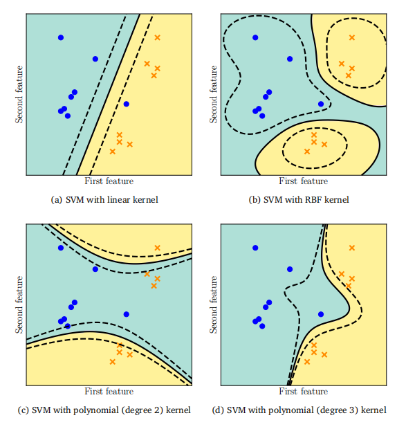

## 12.4 核函数

考虑对偶SVM的公式（12.41）。注意到目标函数中的内积仅发生在样本$x_i$和$x_j$之间，而没有样本与参数之间的内积。因此，如果我们考虑一组特征$\phi(x_i)$来表示$x_i$，对偶SVM中唯一的变化将是替换内积。这种模块化特性允许我们分别考虑分类方法（SVM）和特征表示$\phi(x)$的选择，从而为我们独立探索这两个问题提供了灵活性。在本节中，我们将讨论表示$\phi(x)$并简要介绍核函数的概念，但不涉及技术细节。

由于$\phi(x)$可能是非线性函数，我们可以使用SVM（它假设了一个线性分类器）来构造在样本$x_n$上非线性的分类器。除了软间隔之外，这为用户处理非线性可分的数据集提供了第二条途径。事实证明，在对偶SVM中我们观察到的这种特性（即仅存在样本之间的内积）在许多算法和统计方法中都存在。我们不需要显式地定义一个非线性特征映射$\phi(\cdot)$并计算样本$x_i$和$x_j$之间的内积，而是可以定义一个相似度函数$k(x_i,x_j)$来表示$x_i$和$x_j$之间的关系。对于一类特定的相似度函数，称为核函数，这个相似度函数隐式地定义了一个非线性特征映射$\phi(\cdot)$。核函数根据定义是函数$k:\mathcal{X}\times\mathcal{X}\to\mathbb{R}$，其中存在一个希尔伯特空间$\mathcal{H}$和一个特征映射$\phi:\mathcal{X}\to\mathcal{H}$，使得
$$k(\boldsymbol{x}_i,\boldsymbol{x}_j)=\langle\boldsymbol{\phi}(\boldsymbol{x}_i),\boldsymbol{\phi}(\boldsymbol{x}_j)\rangle_{\mathcal{H}}\:.$$
(12.52)

与每个核函数$k$相关联的，都有一个唯一的再生核希尔伯特空间（Aronszajn, 1950; Berlinet 和 Thomas-Agnan, 2004）。在这种独特的关联中，$\phi(\boldsymbol{x})=k(\cdot,\boldsymbol{x})$被称为规范特征映射。从内积到核函数的推广（12.52）被称为核技巧（Schölkopf 和 Smola, 2002; Shawe-Taylor 和 Cristianini, 2004），因为它隐藏了显式的非线性特征映射。

由数据集上的内积或应用$k(\cdot,\cdot)$得到的矩阵$K\in\mathbb{R}^{N\times N}$被称为Gram矩阵，通常简称为核矩阵。核函数必须是对称和正半定函数，以确保每个核矩阵$K$都是对称和正半定的（第3.2.3节）：
$$\forall z\in\mathbb{R}^{N}:z^{\top}Kz\geqslant0\:.$$
(12.53)

图12.10使用不同内核的SVM。注意，虽然决策边界是非线性的，但要解决的潜在问题是一个线性分离超平面（尽管有一个非线性核）。

对于多变量实值数据$x_i\in\mathbb{R}^D$，一些流行的核函数示例包括多项式核、高斯径向基函数核和有理二次核（Schölkopf 和 Smola, 2002; Rasmussen 和 Williams, 2006）。图12.10展示了不同核函数在示例数据集上对超平面分隔效果的影响。请注意，我们仍然是在求解超平面，即函数假设类仍然是线性的。非线性曲面是由核函数引起的。

备注。对于初学者来说，不幸的是，“核”（kernel）这个词有多种含义。在本章中，“核”一词来源于再生核希尔伯特空间（RKHS）的概念（Aronszajn, 1950; Saitoh, 1988）。我们在线性代数中已经讨论过“核”的概念（第2.7.3节），在那里，“核”是零空间的另一种说法。在机器学习中，“核”一词的第三个常见用途是核密度估计中的平滑核（第11.5节）。

由于显式表示$\phi(x)$在数学上与核表示$k(x_i,x_j)$等价，因此从业者通常会设计核函数，使其计算效率高于显式特征映射之间的内积。例如，考虑多项式核（Schölkopf 和 Smola, 2002），当输入维度较大时，显式展开中的项数会迅速增长（即使是低次多项式）。核函数每输入一个维度只需进行一次乘法运算，这可以显著节省计算量。另一个例子是高斯径向基函数核（Schölkopf 和 Smola, 2002; Rasmussen 和 Williams, 2006），其对应的特征空间是无限维的。在这种情况下，我们无法显式地表示特征空间，但仍可以使用核来计算两个示例之间的相似性。核技巧的另一个有用方面是，原始数据不需要已经表示为多变量实值数据。请注意，内积是在函数$\phi(\cdot)$的输出上定义的，但并不限制输入为实数。因此，函数$\phi(\cdot)$和核函数$k(\cdot,\cdot)$可以定义在任何对象上，例如集合、序列、字符串、图和分布（Ben-Hur 等人, 2008; Gärtner, 2008; Shi 等人, 2009; Sriperumbudur 等人, 2010; Vishwanathan 等人, 2010）。

