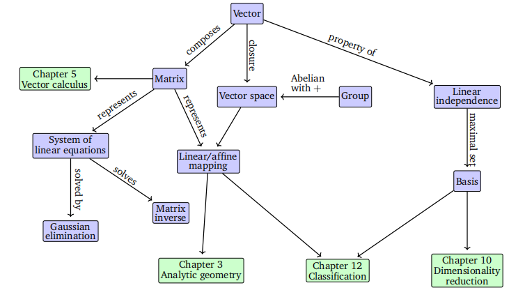

# 线性代数
> 译者：马世拓、何瑞杰
> 
> 这一章是后续很多概念的基础，我国工科生在本科阶段需要强制学习线性代数课程，但很多同学对学校的线性代数课程感到有些云里雾里。所以我这里对这一章进行了一些翻译与补充。

形成直观概念的一种常见方法是构建一系列的符号对象以及针对这些对象的规则。这就是我们所知道的**代数学**。线性代数是一门研究向量与向量运算法则的学科。我们在中学阶段所熟知的“向量”被称为**几何向量**，通常会用小箭头作标记，例如$\vec{x}$, $\vec{y}$等。在本书中我们讨论的是更为一般的向量概念并用粗体来表示它们,比如$\boldsymbol{x}$,$\boldsymbol{y}$等。

一般来说，向量这种特殊的对象可以进行叠加，并且乘以标量后会产生新的同类型对象。从抽象的数学角度来看，任何满足这两个属性的对象都可以被认为是一个向量。下面是一些这样的向量对象的例子：

1. **几何向量**。这种定义下的向量案例对于有中学数学和物理基础的人来说再熟悉不过了。如图2.1(a)所示，几何向量在图中被表示为一个至少有两个维度的有向线段。两个几何向量$\boldsymbol{\vec{x}}$,$\boldsymbol{\vec{y}}$可以相加，例如$\boldsymbol{\vec{x}}+\boldsymbol{\vec{y}}=\boldsymbol{\vec{z}}$就是一个新的几何向量。进一步地，一个几何向量$\boldsymbol{\vec{x}}$乘上一个标量$\lambda\in \R$变为$\lambda\boldsymbol{\vec{x}}$，结果仍然是一个几何向量。事实上，它是由原向量放缩$\lambda$倍得到的结果。因此，几何向量是前面介绍的向量概念的实例。将向量解释为几何向量使我们能够使用关于方向和大小的直觉来推理数学运算。
2. **多项式也是向量**。如图2.1(b)所示，两个多项式加在一起可以进而产生新的多项式；它们也可以用一个标量$\lambda\in \R$去乘，结果同样是一个新的多项式。因此，多项式是（不太寻常的）向量实例。要注意到多项式与几何向量有很大不同。几何向量是具体的图形，而多项式是抽象概念。然而，它们都是我们前面描述的向量。
3. **音频信号是向量**。音频信号用一系列的数字来表示。我们可以把音频信号加在一起，它们的总和就是一个新的音频信号。如果我们缩放一个音频信号，我们也会得到一个音频信号。因此，音频信号也是一种向量的类型。
4. **$\R^n$（n个实数组成的元组）中的元素也是向量**（译者注：这里我们往往也叫做“n维欧几里得空间”）。$\R^n$是比多项式更抽象的概念，也是我们在这本书中会聚焦的概念。例如：
$
\boldsymbol{a}=
\left [
\begin{matrix}
1 \\ 2 \\3
\end{matrix}
\right ]\in \R^3
$
就是一个三元数组的实例。对两个向量 $\boldsymbol{a}$, $\boldsymbol{b}$ 按分量相加会得到一个新的向量  $\boldsymbol{a}+\boldsymbol{b}=\boldsymbol{c}\in \R^n$ 。进一步说，用一个标量 $\lambda \in \R$ 乘一个向量 $\boldsymbol{a}$ 会得到一个放缩后的新向量 $\lambda\boldsymbol{a}\in\R^n$ 。将向量作为 $\R^n$ 的元素有一个额外的好处，就是能够自然对应于计算机上的实数数组。许多编程语言都支持数组操作，这允许方便地实现涉及向量操作的算法。

图2.1 不同类型的向量。向量可以是各种令人吃惊的对象，包括(a)几何向量和(b)多项式

线性代数聚焦于这些向量概念之间的相似性。我们可以对这些向量进行加法或标量乘法。我们主要会聚焦 $\R^n$ 中的向量因为线性代数中的绝大部分算法都是在n维欧几里得空间中形成的。我们会在第8章中看到我们也经常会把数据用 $\R^n$ 中的向量来表示。在本书中，我们会聚焦有限维线性空间，在这种情况下任何一个向量在 $\R^n$ 中存在唯一对应关系。在方便的时候，我们也会使用有关几何向量的认知并考虑一些基于数组的算法。

“**闭包**”是数学中一个很重要的概念。这基于一个问题：根据我设定的操作规则所得到的元素构成了一个怎样的集合？对于向量而言，将一个很小的向量集合经过相加与放缩操作后会得到一个怎样的向量集？这就引出了线性空间的概念（详见2.4节）。线性空间的概念及其正确性是很大一部分机器学习的基础。这一章中要介绍的一些概念总结如图2.2所示。

图2.2 本章的概念地图及与其他章节的联系

本章主要是基于下列作者的课堂笔记与著作：Drumm & Weil (2001), Strang (2003), Hogben (2013), Liesen & Mehrmann(2015), 还有Pavel Grinfeld的线性代数系列，以及其他的好资源例如Gilbert Strang在MIT的线性代数课程以及3Blue1Brown的线性代数系列。

线性代数在机器学习与基础数学中扮演着重要角色。这一章引入的概念是对第3章中几何概念的更高扩充。在第5章中，我们将讨论向量微积分，这里对于矩阵运算法则的知识就很有必要了。在第10章中，我们会使用投影（在3.8节中会介绍）通过主成分分析（PCA）进行降维。在第9章中，我们会讨论线性回归，线性代数在这里起到了解最小二乘问题的主要作用。

