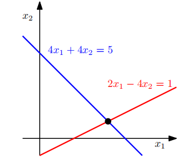

## 2.1 线性方程组
线性方程组是线性代数的核心部分。很多问题都可以用线性方程组表示，线性代数也为我们提供了解这类问题的方法。
> **例2.1**
> 一家公司生产产品 $N_1,N_2,...,N_n$ 需要用到原料 $R_1,R_2,...,R_m$ 。生产一单位产品 $N_j$ 所需要原料 $R_i$ 的用量为$a_{ij}$ ，这里 $i$ =1,2,...,m; $j$ =1,2,...,n。
>
> 问题的目标是找到一组可行的生产方案：在原料 $R_i$ 总可用量为 $b_i$ 的条件下生产产品 $N_j$ 的量 $x_j$ 为多少时没有任何原料剩余。
>
> 如果我们生产 $x_1,x_2,...,x_n$ 单位的对应产品，我们需要:
> $$
> a_{i1}x_1+a_{i2}x_2+\cdots+a_{in}x_n
> $$
> 这么多原材料$R_i$。可行解$(x_1,x_2,...,x_n)\in \R^n$，因此也就需要满足下列条件：
> $$
> a_{11}x_1+a_{12}x_2+\cdots+a_{1n}x_n=b_1\\
> \vdots\\
> a_{m1}x_1+a_{m2}x_2+\cdots+a_{mn}x_n=b_m
> $$
> 这里$a_{ij}\in \mathbb{R}$, $b_{ij}\in \mathbb{R}$

式2.3是线性方程组的通用表达形式，$x_1,x_2,...,x_n$是方程组中的未知量。每个满足2.3式的n-元组$(x_1,x_2,...,x_n)\in \R^n$都是这个线性方程组的一个解。

> **例2.2**
> 线性方程组
> $$
> x_1+x_2+x_3=3\\
> x_1-x_2+2x_3=2\\
> 2x_1+3x_3=1
> $$
> 是没有解的。因为把第一个方程和第二个方程相加得到$2x_1+3x_3=5$与第三个方程发生了冲突。
>
> 我们再来看这样一个方程组：
> $$
> x_1+x_2+x_3=3\\
> x_1-x_2+2x_3=2\\
> x_2+x_3=2
> $$
> 第一个方程减掉第三个方程可以得到$x_1=1$。第一个方程加第二个方程可以得到$2x_1+3x_3=5$，因此$x_3=1$。根据第三个方程，我们又得到$x_2=1$。因此，(1,1,1)是唯一的可行解也就是唯一解（可以通过代入法验证(1,1,1)是方程组的一个解）。
> 
> 第三个案例我们再来看这样一个方程组：
> $$
> x_1+x_2+x_3=3\\
> x_1-x_2+2x_3=2\\
> 2x_1+3x_3=5
> $$
> 因为第一个方程和第二个方程相加得到第三个方程，我们可以把第三个多余的方程消掉。从前两个方程中我们可以得到$2x_1=5-3x_3$, $2x_2=1+x_3$。我们定义$x_3=a\in \R^3$作为自由变量，任意一个满足下列形式的三元组都是方程组的解：
> $$
> (\frac{5}{2}-\frac{3}{2}a,\frac{1}{2}+\frac{1}{2}a,a), a\in \mathbb{R}
> $$
> 因此，我们得到了一个包含无穷个解的解集。

总的来说，对于一个实数域内的线性方程组，它的解只有三种情况：无解，唯一解或无穷个解。线性回归（第9章）解决了例2.1的一个版本，此时我们无法求解线性方程组。

*注：线性方程组的几何意义*。在一个只有 $x_1,x_2$ 两个变量的方程组中，每个方程都被代表了 $x_1$-$x_2$ 平面内的一条直线。线性方程组的解要分别满足其中所有方程里任意一个方程，所以它同时也是这些直线的交点。交点可以组成一条直线（如果两个方程描述的是同一条直线），可以组成一个点，或为空（两条直线平行）。图2.3描述了下面这个线性方程组的几何表示：

$$
\begin{cases}
4x_1+4x_2=5\\
2x_1-4x_2=1
\end{cases}
$$

图2.3 两个变量线性方程组的解空间在几何意义上表示为两条线的交点。每个线性方程都代表一条直线

最终的解为($x_1$,$x_2$)=(1,1/4)。类似地，对于三个变量，每个线性方程在三维空间中确定一个平面。这些平面相交形成的结果同时满足所有的线性方程，它们可以得到一个解集，可能是一个平面、一条线、一个点或为空（在这些平面没有公共的交点的情况下）。
 
2.1线性方程组

为了引出解线性方程组的符号方法，我们介绍一种有效的缩写方法。我们将系数 $a_{ij}$ 写作向量并将向量构造为矩阵。换而言之，我们将线性方程组改写为如下形式：

$$
\left [\begin{matrix}a_{11} \\ \vdots \\a_{m1}\end{matrix}\right ]x_1
+\left [\begin{matrix}a_{12} \\ \vdots \\a_{m2}\end{matrix}\right ]x_2
+\cdots
+\left [\begin{matrix}a_{1n} \\ \vdots \\a_{mn}\end{matrix}\right ]x_n=
\left [\begin{matrix}b_{1} \\ \vdots \\b_{m}\end{matrix}\right ]
\Leftrightarrow
\left [
    \begin{matrix}
    a_{11}&\cdots&a_{1n} \\ 
    \vdots&\vdots&\vdots \\
    a_{m1}&\cdots&a_{mn}
    \end{matrix}
\right ]\left [
    \begin{matrix}
    x_{1} \\ 
    \vdots\\
    x_{n}
    \end{matrix}
\right ]=\left [
    \begin{matrix}
    b_{1} \\ 
    \vdots\\
    b_{m}
    \end{matrix}
\right ]$$

接下来，我们将对这些**矩阵**及其定义的运算规则作出进一步的探究。我们将在第2.3节中讲述线性方程组的解法。
