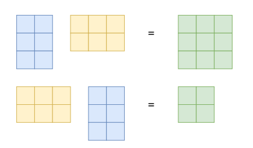

## 2.2 矩阵
矩阵在线性代数中起到了关键作用。它们不仅可以表示线性方程组，还可以表示线性函数（或者线性映射），我们将在2.7节中看到。在我们讨论这些有趣的话题之前，我们首先要定义什么是矩阵以及我们可以对矩阵进行怎样的操作。我们会在第4章看到更多有关矩阵的性质。

**定义2.1（矩阵）**：对于$m,n\in \Z$，一个大小为$(m,n)$的实矩阵$\boldsymbol{A}$是一个关于元素$a_{ij}$的m*n元组，其中$i=1,2,\dots,m, j=1,2,\dots,n$，按照m行n列的方式进行排布。

$$
\boldsymbol{A}=
\left [
    \begin{matrix}
    a_{11}&\cdots&a_{1n} \\ 
    \vdots&\vdots&\vdots \\
    a_{m1}&\cdots&a_{mn}
    \end{matrix}
\right ],
a_{ij}\in\mathbb{R}
$$

按照惯例，矩阵按第二个下标(从1到n)索引称为行，矩阵按第一个下标索引(从1到m)称为列。这些特殊的矩阵也被称为行/列向量。

$\R^{m\times n}$ 是所有实值（m，n）矩阵的集合。通过将矩阵的所有n列叠加成一个长向量，一个 $\boldsymbol{A}\in\R^{m\times n}$ 可以等价地表示为一个 $a\in\R^{m\times n}$，如图2.4所示。

图2.4 通过叠加矩阵 $\boldsymbol{A}$ 的列，矩阵 $\boldsymbol{A}$ 可以表示为长向量 $\boldsymbol{a}$ 。

### 2.2.1 矩阵的加法与乘法
两个矩阵 $\boldsymbol{A}\in\R^{m\times n}$， $\boldsymbol{B}\in\R^{m\times n}$ 的和被定义为两个矩阵按对应元素的相加得到的新矩阵，即：

$$
\boldsymbol{A}+\boldsymbol{B}=
\left [
    \begin{matrix}
    a_{11}+b_{11}&\cdots&a_{1n}+b_{1n} \\ 
    \vdots&\vdots&\vdots \\
    a_{m1}+b_{m1}&\cdots&a_{mn}+b_{mn}
    \end{matrix}
\right ]\in\R^{m\times n}
$$

对于矩阵$\boldsymbol{A}\in\R^{m\times n}$，$\boldsymbol{B}\in\R^{n\times k}$的乘积矩阵$\boldsymbol{C}=\boldsymbol{A}\boldsymbol{B}\in\R^{m\times k}$(注意这里矩阵的大小)中元素的计算法则为：

$$
c_{ij}=\sum_{l=1}^n a_{il}b_{lj},(i=1,2,\dots,m, j=1,2,\dots,k)
$$

也就是说，为了计算元素 $c_{ij}$ 我们用 $\boldsymbol{A}$ 的第i行和 $\boldsymbol{B}$ 的第j列元素逐项相乘并求和。在后续的3.2节中，我们把这种操作称作对应行与列的**内积**。在我们需要显式地执行乘法的情况下，我们使用符号 $\boldsymbol{A}\cdot \boldsymbol{B}$ 来表示乘法（显式地表示“·”）。

*注意*：矩阵只有在“相邻”的尺寸匹配时才可以相乘。例如，一个大小为 $n\times k$ 的矩阵 $\boldsymbol{A}$ 可以与一个 $k\times m$ 大小的矩阵 $\boldsymbol{B}$ 相乘，但只能从左边乘：

$$
\underbrace{\boldsymbol{A}}_{n\times k} \underbrace{\boldsymbol{B}}_{k\times m}=\underbrace{\boldsymbol{C}}_{n\times m}
$$

而乘积 $\boldsymbol{B}\boldsymbol{A}$ 如果 $m\neq n$ 时则是不被定义的，因为相邻的维度无法匹配。

*注意*：矩阵乘法并不是对矩阵的按元素乘，即：$c_{ij}\neq a_{ij}b_{ij}$（即使$\boldsymbol{A}$,$\boldsymbol{B}$的尺寸被正确选择）。当我们进行多维数组之间的乘法时，这种按位的乘法往往也出现在编程语言中，它被称作 Hadamard 积。

> **例2.3**
> 对于矩阵
>$
>\boldsymbol{A}=
>\left [
>    \begin{matrix}
>    1&2&3 \\ 
>    3&2&1
>    \end{matrix}
>\right ]\in\R^{2\times 3}
>$，
>$
>\boldsymbol{B}=
>\left [
>    \begin{matrix}
>    0&2 \\
>    1&-1\\ 
>    0&1
>    \end{matrix}
>\right ]\in\R^{3\times 2}
>$，我们有
>
>$$
\boldsymbol{A}\boldsymbol{B}=\left [ \begin{matrix} 1&2&3 \\ 3&2&1 \end{matrix} \right ]\left [ \begin{matrix} 0&2 \\ 1&-1\\ 0&1 \end{matrix} \right ]= \left [ \begin{matrix} 2&3 \\ 2&5 \end{matrix} \right ]\in \R^{2\times 2} 
>$$
>
>$$ 
\boldsymbol{B}\boldsymbol{A}= \left [ \begin{matrix} 0&2 \\ 1&-1\\ 0&1 \end{matrix} \right ] \left [ \begin{matrix} 1&2&3 \\ 3&2&1 \end{matrix} \right ] = \left [ \begin{matrix} 6&4&2 \\ -2&0&2\\ 3&2&1 \end{matrix} \right ]\in \R^{3\times 3}
>$$
>
从这个例子中我们可以看到，矩阵的乘法并不具备交换律，即：$\boldsymbol{A}\boldsymbol{B}\neq \boldsymbol{B}\boldsymbol{A}$。图2.5给出了它的几何解释。

图2.5 即使同时定义了矩阵乘法 AB 和 BA，结果的维数也可能是不同的。

**定义（单位矩阵）**：在$\R^{n\times n}$中，定义**单位矩阵**

$$
\boldsymbol{I}_n=\left [
    \begin{matrix}
    1&0&\cdots&0 \\
    0&1&\cdots&0\\
    \vdots&\vdots&\cdots&\vdots\\
    0&0&\cdots&1
    \end{matrix}
\right ]\in \mathbb{R}^{n\times n}
$$

为对角线上全部为1，其他位置全部为0的$n\times n$维矩阵。

现在，我们定义了矩阵的加法、乘法和单位矩阵，让我们来看看它们的运算性质：

- **结合律**：

$$
\forall \boldsymbol{A}\in\R^{m\times n}, \boldsymbol{B}\in\R^{n\times p}, \boldsymbol{C}\in\R^{p\times q}, (\boldsymbol{A}\boldsymbol{B})\boldsymbol{C}=\boldsymbol{A}(\boldsymbol{B}\boldsymbol{C})
$$

- **分配律**：

$$
\forall \boldsymbol{A},\boldsymbol{B}\in\R^{m\times n}, \boldsymbol{C},\boldsymbol{D}\in\R^{n\times p}, \\
(\boldsymbol{A}+\boldsymbol{B})\boldsymbol{C}=\boldsymbol{A}\boldsymbol{B}+\boldsymbol{A}\boldsymbol{C},\\
\boldsymbol{A}(\boldsymbol{C}+\boldsymbol{D})=\boldsymbol{A}\boldsymbol{C}+\boldsymbol{A}\boldsymbol{D}
$$

- **与单位矩阵相乘**：

$$
\forall \boldsymbol{A}\in\R^{m\times n}, \boldsymbol{I}_m\boldsymbol{A}=\boldsymbol{A}\boldsymbol{I}_n=\boldsymbol{A}
$$

注意，由于 $m\neq n$ 所以 $\boldsymbol{I}_m\neq \boldsymbol{I}_n$

### 2.2.2 矩阵的逆与转置
**定义2.3（逆矩阵）**：考虑一个方阵 $\boldsymbol{A}\in \R^{n\times n}$，令矩阵 $\boldsymbol{B}$ 满足性质：$\boldsymbol{AB}=\boldsymbol{BA}=\boldsymbol{I}_n$，$\boldsymbol{B}$ 被称作 $\boldsymbol{A}$ 的**逆**并记作 $\boldsymbol{A}^{-1}$ 。

不幸的是，并不是每个矩阵 $\boldsymbol{A}$ 都存在逆矩阵 $\boldsymbol{A}^{-1}$ 。如果这个逆存在，矩阵 $\boldsymbol{A}$ 被称作**可逆矩阵/非奇异矩阵/规则矩阵**，否则就叫作**不可逆矩阵/奇异矩阵**。如果一个矩阵的逆存在，那么它也必然唯一。在2.3节中，我们将会讨论一种通过求解线性方程组的解计算矩阵逆的通用方法。

*注意*：（ $2\times 2$ 矩阵逆的存在性）考虑一个矩阵

$$
\boldsymbol{A}=
\left [
    \begin{matrix}
    a_{11}&a_{12} \\
    a_{21}&a_{22}
    \end{matrix}
\right ]\in \mathbb{R}^{2\times 2}
$$

如果我们对矩阵 $\boldsymbol{A}$ 乘上：

$$
\boldsymbol{A}'=
\left [
    \begin{matrix}
    a_{22}&-a_{12} \\
    -a_{21}&a_{11}
    \end{matrix}
\right ]\in \mathbb{R}^{2\times 2}
$$

我们就会得到：

$$
\boldsymbol{AA}'=
\left [
    \begin{matrix}
    a_{11}a_{22}-a_{12}a_{21}&0 \\
    0&a_{11}a_{22}-a_{12}a_{21}
    \end{matrix}
\right ]=(a_{11}a_{22}-a_{12}a_{21})\boldsymbol{I}
$$

因此，

$$
\boldsymbol{A}^{-1}=
\frac{1}{a_{11}a_{22}-a_{12}a_{21}}
\left [
    \begin{matrix}
    a_{22}&-a_{12} \\
    -a_{21}&a_{11}
    \end{matrix}
\right ]
$$

当且仅当 $a_{11}a_{22}-a_{12}a_{21}\neq 0$。在4.1节中，我们会看到$(a_{11}a_{22}-a_{12}a_{21})$是这个$2\times 2$矩阵的行列式。此外，我们通常可以使用这个行列式来检查一个矩阵是否可逆。

> **例2.4**
> 矩阵 $\boldsymbol{A}= \left [ \begin{matrix} 1&2&1\\ 4&4&5\\ 6&7&7 \end{matrix} \right ]$ 与 $\boldsymbol{B}= \left [ \begin{matrix} -7&7&6\\ 2&1&-1\\ 4&5&-4 \end{matrix} \right ]$ 互为逆矩阵，因为 $\boldsymbol{AB}=\boldsymbol{BA}=\boldsymbol{I}$。

**定义2.4（转置）**：对于矩阵 $\boldsymbol{A}\in \mathbb{R}^{m\times n}$，满足 $b_{ij}=a_{ji}$ 的矩阵 $\boldsymbol{B}\in \mathbb{R}^{n\times m}$ 被称作 $\boldsymbol{A}$ 的转置。我们记 $\boldsymbol{B}=\boldsymbol{A}^{\top}$

总的来说，$\boldsymbol{A}^{\top}$可以通过把$\boldsymbol{A}$的行作为$\boldsymbol{A}^{\top}$的对应列得到（译者注：这里其实通俗来讲就是行列互换）。下面是一些有关逆与转置的重要性质：

$$
\boldsymbol{A}\boldsymbol{A}^{-1}=\boldsymbol{A}^{-1}\boldsymbol{A}_n=\boldsymbol{I}
$$

$$
(\boldsymbol{AB})^{-1}=\boldsymbol{B}^{-1}\boldsymbol{A}^{-1}
$$

$$
(\boldsymbol{A+B})^{-1}\neq \boldsymbol{A}^{-1}+\boldsymbol{B}^{-1}
$$

$$
(\boldsymbol{A}^{\top})^{\top}=\boldsymbol{A}
$$

$$
(\boldsymbol{A+B})^{\top}= \boldsymbol{A}^{\top}+\boldsymbol{B}^{\top}
$$

$$
(\boldsymbol{AB})^{\top}=\boldsymbol{B}^{\top}\boldsymbol{A}^{\top}
$$

**定义2.5（对称矩阵）**：一个矩阵$\boldsymbol{A}\in \R^{n\times n}$是**对称矩阵**若$\boldsymbol{A}=\boldsymbol{A}^{\top}$。

注意只有$n\times n$矩阵才可能具备对称性。通常来说，我们也把$n\times n$矩阵叫**方阵**因为它具备相同的行数和列数。进一步的，如果矩阵$\boldsymbol{A}$可逆，$\boldsymbol{A}^{\top}$也可逆，那么$(\boldsymbol{A}^{-1})^{\top}=(\boldsymbol{A}^{\top})^{-1}$，记作$\boldsymbol{A}^{-T}$

*注意*（对称矩阵的和与积）。对称矩阵$\boldsymbol{A,B}\in \R^{n\times n}$的和矩阵也是对称的。但是，尽管二者的积存在，结果却通常是不对称的。例如：

$$
\left [
    \begin{matrix}
    1&0\\
    0&0
    \end{matrix}
\right ]
\left [
    \begin{matrix}
    1&1\\
    1&1
    \end{matrix}
\right ]=
\left [
    \begin{matrix}
    1&1\\
    0&0
    \end{matrix}
\right ]
$$

### 2.2.3 矩阵的标量乘
让我们来看看如果矩阵乘上一个标量$\lambda \in \mathbb{R}$会发生什么吧。令$\boldsymbol{A}\in\mathbb{R}^{m\times n}, \lambda \in \mathbb{R}$, 那么$\lambda\boldsymbol{A=K}$,$K_{ij}=\lambda a_{ij}$。实际上，$\lambda$对矩阵$\boldsymbol{A}$中每个元素进行了放缩。对于$\lambda, \psi\in \mathbb{R}$，有如下性质：

- 结合律1

$$
(\lambda\psi)\boldsymbol{C}=\lambda(\psi\boldsymbol{C}), \boldsymbol{C}\in\R^{m\times n}
$$

- 结合律2

$$
\lambda(\boldsymbol{B}\boldsymbol{C})=(\lambda\boldsymbol{B})\boldsymbol{C}=\boldsymbol{B}(\lambda\boldsymbol{C})=(\boldsymbol{B}\boldsymbol{C})\lambda, \boldsymbol{B}\in\R^{m\times n}, \boldsymbol{C}\in\R^{n\times k}
$$

- 转置

$$
(\lambda\boldsymbol{C})^{\top}=\boldsymbol{C}^{\top}\lambda^{\top}=\boldsymbol{C}^{\top}\lambda=\lambda\boldsymbol{C}^{\top}
$$

因为对于$\forall \lambda \in \R$, $\lambda^{\top}=\lambda$

- 分配律

$$
\boldsymbol{B}\in\R^{m\times n}, \boldsymbol{C}\in\R^{m\times n}, \\
(\lambda+\psi)\boldsymbol{C}=\lambda\boldsymbol{C}+\psi\boldsymbol{C},\\
\lambda(\boldsymbol{B}+\boldsymbol{C})=\lambda\boldsymbol{B}+\lambda\boldsymbol{C}
$$

> **例2.5（分配律）**
> 如果我们令 $\boldsymbol{C}=\left[ \begin{matrix} 1&2\\ 3&4 \end{matrix}\right]$，对于任意 $\lambda, \psi\in\R$ 都有：
>$$
\begin{align*} \begin{bmatrix} 1(\lambda+\psi)&2(\lambda+\psi)\\ 3(\lambda+\psi)&4(\lambda+\psi) \end{bmatrix}&=\left [\begin{matrix} \lambda+\psi&2\lambda+2\psi\\ 3\lambda+3\psi&4\lambda+4\psi \end{matrix} \right]\\&=\left[ \begin{matrix} 1\lambda&2\lambda\\ 3\lambda&4\lambda \end{matrix} \right]+ \left[ \begin{matrix} 1\psi&2\psi\\ 3\psi&4\psi \end{matrix} \right]\\&=\lambda\boldsymbol{C}+\psi\boldsymbol{C}  \end{align*}
>$$

### 2.2.4 线性方程组的矩阵表示
如果我们考虑这样一个线性方程组：

$$
2x_1+3x_2+5x_3=1\\
4x_1-2x_2+7x_3=8\\
9x_1+5x_2-3x_3=2
$$

利用矩阵乘法的规则，我们可以把这个方程组写成更紧凑的形式:

$$
\left [
    \begin{matrix}
    2&3&5\\
    4&-2&7\\
    9&5&-3
    \end{matrix}
\right ]\left [
    \begin{matrix}
    x_1\\x_2\\x_3
    \end{matrix}
\right ]=\left [
    \begin{matrix}
    1\\8\\2
    \end{matrix}
\right ]
$$

注意，$x_1$缩放了第一列，$x_2$是第二列，$x_3$是第三列。

一般的，一个线性方程组可以缩写为矩阵形式 $\boldsymbol{Ax=b}$。参考2.3式，乘积 $\boldsymbol{Ax}$ 是对 $\boldsymbol{A}$ 的列的线性组合。我们将在第2.5节中更详细地讨论线性组合。
