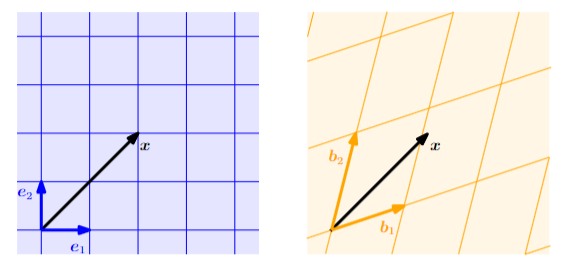
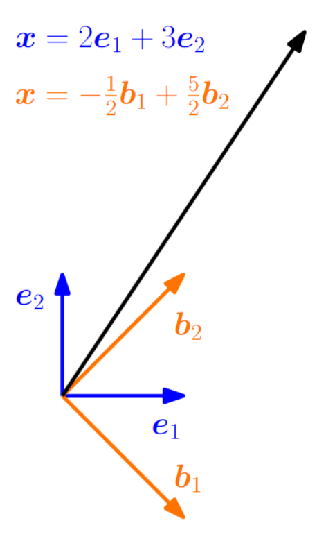
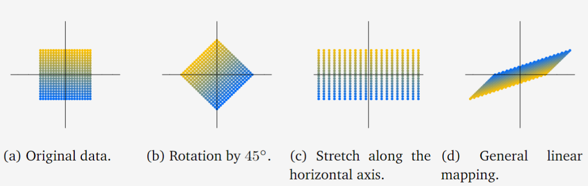
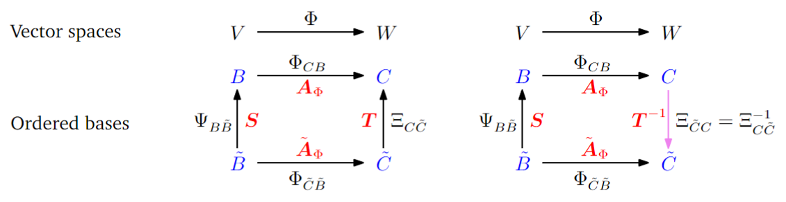

## 2.7 线性映射

接下来，我们将研究向量空间之间的映射，这些映射保持向量空间的结构，从而可以定义坐标的概念。在本章开头，我们提到向量是可以相加并被标量乘的数学对象，结果仍然是向量。我们希望这种性质在应用映射时得以保持：考虑两个实向量空间 $V, W$，一个映射 $\Phi: V \to W$ 保持向量空间的结构，如果

$$
\Phi(\boldsymbol{x} + \boldsymbol{y}) = \Phi(\boldsymbol{x}) + \Phi(\boldsymbol{y}) \quad \tag{2.85}
$$

$$
\Phi(\lambda \boldsymbol{x}) = \lambda \Phi(\boldsymbol{x}) \quad \tag{2.86}
$$

对所有 $\boldsymbol{x}, \boldsymbol{y} \in V$ 和 $\lambda \in \mathbb{R}$ 成立。我们可以将这些条件总结为以下定义：

**定义2.15（线性映射）**：对于向量空间 $V, W$，一个映射 $\Phi: V \to W$ 称为**线性映射**（或向量空间同态/线性变换），如果

$$
\forall \boldsymbol{x}, \boldsymbol{y} \in V, \forall \lambda, \psi \in \mathbb{R}: \Phi(\lambda \boldsymbol{x} + \psi \boldsymbol{y}) = \lambda \Phi(\boldsymbol{x}) + \psi \Phi(\boldsymbol{y}). \quad \tag{2.87}
$$

事实证明，我们可以用矩阵来表示线性映射（第2.7.1节）。回想一下，我们也可以将一组向量收集为矩阵的列。在处理矩阵时，我们需要牢记矩阵所代表的内容：一个线性映射还是一组向量。我们将在第4章中更多地了解线性映射。在继续之前，我们将简要介绍特殊的映射。

**定义2.16（单射、满射、双射）**：考虑一个映射 $\Phi: V \to W$，其中 $V, W$ 可以是任意集合。那么 $\Phi$ 称为：
- **单射**（Injective）：如果 $\forall \boldsymbol{x}, \boldsymbol{y} \in V: \Phi(\boldsymbol{x}) = \Phi(\boldsymbol{y}) \Rightarrow \boldsymbol{x} = \boldsymbol{y}$。
- **满射**（Surjective）：如果 $\Phi(V) = W$。
- **双射**（Bijective）：如果它是单射且满射。

如果 $\Phi$ 是满射，那么 $W$ 中的每一个元素都可以通过 $\Phi$ 从 $V$ 中的某个元素“到达”。如果 $\Phi$ 是双射，那么存在一个映射 $\Psi: W \to V$，使得 $\Psi \circ \Phi(\boldsymbol{x}) = \boldsymbol{x}$。这个映射 $\Psi$ 被称为 $\Phi$ 的**逆映射**，通常记作 $\Phi^{-1}$。根据这些定义，我们引入以下线性映射之间的特殊情形：
- **同构**（Isomorphism）：$\Phi: V \to W$ 线性且双射。
- **自同态**（Endomorphism）：$\Phi: V \to V$ 线性。线性空间 $V$ 的所有自同态形成一个集合，记为 $\text{End}(V)$
- **自同构**（Automorphism）：$\Phi: V \to V$ 线性且双射。线性空间 $V$ 的所有自同构形成一个集合，记为 $\text{Aut}(V)$
- **恒等映射**（Identity Automorphism）：$\text{id}_V: V \to V, \boldsymbol{x} \mapsto \boldsymbol{x}$ 是 $V$ 中的恒等映射。

**例2.19（同态）**：映射 $\Phi: \mathbb{R}^2 \to \mathbb{C}$，$\Phi(\boldsymbol{x}) = x_1 + ix_2$ 是一个同态：

$$
\Phi\left(\begin{bmatrix} x_1 \\ x_2 \end{bmatrix} + \begin{bmatrix} y_1 \\ y_2 \end{bmatrix}\right) = (x_1 + y_1) + i(x_2 + y_2) = (x_1 + ix_2) + (y_1 + iy_2) = \Phi\left(\begin{bmatrix} x_1 \\ x_2 \end{bmatrix}\right) + \Phi\left(\begin{bmatrix} y_1 \\ y_2 \end{bmatrix}\right)
$$

$$
\Phi\left(\lambda \begin{bmatrix} x_1 \\ x_2 \end{bmatrix}\right) = \lambda x_1 + i\lambda x_2 = \lambda(x_1 + ix_2) = \lambda \Phi\left(\begin{bmatrix} x_1 \\ x_2 \end{bmatrix}\right).
\tag{2.88} 
$$

这也证明了为什么复数可以表示为 $\mathbb{R}^2$ 中的元组：存在一个双射线性映射，将 $\mathbb{R}^2$ 中的元素逐元加法转换为复数集中的相应加法。注意，我们只证明了线性，而不是双射。

**定理2.17（Axler, 2015, 定理3.59）**：有限维向量空间 $V$ 和 $W$ 是同构的，当且仅当 $\dim(V) = \dim(W)$。

定理2.17表明，如果两个向量空间的维数相同，则它们之间存在一个线性双射映射。直观上，这意味着维数相同的向量空间在某种意义上是相同的，因为它们可以相互转换而不会有任何损失。定理2.17还为我们将 $\mathbb{R}^{m \times n}$（$m \times n$ 矩阵的向量空间）和 $\mathbb{R}^{mn}$（长度为 $mn$ 的向量空间）视为相同提供了依据，因为它们的维数都是 $mn$，并且存在一个线性双射映射，可以将一个转换为另一个。

> **注释**：考虑向量空间 $V, W, X$。那么：
- 对于线性映射 $\Phi: V \to W$ 和 $\Psi: W \to X$，映射 $\Psi \circ \Phi: V \to X$ 也是线性的。
- 如果 $\Phi: V \to W$ 是一个同构，那么 $\Phi^{-1}: W \to V$ 也是一个同构。
- 如果 $\Phi: V \to W$ 和 $\Psi: V \to W$ 是线性的，那么 $\Phi + \Psi$ 和 $\lambda \Phi$（$\lambda \in \mathbb{R}$）也是线性的。♦

### 2.7.1 线性映射的矩阵表示

任何 $n$ 维向量空间都与 $\mathbb{R}^n$ 同构（定理2.17）。我们考虑一个 $n$ 维向量空间 $V$ 的一个基 $\{\boldsymbol{b}_1, \dots, \boldsymbol{b}_n\}$。接下来，有序基的顺序将很重要。因此，我们写作

$$
B = (\boldsymbol{b}_1, \dots, \boldsymbol{b}_n) \quad \tag{2.89}
$$

并称这个 $n$-元组为 $V$ 的一个**有序基**。

**注（一些记号）**：现在我们有多个看起来相似易混淆的记号。因此我们在此重申：
- $B = (\boldsymbol{b}_1, \dots, \boldsymbol{b}_n)$ 是一个有序基；
- $B = \{\boldsymbol{b}_1, \dots, \boldsymbol{b}_n\}$ 是一个（无序）基；
- $B = [\boldsymbol{b}_1, \dots, \boldsymbol{b}_n]$ 是一个矩阵，其列向量是向量 $\boldsymbol{b}_1, \dots, \boldsymbol{b}_n$。♦

**定义2.18（坐标）**：考虑一个向量空间 $V$ 和 $V$ 的一个有序基 $B = (\boldsymbol{b}_1, \dots, \boldsymbol{b}_n)$。对于任意 $\boldsymbol{x} \in V$，我们得到一个唯一的表示（线性组合）

$$
\boldsymbol{x} = \alpha_1 \boldsymbol{b}_1 + \cdots + \alpha_n \boldsymbol{b}_n \quad \tag{2.90}
$$

的 $\boldsymbol{x}$ 关于 $B$。那么 $\alpha_1, \dots, \alpha_n$ 称为 $\boldsymbol{x}$ 关于 $B$ 的**坐标**，而向量

$$
\boldsymbol{\alpha} = \begin{bmatrix}
\alpha_1 \\ \vdots \\ \alpha_n
\end{bmatrix} \in \mathbb{R}^n \quad \tag{2.91}
$$

称为 $\boldsymbol{x}$ 关于有序基 $B$ 的**坐标向量**或**坐标表示**。

基有效地定义了一个坐标系。我们熟悉二维中的笛卡尔坐标系，它由规范基向量 $\boldsymbol{e}_1, \boldsymbol{e}_2$ 张成。在这个坐标系中，一个向量 $\boldsymbol{x} \in \mathbb{R}^2$ 有一个表示，它告诉我们如何线性组合 $\boldsymbol{e}_1$ 和 $\boldsymbol{e}_2$ 来得到 $\boldsymbol{x}$。然而，$\mathbb{R}^2$ 的任何基都定义了一个有效的坐标系，同一个向量 $\boldsymbol{x}$ 在 $(\boldsymbol{b}_1, \boldsymbol{b}_2)$ 基中可能有不同的坐标表示。在图2.8中，$\boldsymbol{x}$ 关于标准基 $(\boldsymbol{e}_1, \boldsymbol{e}_2)$ 的坐标是 $[2, 2]^\top$。然而，关于基 $(\boldsymbol{b}_1, \boldsymbol{b}_2)$，同一个向量 $\boldsymbol{x}$ 被表示为 $[1.09, 0.72]^\top$，即 $\boldsymbol{x} = 1.09\boldsymbol{b}_1 + 0.72\boldsymbol{b}_2$。在接下来的部分中，我们将发现如何得到这种表示。

图2.8 相同的向量在基不同的两个线性空间中的坐标表示不同

**例2.20**：考虑一个几何向量 $\boldsymbol{x} \in \mathbb{R}^2$，其关于 $\mathbb{R}^2$ 的标准基 $(\boldsymbol{e}_1, \boldsymbol{e}_2)$ 的坐标为 $[2, 3]^\top$。这意味着我们可以写作 $\boldsymbol{x} = 2\boldsymbol{e}_1 + 3\boldsymbol{e}_2$。然而，我们不需要选择标准基来表示这个向量。如果我们使用基向量 $\boldsymbol{b}_1 = [1, -1]^\top, \boldsymbol{b}_2 = [1, 1]^\top$，我们将得到坐标 $\frac{1}{2}[-1, 5]^\top$，以表示关于 $(\boldsymbol{b}_1, \boldsymbol{b}_2)$ 的同一个向量（见图2.9）。

图2.9 同一向量的不同坐标表示取决于基的选取

> **注释**：对于一个 $n$ 维向量空间 $V$ 和 $V$ 的一个有序基 $B$，映射 $\Phi: \mathbb{R}^n \to V$，$\Phi(\boldsymbol{e}_i) = \boldsymbol{b}_i$，$i = 1, \dots, n$，是线性的（并且由于定理2.17是一个同构），其中 $(\boldsymbol{e}_1, \dots, \boldsymbol{e}_n)$ 是 $\mathbb{R}^n$ 的标准基。♦

现在，我们已经准备好明确地建立矩阵和有限维向量空间之间的线性映射之间的联系。

**定义2.19（变换矩阵）**：考虑向量空间 $V, W$，分别有对应的（有序）基 $B = (\boldsymbol{b}_1, \dots, \boldsymbol{b}_n)$ 和 $C = (\boldsymbol{c}_1, \dots, \boldsymbol{c}_m)$。此外，考虑一个线性映射 $\Phi: V \to W$。对于 $j \in \{1, \dots, n\}$，

$$
\Phi(\boldsymbol{b}_j) = \alpha_{1j} \boldsymbol{c}_1 + \cdots + \alpha_{mj} \boldsymbol{c}_m = \sum_{i=1}^m \alpha_{ij} \boldsymbol{c}_i \quad \tag{2.92}
$$

是 $\Phi(\boldsymbol{b}_j)$ 关于 $C$ 的唯一表示。那么，我们称矩阵 $A_\Phi$，其元素由

$$
A_\Phi(i, j) = \alpha_{ij} \quad \tag{2.93}
$$

给出，为 $\Phi$ 的**变换矩阵**（关于有序基 $B$ 和 $C$）。

$\Phi(\boldsymbol{b}_j)$ 关于有序基 $C$ 的坐标是变换矩阵 $A_\Phi$ 的第 $j$ 列。考虑（有限维）向量空间 $V, W$，分别有有序基 $B, C$，以及一个线性映射 $\Phi: V \to W$ 和其变换矩阵 $A_\Phi$。如果 $\hat{\boldsymbol{x}}$ 是 $\boldsymbol{x} \in V$ 关于 $B$ 的坐标向量，而 $\hat{\boldsymbol{y}}$ 是 $\boldsymbol{y} = \Phi(\boldsymbol{x}) \in W$ 关于 $C$ 的坐标向量，那么

$$
\hat{\boldsymbol{y}} = A_\Phi \hat{\boldsymbol{x}}. \quad \tag{2.94}
$$

这意味着变换矩阵可以用来将关于 $V$ 中有序基的坐标映射到关于 $W$ 中有序基的坐标。

**例2.21（变换矩阵）**：考虑一个同态 $\Phi: V \to W$ 和 $V$ 的有序基 $B = (\boldsymbol{b}_1, \dots, \boldsymbol{b}_3)$ 以及 $W$ 的有序基 $C = (\boldsymbol{c}_1, \dots, \boldsymbol{c}_4)$。给定

$$
\Phi(\boldsymbol{b}_1) = \boldsymbol{c}_1 - \boldsymbol{c}_2 + 3\boldsymbol{c}_3 - \boldsymbol{c}_4, \\
\Phi(\boldsymbol{b}_2) = 2\boldsymbol{c}_1 + \boldsymbol{c}_2 + 7\boldsymbol{c}_3 + 2\boldsymbol{c}_4, \\
\Phi(\boldsymbol{b}_3) = 3\boldsymbol{c}_2 + \boldsymbol{c}_3 + 4\boldsymbol{c}_4,
\tag{2.95}
$$

那么关于 $B$ 和 $C$ 的变换矩阵 $A_\Phi$ 满足 $\Phi(\boldsymbol{b}_k) = \sum_{i=1}^4 \alpha_{ik} \boldsymbol{c}_i$，$k = 1, \dots, 3$，并且由

$$
A_\Phi = [\boldsymbol{\alpha}_1, \boldsymbol{\alpha}_2, \boldsymbol{\alpha}_3] = \begin{bmatrix}
1 & 2 & 0 \\
-1 & 1 & 3 \\
3 & 7 & 1 \\
-1 & 2 & 4
\end{bmatrix},
\tag{2.96}
$$

给出，其中 $\boldsymbol{\alpha}_j$，$j = 1, 2, 3$，是 $\Phi(\boldsymbol{b}_j)$ 关于 $C$ 的坐标向量。

**例2.22（向量的线性变换）**：考虑 $\mathbb{R}^2$ 中的一组向量，如图2.10(a)所示，每个向量用一个点表示，对应于 $(x_1, x_2)$-坐标。这些向量排列成一个正方形。当我们使用矩阵 $A_1$ 在(2.97)中对每个向量进行线性变换时，我们得到图2.10(b)中的旋转正方形。如果我们应用由矩阵 $A_2$ 表示的线性映射，我们得到图2.10(c)中的矩形，其中每个 $x_1$-坐标被拉伸了2倍。图2.10(d)显示了使用 $A_3$ 对原始正方形进行线性变换后的结果，这是一个反射、旋转和拉伸的组合。

$$
\boldsymbol{A}_{1} = \begin{bmatrix}
\cos\left( \frac{\pi}{4} \right) & -\sin\left( \frac{\pi}{4} \right)\\
\sin\left( \frac{\pi}{4} \right) & \cos\left( \frac{\pi}{4} \right)
\end{bmatrix}, \quad \boldsymbol{A}_{2} = \begin{bmatrix}
2 & 0\\0 & 1
\end{bmatrix}, \quad \boldsymbol{A}_{3} = \frac{1}{2}\begin{bmatrix}
3 & -1\\
1 & -1
\end{bmatrix} \tag{2.97}
$$

图2.10 线性映射的例子。（a）以点表示的均匀分布的原始向量。（b）逆时针旋转 45°（c）沿着水平方向两侧拉长（d）一般的线性变换

### 2.7.2 基变换

接下来，我们将更仔细地研究当我们在 $V$ 和 $W$ 中改变基时，线性映射 $\Phi: V \to W$ 的变换矩阵如何变化。考虑 $V$ 的两个有序基

$$
B = (\boldsymbol{b}_1, \dots, \boldsymbol{b}_n), \quad \tilde{B} = (\tilde{\boldsymbol{b}}_1, \dots, \tilde{\boldsymbol{b}}_n) \quad \tag{2.98}
$$

以及 $W$ 的两个有序基

$$
C = (\boldsymbol{c}_1, \dots, \boldsymbol{c}_m), \quad \tilde{C} = (\tilde{\boldsymbol{c}}_1, \dots, \tilde{\boldsymbol{c}}_m). \quad \tag{2.99}
$$

此外，$A_\Phi \in \mathbb{R}^{m \times n}$ 是线性映射 $\Phi: V \to W$ 关于基 $B$ 和 $C$ 的变换矩阵，而 $\tilde{A}_\Phi \in \mathbb{R}^{m \times n}$ 是关于 $\tilde{B}$ 和 $\tilde{C}$ 的相应变换矩阵。在接下来的内容中，我们将研究 $A$ 和 $\tilde{A}$ 之间的关系，即/或我们是否可以将 $A_\Phi$ 转换为 $\tilde{A}_\Phi$，如果我们选择从 $B, C$ 到 $\tilde{B}, \tilde{C}$ 进行基变换。

> **注释**：我们实际上得到了不同坐标表示的恒等映射 $\text{id}_V$。在图2.9的上下文中，这意味着将关于 $(\boldsymbol{e}_1, \boldsymbol{e}_2)$ 的坐标映射到关于 $(\boldsymbol{b}_1, \boldsymbol{b}_2)$ 的坐标，而不改变向量 $\boldsymbol{x}$。通过改变基并相应地改变向量的表示，关于新基的变换矩阵可以具有特别简单的形式，这使得计算变得直接。♦

**例2.23（基变换）**：考虑一个变换矩阵

$$
A = \begin{bmatrix}
2 & 1 \\ 1 & 2
\end{bmatrix}
\tag{2.100}
$$

关于 $\mathbb{R}^2$ 的规范基。如果我们定义一个新的基

$$
B = \left( \begin{bmatrix} 1 \\ 1 \end{bmatrix}, \begin{bmatrix} 1 \\ -1 \end{bmatrix} \right)
\tag{2.101}
$$

那么我们得到一个对角变换矩阵

$$
\tilde{A} = \begin{bmatrix}
3 & 0 \\ 0 & 1
\end{bmatrix}
\tag{2.102}
$$

关于 $B$，这比 $A$ 更容易处理。

在接下来的内容中，我们将研究将一个基的坐标向量映射到另一个基的坐标向量的映射。我们将首先陈述我们的主要结果，然后进行解释。

**定理2.20（基变换）**：对于线性映射 $\Phi: V \to W$，有序基

$$
B = (\boldsymbol{b}_1, \dots, \boldsymbol{b}_n), \quad \tilde{B} = (\tilde{\boldsymbol{b}}_1, \dots, \tilde{\boldsymbol{b}}_n) \quad \tag{2.103}
$$

在 $V$ 中，

$$
C = (\boldsymbol{c}_1, \dots, \boldsymbol{c}_m), \quad \tilde{C} = (\tilde{\boldsymbol{c}}_1, \dots, \tilde{\boldsymbol{c}}_m) \quad \tag{2.104}
$$

在 $W$ 中，以及关于 $B$ 和 $C$ 的变换矩阵 $A_\Phi$，关于基 $\tilde{B}$ 和 $\tilde{C}$ 的相应变换矩阵 $\tilde{A}_\Phi$ 由

$$
\tilde{A}_\Phi = T^{-1} A_\Phi S \quad \tag{2.105}
$$

给出。这里，$S \in \mathbb{R}^{n \times n}$ 是恒等映射 $\text{id}_V$ 的变换矩阵，它将关于 $\tilde{B}$ 的坐标映射到关于 $B$ 的坐标，而 $T \in \mathbb{R}^{m \times m}$ 是恒等映射 $\text{id}_W$ 的变换矩阵，它将关于 $\tilde{C}$ 的坐标映射到关于 $C$ 的坐标。

**证明**：根据 Drumm 和 Weil (2001)，我们可以将 $V$ 的新基 $\tilde{B}$ 的向量表示为 $B$ 的基向量的线性组合，使得

$$
\tilde{\boldsymbol{b}}_j = \sum_{i=1}^n s_{ij} \boldsymbol{b}_i, \quad j = 1, \dots, n. \quad \tag{2.106}
$$

类似地，我们将 $W$ 的新基 $\tilde{C}$ 的向量表示为 $C$ 的基向量的线性组合，得到

$$
\tilde{\boldsymbol{c}}_k = \sum_{l=1}^m t_{lk} \boldsymbol{c}_l, \quad k = 1, \dots, m. \quad \tag{2.107}
$$

我们定义 $S = ((s_{ij})) \in \mathbb{R}^{n \times n}$ 为变换矩阵，它将关于 $\tilde{B}$ 的坐标映射到关于 $B$ 的坐标，而 $T = ((t_{lk})) \in \mathbb{R}^{m \times m}$ 为变换矩阵，它将关于 $\tilde{C}$ 的坐标映射到关于 $C$ 的坐标。特别地，$S$ 的第 $j$ 列是 $\tilde{\boldsymbol{b}}_j$ 关于 $B$ 的坐标表示，而 $T$ 的第 $k$ 列是 $\tilde{\boldsymbol{c}}_k$ 关于 $C$ 的坐标表示。注意，$S$ 和 $T$ 都是可逆的。我们将从两个角度研究 $\Phi(\tilde{\boldsymbol{b}}_j)$。首先，应用映射 $\Phi$，我们得到

$$
\begin{align}
\Phi(\tilde{\boldsymbol{b}}_j) &= \sum_{k=1}^m \tilde{k}_j \tilde{\boldsymbol{c}}_k \quad \tag{2.107} \\&= \sum_{k=1}^m \tilde{k}_j \sum_{l=1}^m t_{lk} \boldsymbol{c}_l = \sum_{l=1}^m \left( \sum_{k=1}^m t_{lk} \tilde{k}_j \right) \boldsymbol{c}_l, \quad \tag{2.108}
\end{align}
$$

其中我们首先将 $W$ 中的新基向量 $\tilde{\boldsymbol{c}}_k$ 表示为 $C$ 中基向量 $\boldsymbol{c}_l$ 的线性组合，然后交换了求和的顺序。另一方面，将 $\tilde{\boldsymbol{b}}_j \in V$ 表示为 $B$ 中基向量 $\boldsymbol{b}_i$ 的线性组合，我们得到

$$
\begin{align*}
\Phi(\tilde{\boldsymbol{b}}_j) &= \Phi \left( \sum_{i=1}^n s_{ij} \boldsymbol{b}_i \right) \\&= \sum_{i=1}^n s_{ij} \Phi(\boldsymbol{b}_i) = \sum_{i=1}^n s_{ij} \sum_{l=1}^m a_{li} \boldsymbol{c}_l \quad \tag{2.109a} \\&= \sum_{l=1}^m \left( \sum_{i=1}^n a_{li} s_{ij} \right) \boldsymbol{c}_l, \quad j = 1, \dots, n, \quad \tag{2.109b}
\end{align*}
$$

其中我们利用了 $\Phi$ 的线性。比较 (2.108) 和 (2.109b)，我们得到

$$
\sum_{k=1}^m t_{lk} \tilde{k}_j = \sum_{i=1}^n a_{li} s_{ij}, \quad \forall j = 1, \dots, n, \quad \forall l = 1, \dots, m,
$$

因此，

$$
T \tilde{A}_\Phi = A_\Phi S \in \mathbb{R}^{m \times n}, \quad \tag{2.111}
$$

从而，

$$
\tilde{A}_\Phi = T^{-1} A_\Phi S, \quad \tag{2.112}
$$

这就证明了定理2.20。

定理2.20告诉我们，当我们在 $V$ 中从 $B$ 到 $\tilde{B}$ 进行基变换，以及在 $W$ 中从 $C$ 到 $\tilde{C}$ 进行基变换时，线性映射 $\Phi: V \to W$ 的变换矩阵 $A_\Phi$ 被替换为等价矩阵 $\tilde{A}_\Phi$，满足

$$
\tilde{A}_\Phi = T^{-1} A_\Phi S. \quad \tag{2.113}
$$

图2.11说明了这种关系：考虑一个同态 $\Phi: V \to W$ 和 $V$ 的有序基 $B, \tilde{B}$ 以及 $W$ 的有序基 $C, \tilde{C}$。映射 $\Phi_{CB}$ 是 $\Phi$ 的一个实例，它将 $B$ 的基向量映射为 $C$ 的基向量的线性组合。假设我们知道关于有序基 $B, C$ 的变换矩阵 $A_\Phi$。当我们从 $B$ 到 $\tilde{B}$ 在 $V$ 中进行基变换，以及从 $C$ 到 $\tilde{C}$ 在 $W$ 中进行基变换时，我们可以通过以下方式确定关于基 $\tilde{B}, \tilde{C}$ 的映射 $\Phi_{\tilde{C}\tilde{B}}$：

$$
\Phi_{\tilde{C}\tilde{B}} = \Xi_{\tilde{C}C} \circ \Phi_{CB} \circ \Psi_{B\tilde{B}} = \Xi^{-1}_{C\tilde{C}} \circ \Phi_{CB} \circ \Psi_{B\tilde{B}}. \quad \tag{2.114}
$$

具体来说，我们使用 $\Psi_{B\tilde{B}} = \text{id}_V$ 和 $\Xi_{C\tilde{C}} = \text{id}_W$，即 $V$ 和 $W$ 中的恒等映射，但相对于不同的基。

图2.11 线性变换和基变换之间的关系

**定义2.21（等价）**：如果存在可逆矩阵 $S \in \mathbb{R}^{n \times n}$ 和 $T \in \mathbb{R}^{m \times m}$，使得

$$
\tilde{A} = T^{-1} A S,
$$

则称矩阵 $A, \tilde{A} \in \mathbb{R}^{m \times n}$ 是**等价**的。

**定义2.22（相似）**：如果存在一个可逆矩阵 $S \in \mathbb{R}^{n \times n}$，使得

$$
\tilde{A} = S^{-1} A S,
$$

则称矩阵 $A, \tilde{A} \in \mathbb{R}^{n \times n}$ 是**相似**的。

> **注释**：相似矩阵总是等价的。然而，等价矩阵不一定是相似的。♦

> **注释**：考虑向量空间 $V, W, X$。从注释中我们知道，对于线性映射 $\Phi: V \to W$ 和 $\Psi: W \to X$，映射 $\Psi \circ \Phi: V \to X$ 也是线性的。如果 $A_\Phi$ 和 $A_\Psi$ 是相应映射的变换矩阵，那么整体变换矩阵是 $A_{\Psi \circ \Phi} = A_\Psi A_\Phi$。♦

从这个注释来看，我们可以从线性映射的组合的角度来看待基变换：
- $A_\Phi$ 是线性映射 $\Phi_{CB}: V \to W$ 关于基 $B, C$ 的变换矩阵。
- $\tilde{A}_\Phi$ 是线性映射 $\Phi_{\tilde{C}\tilde{B}}: V \to W$ 关于基 $\tilde{B}, \tilde{C}$ 的变换矩阵。
- $S$ 是线性映射 $\Psi_{B\tilde{B}}: V \to V$（自同构）的变换矩阵，它用 $B$ 表示 $\tilde{B}$。通常，$\Psi = \text{id}_V$ 是 $V$ 中的恒等映射。
- $T$ 是线性映射 $\Xi_{C\tilde{C}}: W \to W$（自同构）的变换矩阵，它用 $C$ 表示 $\tilde{C}$。通常，$\Xi = \text{id}_W$ 是 $W$ 中的恒等映射。

如果非正式地用基来表示这些变换，那么 $A_\Phi: B \to C$，$\tilde{A}_\Phi: \tilde{B} \to \tilde{C}$，$S: \tilde{B} \to B$，$T: \tilde{C} \to C$，以及 $T^{-1}: C \to \tilde{C}$，并且

$$
\tilde{B} \to \tilde{C} = \tilde{B} \to B \to C \to \tilde{C} \quad \tag{2.115}
$$

$$
\tilde{A}_\Phi = T^{-1} A_\Phi S. \quad \tag{2.116}
$$

注意，(2.116) 中的执行顺序是从右到左，因为向量在右侧相乘，所以 $x \mapsto Sx \mapsto A_\Phi (Sx) \mapsto T^{-1}(A_\Phi (Sx)) = \tilde{A}_\Phi x$。

**例2.24（基变换）**：考虑一个线性映射 $\Phi: \mathbb{R}^3 \to \mathbb{R}^4$，其变换矩阵为

$$
A_\Phi = \begin{bmatrix}
1 & 2 & 0 \\
-1 & 1 & 3 \\
3 & 7 & 1 \\
-1 & 2 & 4
\end{bmatrix}
\tag{2.117}
$$

关于标准基

$$
B = \left( \begin{bmatrix} 1 \\ 0 \\ 0 \end{bmatrix}, \begin{bmatrix} 0 \\ 1 \\ 0 \end{bmatrix}, \begin{bmatrix} 0 \\ 0 \\ 1 \end{bmatrix} \right), \quad C = \left( \begin{bmatrix} 1 \\ 0 \\ 0 \\ 0 \end{bmatrix}, \begin{bmatrix} 0 \\ 1 \\ 0 \\ 0 \end{bmatrix}, \begin{bmatrix} 0 \\ 0 \\ 1 \\ 0 \end{bmatrix}, \begin{bmatrix} 0 \\ 0 \\ 0 \\ 1 \end{bmatrix} \right).
\tag{2.118}
$$

我们希望找到关于新基

$$
\tilde{B} = \left( \begin{bmatrix} 1 \\ 1 \\ 0 \end{bmatrix}, \begin{bmatrix} 0 \\ 1 \\ 1 \end{bmatrix}, \begin{bmatrix} 1 \\ 0 \\ 1 \end{bmatrix} \right) \in \mathbb{R}^3, \quad \tilde{C} = \left( \begin{bmatrix} 1 \\ 1 \\ 0 \\ 0 \end{bmatrix}, \begin{bmatrix} 1 \\ 0 \\ 1 \\ 0 \end{bmatrix}, \begin{bmatrix} 0 \\ 1 \\ 1 \\ 0 \end{bmatrix}, \begin{bmatrix} 1 \\ 0 \\ 0 \\ 1 \end{bmatrix} \right).
\tag{2.119}
$$

的变换矩阵 $\tilde{A}_\Phi$。
那么，

$$
S = \begin{bmatrix}
1 & 0 & 1 \\
1 & 1 & 0 \\
0 & 1 & 1
\end{bmatrix}, \quad T = \begin{bmatrix}
1 & 1 & 0 & 1 \\
1 & 0 & 1 & 0 \\
0 & 1 & 1 & 0 \\
0 & 0 & 0 & 1
\end{bmatrix},
\tag{2.120}
$$

其中 $S$ 的第 $i$ 列是 $\tilde{\boldsymbol{b}}_i$ 关于 $B$ 的基向量的坐标表示。由于 $B$ 是标准基，坐标表示很容易找到。对于一般的基 $B$，我们需要解一个线性方程组来找到 $\lambda_i$，使得

$$
\sum_{i=1}^3 \lambda_i \boldsymbol{b}_i = \tilde{\boldsymbol{b}}_j, \quad j = 1, \dots, 3.
$$

类似地，$T$ 的第 $j$ 列是 $\tilde{\boldsymbol{c}}_j$ 关于 $C$ 的基向量的坐标表示。因此，我们得到

$$
\tilde{A}_\Phi = T^{-1} A_\Phi S = \frac{1}{2} \begin{bmatrix}
1 & 1 & -1 \\
-1 & 1 & -1 \\
-1 & 1 & 1 \\
0 & 0 & 0 & 2
\end{bmatrix}
\begin{bmatrix}
3 & 2 & 1 \\
0 & 4 & 2 \\
10 & 8 & 4
\end{bmatrix} \quad \tag{2.121a}
$$

$$
= \begin{bmatrix}
-4 & -4 & -2 \\
6 & 0 & 0 \\
4 & 8 & 4 \\
1 & 6 & 3
\end{bmatrix}.
\tag{2.121b}
$$

在第4章中，我们将利用基变换的概念，找到一个基，使得一个内射的变换矩阵具有特别简单的（对角）形式。在第10章中，我们将研究一个数据压缩问题，并找到一个方便的基，将数据投影到该基上，同时最小化压缩损失。

### 2.7.3 像和核

线性映射的像和核是具有某些重要性质的向量子空间。接下来，我们将更仔细地描述它们。

**定义2.23（像和核）**：对于 $\Phi: V \to W$，我们定义

$$
\text{ker}(\Phi) := \Phi^{-1}(\boldsymbol{0}_W) = \{\boldsymbol{v} \in V : \Phi(\boldsymbol{v}) = \boldsymbol{0}_W\} \quad \tag{2.122}
$$

为 $\Phi$ 的**核**或**零空间**，以及

$$
\text{Im}(\Phi) := \Phi(V) = \{\boldsymbol{w} \in W : \exists \boldsymbol{v} \in V, \Phi(\boldsymbol{v}) = \boldsymbol{w}\} \quad \tag{2.123}
$$

为 $\Phi$ 的**像**或**值域**。

我们还称 $V$ 和 $W$ 分别为 $\Phi$ 的**定义域**和**值域**。直观上，核是 $V$ 中所有被 $\Phi$ 映射到 $W$ 中的零向量 $\boldsymbol{0}_W$ 的向量集合。像则是 $W$ 中所有可以通过 $\Phi$ 从 $V$ 中的某个向量“到达”的向量集合。图2.12给出了一个说明。

图2.12 线性映射的像和核

> **注释**：考虑线性映射 $\Phi: V \to W$，其中 $V, W$ 是向量空间。
- 总是成立 $\Phi(\boldsymbol{0}_V) = \boldsymbol{0}_W$，因此 $\boldsymbol{0}_V \in \text{ker}(\Phi)$。特别地，零空间永远不会是空的。
- $\text{Im}(\Phi) \subseteq W$ 是 $W$ 的一个子空间，而 $\text{ker}(\Phi) \subseteq V$ 是 $V$ 的一个子空间。♦

**注（零空间和列空间）**：考虑 $A \in \mathbb{R}^{m \times n}$ 和线性映射 $\Phi: \mathbb{R}^n \to \mathbb{R}^m$，$\boldsymbol{x} \mapsto A\boldsymbol{x}$。对于 $A = [\boldsymbol{a}_1, \dots, \boldsymbol{a}_n]$，其中 $\boldsymbol{a}_i$ 是 $A$ 的列，我们得到

$$
\text{Im}(\Phi) = \{A\boldsymbol{x} : \boldsymbol{x} \in \mathbb{R}^n\} = \left\{ \sum_{i=1}^n x_i \boldsymbol{a}_i : x_1, \dots, x_n \in \mathbb{R} \right\} \quad \tag{2.124a}
$$

$$
= \text{span}[\boldsymbol{a}_1, \dots, \boldsymbol{a}_n] \subseteq \mathbb{R}^m, \quad \tag{2.124b}
$$

即像就是 $A$ 的列的张成空间，也称为**列空间**。因此，像（列空间）是 $\mathbb{R}^m$ 的一个子空间，其中 $m$ 是矩阵的“高度”。$\text{rk}(A) = \dim(\text{Im}(\Phi))$。核/零空间 $\text{ker}(\Phi)$ 是齐次线性方程组 $A\boldsymbol{x} = \boldsymbol{0}$ 的一般解，它捕捉了所有可能的线性组合，这些线性组合在 $\mathbb{R}^n$ 中产生 $\boldsymbol{0} \in \mathbb{R}^m$。零空间是 $\mathbb{R}^n$ 的一个子空间，其中 $n$ 是矩阵的“宽度”。零空间关注列之间的关系，我们可以用它来确定如何/是否可以用其他列来表示一列。

**例2.25（线性映射的像和核）**：映射

$$
\Phi: \mathbb{R}^4 \to \mathbb{R}^2, \quad \begin{bmatrix}
x_1 \\ x_2 \\ x_3 \\ x_4
\end{bmatrix} \mapsto \begin{bmatrix}
1 & 2 & -1 & 0 \\
1 & 0 & 0 & 1
\end{bmatrix} \begin{bmatrix}
x_1 \\ x_2 \\ x_3 \\ x_4
\end{bmatrix} = \begin{bmatrix}
x_1 + 2x_2 - x_3 \\ x_1 + x_4
\end{bmatrix}
\tag{2.125a}
$$

$$
= x_1 \begin{bmatrix}
1 \\ 1
\end{bmatrix} + x_2 \begin{bmatrix}
2 \\ 0
\end{bmatrix} + x_3 \begin{bmatrix}
-1 \\ 0
\end{bmatrix} + x_4 \begin{bmatrix}
0 \\ 1
\end{bmatrix}. \quad \tag{2.125b}
$$

是线性的。为了确定 $\text{Im}(\Phi)$，我们可以取变换矩阵的列的张成空间：

$$
\text{Im}(\Phi) = \text{span}\left[ \begin{bmatrix}
1 \\ 1
\end{bmatrix}, \begin{bmatrix}
2 \\ 0
\end{bmatrix}, \begin{bmatrix}
-1 \\ 0
\end{bmatrix}, \begin{bmatrix}
0 \\ 1
\end{bmatrix} \right]. \quad \tag{2.126}
$$

为了计算 $\Phi$ 的核（零空间），我们需要解 $A\boldsymbol{x} = \boldsymbol{0}$，即我们需要解一个齐次方程组。为此，我们使用高斯消元法将 $A$ 转换为简化行阶梯形式：

$$
\begin{bmatrix}
1 & 2 & -1 & 0 \\
1 & 0 & 0 & 1
\end{bmatrix}
\Rightarrow \cdots \Rightarrow
\begin{bmatrix}
1 & 0 & 0 & 1 \\
0 & 1 & -\frac{1}{2} & -\frac{1}{2}
\end{bmatrix}.
\tag{2.127}
$$

这个矩阵处于简化行阶梯形式，我们可以使用“负一技巧”来计算零空间的一个基（见第2.3.3节）。或者，我们可以将非主元列（第3列和第4列）表示为主元列（第1列和第2列）的线性组合。第3列 $\boldsymbol{a}_3$ 等于 $-\frac{1}{2}$ 倍的第2列 $\boldsymbol{a}_2$。因此，$\boldsymbol{0} = \boldsymbol{a}_3 + \frac{1}{2} \boldsymbol{a}_2$。同样地，我们看到 $\boldsymbol{a}_4 = \boldsymbol{a}_1 - \frac{1}{2} \boldsymbol{a}_2$，因此 $\boldsymbol{0} = \boldsymbol{a}_1 - \frac{1}{2} \boldsymbol{a}_2 - \boldsymbol{a}_4$。总体上，这给出了零空间（核）为

$$
\text{ker}(\Phi) = \text{span}\left[
\begin{bmatrix}
0 \\ 1 \\ 2 \\ 1
\end{bmatrix},
\begin{bmatrix}
-1 \\ 1 \\ 2 \\ 0
\end{bmatrix}
\right].
\tag{2.128}
$$

**秩-零度定理**：对于向量空间 $V, W$ 和线性映射 $\Phi: V \to W$，我们有

$$
\dim(\text{ker}(\Phi)) + \dim(\text{Im}(\Phi)) = \dim(V). \quad \tag{2.129}
$$

秩-零度定理也被称为线性映射的基本定理（Axler, 2015, 定理3.22）。以下是一些直接的推论：
- 如果 $\dim(\text{Im}(\Phi)) < \dim(V)$，那么 $\text{ker}(\Phi)$ 是非平凡的，即核包含的不仅仅是 $\boldsymbol{0}_V$，且 $\dim(\text{ker}(\Phi)) \geq 1$。
- 如果 $A_\Phi$ 是关于有序基的 $\Phi$ 的变换矩阵且 $\dim(\text{Im}(\Phi)) < \dim(V)$，那么线性方程组 $A_\Phi \boldsymbol{x} = \boldsymbol{0}$ 有无穷多个解。
- 如果 $\dim(V) = \dim(W)$，那么以下三个条件是等价的：
  - $\Phi$ 是单射。
  - $\Phi$ 是满射。
  - $\Phi$ 是双射，因为 $\text{Im}(\Phi) \subseteq W$。
