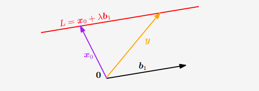

## 2.8 仿射空间

主元列（第1列和第2列）的线性组合。第3列 $\boldsymbol{a}_3$ 等于 $-\frac{1}{2}$ 倍的第2列 $\boldsymbol{a}_2$。因此，$\boldsymbol{0} = \boldsymbol{a}_3 + \frac{1}{2} \boldsymbol{a}_2$。同样地，我们看到 $\boldsymbol{a}_4 = \boldsymbol{a}_1 - \frac{1}{2} \boldsymbol{a}_2$，因此 $\boldsymbol{0} = \boldsymbol{a}_1 - \frac{1}{2} \boldsymbol{a}_2 - \boldsymbol{a}_4$。总体上，这给出了零空间（核）为

$$
\text{ker}(\Phi) = \text{span}\left[
\begin{bmatrix}
0 \\ 1 \\ 2 \\ 1
\end{bmatrix},
\begin{bmatrix}
-1 \\ 1 \\ 2 \\ 0
\end{bmatrix}
\right].
\tag{2.128}
$$

**秩-零度定理**：对于向量空间 $V, W$ 和线性映射 $\Phi: V \to W$，我们有

$$
\dim(\text{ker}(\Phi)) + \dim(\text{Im}(\Phi)) = \dim(V). \tag{2.129}
$$

秩-零度定理也被称为线性映射的基本定理（Axler, 2015, 定理3.22）。以下是一些直接的推论：
- 如果 $\dim(\text{Im}(\Phi)) < \dim(V)$，那么 $\text{ker}(\Phi)$ 是非平凡的，即核包含的不仅仅是 $\boldsymbol{0}_V$，且 $\dim(\text{ker}(\Phi)) \geq 1$。
- 如果 $A_\Phi$ 是关于有序基的 $\Phi$ 的变换矩阵且 $\dim(\text{Im}(\Phi)) < \dim(V)$，那么线性方程组 $A_\Phi \boldsymbol{x} = \boldsymbol{0}$ 有无穷多个解。
- 如果 $\dim(V) = \dim(W)$，那么以下三个条件是等价的：
  - $\Phi$ 是单射。
  - $\Phi$ 是满射。
  - $\Phi$ 是双射，因为 $\text{Im}(\Phi) \subseteq W$。

### 2.8 仿射空间

接下来，我们将更仔细地研究从原点偏移的空间，即不再是向量子空间的空间。此外，我们将简要讨论这些仿射空间之间的映射的性质，这些映射类似于线性映射。

> **注释**：在机器学习文献中，线性和仿射之间的区别有时并不清楚，因此我们可以找到将仿射空间/映射称为线性空间/映射的参考。♦

### 2.8.1 仿射子空间

**定义2.25（仿射子空间）**：设 $V$ 是一个向量空间，$\boldsymbol{x}_0 \in V$ 且 $U \subseteq V$ 是一个子空间。那么子集

$$
L = \boldsymbol{x}_0 + U := \{\boldsymbol{x}_0 + \boldsymbol{u} : \boldsymbol{u} \in U\} \tag{2.130a}
$$

$$
= \{\boldsymbol{v} \in V : \exists \boldsymbol{u} \in U, \boldsymbol{v} = \boldsymbol{x}_0 + \boldsymbol{u}\} \subseteq V \tag{2.130b}
$$

称为 $V$ 的一个**仿射子空间**或**线性流形**。$U$ 称为**方向**或**仿射子空间的方向空间**，而 $\boldsymbol{x}_0$ 称为**支点**。在第12章中，我们称这样的子空间为**超平面**。

注意，仿射子空间的定义排除了 $0$，如果 $\boldsymbol{x}_0 \notin U$。因此，如果 $\boldsymbol{x}_0 \notin U$，仿射子空间不是 $V$ 的一个（线性）子空间。仿射子空间的例子是 $\mathbb{R}^3$ 中的点、线和平面，它们不一定通过原点。

> **注释**：考虑 $V$ 的两个仿射子空间 $L = \boldsymbol{x}_0 + U$ 和 $\tilde{L} = \tilde{\boldsymbol{x}}_0 + \tilde{U}$。那么 $L \subseteq \tilde{L}$ 当且仅当 $U \subseteq \tilde{U}$ 且 $\boldsymbol{x}_0 - \tilde{\boldsymbol{x}}_0 \in \tilde{U}$。仿射子空间通常由参数描述：考虑 $V$ 的一个 $k$ 维仿射空间 $L = \boldsymbol{x}_0 + U$。如果 $(\boldsymbol{b}_1, \dots, \boldsymbol{b}_k)$ 是 $U$ 的一个有序基，那么 $L$ 中的每一个元素 $\boldsymbol{x}$ 都可以唯一地表示为

$$
\boldsymbol{x} = \boldsymbol{x}_0 + \lambda_1 \boldsymbol{b}_1 + \cdots + \lambda_k \boldsymbol{b}_k, \tag{2.131}
$$

其中 $\lambda_1, \dots, \lambda_k \in \mathbb{R}$。这个表示称为 $L$ 的**参数方程**，具有方向向量 $\boldsymbol{b}_1, \dots, \boldsymbol{b}_k$ 和参数 $\lambda_1, \dots, \lambda_k$。♦

**例2.26（仿射子空间）**：一维仿射子空间称为**线**，可以写为 $\boldsymbol{y} = \boldsymbol{x}_0 + \lambda \boldsymbol{b}_1$，其中 $\lambda \in \mathbb{R}$ 且 $U = \text{span}[\boldsymbol{b}_1] \subseteq \mathbb{R}^n$ 是 $\mathbb{R}^n$ 的一个一维子空间。这意味着一条线由一个支点 $\boldsymbol{x}_0$ 和一个定义方向的向量 $\boldsymbol{b}_1$ 定义。图2.13给出了一个说明。

$\mathbb{R}^n$ 中的二维仿射子空间称为**平面**。平面的参数方程为 $\boldsymbol{y} = \boldsymbol{x}_0 + \lambda_1 \boldsymbol{b}_1 + \lambda_2 \boldsymbol{b}_2$，其中 $\lambda_1, \lambda_2 \in \mathbb{R}$ 且 $U = \text{span}[\boldsymbol{b}_1, \boldsymbol{b}_2] \subseteq \mathbb{R}^n$。这意味着一个平面由一个支点 $\boldsymbol{x}_0$ 和两个线性无关的向量 $\boldsymbol{b}_1, \boldsymbol{b}_2$ 定义，它们张成方向空间。在 $\mathbb{R}^n$ 中，$(n-1)$-维仿射子空间称为**超平面**，相应的参数方程为 $\boldsymbol{y} = \boldsymbol{x}_0 + \sum_{i=1}^{n-1} \lambda_i \boldsymbol{b}_i$，其中 $\boldsymbol{b}_1, \dots, \boldsymbol{b}_{n-1}$ 形成一个 $(n-1)$-维子空间 $U$ 的基。这意味着一个超平面由一个支点 $\boldsymbol{x}_0$ 和 $(n-1)$ 个线性无关的向量 $\boldsymbol{b}_1, \dots, \boldsymbol{b}_{n-1}$ 定义，它们张成方向空间。在 $\mathbb{R}^2$ 中，一条线也是一个超平面。在 $\mathbb{R}^3$ 中，一个平面也是一个超平面。

图2.13 线是仿射子空间。向量 $\boldsymbol{y}$ 在线 $\boldsymbol{x}_0 + \lambda \boldsymbol{b}_1$ 上位于具有支点 $\boldsymbol{x}_0$ 和方向 $\boldsymbol{b}_1$ 的仿射子空间 $L$ 中。

**注（非齐次线性方程组和仿射子空间）**：对于 $A \in \mathbb{R}^{m \times n}$ 和 $\boldsymbol{x} \in \mathbb{R}^m$，线性方程组 $A\lambda = \boldsymbol{x}$ 的解要么是空集，要么是 $\mathbb{R}^n$ 的一个 $n - \text{rk}(A)$ 维仿射子空间。特别地，线性方程 $\lambda_1 \boldsymbol{b}_1 + \cdots + \lambda_n \boldsymbol{b}_n = \boldsymbol{x}$ 的解（其中 $(\lambda_1, \dots, \lambda_n) \neq (0, \dots, 0)$）是 $\mathbb{R}^n$ 中的一个超平面。在 $\mathbb{R}^n$ 中，每一个 $k$-维仿射子空间是齐次线性方程组 $A\boldsymbol{x} = \boldsymbol{b}$ 的解，其中 $A \in \mathbb{R}^{m \times n}$，$\boldsymbol{b} \in \mathbb{R}^m$ 且 $\text{rk}(A) = n - k$。回想一下，对于齐次方程组 $A\boldsymbol{x} = \boldsymbol{0}$，解是一个向量子空间，我们也可以将其视为一个特殊的仿射空间，其支点 $\boldsymbol{x}_0 = \boldsymbol{0}$。♦

### 2.8.2 仿射映射

和我们在 2.7 节中讨论的线性空间之间的线性映射类似，我们也可以定义两个仿射空间之间的仿射映射。这样一来我们在线性空间中得到的许多性质可以在仿射空间中得以保持。

**定义 2.26 （仿射空间）** 对两个线性空间 $V$ 和 $W$，线性映射 $\Phi: V \rightarrow W$，以及 $a \in W$，就可以定义 $V$ 到 $W$ 的仿射映射

$$
\begin{align}
\phi: V &\rightarrow W \tag{2.132}\\
x &\mapsto a + \Phi(x). \tag{2.133}
\end{align}
$$

其中的向量 $a$ 称为 $\phi$ 的位移向量。

* 每个仿射映射 $\phi: V \rightarrow W$ 都可以唯一地写为一个线性映射 $\Phi: V \rightarrow W$ 和一个位移 $\tau: W \rightarrow W$ 的复合，也即 $\phi = \tau \circ \Phi$。
* 两个仿射映射的复合还是仿射映射
* 仿射映射保持几何结构（如维数和平行的性质）

