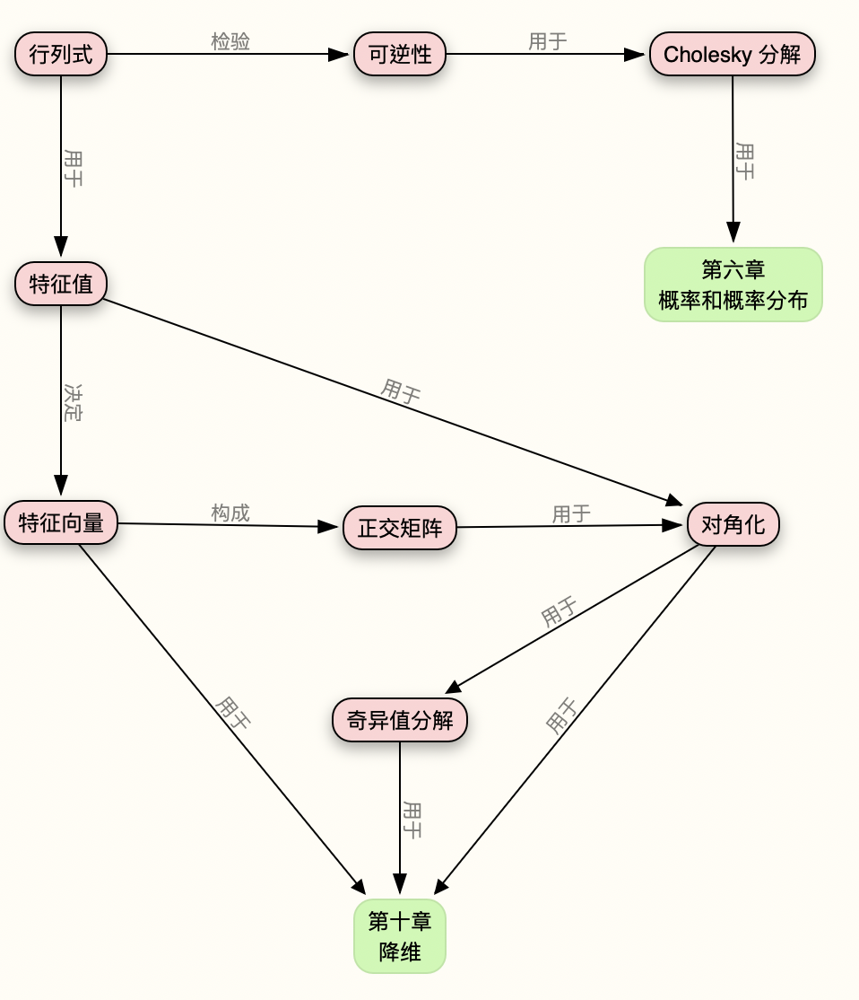

# 第四章 矩阵分解

> 译者注：这一章是线性代数运算中比较重要的章节，也是后续很多算法的核心原理例如PCA等。在这一节中要注意体会矩阵分解的基本思想，并能给出不同分解方法的实现。

在[第2章](../ch2/ch2.md)和[第3章](../ch3/ch3.md)中，我们研究了向量的运算与度量、向量投影和线性映射的方法。向量的映射和变换可以方便地描述为由矩阵执行的操作。此外，数据通常也以矩阵形式表示，例如，可以用矩阵的行表示不同的人，列描述人的不同特征，如体重、身高和社会经济地位。在本章中，我们将介绍矩阵的三个方面：如何对矩阵组合，如何分解矩阵，以及如何将这些分解用于矩阵近似。

我们首先考虑允许我们用几个数字来描述矩阵特征的方法，这些数字表征了矩阵的整体性质。对于方阵的重要特例，我们将在行列式（[第4.1节](ch4_1.md)）和特征值（[第4.2节](ch4_2.md)）部分进行讨论。这些特征值具有重要的数学意义，使我们能够快速掌握矩阵具有哪些有用的性质。在这里我们将继续讨论矩阵分解方法：矩阵分解可以类比为数字的因式分解，例如将21因式分解为素数7和3。因此，矩阵分解（matrix decomposition）也常被称为**matrix factorization**。矩阵分解用于通过使用可解释矩阵的因子的不同表示来描述矩阵。

我们将首先介绍对称正定矩阵的平方根运算，即Cholesky分解（[第4.3节](ch4_3.md)）。从这里，我们将看看将矩阵分解为规范形式的两种相关方法。第一种称为矩阵对角化（[第4.4节](ch4_4.md)），如果我们选择合适的基，它允许我们使用对角变换矩阵来表示线性映射。第二种方法，奇异值分解（[第4.5节](ch4_5.md)），将这种因式分解扩展到非方阵，它被认为是线性代数中的基本概念之一。这些分解是有帮助的，因为表示数值数据的矩阵通常非常大，很难分析。我们以矩阵分类的形式系统地概述了矩阵的类型和区分它们的特征属性（[第4.7节](ch4_7.md)）来结束本章。

这一章中讲述的一些方法对后续的一些数学理论性章节例如[第6章](../ch6/ch6.md)以及一些应用性章节例如[第10章](../ch10/ch10.md)中的降维和[第11章](../ch11/ch11.md)中的密度估计都有重要作用。本章的整体结构如图4.1所示：

图4.1 本章介绍的概念的思维导图，以及它们在本书其他部分的使用位置。

