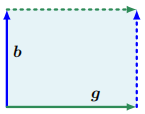

## 4.1 矩阵的行列式与迹

行列式是线性代数中的重要概念。行列式是线性方程组分析和求解中的数学对象。行列式仅在方阵$A\in R^{n\times n}$上定义，即具有相同行数和列数的矩阵。在这本书中，我们把行列式写成$\det(A)$，有时写成$|A|$：
$$
\det(A)=
\begin{vmatrix}
a_{11}& a_{21}& \cdots& a_{n1}\\
a_{12}& a_{22}& \cdots& a_{n2}\\
\vdots& \vdots& \ddots& \vdots\\
a_{1n}& a_{2n}& \cdots& a_{nn}\\
\end{vmatrix}\tag{4.1}
$$
方阵$A\in R^{n\times n}$的行列式是一个将$A$映射为一个实数的函数。在给出一般$n\times n$矩阵行列式的定义之前，让我们来看一些典型的例子，并定义一些特殊矩阵的行列式。

> **例4.1 检验矩阵是否可逆**
>
> 让我们从一个方阵$A$是否可逆（参考2.2.2节）开始。对于最小的二维方阵，我们已经知道何时矩阵是可逆的了。如果$A$是一个1×1矩阵，即它是一个标量，那么$A=a \Rightarrow A^{-1}=\frac{1}{a}$，当且仅当$a\neq 0$时$a\frac{1}{a}=1$成立。
>
> 对于一个$2\times 2$矩阵，由逆矩阵的定义（式2.3）我们知道$AA^{-1}=I$，随即，由式2.24，A的逆可以定义为：
> $$
> A^{-1}=\frac{1}{a_{11}a_{22}-a_{12}a_{21}}\begin{bmatrix}
> a_{22}&-a_{12}\\
> -a_{21}&a_{11}
> \end{bmatrix}\tag{4.2}
> $$
> 这里，$A$是可逆矩阵当且仅当：
> $$
> a_{11}a_{22}-a_{12}a_{21}\neq 0\tag{4.3}
> $$
> 这个式子就是对于$A\in R^{2\times 2}$的行列式：
> $$
> \det(A)=\begin{vmatrix}
> a_{11}&a_{12}\\
> a_{21}&a_{22}
> \end{vmatrix}=a_{11}a_{22}-a_{12}a_{21}\tag{4.4}
> $$

例4.1已经指出了行列式和逆矩阵存在之间的关系。下一个定理陈述了*n×n*矩阵的相同结果。

**定理4.1** 对于任意方阵$A\in R^{n\times n}$，当且仅当$\det(A)\neq 0$时$A$可逆。

我们有针对小型矩阵的行列式的显式（封闭形式）表达式。对于*n=*1，
$$
\det(A)=\det(a_{11})=a_{11}\tag{4.5}
$$
对于n=2,
$$
\det(A)=\begin{vmatrix}
a_{11}&a_{12}\\
a_{21}&a_{22}
\end{vmatrix}=a_{11}a_{22}-a_{12}a_{21}\tag{4.6}
$$
对于n=3（也就是大家熟知的Sarrus规则）：
$$
\begin{vmatrix}
a_{11}&a_{12}&a_{13}\\
a_{21}&a_{22}&a_{23}\\
a_{31}&a_{32}&a_{33}
\end{vmatrix}=a_{11}a_{22}a_{33}+a_{21}a_{32}a_{13}+a_{31}a_{12}a_{23}-a_{31}a_{22}a_{13}-a_{11}a_{32}a_{23}-a_{21}a_{12}a_{33}
\tag{4.7}
$$
为了帮助记忆Sarrus规则中的乘积项，请尝试在矩阵中追踪三乘积的元素。

如果对于每个$i>j$都有$T_{ij}=0$，我们称一个方阵$T$为上三角矩阵，即矩阵对角线以下为零。类似地，我们定义下三角矩阵，即对角线上方为零的矩阵。对于一个三角矩阵$T\in R^{n\times n}$，它的行列式就是对角线上元素的乘积：
$$
\det(T)=\prod_{i=1}^n T_{ii} \tag{4.8}
$$

> **例4.2 行列式可以作为体积的度量**
>
> 当我们将行列式视为$R^n$中跨越对象的*n*个向量集的映射时，行列式的概念是很自然的。结果表明，行列式$ \det(A)$是由矩阵$A$的列形成的n维平行六面体的有符号体积。
>
> 对于*n*=2，矩阵的列形成平行四边形；见图4.2。随着向量之间的角度变小，平行四边形的面积也会缩小。
>
> 
>
> **图4.2**向量$b$和$g$所跨越的平行四边形（阴影区域）的面积为$|\det([b,g])|$
>
> 考虑将两个列向量$b,g$构成一个矩阵$A=[b,g]$，那么，A行列式的绝对值是顶点为0,b,g,b+g的平行四边形的面积。特别的，如果b,g线性相关，也就有$b=\lambda g, \lambda\in R$，它们无法构成二维平行四边形，因此对应的区域面积为0。相反地，如果b,g线性无关且构成一组正交基向量$e_1,e_2$，那么它们也可以写作$b=\begin{bmatrix}b\\0\end{bmatrix}$和$g=\begin{bmatrix}0\\g\end{bmatrix}$，那么这个行列式就是$\begin{vmatrix}b&0\\0&g\end{vmatrix}=bg-0=bg$。
>
> 行列式的符号表示生成向量b、g相对于标准基（e1，e2）的方向。在我们的图中，把顺序翻转为g,b就可以交换A的列并翻转阴影区域面积的方向。这就是我们所熟悉的：平行四边形面积等于底乘高。这样的直觉可以扩展到更高的维度。在$R^{3}$中，我们考虑三个向量$r,b,g\in R^3$构成平行六面体的三条边，即六个面都是平行四边形的立体图形，如图4.3所示：
>
> 
>
> **图4.3**向量$r$,$b$和$g$所跨越的平行六面体（阴影区域）的体积为$|\det([r,b,g])|$，行列式的符号表示生成向量的方向。
>
> 这个$3\times3$矩阵$[r,b,g]$行列式的绝对值就是平行六面体的体积。因此，行列式充当一个函数，用于测量由矩阵中组成的列向量形成的有符号体积。
>
> 考虑三个线性无关的向量$r,g,b\in R^3$：
> $$
> r=\begin{bmatrix}2\\0\\-8\end{bmatrix},g=\begin{bmatrix}6\\1\\0\end{bmatrix},b=\begin{bmatrix}1\\4\\-1\end{bmatrix} \tag{4.9}
> $$
> 把这些向量作为矩阵的列：
> $$
> A=[r,g,b]=\begin{bmatrix}
> 2&6&1\\0&1&4\\-8&0&-1
> \end{bmatrix} \tag{4.10}
> $$
> 这样我们就可以计算所需的体积：
> $$
> V=|\det(A)|=186.\tag{4.11}
> $$

计算$n\times n$矩阵的行列式需要一个通用的算法来解决n>3的情况，我们将在下面进行探索。下面的定理4.2将计算$n\times n$矩阵行列式的问题简化为计算$(n-1)\times(n-1)$矩阵的行列式。通过递归应用拉普拉斯展开（定理4.2），我们可以通过最终计算2×2矩阵的行列式来计算$n\times n$矩阵的行列式。

**定理4.2** （拉普拉斯展开）考虑一个矩阵$A\in R^{n\times n}$，那么，对于$j=1,2,\cdots,n$，有：

1. 按第j列展开：

$$
\det(A)=\sum_{k=1}^n (-1)^{k+j}a_{kj}\det(A_{k,j})\tag{4.12}
$$

2. 按第i行展开：

$$
\det(A)=\sum_{k=1}^n (-1)^{k+j}a_{jk}\det(A_{j,k})\tag{4.13}
$$

这里$A_{k,j}$是矩阵A删除第i行和第j列得到的子矩阵。

> **例4.3 拉普拉斯展开**
>
> 让我们计算这样一个矩阵的行列式：
> $$
> A=\begin{bmatrix}
> 1&2&3\\3&1&2\\0&0&1
> \end{bmatrix} \tag{4.14}
> $$
> 按式（4.13）的规则对第一行应用一次拉普拉斯展开：
> $$
> \begin{vmatrix}
> 1&2&3\\3&1&2\\0&0&1
> \end{vmatrix}
> =(-1)^{1+1}1\begin{vmatrix}1&2\\0&1\end{vmatrix}
> +(-1)^{1+2}2\begin{vmatrix}3&2\\0&1\end{vmatrix}
> +(-1)^{1+3}3\begin{vmatrix}3&1\\0&0\end{vmatrix}
> \tag{4.15}
> $$
> 我们利用(4.6)来计算所有的二阶行列式：
> $$
> \det(A)=1(1-0)-2(3-0)+3(0-0)=-5\tag{4.16}
> $$
> 为了完整起见，我们可以将这个结果与使用Sarrus规则（4.7）计算行列式进行比较：
> $$
> \det(A)=1·1·1+3·0·3+0·2·2−0·1·3−1·0-2−3·2·1=1−6=−5\tag{4.17}
> $$

对于$A\in R^{n\times n}$，行列式具有以下性质：

- 矩阵乘积的行列式等于行列式的乘积，也就是$\det(AB)=\det(A)\det(B)$
- 矩阵转置后求行列式与自身行列式相等，$\det(A)=\det(A^T)$
- 如果矩阵A是正规矩阵（可逆），那么$\det(A^{-1})=\frac{1}{\det(A)}$
- 相似矩阵（定义2.22）具有相同的行列式。因此，对于线性映射$\Phi: V\to V$，$\Phi$的所有变换矩阵$A_\Phi$具有相同的行列式。因此，行列式对于线性映射的基的选择是不变的。
- 将列/行的倍数添加到另一列/行不会改变$\det(A)$
- 将某一列/行放大$\lambda$倍会使得行列式被放大$\lambda\in R$倍。特别地，$\det(\lambda A)=\lambda^n\det(A)$
- 交换两行/两列会改变$\det(A)$的符号

由于最后三个性质，我们可以使用高斯消元法（见第2.1节）通过将A转化为行阶梯形式来计算det(A)。当A呈三角矩阵，也就是对角线以下的元素都为0时，我们可以停止高斯消元。回想一下（4.8），三角矩阵的行列式是对角元素的乘积。

**定理4.3** 一个方阵$A\in R^{n \times n}$有$\det(A)=0$，当且仅当$rank(A)=n$。换言之**，**当且仅A满秩时A可逆。

当数学主要由手工完成时，行列式计算被认为是分析矩阵可逆性的一种基本方法。然而，现代机器学习方法使用直接数值方法，取代了行列式的显式计算。例如，在第2章中，我们了解到逆矩阵可以通过高斯消元法计算。因此，高斯消元法可用于计算矩阵的行列式。

行列式将在后续章节中发挥重要的理论作用，特别是当我们通过特征多项式学习特征值和特征向量时（第4.2节）更是如此。

**定义4.4** 一个方阵$A\in R^{n \times n}$的迹为:
$$
tr(A)=\sum_{i=1}^n a_{ii} \tag{4.18}
$$
即，一个矩阵的迹是A的对角线元素之和。

迹满足如下性质：

- 对于$A,B\in R^{n \times n}$, $tr(A+B)=tr(A)+tr(B)$
- 对于$A\in R^{n \times n}, \alpha \in R$, $tr(\alpha A)=\alpha tr(A)$
- $tr(I_n)=n$
- 对于$A\in R^{n \times k}, B\in R^{k \times n}$, $tr(AB)=tr(BA)$

可以证明只有一个函数能同时满足上述四条性质，就是矩阵的迹(Gohberg et al., 2012)。

矩阵相乘求迹的性质可以更泛化。具体而言，该性质在循环置换下是不变的。即：
$$
tr(AKL)=tr(KLA)\tag{4.19}
$$
对于$A\in R^{a\times k}, B\in R^{k\times l}, C\in R^{l\times a}$成立。这个性质可以推广到任意数量的矩阵的乘积。作为（4.19）的特例，对于两个向量$x,y\in R^n$，
$$
tr(xy^T)=tr(y^Tx)=y^Tx\in R \tag{4.20}
$$
给定一个线性映射$\Phi:V\to V$，其中V是一个向量空间，我们通过使用$\Phi $的矩阵表示的轨迹来定义这个映射的迹。对于给定V的基，我们可以用变换矩阵A来描述$\Phi $。那么$\Phi $的迹就是A的迹。对于不同的V基来说，它认为Φ的相应变换矩阵B可以对适当的S通过$S^{-1}AS$形式的基变化来获得（见第2.7.2节）。对于$\Phi $的对应迹，这也就是说：
$$
tr(B)=tr(S^{-1}AS)=tr(AS^{-1}S)=tr(A) \tag{4.21}
$$
因此，虽然线性映射的矩阵表示是基相关的，但线性映射$\Phi$的轨迹与基无关。

在本节中，我们介绍了行列式和迹作为表征方阵的函数。结合我们对行列式和迹的理解，我们现在可以定义一个用多项式描述矩阵A的重要方程，我们将在后续章节中广泛使用。

**定义4.5** （特征多项式）对于$\lambda \in R$和$A\in R^{n\times n}$, 
$$
\begin{align}
p_A(\lambda)&=det(A-\lambda I)\\
&=c_0+c_1\lambda+c_2\lambda^2+\cdots+c_{n-1}\lambda^{n-1}+c_n\lambda^n
\end{align}
\tag{4.22}
$$
$c_0,c_1,\cdots,c_n\in R$，这被称作A的特征多项式。特别地，
$$
c_0=\det(A)\tag{4.23}
$$

$$
c_{n-1}=(-1)^{n-1}tr(A) \tag{4.24}
$$

特征多项式（4.22）将允许我们计算特征值和特征向量，下一节将介绍。

