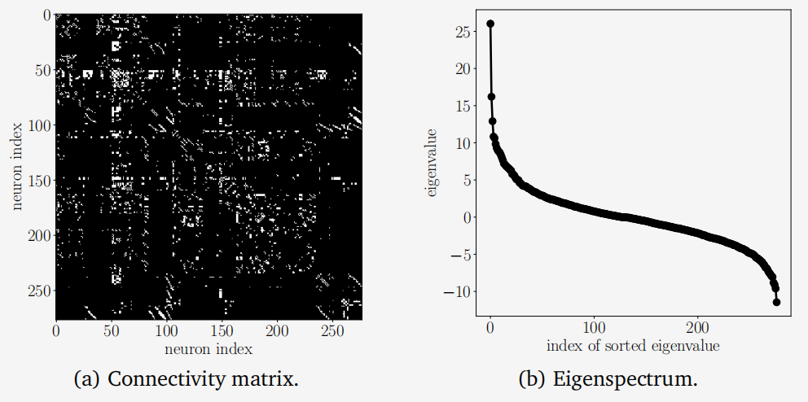
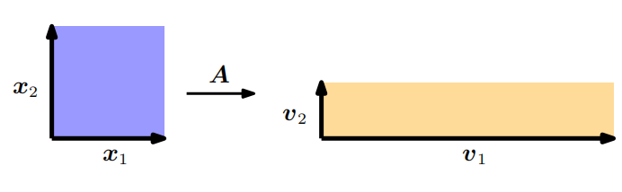

## 4.2 特征值与特征向量

现在，我们将了解一种新的方式来描述矩阵及其相关的线性映射。回想一下第2.7.1节的内容，给定一个有序基，每个线性映射都有一个唯一的变换矩阵。我们可以通过进行“特征”分析来解释线性映射及其相关的变换矩阵。正如我们将看到的，线性映射的特征值将告诉我们一组特殊向量（即特征向量）是如何被线性映射变换的。

**定义4.6**. 设$A\in\mathbb{R}^{n\times n}$是一个方阵。那么，如果$\lambda\in\mathbb{R}$满足
$$
Ax=\lambda x \tag{4.25}
$$
则称$\lambda$为$A$的特征值，而$x\in\mathbb{R}^n\backslash\{0\}$为对应的特征向量。我们称(4.25)为特征值方程。

**备注**：在线性代数文献和软件中，通常约定特征值按降序排列，因此最大的特征值及其对应的特征向量被称为第一特征值和第一特征向量，次大的被称为第二特征值和第二特征向量，以此类推。然而，教科书和出版物可能有不同的排序观念，或者根本没有排序。如果本书中没有明确说明排序，我们则不假定任何排序。

以下陈述是等价的：

- $\lambda$是$A\in\mathbb{R}^{n\times n}$的特征值。
- 存在一个$x\in\mathbb{R}^n\backslash\{\boldsymbol{0}\}$使得$Ax=\lambda x$，或者等价地，$(A-\lambda I_n)x=0$有非零解，即$x\neq0$。
- $\mathrm{rk}(A-\lambda I_n)<n$。
- $\mathrm{det}(A-\lambda I_n)=0$。

**定义4.7（共线性和同向性）**。两个指向相同方向的向量称为同向的。如果两个向量指向相同或相反的方向，则它们是共线的。

**备注（特征向量的非唯一性）**：如果$x$是与特征值$\lambda$相关联的$A$的特征向量，那么对于任意$c\in\mathbb{R}\backslash\{0\}$，$cx$也是与相同特征值$\lambda$相关联的$A$的特征向量，因为:
$$
A(c\boldsymbol{x})=cA\boldsymbol{x}=c\lambda\boldsymbol{x}=\lambda(c\boldsymbol{x}) \tag{4.26}
$$
因此，所有与$x$共线的向量也都是$A$的特征向量。

**定理4.8**. $\lambda\in\mathbb{R}$是$A\in\mathbb{R}^{n\times n}$的特征值当且仅当$\lambda$是矩阵$A$的特征多项式$p_{\boldsymbol{A}}(\lambda)$的根。

**定义4.9**. 设方阵$A$有一个特征值$\lambda_i$，则$\lambda_i$的代数重数是指该根在特征多项式中出现的次数。

**定义4.10（特征空间和特征谱）**。对于$A\in\mathbb{R}^{n\times n}$，与特征值$\lambda$相关联的所有特征向量张成的$\mathbb{R}^n$的子空间称为$A$关于$\lambda$的特征空间，记作$E_\lambda$。矩阵$A$的所有特征值的集合称为$A$的特征谱或简称谱。

如果$\lambda$是$A\in\mathbb{R}^{n\times n}$的特征值，则对应的特征空间$E_\lambda$是齐次线性方程组$(A-\lambda I)x=0$的解空间。从几何角度看，与非零特征值相对应的特征向量指向一个被线性映射拉伸的方向，而特征值则是拉伸的因子。如果特征值为负，则拉伸的方向会反转。

> **例4.4 单位矩阵的情况**
> 单位矩阵$I\in\mathbb{R}^{n\times n}$的特征多项式为$p_I(\lambda)=\det(\boldsymbol{I}-\lambda\boldsymbol{I})=(1-\lambda)^n=0$，它只有一个特征值$\lambda=1$，且该特征值出现$n$次。此外，对于所有非零向量$x\in\mathbb{R}^n$，都有$Ix=\lambda x=1x$。因此，单位矩阵的唯一特征空间$E_1$张成$n$维空间，且$\mathbb{R}^n$的所有标准基向量都是$I$的特征向量。

关于特征值和特征向量的有用性质包括：

- 矩阵$A$及其转置$A^\top$具有相同的特征值，但不一定具有相同的特征向量。
- 特征空间$E_\lambda$是$A-\lambda I$的零空间，因为

$$\begin{aligned}
Ax=\lambda x&\iff Ax-\lambda x=0\\
&\iff(A-\lambda\boldsymbol{I})\boldsymbol{x}=\boldsymbol{0}\iff\boldsymbol{x}\in\ker(\boldsymbol{A}-\lambda\boldsymbol{I}).
\end{aligned}\tag{4.27}$$

- 相似矩阵（见定义2.22）具有相同的特征值。因此，线性映射$\Phi$的特征值与其变换矩阵的基选择无关。这使得特征值、行列式和迹成为线性映射的关键特征参数，因为它们在基变换下是不变的。
- 对称、正定矩阵总是具有正实特征值。

> **例 4.5 计算特征值、特征向量和特征空间**
>
> 让我们找到$2\times2$矩阵
>
> $$
> \boldsymbol A=\begin{bmatrix}4&2\\1&3\end{bmatrix} \tag{4.28}
> $$
>
> 的特征值和特征向量。
>
> **步骤 1: 特征多项式**。根据特征向量$x\neq0$和特征值$\lambda$的定义，存在向量使得$Ax=\lambda x$，即$(A-\lambda I)x=0$。由于$x\neq0$，这要求$A-\lambda I$的核（零空间）包含除0以外的元素。这意味着$A-\lambda I$不可逆，因此$\det(\boldsymbol{A}-\lambda\boldsymbol{I})=0$。因此，我们需要计算特征多项式（4.22a）的根来找到特征值。
>
> **步骤 2: 特征值**。特征多项式为
> $$
> \begin{aligned}
> p_{\boldsymbol{A}}(\lambda)&=\det(\boldsymbol{A}-\lambda\boldsymbol{I})\\
> &=\det\left(\begin{bmatrix}4&2\\1&3\end{bmatrix}-\begin{bmatrix}\lambda&0\\0&\lambda\end{bmatrix}\right)=\begin{vmatrix}4-\lambda&2\\1&3-\lambda\end{vmatrix}\\
> &=(4-\lambda)(3-\lambda)-2\cdot1.
> \end{aligned} \tag{4.29}
> $$
> 我们分解特征多项式得到
>
> $$
> p(\lambda)=(4-\lambda)(3-\lambda)-2\cdot1=10-7\lambda+\lambda^2=(2-\lambda)(5-\lambda) \tag{4.30}
> $$
> 给出根$\lambda_1=2$和$\lambda_2=5$。
>
> **步骤 3: 特征向量和特征空间**。我们通过查看满足以下条件的向量$x$来找到与这些特征值相对应的特征向量
> $$
> \begin{bmatrix}4-\lambda&2\\1&3-\lambda\end{bmatrix}\boldsymbol x=\boldsymbol0.\tag{4.31}
> $$
> 对于$\lambda=5$，我们得到
>
> $$
> \begin{bmatrix}4-5&2\\1&3-5\end{bmatrix}\begin{bmatrix}x_1\\x_2\end{bmatrix}=\begin{bmatrix}-1&2\\1&-2\end{bmatrix}\begin{bmatrix}x_1\\x_2\end{bmatrix}=\boldsymbol{0}. \tag{4.32}
> $$
> 我们解这个齐次系统，得到解空间
>
> $$
> E_5=\operatorname{span}[\begin{bmatrix}2\\1\end{bmatrix}]. \tag{4.33}
> $$
> 这个特征空间是一维的，因为它只有一个基向量。类似地，我们通过解齐次方程组来找到对应于$\lambda=2$的特征向量
>
> $$
> \begin{bmatrix}4-2&2\\1&3-2\end{bmatrix}\boldsymbol x=\begin{bmatrix}2&2\\1&1\end{bmatrix}\boldsymbol x=\boldsymbol0. \tag{4.34}
> $$
>
> 这意味着任何形式为 $x=\begin{bmatrix}x_1\\x_2\end{bmatrix}$ 的向量，其中 $x_2 = -x_1$，比如 $\begin{bmatrix}1\\-1\end{bmatrix}$，都是对应于特征值2的特征向量。对应的特征空间由下式给出：
>
> $$
> E_2 = \operatorname{span}[\begin{bmatrix}1\\-1\end{bmatrix}]. \tag{4.35}
> $$
>
> 这意味着特征空间 $E_2$ 是一维的，并且由单个向量 $\begin{bmatrix}1\\-1\end{bmatrix}$ 张成（span）。任何满足 $x_2 = -x_1$ 的向量都可以表示为 $\begin{bmatrix}1\\-1\end{bmatrix}$ 的标量倍，因此它们都是特征值 $\lambda = 2$ 的特征向量。

在例4.5中，两个特征空间$E_5$和$E_2$都是一维的，因为它们各自都仅由一个向量张成。然而，在其他情况下，我们可能有多个相同的特征值（参见定义4.9），并且特征空间可能具有超过一个的维度。

**定义4.11**. 设$\lambda_i$是方阵$A$的一个特征值。那么，$\lambda_i$的几何重数是与$\lambda_i$相关联的线性无关特征向量的数量。换句话说，它是与$\lambda_i$相关联的特征向量所张成的特征空间的维度。

**备注**。一个特定特征值的几何重数必须至少为1，因为每个特征值都至少有一个相关联的特征向量。一个特征值的几何重数不能超过其代数重数，但可能更低。

> **例4.6**
> 矩阵$A=\begin{bmatrix}2&1\\0&2\end{bmatrix}$有两个重复的特征值$\lambda_1=\lambda_2=2$，且代数重数为2。然而，该特征值只有一个不同的单位特征向量$x_1=\begin{bmatrix}1\\0\end{bmatrix}$，因此，几何重数为1。

### 图形直觉在二维空间中的应用

让我们通过不同的线性映射来获得关于行列式、特征向量和特征值的一些直观理解。图4.4描绘了五个变换矩阵$A_1, \ldots, A_5$以及它们对以原点为中心的方形网格点的影响：

图4.4
 **行列式与特征空间** ,**五个线性映射及其相关变换矩阵概览** $A_{i}\in\mathbb{R}^{2\times2}$将400个颜色编码的点$x\in \mathbb{R} ^2$（左列）投影到目标点$A_ix$（右列）。中间列展示了第一个特征向量被其对应的特征值$\lambda_1$拉伸，以及第二个特征向量被其对应的特征值$\lambda_2$拉伸。每一行展示了五个变换矩阵$A_i$之一在标准基下的效果。

- $\boldsymbol{A}_{1}=\begin{bmatrix}\frac{1}{2}&0\\0&2\end{bmatrix}$。这个矩阵的两个特征向量的方向对应于$\mathbb{R}^2$中的标准基向量，即两个坐标轴。垂直轴被放大了2倍（特征值$\lambda_1=2$），而水平轴被压缩了$\frac{1}{2}$倍（特征值$\lambda_2=\frac{1}{2}$）。这个映射是保面积的，因为行列式$\operatorname{det}(\boldsymbol{A}_{1})=1 = 2 \cdot \frac{1}{2}$。

- $A_{2}=\begin{bmatrix}1&\frac{1}{2}\\0&1\end{bmatrix}$ 这个矩阵对应于一个剪切映射。它将网格点沿着水平轴向右剪切，如果它们在正y轴的一侧；如果它们在负y轴的一侧，则向左剪切。这种剪切不改变网格的面积（因为行列式为1），但改变了网格的形状。特征值$\lambda_1=\lambda_2=1$是重复的，且特征向量是共线的（尽管在这里为了强调，我们在两个相反的方向上绘制了它们）。这表明映射仅沿着一个方向（水平轴）作用，但实际上，由于剪切的存在，它也在垂直方向上产生了影响，只是没有改变面积。

- $\boldsymbol{A}_{3}=\begin{bmatrix}\cos(\frac{\pi}{6})&-\sin(\frac{\pi}{6})\\\sin(\frac{\pi}{6})&\cos(\frac{\pi}{6})\end{bmatrix}=\frac{1}{2}\begin{bmatrix}\sqrt{3}&-1\\1&\sqrt{3}\end{bmatrix}$ 这个矩阵$\boldsymbol A_3$将点逆时针旋转了$\frac{\pi}{6}$弧度（即$30^\circ$）。由于旋转是面积保持的，所以行列式为1。旋转矩阵的特征值是复数，反映了旋转的性质（因此没有绘制特征向量）。关于旋转的更多细节，请参考第3.9节。

- $A_{4}=\begin{bmatrix}1&-1\\-1&1\end{bmatrix}$ 这个矩阵表示一个映射，它将二维域压缩到一维。由于一个特征值为0（$\lambda_1=0$），与这个特征值对应的（蓝色）特征向量方向上的空间会塌陷，而与之正交的（红色）特征向量则会使空间拉伸一个因子$\lambda_2=2$。然而，由于有一个特征值为0，整个变换后的图像面积实际上是0。

- $A_{5}=\begin{bmatrix}1&\frac{1}{2}\\\frac{1}{2}&1\end{bmatrix}$ 这是一个剪切和拉伸的映射。由于行列式的绝对值为$\frac{3}{4}$，它表示空间被放大了75%（注意这里的“放大”是指行列式绝对值与1的关系，实际上在某些方向上可能是压缩的）。它沿着（红色）特征向量$\lambda_2$的方向拉伸了空间1.5倍，并沿着与之正交的（蓝色）特征向量压缩了0.5倍。这种变换既改变了网格的形状，也改变了其面积。

特别是，行列式的绝对值表示变换后图形面积的缩放比例（在二维中），而特征值和特征向量则揭示了变换在特定方向上的行为。例如，特征值大于1表示该方向上的放大，小于1表示压缩，而复数特征值则通常与旋转或振荡相关。

> **例4.7 生物神经网络的特征谱**
>
> 
>
>  
图4.5 Caenorhabditis elegans（线虫）神经网络（Kaiser 和 Hilgetag, 2006）
  **(a) 对称化连接性矩阵**  **(b) 特征谱** 
>
> 分析和学习网络数据的方法是机器学习方法的重要组成部分。理解网络的关键在于网络节点之间的连接性，特别是两个节点是否相互连接。在数据科学应用中，研究能够捕获这种连接性数据的矩阵通常非常有用。
>
> 我们构建了线虫C.Elegans完整神经网络的连接性/邻接矩阵$A\in\mathbb{R}^{277\times277}$。矩阵的每一行/列代表线虫大脑中的一个神经元（共277个）。如果神经元$i$通过突触与神经元$j$相连，则连接性矩阵$A$中对应元素$a_{ij}=1$，否则$a_{ij}=0$。由于连接性矩阵$A$可能不是对称的（即可能存在单向连接），其特征值可能不是实数。因此，我们计算了连接性矩阵的对称版本，记为$A_{sym}:=A+A^\top$。这个新的对称矩阵$A_{sym}$在图4.5(a)中展示，如果两个神经元之间存在连接（无论连接方向如何），则矩阵中对应元素$a_{ij}$为非零值（以白色像素表示）。在图4.5(b)中，我们展示了$A_{sym}$对应的特征谱。横轴表示按降序排列的特征值索引，纵轴表示对应的特征值。该特征谱呈现出典型的“S”形，这在许多生物神经网络中都很常见。关于这一现象背后的机制，是神经科学研究中的一个活跃领域。

**定理4.12**. 一个矩阵$A\in \mathbb{R}^{n\times n}$的具有$n$个不同特征值$\lambda_1, \ldots, \lambda_n$的特征向量$x_1, \ldots, x_n$是线性无关的。

这个定理表明，具有$n$个不同特征值的矩阵的特征向量构成$\mathbb{R}^n$的一个基。

**定义4.13.** 如果一个方阵$A\in\mathbb{R}^{n\times n}$拥有的线性无关特征向量少于$n$个，则称该矩阵是缺陷的。一个非缺陷的矩阵$A\in\mathbb{R}^{n\times n}$不一定需要$n$个不同的特征值，但它确实需要其特征向量构成$\mathbb{R}^n$的一个基。观察缺陷矩阵的特征空间，可以得出特征空间维数之和小于$n$。特别是，缺陷矩阵至少有一个特征值$\lambda_i$，其代数重数$m>1$但几何重数小于$m$。

**备注** 缺陷矩阵不能有$n$个不同的特征值，因为不同的特征值具有线性无关的特征向量（定理$4.12$）。

**定理4.14​**. 给定矩阵$A\in\mathbb{R}^{m\times n}$，我们总可以通过定义
$$
S:=A^\top A \tag{4.36}
$$
来获得一个对称且半正定的矩阵$S\in\mathbb{R}^{n\times n}$。

**备注**. 如果$\text{rk}(A)=n$，则$S:=A^\top A$是对称且正定的。

理解定理$4.14$为何成立对我们如何使用对称化矩阵有很大启示：对称性要求$S=S^\top$，通过插入(4.36)我们得到$S=A^\top A=A^\top(A^\top)^\top=(A^\top A)^\top=S^\top$。此外，半正定性（第$3.2.3$节）要求$x^\top Sx\geqslant0$，插入(4.36)我们得到$x^\top Sx=x^\top A^\top Ax=(x^\top A^\top)(Ax)=(Ax)^\top(Ax)\geqslant0$，因为点积计算的是平方和（它们本身是非负的）。

**定理4.15（谱定理）**. 如果$A\in\mathbb{R}^{n\times n}$是对称的，则存在由$A$的特征向量构成的对应线性空间$V$的一个正交规范基，且每个特征值都是实数。

谱定理的一个直接推论是，对称矩阵$A$的特征分解存在（具有实数特征值），并且我们可以找到一个由特征向量构成的正交规范基（ONB），使得$A=PDP^\top$，其中$D$是对角矩阵，$P$的列包含特征向量。

>  例4.8​
>
> 考虑矩阵
> $$
> A=\begin{bmatrix}3&2&2\\2&3&2\\2&2&3\end{bmatrix} \tag{4.37}
> $$
> 矩阵$A$的特征多项式为
>
> $$
> p_A(\lambda) = -(\lambda - 1)^2(\lambda - 7)\tag{4.38}
> $$
> 由此，我们可以确定矩阵$A$的特征值为$\lambda_1 = 1$（这是一个重复的特征值）和$\lambda_2 = 7$。
>
> 接下来，我们按照标准程序计算特征向量，得到与这些特征值对应的特征空间：
>
> $$
> E_1 = \text{span}\left(\underbrace{\begin{bmatrix}-1 \\ 1 \\ 0\end{bmatrix}}_{=:\boldsymbol{x}_1}, \underbrace{\begin{bmatrix}-1 \\ 0 \\ 1\end{bmatrix}}_{=:\boldsymbol{x}_2}\right), \quad E_7 = \text{span}\left(\underbrace{\begin{bmatrix}1 \\ 1 \\ 1\end{bmatrix}}_{=:\boldsymbol{x}_3}\right) \tag{4.39}
> $$
> 我们注意到$\boldsymbol{x}_3$与$\boldsymbol{x}_1$和$\boldsymbol{x}_2$都是正交的，但$\boldsymbol{x}_1$和$\boldsymbol{x}_2$之间不是正交的（因为$\boldsymbol{x}_1^\top \boldsymbol{x}_2 = 1 \neq 0$）。然而，根据谱定理（定理4.15），我们知道存在一个由正交特征向量构成的基，但我们目前得到的基并不满足这个条件。不过，我们可以构造一个这样的基。
>
> 为了构造这样的基，我们利用$\boldsymbol{x}_1$和$\boldsymbol{x}_2$都是与同一特征值$\lambda_1 = 1$相关联的特征向量这一事实。因此，对于任意的$\alpha, \beta \in \mathbb{R}$，都有
>
> $$
> A(\alpha\boldsymbol{x}_1 + \beta\boldsymbol{x}_2) = A\boldsymbol{x}_1\alpha + A\boldsymbol{x}_2\beta = \lambda_1(\alpha\boldsymbol{x}_1 + \beta\boldsymbol{x}_2)\tag{4.40}
> $$
> 即，$\boldsymbol{x}_1$和$\boldsymbol{x}_2$的任何线性组合仍然是与$\lambda_1$相关联的特征向量。Gram-Schmidt算法（第3.8.3节）是一种通过迭代地从一组基向量中构造正交/单位正交基的方法，它使用这样的线性组合。因此，即使$\boldsymbol{x}_1$和$\boldsymbol{x}_2$不是正交的，我们也可以应用Gram-Schmidt算法来找到与$\lambda_1 = 1$相关联且相互正交（以及与$\boldsymbol{x}_3$正交）的特征向量。
>
> 在我们的例子中，应用Gram-Schmidt算法后，我们可能会得到（注意这里的$\boldsymbol{x}_2'$可能不是唯一的，因为它取决于Gram-Schmidt算法的具体实现）：
>
> $$
> \boldsymbol{x}_1' = \begin{bmatrix}-1 \\ 1 \\ 0\end{bmatrix}, \quad \boldsymbol{x}_2' = \frac{1}{2}\begin{bmatrix}-1 \\ -1 \\ 2\end{bmatrix}\tag{4.41}
> $$
> 这两个向量是相互正交的，与$\boldsymbol{x}_3$也正交，并且是矩阵$A$与特征值$\lambda_1 = 1$相关联的特征向量。

在结束对特征值和特征向量的讨论之前，将矩阵的这些特性与行列式和迹的概念联系起来是非常有用的。

**定理 4.16**：一个矩阵 $A \in \mathbb{R}^{n \times n}$ 的行列式是其特征值的乘积，即

$$
\det(\boldsymbol A) = \prod_{i=1}^n \lambda_i \tag{4.42}
$$
其中，$\lambda_i \in \mathbb{C}$ 是 $A$ 的（可能重复的）特征值。

图4.6 几何上关于特征值的解释。矩阵$A$的特征向量被对应的特征值拉伸。单位正方形的面积变化了$|\lambda_1\lambda_2|$倍，周长变化了$\frac{1}{2}(|\lambda_{1}|+|\lambda_{2}|)$倍。

**定理4.17**. 矩阵$A\in \mathbb{R} ^{n\times n}$的迹是其特征值的和，即
$$
tr(A)=\sum_{i=1}^{n}\lambda_{i} \tag{4.43}
$$
其中，$\lambda_i\in\mathbb{C}$是A的（可能重复的）特征值。

现在，我们来为这两个定理提供一个几何上的直观理解。考虑一个矩阵$\dot{A}\in\mathbb{R}^{2\times2}$，它有两个线性无关的特征向量$x_1,x_2$。为了这个例子，我们假设$(x_1,x_2)$是$\mathbb{R}^2$的一个正交归一基（ONB），因此它们是正交的，并且它们所张成的正方形的面积是1；见图4.6。从第4.1节我们知道，行列式计算的是在变换$A$下单位正方形面积的变化。在这个例子中，我们可以明确地计算出面积的变化：使用$A$映射特征向量得到向量$v_1=Ax_1=\lambda_1x_1$和$v_2=Ax_2=\lambda_2x_2$，即新的向量$v_i$是特征向量$x_i$的缩放版本，缩放因子是对应的特征值$\lambda_i$。$\boldsymbol{v}_1,\boldsymbol{v}_2$仍然是正交的，并且它们所张成的矩形的面积是$|\lambda_1\lambda_2|$。

鉴于在我们的例子中$x_1,x_2$是正交归一的，我们可以直接计算出单位正方形的周长为$2(1+1)$。映射特征向量后，新的矩形周长为$2(|\lambda_1|+|\lambda_2|)$。因此，特征值绝对值的和告诉我们，在单位正方形经过变换矩阵$A$的变换后，其周长如何变化。

> **例4.9 谷歌的PageRank - 网页作为特征向量**
>
> 谷歌使用矩阵$A$的最大特征值对应的特征向量来确定搜索页面的排名。PageRank算法是由拉里·佩奇（Larry Page）和谢尔盖·布林（Sergey Brin）于1996年在斯坦福大学开发的，其核心理念是任何网页的重要性都可以通过链接到它的网页的重要性来近似。为此，他们将所有网站写成一个巨大的有向图，展示了哪些页面链接到哪些页面。PageRank通过计算指向网页$a_i$的页面数量来计算该网站$a_i$的权重（重要性）$x_i\geqslant0$。此外，PageRank还考虑了链接到$a_i$的网站的重要性。
>
> 然后，用户的导航行为被建模为这个图的一个转移矩阵$A$，它告诉我们用户以什么（点击）概率会最终到达另一个网站。矩阵$A$具有这样的性质：对于网站的任何初始排名/重要性向量$x$，序列$x,\boldsymbol{A}x,\boldsymbol{A}^2x,\ldots$都会收敛到一个向量$x^*$。这个向量被称为PageRank，并满足$Ax^*=x^*$，即它是$A$的一个特征向量（对应的特征值为1）。在对$x^*$进行归一化，使得$\|x^*\|=1$之后，我们可以将元素解释为概率。关于PageRank的更多细节和不同的视角可以在原始技术报告（Page et al., 1999）中找到。

