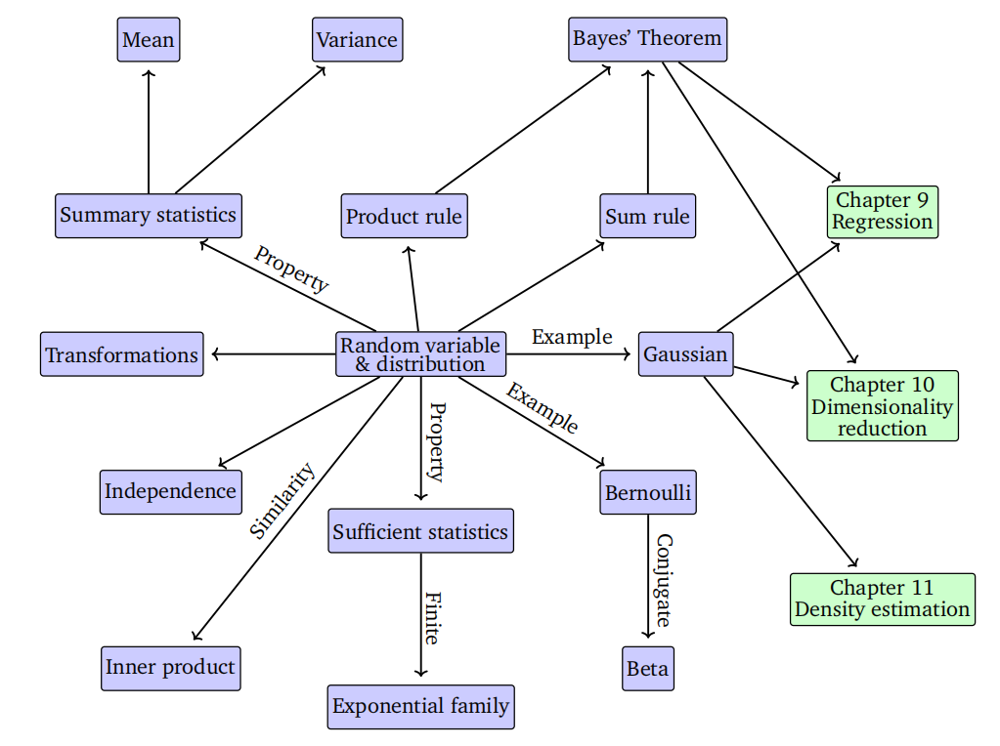

# 第6章 概率分布

概率，简而言之，是研究不确定性的学科。概率可以被视为某一事件发生次数的比例，或者对某一事件发生的信任程度。然后，我们希望利用这种概率来衡量实验中某事件发生的可能性。正如第1章所述，我们经常量化数据中的不确定性、机器学习模型中的不确定性以及模型预测结果中的不确定性。量化不确定性需要随机变量的概念，随机变量是一个函数，它将随机实验的结果映射到我们感兴趣的一组属性上。与随机变量相关联的是一个函数，它测量某一特定结果（或结果集）发生的概率；这被称为概率分布。

概率分布是其他概念（如概率建模（第8.4节）、图形模型（第8.5节）和模型选择（第8.6节））的基石。在下一节中，我们将介绍定义概率空间的三个概念（样本空间、事件和事件的概率）以及它们与第四个概念——随机变量的关系。本次介绍特意采用了较为直观的方式，因为过于严谨的阐述可能会掩盖这些概念背后的直觉。本章介绍的概念概要如图6.1所示。

**图6.1 与随机变量和概率分布相关的概念的思维导图**

