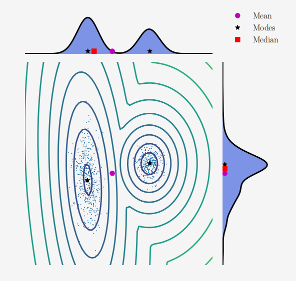
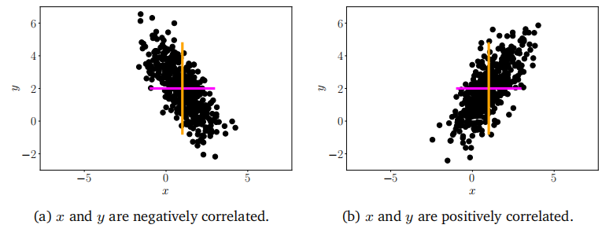
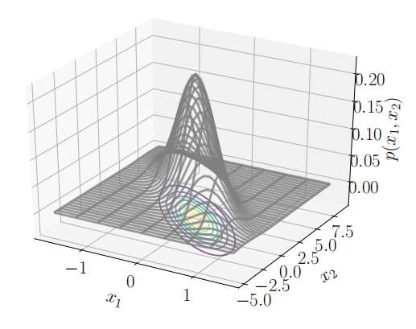

## 6.4 汇总统计量与独立性

我们经常对随机变量集的总结和随机变量对的比较感兴趣。随机变量的统计量是该随机变量的确定性函数。分布的汇总统计量提供了一种有用的视角，来了解随机变量的行为，并且顾名思义，它提供了能够总结和描述分布的数值。我们描述了均值和方差，这两种广为人知的汇总统计量。然后，我们讨论了比较一对随机变量的两种方法：首先，如何判断两个随机变量是独立的；其次，如何计算它们之间的内积。

### 6.4.1 均值与协方差

均值和（协）方差通常用于描述概率分布的性质（期望值和离散程度）。我们将在第6.6节中看到，存在一类有用的分布族（称为指数族分布），其中随机变量的统计量捕获了所有可能的信息。

期望值的概念在机器学习中至关重要，概率论本身的基础概念也可以从期望值推导出来（Whittle, 2000）。

**定义 6.3（期望值）**：对于单变量连续随机变量$X\sim p(x)$的函数$g: \mathbb{R} \to \mathbb{R}$，其期望值定义为

(6.28)

$$\operatorname{E}_X[g(x)]=\int_{\mathcal{X}}g(x)p(x)\mathrm{d}x$$

相应地，对于离散随机变量$X\sim p(x)$的函数$g$，其期望值定义为

(6.29)

$$\operatorname{E}_{X}[g(x)]=\sum_{x\in\mathcal{X}}g(x)p(x)$$

其中，$X$是随机变量$X$所有可能结果（目标空间）的集合。

在本节中，我们认为离散随机变量的结果是数值型的。这可以通过观察函数$g$以实数作为输入来看出。

**备注**：我们将多元随机变量$X$视为单变量随机变量$[X_1,\ldots,X_D]^\top$的有限向量。对于多元随机变量，我们逐元素地定义期望值

随机变量函数的期望值有时被称为“无意识统计学家定律”（Casella 和 Berger, 2002, 第2.2节）

(6.30)

$$\mathbb{E}_X[g(\boldsymbol{x})]=\begin{bmatrix}\mathbb{E}_{X_1}[g(x_1)]\\\vdots\\\mathbb{E}_{X_D}[g(x_D)]\end{bmatrix}\in\mathbb{R}^D$$

其中，下标$\mathbb{E} X_d$表示我们正在对向量$x$的第$d$个元素取期望值。

$\diamondsuit$

**定义 6.3**定义了符号$\mathbb{E}_X$的含义，作为指示我们应对概率密度（对于连续分布）或对所有状态求和（对于离散分布）取积分的算子。均值的定义（定义6.4）是期望值的一个特例，通过选择$g$为恒等函数获得。

**定义 6.4（均值）**：随机变量$X$，其状态$x\in\mathbb{R}^D$，的均值是一个平均值，定义为

(6.31)

$$\operatorname{E}_X[\boldsymbol{x}]=\begin{bmatrix}\operatorname{E}_{X_1}[x_1]\\\vdots\\\operatorname{E}_{X_D}[x_D]\end{bmatrix}\in\mathbb{R}^D$$

其中

$$\operatorname{E}_{X_d}[x_d]:=\left\{\begin{array}{ll}\int_{\mathcal{X}}x_dp(x_d)\mathrm dx_d&\text{如果}X\text{是连续随机变量}\\\sum_{x_i\in\mathcal{X}}x_ip(x_d=x_i)&\text{如果}X\text{是离散随机变量}\end{array}\right.$$

(6.32)

对于$d=1,\ldots,D$，下标$d$表示$x$的相应维度。积分和求和是针对随机变量$X$的目标空间状态$\chi$进行的。

在一维情况下，还有另外两个直观的“平均”概念，即中位数和众数。中位数是排序后位于“中间”的值，即50%的值大于中位数，50%的值小于中位数。这个概念可以通过考虑累积分布函数（定义6.2）为0.5时的值来推广到连续值。对于不对称或有长尾分布，中位数提供了一个比均值更接近人类直觉的典型值估计。此外，中位数比均值对异常值更稳健。中位数向更高维度的推广并非易事，因为在一个以上的维度中没有明显的“排序”方式（Hallin et al., 2010; Kong and Mizera, 2012）。众数是出现频率最高的值。对于离散随机变量，众数定义为出现频率最高的$x$值。对于连续随机变量，众数定义为密度$p(\boldsymbol{x})$的峰值。特定的密度$p(\boldsymbol{x})$可能有一个以上的众数，并且在高维分布中可能存在大量的众数。因此，找到分布的所有众数在计算上可能具有挑战性。

\> **例 6.4**

\>

\> 考虑图 6.4 中所示的二维分布：

\>

\> 

\>

\> 
图6.4一个二维数据集的平均值、模式和中位数及其边缘密度的说明。

\>

\> $$p(x)=0.4\mathcal{N}\left(\boldsymbol{x}\:\bigg|\begin{bmatrix}10\\2\end{bmatrix},\begin{bmatrix}1&0\\0&1\end{bmatrix}\right)+0.6\mathcal{N}\left(\boldsymbol{x}\:\bigg|\begin{bmatrix}0\\0\end{bmatrix},\begin{bmatrix}8.4&2.0\\2.0&1.7\end{bmatrix}\right).$$

\>

\> $(6.33)$

\>

\> 我们将在第 6.5 节中定义高斯分布 $\mathcal{N}(\mu,\sigma^2)$。同时，还展示了该分布在每个维度上的对应边缘分布。观察到该分布是双峰的（有两个众数），但其中一个边缘分布是单峰的（有一个众数）。水平方向上的双峰一元分布说明了均值和中位数可能彼此不同。尽管我们可能会想要将二维中位数定义为每个维度上中位数的串联，但由于我们无法定义二维点的顺序，这变得困难。当我们说“无法定义顺序”时，我们的意思是存在多种方式来定义关系 <，使得 $\begin{bmatrix}3\\0\end{bmatrix}<\begin{bmatrix}2\\3\end{bmatrix}$ 这样的关系不是唯一的。

**备注**：期望值（定义 6.3）是一个线性算子。例如，给定一个实值函数 $f(\boldsymbol{x})=ag(\boldsymbol{x})+bh(\boldsymbol{x})$，其中 $a,b\in\mathbb{R}$ 且 $x\in\mathbb{R}^D$，我们得到

(6.34a)

(6.34b)

$$\begin{aligned}\operatorname{E}_{X}[f(\boldsymbol{x})]&=\int f(\boldsymbol{x})p(\boldsymbol{x})\mathrm{d}\boldsymbol{x}\\&=\int[ag(\boldsymbol{x})+bh(\boldsymbol{x})]p(\boldsymbol{x})\mathrm{d}\boldsymbol{x}\\&=a\int g(\boldsymbol{x})p(\boldsymbol{x})\mathrm{d}\boldsymbol{x}+b\int h(\boldsymbol{x})p(\boldsymbol{x})\mathrm{d}\boldsymbol{x}\\&=a\operatorname{E}_{X}[g(\boldsymbol{x})]+b\operatorname{E}_{X}[h(\boldsymbol{x})]\:.\end{aligned}$$

(6.34c)

(6.34d)

$\diamondsuit$

对于两个随机变量，我们可能希望描述它们之间的对应关系。协方差直观地表示了随机变量之间依赖性的概念。

**定义 6.5（协方差（单变量））**：两个单变量随机变量 $X,Y\in\mathbb{R}$ 之间的协方差由它们各自偏离各自均值的乘积的期望值给出，即

(6.35)

$$\mathrm{Cov}_{X,Y}[x,y]:=\mathrm{E}_{X,Y}\big[(x-\mathrm{E}_{X}[x])(y-\mathrm{E}_{Y}[y])\big].$$

**备注**：当与期望值或多变量随机协方差相关的随机变量通过其参数明确时，下标通常会被省略（例如，E$_X[x]$ 通常简写为 E$[x])$。

通过使用期望的线性性质，定义 6.5 中的表达式可以重写为乘积的期望值减去期望值的乘积，即

(6.36)

$$\mathrm{Cov}[x,y]=\mathrm{E}[xy]-\mathrm{E}[x]\mathrm{E}[y]\:.$$

变量与其自身的协方差 Cov$[x,x]$ 称为方差，记作 $\mathcal{V}_X[x]$。方差的平方根称为标准差，通常记作 $\sigma(x)$。协方差的概念可以推广到多变量随机变量。

**定义 6.6（协方差（多变量））**：如果我们考虑两个多变量随机变量 $X$ 和 $Y$，其状态分别为 $x\in\mathbb{R}^D$ 和 $y\in\mathbb{R}^E$，则 $X$ 和 $Y$ 之间的协方差定义为

$$\mathrm{Cov}[\boldsymbol{x},\boldsymbol{y}]=\mathrm{E}[\boldsymbol{x}\boldsymbol{y}^{\top}]-\mathrm{E}[\boldsymbol{x}]\mathrm{E}[\boldsymbol{y}]^{\top}=\mathrm{Cov}[\boldsymbol{y},\boldsymbol{x}]^{\top}\in\mathbb{R}^{D\times E}\:.$$

(6.37)

定义 6.6 可以应用于两个参数中的相同多变量随机变量，这导致了一个有用的概念，它直观地捕获了随机变量的“散布”。对于多变量随机变量，方差描述了随机变量各个维度之间的关系。

**定义 6.7（方差）**：随机变量 $X$ 的方差，其状态为 $x\in\mathbb{R}^D$，均值向量为 $\mu\in\mathbb{R}^D$，定义为

(6.38a)

$$\begin{aligned}\mathbb{V}_{X}[\boldsymbol{x}]&=\mathrm{Cov}_{X}[\boldsymbol{x},\boldsymbol{x}]\\&=\mathbb{E}_{X}[(\boldsymbol{x}-\boldsymbol{\mu})(\boldsymbol{x}-\boldsymbol{\mu})^{\top}]=\mathbb{E}_{X}[\boldsymbol{x}\boldsymbol{x}^{\top}]-\mathbb{E}_{X}[\boldsymbol{x}]\mathbb{E}_{X}[\boldsymbol{x}]^{\top}\\&=\begin{bmatrix}\mathrm{Cov}[x_1,x_1]&\mathrm{Cov}[x_1,x_2]&\ldots&\mathrm{Cov}[x_1,x_D]\\\mathrm{Cov}[x_2,x_1]&\mathrm{Cov}[x_2,x_2]&\ldots&\mathrm{Cov}[x_2,x_D]\\\vdots&\vdots&\ddots&\vdots\\\mathrm{Cov}[x_D,x_1]&\ldots&\ldots&\mathrm{Cov}[x_D,x_D]\end{bmatrix}.\end{aligned}$$

(6.38c)中的$D\times D$矩阵被称为多元随机变量$X$的协方差矩阵。协方差矩阵是对称的且是半正定的，它向我们揭示了数据的分布情况。在其对角线上，协方差矩阵包含了边缘分布的方差

(6.39)

$$p(x_i)=\int p(x_1,\ldots,x_D)\mathrm{d}x_{\setminus i}\:,$$

其中“$\setminus i$”表示“除了变量$i$之外的所有变量”。非对角线上的元素是$i,j=1,\ldots,D,i\neq j$时的交叉协方差项$\text{Cov}[x_i,x_j]$。

图6.5二维数据集沿每个轴（彩色线）具有相同的均值和方差，但具有不同的协方差。

**备注**。在本书中，我们通常假设协方差矩阵是正定的，以便更好地理解。因此，我们不讨论导致半正定（低秩）协方差矩阵的特殊情况。

$\diamondsuit$

当我们想要比较不同随机变量对之间的协方差时，发现每个随机变量的方差都会影响协方差的值。协方差的归一化版本被称为相关系数。

**定义6.8（相关系数）**。两个随机变量$X,Y$之间的相关系数由

$$\text{corr}[x,y]=\frac{\text{Cov}[x,y]}{\sqrt{\text{V}[x]\text{V}[y]}}\in[-1,1]\:.$$

(6.40)

相关系数矩阵是标准化随机变量$x/\sigma(x)$的协方差矩阵。换句话说，在相关系数矩阵中，每个随机变量都被其标准差（方差的平方根）除。

协方差（和相关系数）表明了两个随机变量之间的关系；见图6.5。正相关$\text{corr}[x,y]$意味着当$x$增长时，$y$也预期会增长。负相关则意味着当$x$增加时，$y$会减小。

### 6.4.2 经验均值和协方差

第6.4.1节中的定义通常也被称为总体均值和总体协方差，因为它指的是总体的真实统计量。在机器学习中，我们需要从数据的经验观察中学习。考虑一个随机变量$X$。从总体统计量到经验统计量的实现，有两个概念上的步骤。首先，我们利用有限数据集（大小为$N$）来构造一个经验统计量，该统计量是有限数量相同随机变量$X_1,\ldots,X_N$的函数。其次，我们观察数据，即查看每个随机变量的实现$x_1,\ldots,x_N$，并应用经验统计量。

具体来说，对于均值（定义6.4），给定一个特定的数据集，我们可以获得均值的估计值，这被称为经验均值或样本均值。经验协方差也是如此。

**定义6.9（经验均值和协方差）**。经验均值向量是每个变量观测值的算术平均值，定义为

$$\bar{\boldsymbol{x}}:=\frac{1}{N}\sum_{n=1}^{N}\boldsymbol{x}_{n}\:,$$

(6.41)

其中$x_n\in\mathbb{R}^D$。

与经验均值类似，经验协方差矩阵是一个$D\times D$矩阵

$$\boldsymbol{\Sigma}:=\frac{1}{N}\sum_{n=1}^{N}(\boldsymbol{x}_{n}-\bar{\boldsymbol{x}})(\boldsymbol{x}_{n}-\bar{\boldsymbol{x}})^{\top}.$$

(6.42)

为了计算特定数据集的统计量，我们将使用实现（观测值）$x_1,\ldots,x_N$，并使用(6.41)和(6.42)。经验协方差矩阵是对称的、半正定的（见第3.2.3节）。

### 6.4.3 方差的三种表达式

我们现在专注于单一随机变量$X$，并使用前面的经验公式推导出方差的三种可能表达式。以下推导对于总体方差是相同的，只是我们需要处理积分。方差的标准定义，对应于协方差（定义6.5）的定义，是随机变量$X$与其期望值$\mu$之间的平方偏差的期望值，即

$$\mathrm V_X[x]:=\mathrm E_X[(x-\mu)^2]\:.$$

(6.43)

在(6.43)中的期望和均值$\mu=\mathbb{E}_X(x)$的计算取决于$X$是离散还是连续随机变量，这通过(6.32)来完成。如(6.43)所示表达的方差是新随机变量$Z:=(X-\mu)^2$的均值。

在经验上估计(6.43)中的方差时，我们需要采用双遍算法：一遍遍历数据以使用(6.41)计算均值$\mu$，然后第二遍使用此估计值$\hat{\mu}$来计算方差。通过重新排列项，我们可以避免双遍遍历。可以将(6.43)中的公式转换为所谓的方差原始分数公式：

(6.44)

$$\mathrm{V}_X[x]=\mathrm{E}_X[x^2]-\left(\mathrm{E}_X[x]\right)^2\:.$$

(6.44)中的表达式可以记忆为“平方的均值减去均值的平方”。我们可以在一遍遍历数据的过程中通过同时累积$x_i$（以计算均值）和$x_i^2$来经验地计算它，其中$x_i$是第$i$个观测值。不幸的是，如果以这种方式实现，它可能在数值上不稳定。当推导等权偏差-方差分解（Bishop, 2006）时，(6.44)中的原始分数版本对于机器学习可能是有用的。

理解方差的第三种方式是，它是所有观测对之间的成对差异之和。考虑随机变量$X$的实现的一个样本$x_1,\ldots,x_N$，我们计算每对$x_i$和$x_j$之间的平方差。通过展开平方，我们可以证明$N^2$个成对差异的总和是观测值的经验方差：

(6.45)

$$\dfrac{1}{N^2}\sum_{i,j=1}^N(x_i-x_j)^2=2\left[\dfrac{1}{N}\sum_{i=1}^Nx_i^2-\left(\dfrac{1}{N}\sum_{i=1}^Nx_i\right)^2\right]\:.$$

我们看到(6.45)是原始分数表达式(6.44)的两倍。这意味着我们可以将成对距离的总和（共有$N^2$个）表示为从均值（共有$N$个）的偏差之和。从几何角度来看，这意味着点集中心与点对距离之间存在等价性。从计算角度来看，这意味着通过计算均值（求和中的$N$项），然后计算方差（再次是求和中的$N$项），我们可以得到一个具有$N^2$项的表达式（即(6.45)的左侧）。

### 6.4.5 统计独立性

**定义6.10（独立性）**。两个随机变量$X,Y$是统计独立的当且仅当

(6.53)

$$p(x,y)=p(x)p(y)\:.$$

直观上，如果两个随机变量$X$和$Y$是独立的，那么知道$y$的值并不会给$x$提供任何额外的信息（反之亦然）。如果$X,Y$是（统计）独立的，那么

$\bullet$ $p(y\mid x) = p(y)$

$\bullet$ $p(x\mid y) = p(x)$

$\mathrm{V}_{X,Y}[x+y]=\mathrm{V}_X[x]+\mathrm{V}_Y[y]$

$\cdot$ $\mathrm{Cov}_{X, Y}[x, y] = 0$

最后一点可能不总是成立的逆命题，即两个随机变量可以有协方差为零但并非统计独立。为了理解这一点，需要回顾协方差只衡量线性依赖关系。因此，非线性依赖的随机变量可能具有零协方差。

\> **例6.5**

\> 考虑一个均值为零的随机变量$X$（$\mathbb{E}_X[x]=0$）且

\>

\> $\mathbb{E}_X[x^3]=0$。令$y=x^2$（因此，$Y$依赖于$X$），并考虑$X$和$Y$之间的协方差（6.36）。但这给出

\>

\> $$\mathrm{Cov}[x,y]=\mathbb{E}[xy]-\mathbb{E}[x]\mathbb{E}[y]=\mathbb{E}[x^{3}]=0\:.$$

\> (6.54)

在机器学习中，我们经常考虑可以建模为独立同分布（i.i.d.）随机变量的问题，即$X_{1}, \ldots , X_{N}$是独立且同分布的。对于超过两个随机变量的情况，如果所有子集都是独立的（参见Pollard (2002, 第4章) 和 Jacod and Protter (2004, 第3章)）。“同分布”意味着所有随机变量都来自同一分布。

机器学习中另一个重要的概念是条件独立性。

定义6.11（条件独立性）。两个随机变量$X$和$Y$在给定$Z$的条件下是条件独立的当且仅当

(6.55)

$$p(\boldsymbol{x},\boldsymbol{y}\mid\boldsymbol{z})=p(\boldsymbol{x}\mid\boldsymbol{z})p(\boldsymbol{y}\mid\boldsymbol{z})\quad\mathrm{for~all}\quad\boldsymbol{z}\in\mathcal{Z}\:,$$

其中，$\mathcal{Z}$是随机变量$Z$的状态集。我们用$X\perp Y\mid Z$来表示给定$Z$时，$X$与$Y$是条件独立的。

定义6.11要求（6.55）中的关系必须对$z$的每一个值都成立。（6.55）的解释可以理解为“在知道$z$的情况下，$x$和$y$的分布是可分解的”。如果我们写$X\perp Y\mid\emptyset$，则独立性可以视为条件独立性的一个特例。通过使用概率的乘积规则（6.22），我们可以展开（6.55）的左侧得到

(6.56)

$$p(\boldsymbol{x},\boldsymbol{y}\mid\boldsymbol{z})=p(\boldsymbol{x}\mid\boldsymbol{y},\boldsymbol{z})p(\boldsymbol{y}\mid\boldsymbol{z})\:.$$

通过比较（6.55）的右侧与（6.56），我们发现$p(y\mid z)$同时出现在两者中，因此

(6.57)

$$p(\boldsymbol{x}\mid\boldsymbol{y},\boldsymbol{z})=p(\boldsymbol{x}\mid\boldsymbol{z})\:.$$

方程（6.57）提供了条件独立性的另一种定义，即$X\amalg Y\mid Z$。这种替代表述提供了这样的解释：“在知道$z$的情况下，关于$y$的知识不会改变我们对$x$的知识”。

### 6.4.6 随机变量的内积

回顾第3.2节中内积的定义。我们可以在随机变量之间定义内积，并在本节中简要描述。如果我们有两个不相关的随机变量$X,Y$，则

多变量随机变量可以

（6.58）此处原文似乎有误或遗漏，但基于上下文，我们可以理解为讨论的是不相关随机变量方差的可加性，即：

$$\mathrm{V}[X+Y]=\mathrm{V}[X]+\mathrm{V}[Y]\:.$$

由于方差是以平方单位衡量的，这看起来非常像直角三角形中的勾股定理$c^2=a^2+b^2$。接下来，我们探讨是否能为（6.58）中不相关随机变量的方差关系找到几何解释。

图6.6随机变量的几何形状。如果随机变量X和Y不相关，则它们是相应线性空间中的正交向量，并应用毕达哥拉斯定理。

随机变量可以视为线性空间中的向量，我们可以定义内积以获得随机变量的几何性质（Eaton, 2007）。如果我们定义

（6.59）

$$\langle X,Y\rangle:=\mathrm{Cov}[X,Y]$$

对于均值为零的随机变量$X$和$Y$，我们得到了一个内积。可以看出，协方差是对称的、正定的，并且在任一参数上都是线性的。随机变量的“长度”是

$$\|X\|=\sqrt{\mathrm{Cov}[X,X]}=\sqrt{\mathrm{V}[X]}=\sigma[X]\:,$$

（6.60）

即其标准差。随机变量“越长”，其不确定性就越大；长度为0的随机变量是确定的。

如果我们查看两个随机变量$X,Y$之间的角度$\theta$，我们得到

（6.61）

$$\cos\theta=\frac{\langle X,Y\rangle}{\|X\|\:\|Y\|}=\frac{\mathrm{Cov}[X,Y]}{\sqrt{\mathrm{V}[X]\mathrm{V}[Y]}}\:,$$

这是两个随机变量之间的相关性（定义6.8）。这意味着，当我们从几何角度考虑时，可以将相关性视为两个随机变量之间角度的余弦值。根据定义3.7，我们知道$X\perp Y\Longleftrightarrow\langle X,Y\rangle=0$。在我们的情况下，这意味着$X$和$Y$是正交的当且仅当Cov$[X,Y]=0$，即它们是不相关的。图6.6说明了这种关系。

图6.7两个随机变量x1和x2的高斯分布。

备注：虽然使用基于前面定义的内积构造的欧几里得距离来比较概率分布很诱人，但遗憾的是，这并不是获得分布之间距离的最佳方式。回想一下，概率质量（或密度）是正的，并且需要加起来等于1。这些约束意味着分布存在于所谓的统计流形上。对这个概率分布空间的研究称为信息几何。计算分布之间的距离通常使用Kullback-Leibler散度，它是考虑统计流形性质的距离的一种推广。就像欧几里得距离是度量（第3.3节）的一个特例一样，Kullback-Leibler散度也是称为Bregman散度和$f$-散度的两种更一般散度类的特例。对散度的研究超出了本书的范围，我们建议查阅信息几何领域创始人之一的Amari（2016）的近期著作，以获取更多详细信息。