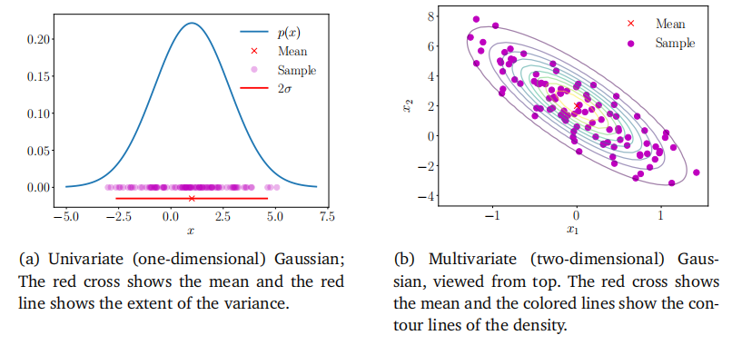
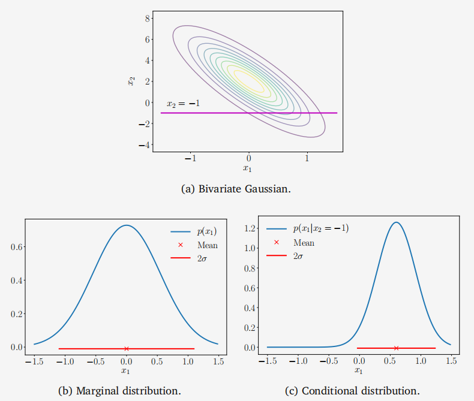

## 6.5 高斯分布

高斯分布是所有连续型随机变量的概率分布中被研究的最透彻的一种分布。它也被叫做正态分布。它的重要性事实上来源于一些便于计算的性质，我们将在下面进行讨论。特别地，我们将使用它来定义线性回归的似然和先验（第9章），并考虑密度估计的高斯混合数（第11章）。

机器学习的许多其他领域也受益于使用高斯分布，例如高斯过程、变分推理和强化学习。它也被广泛应用于其他应用领域，如信号处理（如卡尔曼滤波器）、控制（如线性二次调节器）和统计（如假设检验）。

图6.8高斯分布覆盖了100个样本。(a)一维情况；(b)二维情况。

对于单变量随机变量，高斯分布（Gaussian distribution）的密度函数由下式给出：

(6.62)

$$p(x\mid\mu,\sigma^2)=\frac{1}{\sqrt{2\pi\sigma^2}}\exp\left(-\frac{(x-\mu)^2}{2\sigma^2}\right).$$

多元高斯分布（Multivariate Gaussian distribution）完全由均值向量$\mu$和协方差矩阵$\Sigma$描述，并定义为：

(6.63)

$$p(\boldsymbol{x}\mid\boldsymbol{\mu},\boldsymbol{\Sigma})=(2\pi)^{-\frac{D}{2}}|\boldsymbol{\Sigma}|^{-\frac{1}{2}}\exp\left(-\frac{1}{2}(\boldsymbol{x}-\boldsymbol{\mu})^{\top}\boldsymbol{\Sigma}^{-1}(\boldsymbol{x}-\boldsymbol{\mu})\right),$$

其中，$\boldsymbol{x}\in\mathbb{R}^D$。我们通常写作$p(\boldsymbol{x})=\mathcal{N}(\boldsymbol{x}\mid\boldsymbol{\mu},\boldsymbol{\Sigma})$或$X\sim\mathcal{N}(\boldsymbol{\mu},\boldsymbol{\Sigma})$。图6.7展示了二元高斯分布（网格图）及其对应的等高线图。图6.8展示了单变量高斯分布和二元高斯分布及其对应的样本。当高斯分布的均值为零且协方差为单位矩阵时，即$\mu=0$且$\Sigma=I$，这种情况被称为标准正态分布（standard normal distribution）。

高斯分布在统计估计和机器学习领域中被广泛使用，因为它们具有边际分布和条件分布的闭式表达式。在第九章中，我们将这些闭式表达式广泛用于线性回归。使用高斯随机变量进行建模的一个主要优势是通常不需要进行变量变换（第6.7节）。由于高斯分布完全由其均值和协方差指定，因此我们通常可以通过对随机变量的均值和协方差进行变换来获得变换后的分布。

### 6.5.1 高斯分布的边际分布和条件分布仍然是高斯分布

以下，我们介绍在多元随机变量的一般情况下的边际化和条件化。如果初次阅读时感到困惑，建议读者先考虑两个单变量随机变量的情况。设$X$和$Y$是两个可能具有不同维度的多元随机变量。为了考虑应用概率和规则和条件化的影响，我们明确地将高斯分布表示为连接状态$[x^\top,y^\top]$的函数，

$$p(\boldsymbol{x},\boldsymbol{y})=\mathcal{N}\left(\begin{bmatrix}\boldsymbol{\mu}_x\\\boldsymbol{\mu}_y\end{bmatrix},\:\begin{bmatrix}\boldsymbol{\Sigma}_{xx}&\boldsymbol{\Sigma}_{xy}\\\boldsymbol{\Sigma}_{yx}&\boldsymbol{\Sigma}_{yy}\end{bmatrix}\right).$$

(6.64)

其中，$\Sigma_{xx}=\text{Cov}[x,x]$和$\Sigma_{yy}=\text{Cov}[y,y]$分别是$x$和$y$的边际协方差矩阵，而$\Sigma_{xy}=\text{Cov}[x,y]$是$x$和$y$之间的互协方差矩阵。

条件分布$p(x\mid y)$也是高斯分布（如图6.9(c)所示），并由（Bishop, 2006的2.3节推导得出）

(6.65)

$$\begin{aligned}p(\boldsymbol{x}\mid\boldsymbol{y})&=\mathcal{N}(\boldsymbol{\mu}_{x\mid y},\:\boldsymbol{\Sigma}_{x\mid y})\\\mu_{x\mid y}&=\boldsymbol{\mu}_{x}+\boldsymbol{\Sigma}_{xy}\boldsymbol{\Sigma}_{yy}^{-1}(\boldsymbol{y}-\boldsymbol{\mu}_{y})\\\boldsymbol{\Sigma}_{x\mid y}&=\boldsymbol{\Sigma}_{xx}-\boldsymbol{\Sigma}_{xy}\boldsymbol{\Sigma}_{yy}^{-1}\boldsymbol{\Sigma}_{yx}\:.\end{aligned}$$

(6.66)

(6.67)

注意，在计算(6.66)中的均值时，$y$的值是一个观测值，不再是随机的。

**备注**。条件高斯分布在许多地方都会出现，特别是在我们对后验分布感兴趣的情况下：

\- 卡尔曼滤波器（Kalman, 1960），是信号处理中状态估计最核心的算法之一，其本质就是计算联合分布的高斯条件分布（Deisenroth和Ohlsson, 2011; Särkkä, 2013）。

\- 高斯过程（Rasmussen和Williams, 2006），是函数分布的一种实用实现。在高斯过程中，我们对随机变量的联合高斯性做出假设。通过对观测数据进行（高斯）条件化，我们可以确定函数的后验分布。

\- 潜在线性高斯模型（Roweis和Ghahramani, 1999; Murphy, 2012），包括概率主成分分析（PPCA）（Tipping和Bishop, 1999）。我们将在第10.7节中更详细地讨论PPCA。

联合高斯分布$p(\boldsymbol{x},\boldsymbol{y})$（见(6.64)）的边际分布$p(\boldsymbol{x})$本身也是高斯分布，通过应用求和规则(6.20)计算得出，具体为

(6.68)

$$p(\boldsymbol{x})=\int p(\boldsymbol{x},\boldsymbol{y})\mathrm{d}\boldsymbol{y}=\mathcal{N}\big(\boldsymbol{x}\:|\:\boldsymbol{\mu}_{x},\:\boldsymbol{\Sigma}_{xx}\big)\:.$$

对于$p(y)$也有相应的结果，它是通过对$x$进行边际化得到的。直观上看，在观察(6.64)中的联合分布时，我们忽略了（即，积分掉）我们不感兴趣的所有内容。这如图6.9(b)所示。

\> **例6.6**

\>

\> 

\>

\> 
图6.9 (a)二元高斯分布；联合高斯分布的(b)边缘是高斯分布；(c)高斯分布的条件分布也是高斯分布。

\>

\> 考虑二元高斯分布（如图6.9所示）：

\>

\> (6.69)

\> $$p(x_1,x_2)=\mathcal{N}\left(\begin{bmatrix}0\\2\end{bmatrix},\begin{bmatrix}0.3&-1\\-1&5\end{bmatrix}\right)\:.$$

\>

\> 我们可以通过应用(6.66)和(6.67)来计算在$x_2=-1$条件下，单变量高斯分布的参数，从而分别得到均值和方差。数值上，这等于

\>

\> $$\mu_{x_1\mid x_2=-1}=0+(-1)\cdot0.2\cdot(-1-2)=0.6$$

\> (6.70)

\>

\> 以及

\>

\> $$\sigma_{x_1\mid x_2=-1}^2=0.3-(-1)\cdot0.2\cdot(-1)=0.1\:.$$

\> (6.71)

\>

\> 因此，条件高斯分布由下式给出：

\>

\> $$p(x_{1}\mid x_{2}=-1)=\mathcal{N}\big(0.6,\:0.1\big)\:.$$

\> (6.72)

\>

\> 相比之下，边际分布$p(x_1)$可以通过应用(6.68)获得，这实质上就是使用随机变量$x_1$的均值和方差，得到

\>

\> $$p(x_1)=\mathcal{N}(0,\:0.3)\:.$$

\> (6.73)

### 6.5.2 高斯密度的乘积

在线性回归（第9章）中，我们需要计算高斯似然函数。此外，我们可能还希望假设一个高斯先验（第9.3节）。我们应用贝叶斯定理来计算后验分布，这涉及到似然函数和先验分布的乘积，即两个高斯密度的乘积。两个高斯分布的乘积 $\mathcal{N} ( x\mid \boldsymbol{a}, \boldsymbol{A}) \mathcal{N} ( x\mid \boldsymbol{b}, \boldsymbol{B})$ 的推导结果是

一个由实数 $c\in\mathbb{R}$ 缩放的高斯分布，表示为 $c\mathcal{N}(x\mid c,C)$，其中相关的练习在

(6.74) (6.75)

$$\begin{aligned}&C=(A^{-1}+B^{-1})^{-1}\\&c=C(A^{-1}a+B^{-1}b)\\&c=(2\pi)^{-\frac{D}{2}}|A+B|^{-\frac{1}{2}}\exp\left(-\frac{1}{2}(a-b)^{\top}(A+B)^{-1}(a-b)\right).\\\end{aligned}$$

(6.76)

缩放常数 $c$ 本身可以写成 $a$ 或 $b$ 的高斯密度形式，但协方差矩阵为“膨胀”的 $A+B$，即 $c= \mathcal{N} ( a\mid b, A+ B) = \mathcal{N} ( \boldsymbol{b}\mid a, A+ B)$。

$备注$。为了方便表示，我们有时会用 $\mathcal{N}(x\mid\boldsymbol{m},\boldsymbol{S})$ 来描述高斯密度的函数形式，即使 $x$ 不是随机变量。在前面的演示中，我们就是这样做的，当时我们写了

(6.77)

$$c=\mathcal{N}\big(\boldsymbol{a}\:|\:\boldsymbol{b},\:\boldsymbol{A}+\boldsymbol{B}\big)=\mathcal{N}\big(\boldsymbol{b}\:|\:\boldsymbol{a},\:\boldsymbol{A}+\boldsymbol{B}\big)\:.$$

这里，$a$ 和 $b$ 都不是随机变量。然而，将 $c$ 写成这种形式比 (6.76) 更简洁。

### 6.5.3 和与线性变换

如果 $X,Y$ 是独立的高斯随机变量（即，联合分布为 $p(\boldsymbol{x},\boldsymbol{y})=p(\boldsymbol{x})p(\boldsymbol{y})$），其中 $p(\boldsymbol{x})=\mathcal{N}(\boldsymbol{x}\mid\boldsymbol{\mu}_x,\boldsymbol{\Sigma}_x)$ 且 $p(\boldsymbol{y})=\mathcal{N}(\boldsymbol{y}\mid\boldsymbol{\mu}_{y},\boldsymbol{\Sigma}_{y})$，那么 $x+y$ 也是高斯分布的，并且由下式给出

$$p(\boldsymbol{x}+\boldsymbol{y})=\mathcal{N}(\boldsymbol{\mu}_{x}+\boldsymbol{\mu}_{y},\:\boldsymbol{\Sigma}_{x}+\boldsymbol{\Sigma}_{y})\:.$$

(6.78)

知道 $p(x+y)$ 是高斯分布的，我们可以立即使用从 (6.46) 到 (6.49) 的结果来确定均值和协方差矩阵。这一性质在我们考虑独立同分布（i.i.d.）高斯噪声作用于随机变量时非常重要，这在线性回归（第9章）中就是这样的情况。

\> **例6.7**

\>

\> 由于期望是线性运算，我们可以得到独立高斯随机变量的加权和的概率分布。对于 $a\boldsymbol{x}+b\boldsymbol{y}$，其概率分布为

\>

\> $$p(a\boldsymbol{x}+b\boldsymbol{y})=\mathcal{N}\left(a\boldsymbol{\mu}_{x}+b\boldsymbol{\mu}_{y},\:a^{2}\boldsymbol{\Sigma}_{x}+b^{2}\boldsymbol{\Sigma}_{y}\right).$$

\> (6.79)

\>

\> 这里，$a$ 和 $b$ 是常数，$\boldsymbol{x}$ 和 $\boldsymbol{y}$ 是独立的高斯随机变量，$\boldsymbol{\mu}_{x}$ 和 $\boldsymbol{\mu}_{y}$ 分别是 $\boldsymbol{x}$ 和 $\boldsymbol{y}$ 的均值向量，$\boldsymbol{\Sigma}_{x}$ 和 $\boldsymbol{\Sigma}_{y}$ 分别是 $\boldsymbol{x}$ 和 $\boldsymbol{y}$ 的协方差矩阵。这个结果是基于高斯分布的线性变换性质得出的。

备注。在第11章中，高斯密度（Gaussian densities）的加权和将非常有用。这与高斯随机变量（Gaussian random variables）的加权和是不同的。

♦

在定理6.12中，随机变量$x$来自一个由两个密度$p_1(x)$和$p_2(x)$按$\alpha$加权混合而成的密度。该定理可以推广到多元随机变量的情况，因为期望的线性性质对于多元随机变量也同样成立。然而，平方随机变量的概念需要被$xx^\top$所替代。

定理6.12. 考虑两个一元高斯密度的混合

(6.80)

$$p(x)=\alpha p_1(x)+(1-\alpha)p_2(x)\:,$$

其中标量$0<\alpha<1$是混合权重，$p_1(x)$和$p_2(x)$是具有不同参数的一元高斯密度（方程(6.62)），即$(\mu_1, \sigma_1^2) \neq (\mu_2, \sigma_2^2)$。

那么，混合密度$p(x)$的均值由每个随机变量均值的加权和给出：

(6.81)

$$\mathbb{E}[x]=\alpha\mu_1+(1-\alpha)\mu_2\:.$$

混合密度$p(x)$的方差由

$$\mathrm{V}[x]=\left[\alpha\sigma_1^2+(1-\alpha)\sigma_2^2\right]+\left(\left[\alpha\mu_1^2+(1-\alpha)\mu_2^2\right]-\left[\alpha\mu_1+(1-\alpha)\mu_2\right]^2\right)$$

给出。

证明：混合密度$p(x)$的均值由每个随机变量均值的加权和给出。我们应用均值的定义（定义6.4），并将我们的混合公式（6.80）代入，得到

$(6.83a)$

(6.83b)

$$\begin{aligned}\boldsymbol{E}[x]&=\int_{-\infty}^{\infty}xp(x)\mathrm{d}x\\&=\int_{-\infty}^{\infty}\left(\alpha xp_1(x)+(1-\alpha)xp_2(x)\right)\mathrm{d}x\\&=\alpha\int_{-\infty}^{\infty}xp_1(x)\mathrm{d}x+(1-\alpha)\int_{-\infty}^{\infty}xp_2(x)\mathrm{d}x\\&=\alpha\mu_1+(1-\alpha)\mu_2.\end{aligned}$$

(6.83c)

(6.83d)

为了计算方差，我们可以使用（6.44）中的方差原始分数版本，这需要平方随机变量的期望的表达式。在这里，我们使用随机变量函数（平方）的期望的定义（定义6.3），

(6.84a)

$$\begin{aligned}\operatorname{E}[x^2]&=\int_{-\infty}^{\infty}x^2p(x)\mathrm{d}x\\&=\int_{-\infty}^{\infty}\left(\alpha x^2p_1(x)+(1-\alpha)x^2p_2(x)\right)\mathrm{d}x\end{aligned}$$

(6.84b)

(6.84c)

$$=\alpha\int_{-\infty}^{\infty}x^{2}p_{1}(x)\mathrm{d}x+(1-\alpha)\int_{-\infty}^{\infty}x^{2}p_{2}(x)\mathrm{d}x\\=\alpha(\mu_{1}^{2}+\sigma_{1}^{2})+(1-\alpha)(\mu_{2}^{2}+\sigma_{2}^{2})\:,$$

(6.84d)

在最后这个等式中，我们再次使用了方差的原始分数版本（6.44），即$\sigma^2=\text{E}[x^2]-\mu^2$。这个等式被重新排列，使得平方随机变量的期望是均值的平方和方差的和。

因此，方差是通过从(6.84d)中减去(6.83d)来给出的，

(6.85a) $(6.85b)$

$$\begin{aligned}\mathrm{V}[x]&=\mathbb{E}[x^{2}]-(\mathbb{E}[x])^{2}\\&=\alpha(\mu_{1}^{2}+\sigma_{1}^{2})+(1-\alpha)(\mu_{2}^{2}+\sigma_{2}^{2})-(\alpha\mu_{1}+(1-\alpha)\mu_{2})^{2}\\&=\left[\alpha\sigma_{1}^{2}+(1-\alpha)\sigma_{2}^{2}\right]\\&+\left(\left[\alpha\mu_{1}^{2}+(1-\alpha)\mu_{2}^{2}\right]-\left[\alpha\mu_{1}+(1-\alpha)\mu_{2}\right]^{2}\right)\:.\end{aligned}$$

(6.85c)

备注。前面的推导适用于任何密度，但由于高斯分布完全由均值和方差确定，因此混合密度可以以封闭形式确定。

♦

对于混合密度，各个组成部分可以被认为是条件分布（以组件身份为条件）。方程(6.85c)是条件方差公式的一个例子，也称为全方差定律，它一般地表明对于两个随机变量$X$和$Y$，有$\text{V}_X[x]=\text{E}_Y[\text{V}_X[x|y]]+\text{V}_Y[\text{E}_X[x|y]]$，即$X$的（总）方差是条件方差的期望值加上条件均值的方差。

在示例6.17中，我们考虑了一个二元标准高斯随机变量$X$，并对其进行了线性变换$Ax$。结果是一个均值为零、协方差为$AA^\top$的高斯随机变量。请注意，添加一个常数向量会改变分布的均值，但不会影响其方差，即随机变量$x+\mu$是均值为$\mu$、协方差为单位矩阵的高斯分布。因此，高斯随机变量的任何线性/仿射变换都是高斯分布的。

考虑一个高斯分布的随机变量$X\sim\mathcal{N}(\boldsymbol{\mu},\boldsymbol{\Sigma})$。对于给定形状的矩阵$A$的变换，设$Y$是一个随机变量，使得$y=Ax$是$x$的变换版本。我们可以利用期望是线性运算（6.50）来计算高斯$y$的均值，如下所示：

$$\text{E}[y]=\text{E}[Ax]=A\text{E}[x]=A\mu\:.$$

(6.86)

类似地，我们可以使用（6.51）来找到$y$的方差：

$$\text{V}[y]=\text{V}[Ax]=A\text{V}[x]A^{\top}=A\Sigma A^{\top}.$$

(6.87)

这意味着随机变量$y$的分布是

$$p(\boldsymbol{y})=\mathcal{N}(\boldsymbol{y}\mid A\boldsymbol{\mu},\:A\boldsymbol{\Sigma}\boldsymbol{A}^{\top}).$$

(6.88)

现在让我们考虑反向变换：当我们知道一个随机变量的均值是另一个随机变量的线性变换时。对于给定的满秩矩阵$A\in\mathbb{R}^{M\times N}$，其中$M\geqslant N$，设$y\in\mathbb{R}^M$是一个均值为$Ax$的高斯随机变量，即，

(6.89)

$$p(\boldsymbol{y})=\mathcal{N}(\boldsymbol{y}\:|\:\boldsymbol{A}\boldsymbol{x},\:\boldsymbol{\Sigma})\:.$$

那么对应的概率分布$p(x)$是什么？如果$A$是可逆的，那么我们可以写$x=A^{-1}y$并应用前一段中的变换。但是，一般来说$A$是不可逆的，我们使用与伪逆（3.57）类似的方法。即，我们先对两边同时左乘$A^\top$，然后求$A^\top A$的逆，它是对称且正定的，从而得到关系

$$y=Ax\iff(A^{\top}A)^{-1}A^{\top}y=x\:.$$

(6.90)

因此，$x$是$y$的线性变换，我们得到

(6.91)

$$p(\boldsymbol{x})=\mathcal{N}\big(\boldsymbol{x}\mid(\boldsymbol{A}^{\top}\boldsymbol{A})^{-1}\boldsymbol{A}^{\top}\boldsymbol{y},\:(\boldsymbol{A}^{\top}\boldsymbol{A})^{-1}\boldsymbol{A}^{\top}\boldsymbol{\Sigma}\boldsymbol{A}(\boldsymbol{A}^{\top}\boldsymbol{A})^{-1}\big)\:.$$

### 6.5.4 从多元高斯分布中采样

我们不会详细解释计算机上随机采样的微妙之处，感兴趣的读者可以参考Gentle（2004）的著作。在多元高斯分布的情况下，该过程包含三个阶段：首先，我们需要一个伪随机数源，它能在区间[0,1]内提供均匀样本；其次，我们使用非线性变换，如Box-Müller变换（Devroye，1986），从一元高斯分布中获取样本；第三，我们将这些样本向量组合起来，以获得来自多元标准正态分布$\mathcal{N}(\boldsymbol{0},\boldsymbol{I})$的样本。

对于一般的多元高斯分布，即均值非零且协方差不是单位矩阵的情况，我们使用高斯随机变量的线性变换的性质。假设我们想要从均值为$\mu$、协方差矩阵为$\Sigma$的多元高斯分布中生成样本$\boldsymbol x_i,i=1,\ldots,n$。我们希望从一个能为多元标准正态分布$\mathcal{N}(\boldsymbol{0},\bar{\boldsymbol{I}})$提供样本的采样器中构造样本。

为了从多元正态分布$\mathcal{N}(\mu,\Sigma)$中获取样本，我们可以利用高斯随机变量的线性变换的性质：如果$x\sim\mathcal{N}(0,\boldsymbol{I})$，那么$y=Ax+\mu$，其中$AA^\top=\Sigma$，且$y$是具有均值$\mu$和协方差矩阵$\Sigma$的高斯分布。选择$A$的一个方便方法是使用协方差矩阵$\Sigma = AA^\top$的Cholesky分解（第4.3节）。Cholesky分解的优点是$A$是三角矩阵，这有助于提高计算效率。