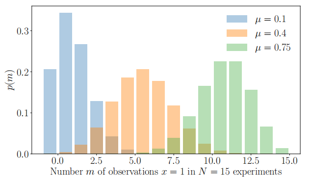
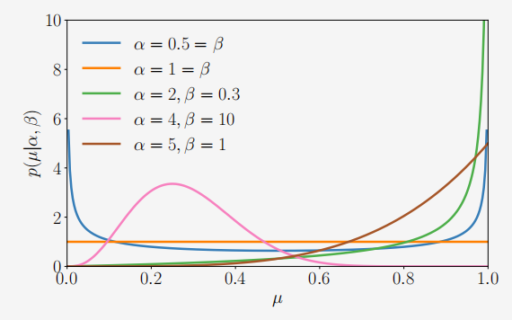
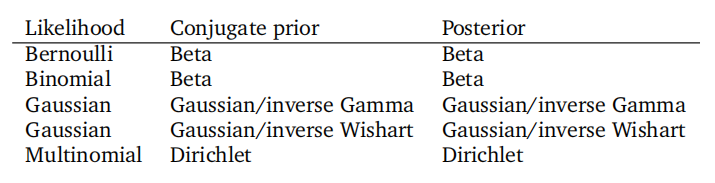

## 6.6 共轭性与指数族分布

我们在统计学教科书中遇到的许多“有名”的概率分布都是为了模拟特定类型的现象而发现的。例如，我们在6.5节中见到了高斯分布。这些分布之间也以复杂的方式相互关联（Leemis 和 McQueston, 2008）。对于该领域的初学者来说，要弄清楚应该使用哪种分布可能会感到不知所措。此外，许多这些分布的发现时期，统计和计算还只能通过笔和纸来完成。因此，很自然地会提出这样的问题：在计算时代（Efron 和 Hastie, 2016），哪些概念是职位描述中有意义的？

在上一节中，我们看到，当分布是高斯分布时，许多用于推断的操作都可以方便地计算。此时，值得回顾在机器学习上下文中操作概率分布的期望属性：

1. 在应用概率规则时，存在一些“封闭性”，例如贝叶斯定理。这里的封闭性意味着应用特定操作会返回同类型的对象。
2. 当我们收集更多数据时，不需要更多参数来描述分布。
3. 由于我们感兴趣的是从数据中学习，因此我们希望参数估计能够表现良好。

事实证明，被称为指数族的分布类在保持一般性的同时，也保留了有利的计算和推断特性。在介绍指数族之前，让我们再来看三个“有名”的概率分布成员：伯努利分布（示例6.8）、二项分布（示例6.9）和贝塔分布（示例6.10）。

> **例 6.8**
>
> 伯努利分布是针对单个二元随机变量$X$的分布，其状态$x\in\{0,1\}$。它由一个连续参数$\mu\in[0,1]$控制，该参数表示$X=1$的概率。伯努利分布Ber$(\mu)$定义为
>
> (6.92)
> $$\begin{aligned}
> p(x\mid\mu)&=\mu^{x}(1-\mu)^{1-x}\:,\quad x\in\{0,1\}\:,\\
> \boldsymbol{E}[x]&=\mu\:,\\
> \boldsymbol{V}[x]&=\mu(1-\mu)\:,
> \end{aligned}$$
>
> 其中，E$[x]$和V$[x]$分别是二元随机变量$X$的均值和方差。

可以使用伯努利分布的一个例子是，当我们对抛硬币时“头”的概率建模感兴趣时。

图6.10µ∈{0.1、0.4、0.75}和N = 15的二项式分布示例。

**备注**。上面改写伯努利分布，我们使用布尔变量作为数值0或1，用指数表示，是机器学习教科书中经常使用的技巧。另一种情况是在表示多项分布时。

> **例 6.9（二项分布）**
>
> 二项分布是伯努利分布在整数上的一个推广（如图6.10所示）。特别是，二项分布可以用于描述从伯努利分布中抽取$N$个样本时，观察到$X=1$出现$m$次的概率，其中$p(X=1) = \mu \in [0,1]$。二项分布Bin$(N,\mu)$定义为
>
> (6.95)
> $$\begin{aligned}
> p(m\mid N,\mu)&=\binom{N}{m}\mu^m(1-\mu)^{N-m}\:,\\
> \mathbb{E}[m]&=N\mu\:,\\
> \mathbb{V}[m]&=N\mu(1-\mu)\:,
> \end{aligned}$$
>
> 其中，E$[m]$和V$[m]$分别是$m$的均值和方差。

二项式的一个例子是，如果我们想描述在N个抛硬币实验中观察到m个“头”的概率，如果在单个实验中观察到头部的概率是µ。

> **例 6.10（贝塔分布）**
>
> 我们可能希望对有限区间上的连续随机变量进行建模。贝塔分布是一个在连续随机变量$\mu\in[0,1]$上的分布，它经常用于表示某些二元事件（例如，控制伯努利分布的参数）的概率。贝塔分布Beta($\alpha,\beta)$（如图6.11所示）本身由两个参数$\alpha>0,\beta>0$控制，并定义为
>
> (6.98)
> $$\begin{aligned}
> p(\mu\mid\alpha,\beta)&=\frac{\Gamma(\alpha+\beta)}{\Gamma(\alpha)\Gamma(\beta)}\mu^{\alpha-1}(1-\mu)^{\beta-1}\\
> \mathrm{E}[\mu]&=\frac{\alpha}{\alpha+\beta}\:,\quad\mathrm{V}[\mu]=\frac{\alpha\beta}{(\alpha+\beta)^{2}(\alpha+\beta+1)}
> \end{aligned}$$
> (6.99)
>
> 其中，$\Gamma(\cdot)$是伽马函数，定义为
> $$\Gamma(t):=\int_{0}^{\infty}x^{t-1}\exp(-x)dx,\quad t>0\:.\quad\Gamma(t+1)=t\Gamma(t)\:.$$
> (6.100)
>
> (6.101)
>
> 请注意，(6.98)中的伽马函数之比用于对贝塔分布进行归一化。
>
> 
>
> 
图6.11α和β不同值的Beta分布示例。

直观上，$\alpha$ 将概率质量向 1 移动，而 $\beta$ 将概率质量向 0 移动。这里有一些特殊情况（Murphy, 2012）：

$\bullet$ 当 $\alpha=1=\beta$ 时，我们得到均匀分布 $\mathcal{U}[0,1]$。
$\bullet$ 当 $\alpha,\beta<1$ 时，我们得到一个在 0 和 1 处有尖峰的双峰分布。
$\bullet$ 当 $\alpha,\beta>1$ 时，分布是单峰的。
$\bullet$ 当 $\alpha,\beta>1$ 且 $\alpha=\beta$ 时，分布是单峰的、对称的，并且以区间 [0,1] 为中心，即众数/均值为 $\frac{1}{2}$。

备注。存在大量具有名称的分布，它们之间以不同的方式相互关联（Leemis 和 McQueston, 2008）。值得注意的是，每个命名的分布都是出于特定原因而创建的，但可能具有其他应用。了解特定分布创建背后的原因通常能够洞察如何最好地使用它。我们介绍了前面的三个分布，以便能够说明共轭性（第 6.6.1 节）和指数族（第 6.6.3 节）的概念。

### 6.6.1 共轭性

根据贝叶斯定理（6.23），后验概率与先验概率和似然函数的乘积成正比。先验概率的指定可能由于两个原因而变得棘手：首先，先验概率应该包含我们在看到任何数据之前对问题的了解，这通常很难描述。其次，通常不可能通过解析方法计算后验分布。然而，有一些计算上方便的先验概率：共轭先验。

**定义 6.13（共轭先验）**。如果后验概率与先验概率具有相同的形式/类型，则该先验概率是似然函数的共轭先验。

共轭性特别方便，因为我们可以通过更新先验分布的参数来代数地计算后验分布。

**备注**。在考虑概率分布的几何形状时，共轭先验保留了与似然函数相同的距离结构（Agarwal 和 Daumé III，2010）。

$\diamondsuit$

为了介绍共轭先验的一个具体例子，我们在示例 6.11 中描述了二项分布（定义在离散随机变量上）和贝塔分布（定义在连续随机变量上）。

> **例 6.11（贝塔-二项共轭性）**
>
> 考虑一个二项随机变量 $x\sim\operatorname{Bin}(N,\mu)$，其中
> $$p(x\mid N,\mu)=\begin{pmatrix}N\\x\end{pmatrix}\mu^x(1-\mu)^{N-x},\quad x=0,1,\dots,N\:,$$
> (6.102)
>
> 表示在 $N$ 次硬币抛掷中找到 $x$ 次“正面”的概率，其中 $\mu$ 是出现“正面”的概率。我们对参数 $\mu$ 放置一个贝塔先验，即 $\mu\sim$Beta$(\alpha,\beta)$，其中
> $$p(\mu\mid\alpha,\beta)=\frac{\Gamma(\alpha+\beta)}{\Gamma(\alpha)\Gamma(\beta)}\mu^{\alpha-1}(1-\mu)^{\beta-1}\:.$$
> (6.103)
>
> 如果我们现在观察到某个结果 $x=h$，即在 $N$ 次硬币抛掷中看到 $h$ 次“正面”，我们可以计算 $\mu$ 的后验分布为
>
> (6.104a) $(6.104b)$
> $$\begin{aligned}
> p(\mu\mid x=h,N,\alpha,\beta)&\propto p(x\mid N,\mu)p(\mu\mid\alpha,\beta)\\
> &\propto\mu^{h}(1-\mu)^{(N-h)}\mu^{\alpha-1}(1-\mu)^{\beta-1}\\
> &=\mu^{h+\alpha-1}(1-\mu)^{(N-h)+\beta-1}
> \end{aligned}$$
> (6.104c)
>
> (6.104d)
> $$\propto\text{Beta}(h+\alpha,N-h+\beta)\:,$$
>
> 即，后验分布是一个贝塔分布，与先验分布相同，即贝塔先验是二项似然函数中参数 $\mu$ 的共轭先验。

**表6.2常见似然函数的共轭先验的例子。**

在下面的例子中，我们将得到一个类似于贝塔二项共轭结果的结果。这里我们将证明贝塔分布是伯努利分布的共轭先验.

> **例 6.12（贝塔-伯努利共轭性）**
>
> 设 $x\in\{0,1\}$ 根据参数为 $\theta\in[0,1]$ 的伯努利分布进行分布，即 $p(x=1\mid\theta)=\theta$。这也可以表示为 $p(x\mid\theta)=\theta^x(1-\theta)^{1-x}$。设 $\theta$ 根据参数为 $\alpha,\beta$ 的贝塔分布进行分布，即 $p(\theta\mid\alpha,\beta)\propto\theta^{\alpha-1}(1-\theta)^{\beta-1}$。
>
> 将贝塔分布和伯努利分布相乘，我们得到
>
> (6.105a)
>
> (6.105b)
> $$\begin{aligned}
> p(\theta\mid x,\alpha,\beta)&=p(x\mid\theta)p(\theta\mid\alpha,\beta)\\
> &\propto\theta^{x}(1-\theta)^{1-x}\theta^{\alpha-1}(1-\theta)^{\beta-1}\\
> &=\theta^{\alpha+x-1}(1-\theta)^{\beta+(1-x)-1}\\
> &\propto p(\theta\mid\alpha+x,\beta+(1-x))\:.
> \end{aligned}$$
> (6.105c)
>
> (6.105d)
>
> 最后一行是参数为 $(\alpha+x,\beta+(1-x))$ 的贝塔分布。

表6.2列出了在概率建模中使用的一些标准似然函数参数的共轭先验示例。在任何统计文本中都可以找到如伽马先验、多项式先验、逆伽马先验、逆Wishart先验和狄利克雷先验等分布是共轭的，例如在Bishop（2006）中就有描述。

贝塔分布是单变量高斯分布、二项分布和伯努利似然函数中参数$\mu$的共轭先验。对于高斯似然函数，我们可以在均值上放置一个共轭的高斯先验。表中高斯似然函数出现两次的原因是我们需要区分单变量和多变量的情况。在单变量（标量）情况下，逆伽马是先验方差的共轭先验。在多变量情况下，我们使用共轭的逆Wishart分布作为协方差矩阵的先验。狄利克雷分布是多项式似然函数的共轭先验。更多详情，请参阅Bishop（2006）。

### 6.6.2 充分统计量

回顾一下，随机变量的统计量是该随机变量的一个确定性函数。例如，如果$x=[x_1,\ldots,x_N]^\top$是一个单变量高斯随机变量的向量，即$x_n\sim\mathcal{N}(\mu,\sigma^2)$，那么样本均值$\hat{\mu}=\frac{1}{N}(x_{1}+\cdots+x_{N})$就是一个统计量。罗纳德·费希尔爵士（Sir Ronald Fisher）发现了充分统计量的概念：即存在统计量，它们包含了可以从与所考虑分布相对应的数据中推断出的所有可用信息。换句话说，充分统计量携带了关于总体进行推断所需的所有信息，即它们是足以表示分布的统计量。

对于一组由$\theta$参数化的分布，设$X$是一个具有分布$p(x\mid\theta_0)$的随机变量，其中$\theta_0$是未知的。如果统计量的向量$\phi(x)$包含了关于$\theta_0$的所有可能信息，则称$\phi(x)$为$\theta_0$的充分统计量。为了更正式地说明“包含所有可能信息”，这意味着在给定$\theta$的情况下，$x$的概率可以分解为两部分：一部分不依赖于$\theta$，另一部分仅通过$\phi(x)$依赖于$\theta$。费希尔-奈曼（Fisher-Neyman）分解定理正式化了这一概念，我们在定理6.14中不加证明地陈述了这一定理。

定理6.14（Fisher-Neyman）。[Lehmann和Casella（1998）中的定理6.5]设$X$具有概率密度函数$p(x\mid\theta)$。那么，统计量$\phi(x)$是$\theta$的充分统计量当且仅当$p(x\mid\theta)$可以写成以下形式：
$$p(x\mid\theta)=h(x)g_\theta(\phi(x))\:,$$
(6.106)

其中$h(x)$是与$\theta$无关的分布，而$g_{\theta}$通过充分统计量$\phi(x)$捕获了所有对$\theta$的依赖。

如果$p(x\mid\theta)$不依赖于$\theta$，那么对于任何函数$\phi$，$\phi(x)$显然是$\theta$的充分统计量。更有趣的情况是$p(x\mid\theta)$仅依赖于$\phi(x)$而不依赖于$x$本身。在这种情况下，$\phi(x)$是$\theta$的充分统计量。

在机器学习中，我们考虑从分布中抽取的有限数量的样本。可以想象，对于简单的分布（如示例6.8中的伯努利分布），我们只需要少量样本就可以估计分布的参数。我们还可以考虑相反的问题：如果我们有一组数据（来自未知分布的样本），那么哪个分布最适合这些数据？一个自然的问题是，随着我们观察更多数据，是否需要更多参数$\theta$来描述分布？一般来说，答案是肯定的，这在非参数统计中有所研究（Wasserman，2007）。一个相反的问题是考虑哪一类分布具有有限维充分统计量，即描述它们所需的参数数量不会任意增加。答案是指数族分布，这将在下一节中介绍。

### 6.6.3 指数族分布

在考虑分布（无论是离散随机变量还是连续随机变量的分布）时，我们可以有三个不同层次的抽象。在第一层次（最具体的一端），我们有一个具有固定参数的特定命名分布，例如均值为0、方差为1的单变量高斯分布$\mathcal{N}(0,1)$。在机器学习中，我们经常使用第二层次的抽象，即我们固定参数形式（如单变量高斯分布），并从数据中推断参数。例如，我们假设一个具有未知均值$\mu$和未知方差$\sigma^2$的单变量高斯分布$\mathcal{N}(\mu,\sigma^2)$，并使用最大似然拟合来确定最佳参数$(\mu,\sigma^2)$。在第9章考虑线性回归时，我们将看到这样的例子。第三层次的抽象是考虑分布族，而在本书中，我们关注的是指数族分布。单变量高斯分布是指数族分布的一个成员。表6.2中列出的许多广泛使用的统计模型，包括所有“命名”模型，都是指数族分布的成员。它们都可以统一到一个概念下（Brown, 1986）。

注。一个简短的历史趣闻：像数学和科学中的许多概念一样，指数族分布也是由不同的研究者同时独立发现的。在1935-1936年间，塔斯马尼亚的埃德温·皮特曼（Edwin Pitman）、巴黎的乔治·达莫瓦（Georges Darmois）和纽约的伯纳德·库普曼（Bernard Koopman）分别证明了在重复独立抽样下，指数族分布是唯一具有有限维充分统计量的分布族（Lehmann and Casella, 1998）。

$\diamondsuit$

指数族分布是一个由参数$\theta\in\mathbb{R}^{\acute{D}}$参数化的概率分布族，其形式为
(6.107)
$$p(\boldsymbol{x}\mid\boldsymbol{\theta})=h(\boldsymbol{x})\exp\left(\langle\boldsymbol{\theta},\boldsymbol{\phi}(\boldsymbol{x})\rangle-A(\boldsymbol{\theta})\right)\:,$$
其中$\phi(x)$是充分统计量的向量。一般来说，在(6.107)中可以使用任何内积（第3.2节），为了具体起见，我们将在这里使用标准点积（$\langle\boldsymbol\theta,\phi(\boldsymbol x)\rangle=\boldsymbol{\theta}^\top\phi(\boldsymbol x)$）。注意，指数族分布的形式本质上是费希尔-奈曼定理（定理6.14）中$g_\theta(\phi(x))$的一个特定表达式。

通过将另一个条目（$\log h(\boldsymbol x)$）添加到充分统计量向量$\phi(x)$中，并约束对应的参数$\theta_0=1$，因子$h(x)$可以被吸收到点积项中。项$A(\boldsymbol{\theta})$是归一化常数，它确保分布的总和或积分为1，被称为对数配分函数。忽略这两个项，并将指数族分布视为形式如下的分布，我们可以获得对指数族分布的良好直观理解：

(6.108)
$$p(\boldsymbol{x}\mid\boldsymbol{\theta})\propto\exp\left(\boldsymbol{\theta}^{\top}\boldsymbol{\phi}(\boldsymbol{x})\right).$$

对于这种参数化形式，参数$\theta$被称为自然参数。乍一看，指数族分布似乎只是通过在点积的结果上添加指数函数而进行的平凡变换。然而，由于我们能够在$\phi(x)$中捕获有关数据的信息，这带来了许多便于建模和高效计算的启示。

> **示例 6.13（高斯分布作为指数族分布）**
>
> 考虑单变量高斯分布 $\mathcal{N}(\mu, \sigma^2)$。令 $\phi(x) = \begin{bmatrix} x \\ x^2 \end{bmatrix}$。
>
> 然后，利用指数族分布的定义（6.109）式，我们有
>
> $$ p(x \mid \boldsymbol{\theta}) \propto \exp(\theta_{1}x + \theta_{2}x^{2}) $$
>
> 设定
>
> $$ \boldsymbol{\theta} = \left[\frac{\mu}{\sigma^2}, -\frac{1}{2\sigma^2}\right]^\top $$
>
> （6.110）
>
> 并将此代入（6.109）式，我们得到
>
> $$ p(x \mid \boldsymbol{\theta}) \propto \exp\left(\frac{\mu x}{\sigma^{2}} - \frac{x^{2}}{2\sigma^{2}}\right) \propto \exp\left(-\frac{1}{2\sigma^{2}}(x-\mu)^{2}\right) $$
>
> （6.111）
>
> 因此，单变量高斯分布是指数族分布的一个成员，其充分统计量为 $\phi(x) = \begin{bmatrix} x \\ x^2 \end{bmatrix}$，自然参数由（6.110）式中的 $\theta$ 给出。

> **示例 6.14（伯努利分布作为指数族分布）** 回顾示例 6.8 中的伯努利分布
>
> (6.112)
> $$ p(x \mid \mu) = \mu^x (1-\mu)^{1-x} \,,\quad x \in \{0,1\}. $$
> (6.113a)
>
> 这个分布可以写成指数族分布的形式：
> $$ \begin{aligned}
> p(x \mid \mu) &= \exp\left[\log\left(\mu^{x}(1-\mu)^{1-x}\right)\right] \\
> &= \exp\left[x\log\mu + (1-x)\log(1-\mu)\right] \\
> &= \exp\left[x\log\mu - x\log(1-\mu) + \log(1-\mu)\right] \\
> &= \exp\left[x\log\frac{\mu}{1-\mu} + \log(1-\mu)\right].
> \end{aligned} $$
> (6.113c)
>
> (6.113d)
>
> 最后一行（6.113d）可以识别为符合指数族分布的形式（6.107），通过观察可知
> $$ h(x) = 1 $$
> (6.114)
>
> (6.115)
> $$ \begin{aligned}
> \theta &= \log\frac{\mu}{1-\mu} \\
> \phi(x) &= x \\
> A(\theta) &= -\log(1-\mu) = \log(1+\exp(\theta)).
> \end{aligned} $$
> (6.116)
>
> (6.117)
>
> $\theta$ 和 $\mu$ 之间的关系是可逆的，因此
>
> (6.118)
> $$ \mu = \frac{1}{1+\exp(-\theta)} \,. $$
> 关系式（6.118）用于获得（6.117）中的右侧等式。

原始伯努利参数 $\mu$ 和自然参数 $\theta$ 之间的关系被称为 sigmoid 函数或逻辑函数。值得注意的是，$\mu$ 的取值范围是 $(0,1)$，但 $\theta$ 的取值范围是 $\mathbb{R}$，因此 sigmoid 函数将实数值压缩到 $(0,1)$ 范围内。这一性质在机器学习中非常有用，例如，在逻辑回归（Bishop, 2006, 第 4.3.2 节）中，以及在神经网络中作为非线性激活函数（Goodfellow 等人, 2016, 第 6 章）中都会用到它。

$\diamondsuit$
对于如何找到某个特定分布的共轭分布的参数形式，这通常并不明显（例如，表 6.2 中的那些分布）。指数族分布提供了一种方便的方法来找到分布的共轭对。考虑随机变量 $X$ 是指数族分布（6.107）的一个成员：

(6.119)
$$ p(\boldsymbol{x} \mid \boldsymbol{\theta}) = h(\boldsymbol{x}) \exp\left(\langle \boldsymbol{\theta}, \boldsymbol{\phi}(\boldsymbol{x}) \rangle - A(\boldsymbol{\theta}) \right) \,. $$

指数族的每一个成员都有一个共轭先验（Brown, 1986）

(6.120)
$$ p(\boldsymbol{\theta} \mid \boldsymbol{\gamma}) = h_c(\boldsymbol{\theta}) \exp\left(\left\langle \begin{bmatrix} \gamma_1 \\ \gamma_2 \end{bmatrix}, \begin{bmatrix} \boldsymbol{\theta} \\ -A(\boldsymbol{\theta}) \end{bmatrix} \right\rangle - A_c(\boldsymbol{\gamma}) \right) \,, $$

其中 $\gamma = \begin{vmatrix} \gamma_1 \\ \gamma_2 \end{vmatrix}$ 的维度是 $\text{dim}(\boldsymbol\theta) + 1$。共轭先验的充分统计量或共轭先验是 $\begin{bmatrix} \theta \\ -A(\boldsymbol{\theta}) \end{bmatrix}$。利用指数族共轭先验一般形式的知识，我们可以推导出与特定分布相对应的共轭先验的函数形式。

正如上一节所述，指数族的主要动机是它们具有有限维充分统计量。此外，共轭分布很容易写出来，而且共轭分布也来自指数族。从推断的角度来看，最大似然估计表现良好，因为充分统计量的经验估计是充分统计量总体值的最优估计（回想一下高斯分布的均值和协方差）。从优化的角度来看，对数似然函数是凹函数，允许应用有效的优化方法（第7章）。
