# 第8章 当模型遇上数据

在本书的第一部分，我们介绍了构成许多机器学习方法基础的数学知识。我们希望读者能够从第一部分学习到数学语言的基础知识，接下来我们将用这些知识来描述和讨论机器学习。本书的第二部分介绍了机器学习的四大支柱：

- 回归（第9章）
- 降维（第10章）
- 密度估计（第11章）
- 分类（第12章）

本书这一部分的主要目的是说明如何将第一部分介绍的数学概念用于设计机器学习算法，以解决这四个支柱范围内的任务。我们并不打算引入高级机器学习概念，而是提供一系列实用的方法，使读者能够应用他们从本书第一部分获得的知识。同时，对于已经熟悉数学的读者来说，这也为他们通往更广泛的机器学习文献提供了门户。

## 8.1 数据，模型与学习

此时，值得停下来思考一下机器学习算法旨在解决的问题。正如第一章所讨论的，机器学习系统主要由三个部分组成：数据、模型和学习。机器学习的主要问题是“我们所说的好模型是什么意思？”。“模型”这个词有很多微妙之处，我们将在本章中多次重新探讨它。同时，如何客观地定义“好”这个词也并非完全显而易见。机器学习的一个指导原则是，好的模型应该在未见过的数据上表现良好。这要求我们定义一些性能指标，如准确率或与真实情况的距离，并找出在这些性能指标下表现良好的方法。本章将介绍一些常用于讨论机器学习模型的数学和统计语言的基本要素。通过这样做，我们简要概述了训练模型的最佳实践，以便得到的预测器在尚未见过的数据上表现良好。

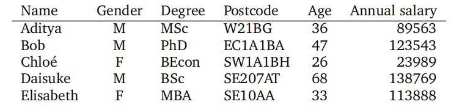

**表8.1来自非数字格式的虚构人力资源数据库的示例数据。**

如第一章所述，“机器学习算法”这个短语有两种不同的含义：训练和预测。我们将在本章中描述这些概念，以及在不同模型之间进行选择的想法。我们将在第8.2节中介绍经验风险最小化的框架，在第8.3节中介绍最大似然估计的原理，在第8.4节中介绍概率模型的思想。我们将在第8.5节中简要概述一种用于指定概率模型的图形语言，并在第8.6节中讨论模型选择。本节的其余部分将详细阐述机器学习的三个主要组成部分：数据、模型和学习。

### 8.1.1 数据作为向量

我们假设数据可以被计算机读取，并以数值格式进行充分表示。数据被假定为表格形式（如图8.1所示），其中每一行代表一个特定的实例或示例，每一列代表一个特定的特征。近年来，机器学习已被应用于许多类型的数据，这些数据并不明显以表格数值格式出现，例如基因组序列、网页的文本和图像内容以及社交媒体图表。我们不在此讨论识别良好特征的重要性和挑战性。这些方面的许多内容都取决于领域专业知识，需要仔细设计，并且在近年来，它们已被纳入数据科学的范畴（Stray, 2016; Adhikari and DeNero, 2018）。

即使我们拥有表格格式的数据，也仍然需要做出选择以获得数值表示。例如，在表8.1中，性别列（一个分类变量）可以转换为数字0表示“男性”，1表示“女性”。或者，性别也可以用数字-1，+1分别表示（如表8.2所示）。此外，在构建表示时经常使用领域知识也很重要，例如知道大学学位从学士到硕士再到博士的进展，或者意识到提供的邮政编码不仅仅是一串字符，而实际上是对伦敦某个地区的编码。在表8.2中，我们将表8.1中的数据转换为数值格式，每个邮政编码都用两个数字表示，即纬度和经度。即使是可能直接读入机器学习算法的数值数据，也应该仔细考虑其单位、缩放和约束。在没有其他信息的情况下，应该对数据集的所有列进行平移和缩放，使其经验均值为0，经验方差为1。为了本书的目的，我们假设领域专家已经对数据进行了适当的转换，即每个输入$x_n$是一个$D$维实数向量，这些实数被称为特征、属性或协变量。我们认为数据集的特征形式如图8.2所示。请注意，在新的数值表示中，我们省略了表8.1中的“姓名”列。这样做有两个主要原因：（1）我们不期望标识符（即姓名）对机器学习任务具有信息性；（2）我们可能希望匿名化数据以保护员工的隐私。

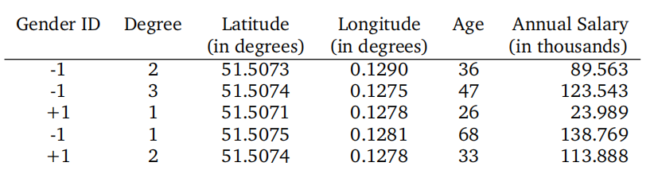

**表8.2来自一个虚构的人力资源数据库的示例数据（见表8.1），被转换为数字格式。**

在本书的这一部分，我们将使用$N$来表示数据集中的示例数量，并用小写字母$n=1,\ldots,N$对示例进行索引。我们假设给定了一组数值数据，表示为一个向量数组（表8.2）。每一行都是一个特定的个体$x_n$，在机器学习中通常被称为示例或数据点。下标$n$表示这是数据集中总共$N$个示例中的第$n$个示例。每一列代表示例的一个特定特征，我们用$d=1,\ldots,D$对特征进行索引。请记住，数据以向量的形式表示，这意味着每个示例（每个数据点）都是一个$D$维向量。表格的方向源自数据库社区，但对于某些机器学习算法（例如，在第10章中），将示例表示为列向量更为方便。

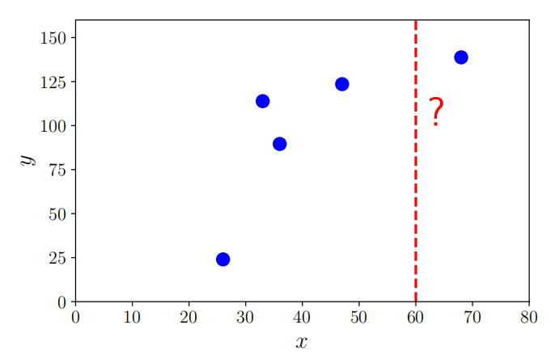

**图8.1用于线性回归的玩具数据。来自表8.2最右边两列的训练数据（xn，yn）对。我们感兴趣的是一个60岁（岁的x=60）的工资，用垂直虚线表示，这不是培训数据的一部分。**

让我们考虑基于表8.2中的数据，根据年龄预测年薪的问题。这被称为监督学习问题，其中每个示例$x_n$（即年龄）都与一个标签$y_n$（即薪资）相关联。标签$y_n$还有其他各种名称，包括目标、响应变量和注释。数据集被写为一组示例-标签对$\{(\boldsymbol x_1,y_1),\ldots,(\boldsymbol x_n,y_n),\ldots,(\boldsymbol x_N,y_N)\}$。示例表$\{x_1,\ldots,x_N\}$经常被串联起来，并写为$X\in\mathbb{R}^{N\times D}$。图8.1展示了由表8.2中最右两列组成的数据集，其中$x=$年龄，$y=$薪资。

我们使用本书第一部分介绍的概念来形式化机器学习问题，如前面段落中的问题。将数据表示为向量$x_n$使我们能够使用线性代数中的概念（在第2章中介绍）。在许多机器学习算法中，我们还需要能够比较两个向量。正如我们将在第9章和第12章中看到的那样，计算两个示例之间的相似性或距离使我们能够形式化这样一种直觉，即具有相似特征的示例应该具有相似的标签。比较两个向量需要我们构造一个几何结构（在第3章中解释），并允许我们使用第7章中的技术来优化所得的学习问题。

由于我们有了数据的向量表示，我们可以对数据进行操作以找到其潜在的更好表示。我们将通过两种方式讨论如何找到好的表示：找到原始特征向量的低维近似，以及使用原始特征向量的非线性高维组合。在第10章中，我们将看到一个通过找到主成分来找到原始数据空间低维近似的例子。找到主成分与第4章中介绍的特征值和奇异值分解的概念密切相关。对于高维表示，我们将看到一个明确的特征映射$\phi(\cdot)$，它允许我们使用更高维的表示$\phi(x_n)$来表示输入$x_n$。高维表示的主要动机是我们可以将新特征构建为原始特征的非线性组合，这反过来可能使学习问题变得更容易。我们将在第9.2节中讨论特征映射，并在第12.4节中展示这个特征映射如何导致核的出现。近年来，深度学习方法（Goodfellow等人，2016）已显示出使用数据本身来学习新的良好特征的潜力，并在计算机视觉、语音识别和自然语言处理等领域取得了巨大成功。本书这一部分不会涵盖神经网络，但读者可参考第5.6节了解反向传播的数学描述，这是训练神经网络的关键概念。

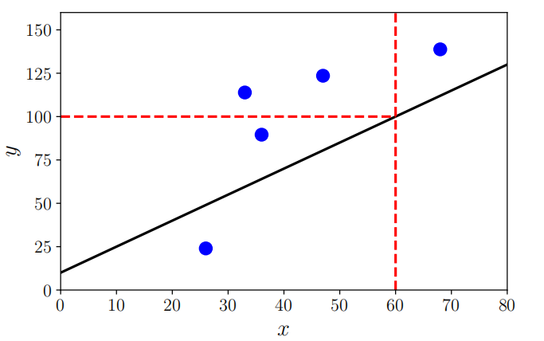

**图8.2示例函数（黑色实对角线）及其在x = 60处的预测，即f（60）= 100。**

### 8.1.2 模型作为函数

一旦我们将数据以适当的向量形式表示，我们就可以着手构建预测函数（称为预测器）。在第1章中，我们还没有精确描述模型的语言。现在，使用本书第一部分的概念，我们可以介绍“模型”的含义。本书提出了两种主要方法：将预测器视为函数，以及将预测器视为概率模型。我们在这里描述前者，并在下一小节中描述后者。

预测器是一个函数，当给定一个特定的输入示例（在我们的情况下，是一个特征向量）时，会产生一个输出。目前，我们将输出视为一个单一的数字，即一个实值标量输出。这可以写为
$$f:\mathbb{R}^{D}\to\mathbb{R}\:,$$
(8.1)

其中输入向量$x$是$D$维的（具有$D$个特征），然后函数$f$应用于它（写为$f(x)$）并返回一个实数。图8.2展示了一个可能的函数，该函数可用于计算输入值$x$的预测值。

在本书中，我们不考虑所有函数的一般情况，因为这需要函数分析。相反，我们考虑线性函数的特殊情况
$$f(\boldsymbol{x})=\boldsymbol{\theta}^\top\boldsymbol{x}+\theta_0$$
(8.2)

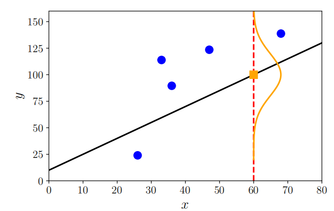

**图8.3示例函数（黑色实对角线）及其在x = 60处的预测不确定性（绘制为高斯曲线）。**

其中$\theta$和$\theta_0$是未知的。这一限制意味着第2章和第3章的内容足以精确阐述非概率（与接下来描述的概率观点相比）机器学习观点下的预测器概念。线性函数在可解决问题的一般性和所需背景数学知识的数量之间取得了良好的平衡。

### 8.1.3 模型作为概率分布

我们通常认为数据是对某些真实潜在效应的有噪声观测，并希望通过应用机器学习从噪声中识别出信号。这要求我们有一种量化噪声效应的语言。我们还经常希望预测器能够表达某种不确定性，例如，量化我们对特定测试数据点的预测值所具有的信心。正如我们在第6章中所见，概率论提供了一种量化不确定性的语言。图8.3展示了函数预测不确定性的高斯分布图示。

我们不必将预测器视为单个函数，而可以将其视为概率模型，即描述可能函数分布的模型。在本书中，我们将自己限制在具有有限维参数的分布的特殊情况，这使我们能够描述概率模型而无需涉及随机过程和随机测度。对于这个特殊情况，我们可以将概率模型视为多元概率分布，这已经允许了一个丰富的模型类别。

我们将在第8.4节中介绍如何使用概率（第6章）中的概念来定义机器学习模型，并在第8.5节中介绍一种图形语言，以便以紧凑的方式描述概率模型。

### 8.1.4 学习是寻找参数

学习的目标是找到一个模型及其对应的参数，使得得到的预测器在未见过的数据上表现良好。在讨论机器学习算法时，从概念上讲，有三个不同的算法阶段：

1. 预测或推断
2. 训练或参数估计
3. 超参数调整或模型选择

预测阶段是我们在之前未见过的测试数据上使用已训练的预测器的过程。换句话说，参数和模型选择已经固定，预测器被应用于代表新输入数据点的新向量。如第1章和前一小节所述，本书将考虑两种机器学习流派，分别对应于预测器是函数还是概率模型。当我们有概率模型（在第8.4节中进一步讨论）时，预测阶段被称为推断。

备注：不幸的是，对于不同的算法阶段并没有统一的命名。单词“推断”有时也用于表示概率模型的参数估计，而较少用于表示非概率模型的预测。

$\diamondsuit$

训练或参数估计阶段是我们根据训练数据调整预测模型的过程。我们希望在给定训练数据的情况下找到好的预测器，并有两种主要策略来实现这一点：基于某种质量度量找到最佳预测器（有时称为找到点估计），或使用贝叶斯推断。找到点估计可以应用于两种类型的预测器，但贝叶斯推断需要概率模型。

对于非概率模型，我们遵循经验风险最小化的原则，这将在第8.2节中描述。经验风险最小化直接为寻找良好参数提供了一个优化问题。对于统计模型，我们使用最大似然原理来找到一组好的参数（第8.3节）。我们还可以使用概率模型来进一步模拟参数的不确定性，这将在第8.4节中更详细地讨论。

我们使用数值方法来找到适合数据的良好参数，大多数训练方法都可以视为寻找目标最大值的爬山方法，例如似然函数的最大值。为了应用爬山方法，我们使用第5章中描述的梯度，并实现第7章中的数值优化方法。

如第1章所述，我们感兴趣的是基于数据学习模型，以便它在未来的数据上表现良好。仅使模型很好地拟合训练数据是不够的，预测器还需要在未见过的数据上表现良好。我们使用交叉验证（第8.2.4节）来模拟预测器在未来未见数据上的行为。正如我们将在本章中看到的，为了实现在未见过的数据上表现良好的目标，我们需要在很好地拟合训练数据和找到现象的“简单”解释之间取得平衡。这种权衡是通过正则化（第8.2.3节）或添加先验（第8.3.2节）来实现的。在哲学上，这既不是归纳也不是演绎，而被称为溯因。根据斯坦福哲学百科全书，溯因是推断最佳解释的过程（Douven，2017）。

我们通常需要就预测器的结构做出高级建模决策，比如要使用的组件数量或要考虑的概率分布类别。组件数量的选择是超参数的一个例子，这个选择可以显著影响模型的性能。在不同模型之间做出选择的问题被称为模型选择，我们将在第8.6节中描述。对于非概率模型，模型选择通常使用嵌套交叉验证来完成，这将在第8.6.1节中描述。我们还使用模型选择来选择我们模型的超参数。

备注：参数和超参数之间的区别有些任意，主要是由可以数值优化与需要使用搜索技术的区别所驱动的。考虑这种区别的另一种方式是，将参数视为概率模型的显式参数，而将超参数（高级参数）视为控制这些显式参数分布的参数。

$\diamondsuit$

在以下部分中，我们将探讨机器学习的三种类型：经验风险最小化（第8.2节）、最大似然原理（第8.3节）和概率建模（第8.4节）。

## 8.2 经验风险最小化

在我们掌握了所有相关的数学知识之后，我们现在可以介绍学习的含义了。机器学习中的“学习”部分实质上就是基于训练数据来估计参数。在本节中，我们考虑预测器是一个函数的情况，而概率模型的情况将在第8.3节中讨论。我们将描述经验风险最小化的概念，这一概念最初是由支持向量机（第12章描述）的提出而普及的。然而，其一般原则具有广泛的适用性，使我们能够在不显式构建概率模型的情况下，探讨学习的本质。以下是四个主要的设计选择，我们将在以下小节中详细讨论：

8.2.1 我们允许预测器采用哪些函数集？

8.2.2 我们如何衡量预测器在训练数据上的表现好坏？

8.2.3 我们如何从仅训练数据中构建在未见过的测试数据上表现良好的预测器？

8.2.4 在模型空间中搜索的程序是什么？

### 8.2.1 函数假设类

假设我们得到$N$个样本$x_n\in\mathbb{R}^D$和对应的标量标签$y_n\in\mathbb{R}$。我们考虑监督学习的设置，其中我们获得样本对$(x_1,y_1),\ldots,(x_N,y_N)$。基于这些数据，我们希望估计一个预测器$f(\cdot,\boldsymbol{\theta}):\mathbb{R}^D\to\mathbb{R}$，它通过参数$\theta$进行参数化。我们希望能够找到一个好的参数$\theta^{*}$，以便很好地拟合数据，即
$$f(\boldsymbol{x}_{n},\boldsymbol{\theta}^{*})\approx y_{n}\quad\text{对于所有}\quad n=1,\ldots,N\:.$$
(8.3)

在本节中，我们使用符号$\hat{y}_n=f(x_n,\theta^*)$来表示预测器的输出。

备注：为了便于阐述，我们将以监督学习（即我们有标签）的角度来描述经验风险最小化。这简化了假设类和损失函数的定义。在机器学习中，选择一类参数化函数也很常见，例如仿射函数。

> **例8.1**
>
> 我们引入普通最小二乘回归问题来说明经验风险最小化。关于回归的更全面介绍将在第9章中给出。当标签$y_n$是实数值时，预测器函数类的一个流行选择是仿射函数集。我们通过向$x_n$添加一个额外的单位特征$x^{(0)}=1$，即$x_n=[1,x_n^{(1)},x_n^{(2)},\ldots,x_n^{(D)}]^\top$，来更简洁地表示仿射函数。相应地，机器学习参数向量是$\boldsymbol{\theta}=[\theta_0,\theta_1,\theta_2,\ldots,\theta_D]^\top$，这使得我们可以将预测器写为线性函数
> $$f(x_n,\boldsymbol{\theta})=\boldsymbol{\theta}^\top\boldsymbol{x}_n\:.$$
> (8.4)
>
> 这个线性预测器等价于仿射模型
>
> (8.5)
> $$f(\boldsymbol{x}_n,\boldsymbol{\theta})=\theta_0+\sum_{d=1}^D\theta_dx_n^{(d)}\:.$$
>
> 预测器以表示单个样本$x_n$的特征向量为输入，并产生实数值输出，即$f:\mathbb{R}^{D+1}\to\mathbb{R}$。本章前面的图表中，预测器是一条直线，这意味着我们假设了一个仿射函数。
>
> 除了线性函数外，我们可能还希望考虑非线性函数作为预测器。神经网络领域的最新进展使得能够高效地计算更复杂的非线性函数类。

给定这类函数，我们想要寻找一个好的预测器。现在，我们转向经验风险最小化的第二个要素：如何测量预测器与训练数据的匹配程度。

### 8.2.2 训练损失函数

考虑一个特定样本的标签$y_n$，以及我们基于$x_n$做出的相应预测$\hat{y}_n$。为了定义什么是良好的数据拟合，我们需要指定一个损失函数$\ell(y_n,\hat{y}_n)$，该函数以真实标签和预测值为输入，并产生一个非负数值（称为损失），表示我们在该特定预测上犯了多大的错误。我们寻找一个好的参数向量$\theta^*$的目标是最小化在$N$个训练样本集上的平均损失。

机器学习中的一个常见假设是，样本集$(x_1,y_1),\ldots,(\boldsymbol{x}_N,y_N)$是独立同分布的。独立（第6.4.5节）一词意味着两个数据点$(\boldsymbol x_i,y_i)$和$(\boldsymbol x_j,y_j)$在统计上互不依赖，这意味着经验均值是总体均值的良好估计（第6.4.1节）。这意味着我们可以使用训练数据上损失的经验均值。对于给定的训练集$\{(\boldsymbol x_1,y_1),\ldots,(\boldsymbol x_N,y_N)\}$，我们引入示例矩阵$X:=[x_1,\ldots,x_N]^\top\in\mathbb{R}^{N\times D}$和标签向量$y:=[y_1,\ldots,y_N]^\top\in\mathbb{R}^N$的符号。使用这种矩阵符号，平均损失由下式给出：
$$\mathbf{R}_{\mathrm{emp}}(f,\boldsymbol{X},\boldsymbol{y})=\frac{1}{N}\sum_{n=1}^{N}\ell(y_{n},\hat{y}_{n})\:,$$
(8.6)

其中$\hat{y}_n=f(\boldsymbol{x}_n,\boldsymbol{\theta})$。式（8.6）被称为经验风险，它取决于三个参数：预测器$f$和数据$X,y$。这种学习策略通常被称为经验风险最小化。

> **例 8.2（最小二乘损失）**
>
> 继续最小二乘回归的示例，我们指定使用平方损失$\ell(y_n,\hat{y}_n)=(y_n-\hat{y}_n)^2$来衡量训练过程中犯错的代价。我们希望最小化经验风险（8.6），即数据上损失的平均值
>
> (8.7)
> $$\min_{\boldsymbol{\theta}\in\mathbb{R}^D}\frac{1}{N}\sum_{n=1}^N(y_n-f(\boldsymbol{x}_n,\boldsymbol{\theta}))^2,$$
>
> 其中我们用预测器$\hat{y}_n=f(\boldsymbol{x}_n,\boldsymbol{\theta})$进行了替换。通过选择线性预测器$f(\boldsymbol{x}_n,\boldsymbol{\theta})=\boldsymbol{\theta}^\top\boldsymbol{x}_n$，我们得到优化问题
>
> $$\min_{\boldsymbol{\theta}\in\mathbb{R}^D}\frac{1}{N}\sum_{n=1}^N(y_n-\boldsymbol{\theta}^\top\boldsymbol{x}_n)^2\:.$$
> (8.8)
>
> 这个方程可以等价地用矩阵形式表示
>
> (8.9)
> $$\min_{\boldsymbol{\theta}\in\mathbb{R}^{D}}\frac{1}{N}\left\|\boldsymbol{y}-\boldsymbol{X}\boldsymbol{\theta}\right\|^{2}\:.$$
>
> 这被称为最小二乘问题。通过求解正规方程，我们可以得到一个闭式解析解，这将在第9.2节中讨论。

我们并不关心仅在训练数据上表现良好的预测器。相反，我们寻求的是在未见的测试数据上表现良好（风险低）的预测器。更正式地说，我们感兴趣的是找到一个预测器$f$（参数固定），该预测器能够最小化预期风险

(8.10)
$$\mathbf{R}_{\mathrm{true}}(f)=\mathbb{E}_{x,y}[\ell(y,f(\boldsymbol{x}))]\:,$$
其中$y$是标签，$f(x)$是基于样本$x$的预测。符号$\mathbf{R}_{\text{true}}(f)$表示如果我们拥有无限量的数据，这就是真正的风险。该期望是针对所有可能的数据和标签的（无限）集合。从我们通常希望最小化预期风险的愿望中，产生了两个实际问题，我们将在以下两个小节中讨论：

$\bullet$ 我们应该如何改变训练过程以使其具有良好的泛化能力？
$\bullet$ 我们如何从（有限）数据中估计预期风险？

备注。许多机器学习任务都指定了相关的性能指标，例如预测的准确性或均方根误差。性能指标可能更复杂，对成本敏感，并捕获特定应用的详细信息。原则上，用于经验风险最小化的损失函数的设计应直接对应于机器学习任务指定的性能指标。但在实践中，损失函数的设计与性能指标之间往往存在不匹配。这可能是由于实现简便性或优化效率等问题导致的。

### 8.2.3 正则化以减少过拟合

本节介绍了一种对经验风险最小化的补充方法，使其能够很好地泛化（即近似最小化预期风险）。回顾一下，训练机器学习预测器的目的是使我们在未见过的数据上也能表现良好，即预测器具有很好的泛化能力。我们通过保留整个数据集的一部分来模拟这种未见过的数据，这部分数据被称为测试集。给定一个足够丰富的预测器$f$的函数类，我们基本上可以记住训练数据以获得零经验风险。虽然这对于最小化训练数据上的损失（因此是风险）来说很好，但我们不会期望预测器在未见过的数据上有很好的泛化能力。在实践中，我们只有有限的数据集，因此我们将数据分为训练集和测试集。训练集用于拟合模型，而测试集（在训练过程中机器学习算法未见过）用于评估泛化性能。重要的是，用户在观察测试集后不应回到训练的新一轮循环中。我们使用下标train和test来分别表示训练集和测试集。我们将在第8.2.4节中重新讨论使用有限数据集来评估预期风险的想法。

事实证明，经验风险最小化可能导致“过拟合”，即预测器过于紧密地拟合训练数据，而不能很好地泛化到新数据（Mitchell, 1997）。这种在训练集上平均损失很小但在测试集上平均损失很大的普遍现象，往往发生在我们拥有少量数据和复杂假设类时。对于特定的预测器$f$（参数固定），当过拟合现象发生时，来自训练数据的风险估计$\mathbf{R}_\mathrm{emp}(f,X_\mathrm{train},y_\mathrm{train})$会低估预期风险$\mathbf{R}_\mathrm{true}(f)$。由于我们使用测试集上的经验风险$\mathbf{R}_{\mathrm{emp}}(f,\boldsymbol{X}_{\mathrm{test}},\boldsymbol{y}_{\mathrm{test}})$来估计预期风险$\mathbf{R}_\mathrm{true}(f)$，如果测试风险远大于训练风险，这就是过拟合的迹象。我们将在第8.3.3节中重新讨论过拟合的概念。

因此，我们需要通过引入惩罚项来以某种方式偏向寻找经验风险最小化的最小化器，这使得优化器更难返回一个过于灵活的预测器。在机器学习中，这个惩罚项被称为正则化。正则化是在经验风险最小化的准确解与解的大小或复杂性之间做出妥协的一种方式。

> **示例 8.3（正则化最小二乘法）**
>
> 正则化是一种方法，用于阻止优化问题中出现复杂或极端的解决方案。最简单的正则化策略是通过添加一个仅涉及$\theta$的惩罚项，将前一个示例中的最小二乘问题
>
> $$ \min_{\boldsymbol{\theta}}\frac{1}{N}\left\|\boldsymbol{y}-\boldsymbol{X}\boldsymbol{\theta}\right\|^2. $$
> (8.11)
>
> 替换为“正则化”问题：
>
> $$ \min_{\theta}\frac{1}{N}\left\|y-X\theta\right\|^{2}+\lambda\left\|\theta\right\|^{2}. $$
> (8.12)
>
> 其中，附加项$\|\theta\|^2$被称为正则化项，而参数$\lambda$被称为正则化参数。正则化参数在训练集上的损失最小化和参数$\theta$的幅度之间进行了权衡。当出现过拟合时，参数值的幅度往往会变得相对较大（Bishop, 2006）。

 正则化项有时被称为惩罚项，它促使向量*θ*更接近原点。正则化的思想也出现在概率模型中，作为参数的先验概率。回顾第6.6节，为了使后验分布与先验分布具有相同的形式，先验和似然需要是共轭的。我们将在第8.3.2节中重新探讨这个思想。在第12章中，我们将看到正则化的思想与大间隔的思想是等价的。 

### 8.2.4 交叉验证以评估泛化性能

我们在上一节中提到，我们通过将预测器应用于测试数据来估计泛化误差以衡量其性能。这些数据有时也被称为验证集。验证集是我们保留在外的可用训练数据的一个子集。这种方法的一个实际问题是数据量有限，而理想情况下我们希望使用尽可能多的可用数据来训练模型。这将要求我们保持验证集$\mathcal{V}$较小，但这会导致预测性能的估计具有噪声（高方差）。解决这些相互矛盾的目标（大训练集、大验证集）的一个方法是使用交叉验证。K折交叉验证有效地将数据分成$K$个部分，其中$K-1$个部分形成训练集$\mathcal{R}$，最后一个部分作为验证集$\mathcal{V}$（类似于前面概述的想法）。交叉验证遍历（理想情况下）所有将部分分配给$\mathcal{R}$和$\mathcal{V}$的组合；见图8.4。此过程针对验证集的$K$种选择重复进行，并对$K$次运行的模型性能进行平均。

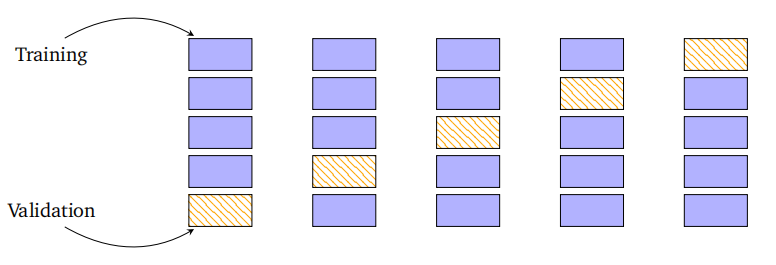

**图8.4k倍交叉验证。数据集被分为K = 5个块，其中K−1作为训练集（蓝色），一个作为验证集（橙色孵化）。**

我们将数据集分为两个不重叠的集合$\mathcal{D}=\mathcal{R}\cup\mathcal{V}$（$\mathcal{R}\cap\mathcal{V}=\emptyset$），其中$\mathcal{V}$是验证集，我们在$\mathcal{R}$上训练模型。训练后，我们在验证集$\mathcal{V}$上评估预测器$f$的性能（例如，通过计算验证集上训练模型的均方根误差（RMSE））。更准确地说，对于每个分区$k$，训练数据$\mathcal{R}^{(k)}$产生一个预测器$f^{(k)}$，然后将其应用于验证集$\mathcal{V}^{(k)}$以计算经验风险$R(f^{(k)},\mathcal{V}^{(k)})$。我们遍历验证集和训练集的所有可能分区，并计算预测器的平均泛化误差。交叉验证近似于期望泛化误差

$$\mathbb{E}_{\mathcal{V}}[R(f,\mathcal{V})]\approx\frac{1}{K}\sum_{k=1}^{K}R(f^{(k)},\mathcal{V}^{(k)})$$
(8.13)

其中$R(f^{(k)},\mathcal{V}^{(k)})$是预测器$f^{(k)}$在验证集$\mathcal{V}^{(k)}$上的风险（例如，RMSE）。该近似有两个来源：首先，由于有限的训练集，导致不是最佳的$f^{(k)}$；其次，由于有限的验证集，导致对风险$R(f^{(k)},\mathcal{V}^{(k)})$的估计不准确。K折交叉验证的一个潜在缺点是训练模型$K$次的计算成本很高，如果训练成本在计算上很昂贵，这可能会成为负担。在实践中，仅查看直接参数通常是不够的。例如，我们需要探索多个复杂性参数（例如，多个正则化参数），这些可能不是模型的直接参数。根据这些超参数评估模型的质量，可能会导致训练次数与模型参数数量成指数关系。可以使用嵌套交叉验证（第8.6.1节）来搜索良好的超参数。

然而，交叉验证是一个令人尴尬的并行问题，即将问题分离为多个并行任务所需的努力很少。在拥有足够的计算资源（例如，云计算、服务器集群）的情况下，交叉验证所需的时间不会比单次性能评估更长。在本节中，我们了解到经验风险最小化基于以下概念：函数假设类、损失函数和正则化。在第8.3节中，我们将看到使用概率分布来替代损失函数和正则化想法的效果。

### 8.2.5 进阶阅读

由于经验风险最小化（Vapnik, 1998）的原始发展采用了大量理论性语言，随后的许多发展也多为理论性。这一研究领域被称为统计学习理论（Vapnik, 1999; Evgeniou et al., 2000; Hastie et al., 2001; von Luxburg and Schölkopf, 2011）。一本基于理论基础并开发了高效学习算法的最新机器学习教科书是Shalev-Shwartz和Ben-David（2014）所著。

正则化概念起源于不适定逆问题的求解（Neumaier, 1998）。本文介绍的方法称为Tikhonov正则化，并且有一个与之密切相关的约束版本，称为Ivanov正则化。Tikhonov正则化与偏差-方差权衡和特征选择（Bühlmann and Van De Geer, 2011）有着深厚的联系。交叉验证的替代方法是自助法和刀切法（Efron and Tibshirani, 1993; Davidson and Hinkley, 1997; Hall, 1992）。

将经验风险最小化（第8.2节）视为“无概率”是不正确的。存在一个潜在的未知概率分布$p(\boldsymbol x,y)$，它控制着数据的生成。然而，经验风险最小化的方法对该分布的选择是不可知的。这与明确要求知道$p(\boldsymbol{x},y)$的标准统计方法形成对比。此外，由于分布是样本$x$和标签$y$的联合分布，标签可能是非确定性的。与标准统计不同，我们不需要为标签$y$指定噪声分布。

## 8.3 参数估计

在第8.2节中，我们没有使用概率分布来明确建模我们的问题。在本节中，我们将看到如何使用概率分布来建模由于观测过程引起的不确定性以及我们预测器参数中的不确定性。在第8.3.1节中，我们将介绍似然函数，它与经验风险最小化中的损失函数概念（第8.2.2节）类似。先验（第8.3.2节）的概念则与正则化（第8.2.3节）的概念类似。

### 8.3.1 最大似然估计

最大似然估计（MLE）背后的思想是定义一个参数函数，使我们能够找到一个很好地拟合数据的模型。估计问题集中在似然函数上，或者更精确地说，是其负对数。对于由随机变量$x$表示的数据和由参数$\theta$参数化的一组概率密度$p(x\mid\boldsymbol{\theta})$，负对数似然由下式给出：

(8.14)
$$\mathcal{L}_{\boldsymbol{x}}(\boldsymbol{\theta})=-\log p(\boldsymbol{x}\mid\boldsymbol{\theta})\:.$$
符号$\mathcal{L}_x(\boldsymbol{\theta})$强调了参数$\theta$在变化，而数据$x$是固定的。在书写负对数似然时，我们通常会省略对$x$的引用，因为它实际上是$\theta$的函数，并在随机变量表示数据中的不确定性从上下文中清楚时，将其写为$\mathcal{L}(\boldsymbol{\theta})$。

让我们解释对于固定的$\dot{\theta}$值，概率密度$p(x\mid\boldsymbol{\theta})$在建模什么。它是一个分布，用于建模给定参数设置下数据的不确定性。对于给定的数据集$x$，似然函数允许我们表达对不同参数设置$\theta$的偏好，并可以选择更“可能”生成数据的设置。

从另一个互补的角度来看，如果我们认为数据是固定的（因为它已经被观测到），并且我们改变参数$\theta$，那么$\mathcal{L}(\boldsymbol{\theta})$告诉我们什么？它告诉我们对于观测值$x$，$\theta$的特定设置有多大的可能性。基于这一观点，最大似然估计器为我们提供了数据集中最可能的参数$\theta$。

我们考虑监督学习设置，其中我们获得成对的$(\boldsymbol{x}_1,y_1),\ldots,(\boldsymbol{x}_N,y_N)$，其中$\boldsymbol x_n\in\mathbb{R}^D$且标签$y_n\in\mathbb{R}$。我们感兴趣的是构建一个预测器，它以特征向量$x_n$作为输入，并产生预测$y_n$（或接近它的值），即，给定向量$x_n$，我们想要标签$y_n$的概率分布。换句话说，我们为特定参数设置$\theta$下的示例指定了标签的条件概率分布。

> **示例 8.4**
>
> 经常使用的第一个示例是指定给定示例的标签的条件概率为高斯分布。换句话说，我们假设可以通过均值为零的独立高斯噪声（参考第6.5节）来解释我们的观测不确定性，即$\varepsilon_{n}\sim\mathcal{N}(0,\sigma^{2})$。我们进一步假设使用线性模型$x_n^\top\theta$进行预测。这意味着我们为每个示例-标签对$(x_n,y_n)$指定了一个高斯似然函数，
> $$p(y_n\mid\boldsymbol{x}_n,\boldsymbol{\theta})=\mathcal{N}\big(y_n\mid\boldsymbol{x}_n^\top\boldsymbol{\theta},\:\sigma^2\big)\:.$$
> (8.15)
>
> 图8.3展示了给定参数$\theta$的高斯似然的一个图示。我们将在第9.2节中看到如何根据高斯分布明确展开上述表达式。

我们假设示例集$(x_1,y_1),\ldots,(x_N,y_N)$是独立同分布的（i.i.d.）。“独立”（第6.4.5节）一词意味着涉及整个数据集（$\mathcal{Y}=\{y_1,\ldots,y_N\}$和$\mathcal{X}=\{x_1,\ldots,x_N\}$）的似然函数可以分解为每个单独示例似然函数的乘积

(8.16)
$$p(\mathcal{Y}\mid\mathcal{X},\boldsymbol{\theta})=\prod_{n=1}^{N}p(y_{n}\mid\boldsymbol{x}_{n},\boldsymbol{\theta})\:,$$
其中$p(y_n\mid\boldsymbol{x}_n,\boldsymbol{\theta})$是特定的分布（在示例8.4中是高斯分布）。表达式“同分布”意味着乘积（8.16）中的每个项都遵循相同的分布，并且它们共享相同的参数。从优化的角度来看，计算可以分解为更简单函数之和的函数通常更容易。因此，在机器学习中，我们经常考虑负对数似然

(8.17)
$$\mathcal{L}(\boldsymbol{\theta})=-\log p(\mathcal{Y}\mid\mathcal{X},\boldsymbol{\theta})=-\sum_{n=1}^{N}\log p(y_{n}\mid\boldsymbol{x}_{n},\boldsymbol{\theta})\:.$$
尽管在$p(y_n|x_n,\boldsymbol{\theta})$（8.15）中，$\theta$位于条件符号的右侧，因此可能被误解为是已观测且固定的，但这种解释是不正确的。负对数似然$\mathcal{L}(\boldsymbol{\theta})$是$\theta$的函数。因此，为了找到一个能够很好地解释数据$(x_1,y_1),\ldots,(x_N,y_N)$的良好参数向量$\theta$，我们需要对$\theta$最小化负对数似然$\mathcal{L}(\boldsymbol{\theta})$。

备注。(8.17)中的负号是一个历史遗留问题，源于我们想要最大化似然函数的惯例，但数值优化文献倾向于研究函数的最小化。

> **示例 8.5**
>
> 继续我们在高斯似然（8.15）的示例，负对数似然可以重写为
>
> (8.18a)
>
> (8.18b)
> $$\begin{aligned}\mathcal{L}(\boldsymbol{\theta})&=-\sum_{n=1}^N\log p(y_n\mid\boldsymbol{x}_n,\boldsymbol{\theta})=-\sum_{n=1}^N\log\mathcal{N}(y_n\mid\boldsymbol{x}_n^\top\boldsymbol{\theta},\:\sigma^2)\\&=-\sum_{n=1}^N\log\frac1{\sqrt{2\pi\sigma^2}}\exp\left(-\frac{(y_n-\boldsymbol{x}_n^\top\boldsymbol{\theta})^2}{2\sigma^2}\right)\\&=-\sum_{n=1}^N\log\exp\left(-\frac{(y_n-\boldsymbol{x}_n^\top\boldsymbol{\theta})^2}{2\sigma^2}\right)-\sum_{n=1}^N\log\frac1{\sqrt{2\pi\sigma^2}}\\&=\frac1{2\sigma^2}\sum_{n=1}^N(y_n-\boldsymbol{x}_n^\top\boldsymbol{\theta})^2-\sum_{n=1}^N\log\frac1{\sqrt{2\pi\sigma^2}}\:.\end{aligned}$$
> (8.18c)
>
> (8.18d)
>
> 由于$\sigma$是给定的，所以(8.18d)中的第二项是常数，最小化$\mathcal{L}(\boldsymbol{\theta})$等价于解决第一项表示的最小二乘问题（与(8.8)比较）。

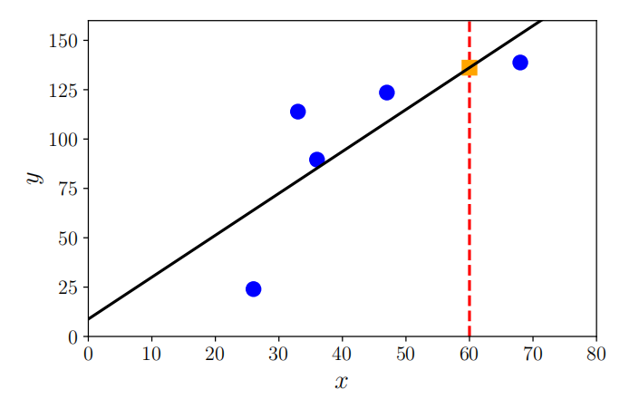

**图8.5对于给定的数据，参数的最大似然估计结果为黑色对角线。橙色方方形表示x = 60处的最大似然预测值。**

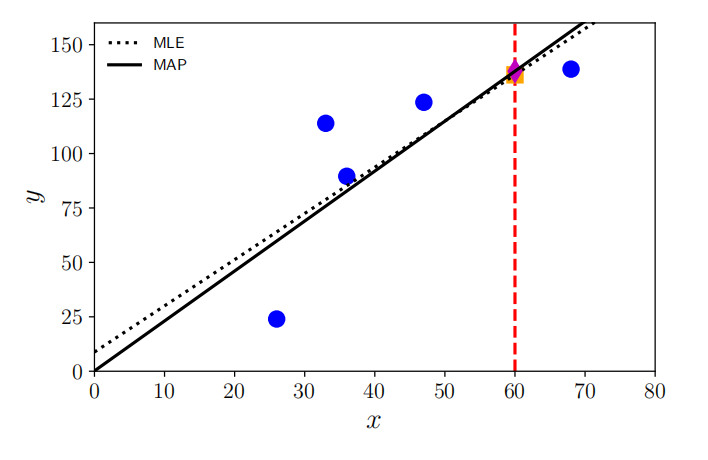

**图8.6在x = 60时与最大似然估计和MAP估计进行比较。先验使斜率较陡，截距接近于零。在这个例子中，将截距移近于零的偏差实际上增加了斜率。**

事实证明，对于高斯似然函数，与最大似然估计相对应的优化问题有一个闭式解。我们将在第9章中看到更多细节。图8.5展示了一个回归数据集和由最大似然参数引起的函数。与未正则化的经验风险最小化（第8.2.3节）类似，最大似然估计可能会受到过拟合的影响（第8.3.3节）。对于其他似然函数，即如果我们用非高斯分布对噪声进行建模，则最大似然估计可能没有闭式解析解。在这种情况下，我们求助于第7章中讨论的数值优化方法。

### **8.3.2 最大后验估计**

如果我们有关于参数$\theta$分布的先验知识，我们可以在似然函数上乘以一个额外的项。这个额外的项是参数$\theta$的先验概率分布$p(\boldsymbol{\theta})$。给定一个先验分布，在观察到一些数据$x$之后，我们应该如何更新$\theta$的分布？换句话说，在观察到数据$x$之后，我们应该如何表示对$\theta$的更具体的知识？如第6.3节所述，贝叶斯定理为我们提供了一个有原则的工具来更新随机变量的概率分布。它允许我们从一般的先验陈述（先验分布）$p(\boldsymbol{\theta})$和函数$p(\boldsymbol{x}\mid\boldsymbol{\theta})$（该函数将参数$\theta$和观测数据$x$联系起来，称为似然函数）中计算出参数$\theta$的后验分布$p(\boldsymbol{\theta}\mid\boldsymbol{x})$（更具体的知识）：

(8.19)
$$p(\boldsymbol{\theta}\mid\boldsymbol{x})=\frac{p(\boldsymbol{x}\mid\boldsymbol{\theta})p(\boldsymbol{\theta})}{p(\boldsymbol{x})}\:.$$

请注意，我们感兴趣的是找到使后验概率最大化的参数$\theta$。由于分布$p(x)$不依赖于$\theta$，我们可以在优化过程中忽略分母的值，从而得到

(8.20)
$$p(\boldsymbol{\theta}\mid\boldsymbol{x})\propto p(\boldsymbol{x}\mid\boldsymbol{\theta})p(\boldsymbol{\theta})\:.$$

前面的比例关系隐藏了数据密度$p(x)$，这可能很难估计。因此，我们不是估计负对数似然的最小值，而是估计负对数后验的最小值，这被称为最大后验估计（MAP估计）。图8.6展示了添加一个均值为零的高斯先验的效果示例。

> **示例 8.6**
>
> 除了前一个示例中关于高斯似然的假设外，我们还假设参数向量服从均值为零的多元高斯分布，即$p(\boldsymbol{\theta})=\mathcal{N}(\mathbf{0},\boldsymbol{\Sigma})$，其中$\boldsymbol{\Sigma}$是协方差矩阵（第6.5节）。请注意，高斯分布的共轭先验也是高斯分布（第6.6.1节），因此我们期望后验分布也是高斯分布。我们将在第9章中看到最大后验估计的详细内容。

在机器学习中，将关于良好参数位置的先验知识纳入考虑是一个普遍存在的想法。我们在第8.2.3节中看到的另一种观点是正则化的思想，它引入了一个额外的项，使得到的参数偏向于接近原点。最大后验估计可以被认为是连接非概率世界和概率世界的桥梁，因为它明确承认了先验分布的需求，但它仍然只产生参数的点估计。

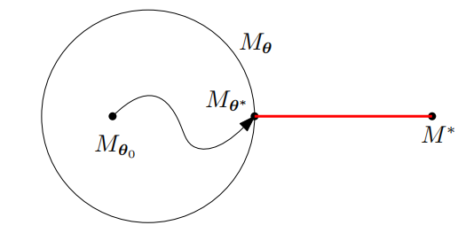

**图8.7模型拟合。在参数化的模型Mθ类中，我们优化模型参数θ，以最小化到真（未知）模型M∗的距离。**

**备注**。最大似然估计$\theta_\mathrm{ML}$具有以下性质（Lehmann和Casella，1998；Efron和Hastie，2016）：

- 渐近一致性：在无限多观测值的极限下，最大似然估计会收敛到真实值，加上一个近似正态的随机误差。

- 实现这些性质所需的样本量可能相当大。
- 误差的方差以$1/N$的速度衰减，其中$N$是数据点的数量。
- 特别是在“小”数据范围内，最大似然估计可能导致过拟合。

最大似然估计（和最大后验估计）的原则是使用概率建模来推断数据和模型参数中的不确定性。然而，我们尚未将概率建模发挥到极致。在本节中，所得的训练过程仍然产生预测器的点估计，即训练返回一组表示最佳预测器的参数值。在第8.4节中，我们将采取这样的观点，即参数值也应该被视为随机变量，并且在做出预测时，我们将使用完整的参数分布，而不是估计该分布中的“最佳”值。

### 8.3.3 模型拟合

考虑这样一个场景，我们被给定一个数据集，并希望将数据拟合到一个参数化模型中。当我们谈论“拟合”时，我们通常指的是优化/学习模型参数，以便它们能够最小化某个损失函数，例如负对数似然。在最大似然估计（第8.3.1节）和最大后验估计（第8.3.2节）中，我们已经讨论了两种常用的模型拟合算法。

模型的参数化定义了一个我们可以操作的模型类$M_{\theta}$。例如，在线性回归设置中，我们可能将输入$x$和（无噪声）观测值$y$之间的关系定义为$y=ax+b$，其中$\boldsymbol{\theta}:=\{a,b\}$是模型参数。在这种情况下，模型参数$\theta$描述了仿射函数族，即斜率为$a$、截距为$b$的直线。假设数据来自一个我们未知的模型$M^*$。对于给定的训练数据集，我们优化$\theta$，使得$M_{\theta}$尽可能接近$M^*$，其中“接近”程度由我们优化的目标函数（例如训练数据上的平方损失）定义。图8.7展示了一个场景，其中我们有一个较小的模型类（由圆$M_{\theta}$表示），而数据生成模型$M^*$位于我们考虑的模型集之外。我们从$M_{\theta_0}$开始参数搜索。优化后，即当我们获得最佳参数$\theta^*$时，我们区分以下三种不同情况：（i）过拟合，（ii）欠拟合，和（iii）拟合良好。我们将从高层次上直观理解这三个概念的含义。

粗略地说，过拟合指的是参数化模型类过于丰富，以至于能够建模由$M^*$生成的数据集以外的更多复杂数据集。例如，如果数据集是由一个线性函数生成的，但我们定义$M_{\theta}$为七阶多项式的类，那么我们不仅可以建模线性函数，还可以建模二度、三度等多项式。过拟合的模型通常具有大量参数。我们经常观察到的一个现象是，过于灵活的模型类$M_{\theta}$会使用其全部建模能力来减少训练误差。如果训练数据包含噪声，那么在远离训练数据的地方进行预测时，我们可能会捕捉到一些有用的信号，但也会捕捉到噪声。图8.8(a)给出了一个回归中的过拟合示例，其中模型参数是通过最大似然估计（见第8.3.1节）学习的。

我们将在第9.2.2节中更详细地讨论回归中的过拟合问题。

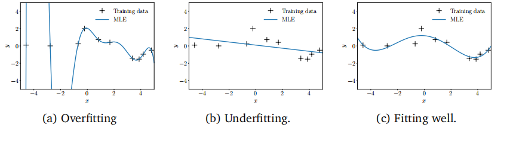

**图8.8对不同模型类的拟合（通过最大似然值）到一个回归数据集。**

当我们遇到欠拟合时，我们遇到了相反的问题，即模型类$M_{\theta}$不够丰富。例如，如果我们的数据集是由正弦函数生成的，但$\theta$只参数化直线，那么即使是最优的优化过程也无法使我们接近真实模型。然而，我们仍然会优化参数并找到建模数据集的最佳直线。图8.8(b)展示了一个因灵活性不足而欠拟合的模型示例。欠拟合的模型通常参数较少。

第三种情况是参数化模型类恰到好处。那么，我们的模型就拟合得很好，即既不过拟合也不欠拟合。这意味着我们的模型类刚好足够丰富，可以描述给定的数据集。图8.8(c)展示了一个相当好地拟合给定数据集的模型。理想情况下，这是我们希望使用的模型类，因为它具有良好的泛化性能。

在实践中，我们经常定义非常丰富的模型类$M_{\theta}$，其中包含许多参数，如深度神经网络。为了减轻过拟合问题，我们可以使用正则化（第8.2.3节）或先验（第8.3.2节）。我们将在第8.6节中讨论如何选择模型类。

### 8.3.4 进阶阅读

在考虑概率模型时，最大似然估计原理推广了线性模型的最小二乘回归思想，我们将在第9章中详细讨论这一点。当将预测器限制为具有线性形式，并对输出应用额外的非线性函数$\varphi$时，即，

(8.21)
$$p(y_n|\boldsymbol{x}_n,\boldsymbol{\theta})=\varphi(\boldsymbol{\theta}^\top\boldsymbol{x}_n)\:,$$
我们可以考虑用于其他预测任务的其他模型，如二元分类或计数数据建模（McCullagh 和 Nelder, 1989）。另一种观点是考虑来自指数族（第6.6节）的似然函数。这类模型在参数和数据之间具有线性依赖关系，并可能具有非线性变换$\varphi$（称为链接函数），被称为广义线性模型（Agresti, 2002, 第4章）。

最大似然估计具有悠久的历史，最初由罗纳德·费希尔爵士（Sir Ronald Fisher）在20世纪30年代提出。我们将在第8.4节中进一步阐述概率模型的思想。在使用概率模型的研究者中，一个争论点是贝叶斯统计和频率统计之间的讨论。如第6.1.1节所述，这归根结底是概率的定义问题。回想第6.1节，我们可以将概率视为逻辑推理（通过允许不确定性）的推广（Cheeseman, 1985; Jaynes, 2003）。最大似然估计方法在本质上是频率的，有兴趣的读者可以参阅Efron和Hastie（2016）以获得对贝叶斯和频率统计的均衡观点。

有些概率模型中，可能无法使用最大似然估计。读者可以参阅更高级的统计教材，如Casella和Berger（2002），了解其他方法，如矩估计法、$M$-估计法和估计方程法。

## 8.4 概率建模与推断

在机器学习中，我们经常关注数据的解释和分析，例如对未来事件的预测和决策制定。为了使这项任务更易于处理，我们通常会构建模型来描述生成观测数据的生成过程。

例如，我们可以用两个步骤来描述抛硬币实验的结果（正面或反面）。首先，我们定义一个参数$\mu$，它作为伯努利分布（第6章）的参数，描述了出现“正面”的概率；其次，我们可以从伯努利分布$p(x\mid\mu)=\text{Ber}(\mu)$中抽取一个结果$x\in\{\text{head}, \text{tail}\}$。参数$\mu$产生了特定的数据集$\chi$，并且取决于所使用的硬币。由于$\mu$是未知的，且永远无法直接观测到，因此我们需要机制来根据抛硬币实验的观察结果来学习关于$\mu$的信息。接下来，我们将讨论如何使用概率建模来实现这一目的。

### 8.4.1 概率模型

概率模型通过指定的概率分布来表示实验中的不确定性方面。使用概率模型的好处在于，它们通过概率论提供了一套统一且一致的工具集，这些工具集包括随机变量（第6章），用于建模、推断、预测和模型选择。

在概率建模中，观测变量$x$和隐藏参数$\theta$的联合分布$p(\boldsymbol x,\boldsymbol{\theta})$至关重要：它包含了以下信息：

- 先验和似然（乘积规则，第6.3节）。
- 边缘似然$p(x)$，在模型选择（第8.6节）中扮演重要角色，可以通过联合分布并积分掉参数来计算（求和规则，第6.3节）。
- 后验分布，可以通过将联合分布除以边缘似然来获得。

只有联合分布具有这样的性质。因此，概率模型是由其所有随机变量的联合分布来指定的。

### 8.4.2 贝叶斯推断

机器学习中的一个关键任务是利用模型和数据来估计模型隐藏变量$\theta$的值，这些值是根据观测变量$x$来推断的。在第8.3.1节中，我们已经讨论了使用最大似然估计或最大后验估计来估计模型参数$\theta$的两种方法。在这两种情况下，我们都获得了$\theta$的一个最佳单一值，因此参数估计的关键算法问题是解决一个优化问题。一旦这些点估计$\theta^*$已知，我们就使用它们来进行预测。更具体地说，预测分布将是$p(\boldsymbol{x}\mid\boldsymbol{\theta}^*)$，其中我们在似然函数中使用$\theta^*$。

正如第6.3节所讨论的，仅关注后验分布的某些统计量（如使后验最大化的参数$\theta^*$）会导致信息丢失，这在使用预测$p(\boldsymbol x\mid\boldsymbol\theta^*)$来做决策的系统中可能是至关重要的。这些决策系统通常具有与似然函数不同的目标函数，因此围绕参数的后验分布可以非常有用，并导致更稳健的决策。贝叶斯推断就是寻找这个后验分布（Gelman等，2004）。对于数据集$\mathcal{X}$、参数先验$p(\boldsymbol{\theta})$和似然函数，后验分布
$$p(\boldsymbol{\theta}\mid\mathcal{X})=\frac{p(\mathcal{X}\mid\boldsymbol{\theta})p(\boldsymbol{\theta})}{p(\mathcal{X})}\:,\quad p(\mathcal{X})=\int p(\mathcal{X}\mid\boldsymbol{\theta})p(\boldsymbol{\theta})\mathrm{d}\boldsymbol{\theta}\:,$$
(8.22)

是通过应用贝叶斯定理获得的。关键思想是利用贝叶斯定理来反转参数$\theta$和数据$\mathcal{X}$之间的关系（由似然函数给出），以获得后验分布$p(\boldsymbol{\theta}\mid\mathcal{X})$。

参数后验分布的含义在于，它可以用来将参数的不确定性传播到数据上。更具体地说，如果我们有参数上的分布$p(\boldsymbol{\theta})$，那么我们的预测将是
$$p(\boldsymbol{x})=\int p(\boldsymbol{x}\mid\boldsymbol{\theta})p(\boldsymbol{\theta})\mathrm{d}\boldsymbol{\theta}=\mathbb{E}_{\boldsymbol{\theta}}[p(\boldsymbol{x}\mid\boldsymbol{\theta})]\:,$$
(8.23)

并且这些预测不再依赖于模型参数$\theta$，因为$\theta$已经被边缘化/积分掉了。方程(8.23)表明，预测是所有合理参数值$\theta$上的平均值，其中合理性由参数分布$p(\boldsymbol{\theta})$封装。

在8.3节中讨论了参数估计，并在此处讨论了贝叶斯推断，让我们比较这两种学习方法。通过最大似然估计或最大后验估计（MAP）进行的参数估计会产生参数的一致点估计$\theta^*$，需要解决的关键计算问题是优化。相比之下，贝叶斯推断产生了一个（后验）分布，需要解决的关键计算问题是积分。使用点估计进行预测是直接的，而在贝叶斯框架下进行预测则需要解决另一个积分问题；参见(8.23)。然而，贝叶斯推断为我们提供了一种有原则的方法来整合先验知识、考虑辅助信息，并融入结构知识，这在参数估计的背景下并不容易实现。此外，在数据高效学习的背景下，将参数不确定性传播到预测中对于决策系统中的风险评估和探索非常有价值（Deisenroth等，2015；Kamthe和Deisenroth，2018）。

虽然贝叶斯推断是一个在数学上有原则的参数学习和预测框架，但由于我们需要解决的积分问题，它也存在一些实际挑战；参见(8.22)和(8.23)。更具体地说，如果我们没有为参数选择共轭先验（第6.6.1节），则(8.22)和(8.23)中的积分在解析上不可处理，我们无法以封闭形式计算后验、预测或边缘似然。在这些情况下，我们需要诉诸于近似方法。在这里，我们可以使用随机近似，如马尔可夫链蒙特卡洛（MCMC）（Gilks等，1996），或使用确定性近似，如拉普拉斯近似（Bishop，2006；Barber，2012；Murphy，2012）、变分推断（Jordan等，1999；Blei等，2017）或期望传播（Minka，2001a）。

尽管存在这些挑战，但贝叶斯推断已成功应用于各种问题，包括大规模主题建模（Hoffman等，2013）、点击率预测（Graepel等，2010）、控制系统中的数据高效强化学习（Deisenroth等，2015）、在线排名系统（Herbrich等，2007）和大规模推荐系统。还有一些通用工具，如贝叶斯优化（Brochu等，2009；Snoek等，2012；Shahriari等，2016），它们是高效搜索模型或算法元参数时非常有用的组成部分。

备注。在机器学习文献中，“变量”和“参数”之间可能存在一些任意的区分。虽然参数是通过估计得到的（例如，通过最大似然估计），但变量通常会被边缘化。在这本书中，我们对这种区分并不那么严格，因为原则上，我们可以对任何参数设置先验并将其积分出来，这将根据上述区分将该参数转变为随机变量。

### 8.4.3 隐变量模型

在实际应用中，除了模型参数$\theta$外，将额外的隐变量$z$（隐变量）作为模型的一部分是有用的（Moustaki等，2015）。这些隐变量与模型参数$\theta$不同，因为它们不直接对模型进行参数化。隐变量可能描述数据生成过程，从而有助于模型的可解释性。它们还经常简化模型结构，使我们能够定义更简单且更丰富的模型结构。模型结构的简化通常伴随着模型参数数量的减少（Paquet，2008；Murphy，2012）。隐变量模型中的学习（至少通过最大似然估计）可以通过期望最大化（EM）算法（Dempster等，1977；Bishop，2006）以有原则的方式进行。在这些隐变量有助于的场景中，例子包括用于降维的主成分分析（第10章）、用于密度估计的高斯混合模型（第11章）、用于时间序列建模的隐马尔可夫模型（Maybeck，1979）或动态系统（Ghahramani和Roweis，1999；Ljung，1999），以及元学习和任务泛化（Hausman等，2018；Sæmundsson等，2018）。虽然引入这些隐变量可能会使模型结构和生成过程变得更简单，但隐变量模型中的学习通常很难，我们将在第11章中看到这一点。由于隐变量模型还允许我们定义从参数生成数据的过程，让我们来看一下这个生成过程。用$x$表示数据，$\theta$表示模型参数，$z$表示隐变量，我们得到条件分布

(8.24)
$$p(x\mid z,\theta)$$
该分布允许我们为任何模型参数和隐变量生成数据。由于$z$是隐变量，我们对它们放置了一个先验$p(\boldsymbol{z})$。与我们之前讨论的模型一样，具有隐变量的模型可以在我们在8.3节和8.4.2节中讨论的框架内用于参数学习和推断。为了促进学习（例如，通过最大似然估计或贝叶斯推断），我们遵循一个两步过程。首先，我们计算模型的似然$p(\boldsymbol x\mid\boldsymbol{\theta})$，它不依赖于隐变量。其次，我们使用此似然进行参数估计或贝叶斯推断，其中我们分别使用与8.3节和8.4.2节中完全相同的表达式。

由于似然函数$p(x\mid\boldsymbol{\theta})$是在给定模型参数下数据的预测分布，我们需要对隐变量进行边缘化，以便
$$p(\boldsymbol{x}\mid\boldsymbol{\theta})=\int p(\boldsymbol{x}\mid\boldsymbol{z},\boldsymbol{\theta})p(\boldsymbol{z})\mathrm{d}\boldsymbol{z}\:,$$
(8.25)

$\begin{array}{l}\text{其中~}p(x\mid\boldsymbol{z},\boldsymbol{\theta})\text{在(8.24)中给出，且}p(\boldsymbol{z})\text{是隐变量的先验。请注意，似然不应依赖于隐变量}\\\mathrm{v}z\text{，而只是数据}x\text{和模型参数}\theta\text{的函数。}\end{array}$

(8.25)中的似然直接允许通过最大似然估计进行参数估计。如8.3.2节所述，对模型参数$\theta$附加一个先验，MAP估计也是直接的。此外，使用(8.25)中的似然，隐变量模型中的贝叶斯推断（8.4.2节）以通常的方式进行：我们对模型参数放置一个先验$p(\boldsymbol{\theta})$，并使用贝叶斯定理获得后验分布

(8.26)
$$p(\boldsymbol\theta\mid\mathcal X)=\frac{p(\mathcal X\mid\boldsymbol\theta)p(\boldsymbol\theta)}{p(\mathcal X)}$$
给定数据集$X$，该后验分布用于模型参数的推断。在贝叶斯推断框架内，(8.26)中的后验可用于进行预测；参见(8.23)。在这个隐变量模型中，我们面临的一个挑战是，似然$p(\mathcal{X}\mid\boldsymbol{\theta})$需要根据(8.25)对隐变量进行边缘化。除非我们选择$p(\boldsymbol{x}\mid\boldsymbol{z},\boldsymbol{\theta})$的共轭先验$p(\boldsymbol{z})$，否则(8.25)中的边缘化在解析上不可处理，我们需要求助于近似方法（Bishop，2006；Paquet，2008；Murphy，2012；Moust

类似于参数后验（8.26），我们可以根据以下公式计算隐变量的后验：
$$p(\boldsymbol{z}\mid\mathcal{X})=\frac{p(\mathcal{X}\mid\boldsymbol{z})p(\boldsymbol{z})}{p(\mathcal{X})}\:,\quad p(\mathcal{X}\mid\boldsymbol{z})=\int p(\mathcal{X}\mid\boldsymbol{z},\boldsymbol{\theta})p(\boldsymbol{\theta})\mathrm{d}\boldsymbol{\theta}\:,$$
其中，$p(\boldsymbol{z})$ 是隐变量的先验，而 $p(\mathcal{X}\mid\boldsymbol{z})$ 需要我们对模型参数 $\theta$ 进行积分。
鉴于解析求解积分的困难性，显然，在一般情况下，同时边缘化隐变量和模型参数是不可能的（Bishop, 2006; Murphy, 2012）。一个更容易计算的量是给定模型参数条件下的隐变量后验分布，即：
$$p(\boldsymbol z\mid\mathcal X,\boldsymbol\theta)=\frac{p(\mathcal X\mid\boldsymbol z,\boldsymbol\theta)p(\boldsymbol z)}{p(\mathcal X\mid\boldsymbol\theta)}\:,$$
(8.28)
其中，$p(\boldsymbol{z})$ 是隐变量的先验，而 $p(\mathcal{X}\mid\boldsymbol{z},\boldsymbol{\theta})$ 在（8.24）中给出。
在第10章和第11章中，我们分别推导了PCA和高斯混合模型的似然函数。此外，我们还计算了PCA和高斯混合模型中隐变量的后验分布（8.28）。
备注。在后续章节中，我们可能不会在隐变量 $z$ 和不确定的模型参数 $\theta$ 之间做出如此清晰的区分，并且也会将模型参数称为“隐变量”或“隐藏变量”，因为它们也是不可观测的。在第10章和第11章中，当我们使用隐变量 $z$ 时，我们会注意到这一点，因为我们将有两种不同类型的隐藏变量：模型参数 $\theta$ 和隐变量 $z$。$\Diamond$
我们可以利用概率模型中所有元素都是随机变量的这一事实，来定义一种统一的表示语言。在第8.5节中，我们将看到一种简洁的图形语言，用于表示概率模型的结构。我们将使用这种图形语言来描述后续章节中的概率模型。

### 8.4.4 进一步阅读

机器学习中的概率模型（Bishop, 2006; Barber, 2012; Murphy, 2012）为用户提供了一种以原则性方式捕获数据和预测模型不确定性的方法。Ghahramani（2015）对机器学习中的概率模型进行了简短的回顾。给定一个概率模型，我们或许足够幸运，能够用分析方法来计算感兴趣的参数。然而，一般来说，分析解是罕见的，因此通常使用计算方法，如采样（Gilks et al., 1996; Brooks et al., 2011）和变分推断（Jordan et al., 1999; Blei et al., 2017）。Moustaki et al.（2015）和Paquet（2008）为潜在变量模型中的贝叶斯推断提供了很好的概述。

近年来，提出了几种编程语言，旨在将软件中定义的变量视为与概率分布相对应的随机变量。其目标是能够编写概率分布的复杂函数，同时在底层由编译器自动处理贝叶斯推断的规则。这个快速发展的领域被称为概率编程。

## 8.5 有向图模型

在本节中，我们介绍了一种用于指定概率模型的图形语言，称为有向图模型。它提供了一种紧凑且简洁的方式来指定概率模型，并允许读者直观地解析随机变量之间的依赖关系。图形模型以可视化的方式捕捉了所有随机变量的联合分布如何被分解为仅依赖于这些变量子集的因子乘积。在第8.4节中，我们将概率模型的联合分布确定为关键关注量，因为它包含了关于先验、似然和后验的信息。然而，联合分布本身可能相当复杂，并且它没有告诉我们关于概率模型结构特性的任何信息。例如，联合分布$p(a,b,c)$并没有告诉我们关于独立关系的信息。这正是图形模型发挥作用的地方。本节依赖于第6.4.5节中描述的独立性和条件独立性的概念。

在图形模型中，节点是随机变量。在图8.9(a)中，节点代表随机变量$a,b,c$。边代表变量之间的概率关系，例如条件概率。

备注：并非每个分布都可以用特定类型的图形模型来表示。关于此点的讨论可以在Bishop（2006）中找到。

概率图形模型具有一些方便的特性：

- 它们是可视化概率模型结构的一种简单方式。

- 它们可用于设计或激励新型统计模型。

- 仅通过检查图形，我们就可以洞察其属性，例如条件独立性。

- 统计模型中推断和学习的复杂计算可以表达为图形操作。

### 8.5.1 图形语义

有向图模型/贝叶斯网络是一种在概率模型中表示条件依赖性的方法。它们提供了条件概率的可视化描述，因此，提供了一种描述复杂性的简单语言，同时也带来了计算上的简化。假设之间（即两个节点或随机变量之间）的有向链接（箭头）表示条件概率。例如，在图8.9(a)中，$a$和$b$之间的箭头给出了在给定$a$的条件下$b$的条件概率$p(b\mid a)$。

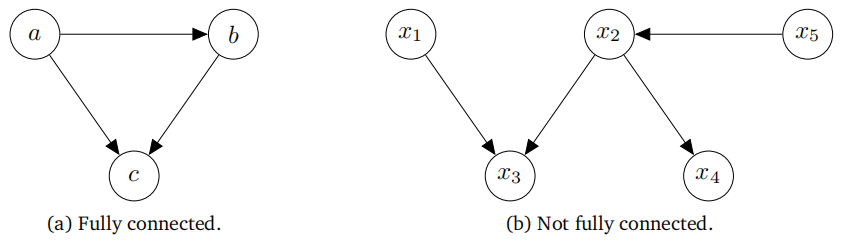

**图8.9有向图形化模型的示例。**

如果我们知道联合分布的因式分解情况，那么就可以从联合分布推导出有向图模型。

> **示例 8.7**
>
> 考虑三个随机变量$a,b,c$的联合分布
>
> (8.29)
> $$p(a,b,c)=p(c\mid a,b)p(b\mid a)p(a)$$
>
> 联合分布在(8.29)中的因式分解告诉我们随机变量之间的关系：
>
> $\bullet$ $c$直接依赖于$a$和$b$。
>
> $\bullet$ $b$直接依赖于$a$。
>
> $\bullet$ $a$既不依赖于$b$也不依赖于$c$。
>
> 根据(8.29)中的因式分解，我们得到了图8.9(a)中的有向图模型。

一般来说，我们可以从联合分布的因式分解中构造出相应的有向图模型，具体步骤如下：

1. 为所有随机变量创建一个节点。
2. 对于每个条件分布，我们在图中从该分布所依赖的变量对应的节点出发，添加一个有向链接（箭头）。

图的布局取决于联合分布的因式分解的选择。

我们讨论了如何从已知的联合分布因式分解得到相应的有向图模型。现在，我们将做完全相反的事情，并描述如何从给定的图形模型中提取一组随机变量的联合分布。

> **示例 8.8**
>
> 观察图8.9(b)中的图形模型，我们利用了两个属性：
>
> $\bullet$ 我们所寻求的联合分布$p(x_1,\ldots,x_5)$是一组条件概率的乘积，图中每个节点对应一个条件概率。在这个特定示例中，我们需要五个条件概率。
>
> $\bullet$ 每个条件概率仅依赖于图中对应节点的父节点。例如，$x_4$将依赖于$x_2$。
>
> 这两个属性给出了联合分布的所需因式分解：
>
> (8.30)
> $$p(x_1,x_2,x_3,x_4,x_5)=p(x_1)p(x_5)p(x_2\mid x_5)p(x_3\mid x_1,x_2)p(x_4\mid x_2)\:.$$

一般来说，联合分布$p(\boldsymbol x)=p(x_1,\ldots,x_K)$可以表示为

(8.31)
$$p(\boldsymbol{x})=\prod_{k=1}^Kp(x_k\mid\mathbf{Pa}_k)\:,$$
其中Pa$_k$表示“$x_k$的父节点”。$x_k$的父节点是指有箭头指向$x_k$的节点。

我们以抛硬币实验的具体示例来结束这一小节。考虑一个伯努利实验（示例6.8），其中该实验的结果$x$为“正面”的概率为

(8.32)
$$p(x\mid\mu)=\mathrm{Ber}(\mu)\:.$$

现在我们重复这个实验$N$次，并观察结果$x_1,\ldots,x_N$，从而得到联合分布

(8.33)
$$p(x_1,\dots,x_N\mid\mu)=\prod_{n=1}^Np(x_n\mid\mu)\:.$$

由于实验是独立的，因此等式右侧是每个单独结果的伯努利分布的乘积。回顾6.4.5节，统计独立性意味着分布可以因式分解。为了为这种情况编写图形模型，我们需要区分未观测/潜在变量和观测变量。在图形上，观测变量用阴影节点表示，因此我们得到图8.10(a)中的图形模型。我们看到，单个参数$\mu$对于所有$x_n,n=1,\ldots,N$都是相同的，因为结果$x_n$是同分布的。对于这种情况，一个更紧凑但等效的图形模型如图8.10(b)所示，其中我们使用了板块符号。板块（框）重复其内部的所有内容（在本例中，重复观测$x_n)N$次。因此，这两个图形模型是等效的，但板块符号更为紧凑。图形模型使我们能够立即在$\mu$上放置一个超先验。超先验是第一层先验参数上的先验分布的第二层超先验。图8.10(c)在潜在变量$\mu$上放置了一个Beta$(\alpha,\beta)$先验。如果我们将$\alpha$和$\beta$视为确定性参数（即不是随机变量），则省略其周围的圆圈。

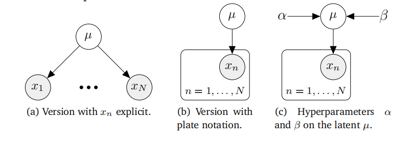

**图8.10重复伯努利实验的图形模型。**

### 8.5.2 条件独立性和d-分离

有向图模型允许我们仅通过查看图形来找到联合分布的条件独立性（第6.4.5节）关系属性。这其中的关键是一个称为d-分离（Pearl, 1988）的概念。

考虑一个一般的有向图，其中$\mathcal{A}$、$\mathcal{B}$、$\mathcal{C}$是节点的不相交集合（它们的并集可能小于图中节点的完整集合）。我们希望确定给定的有向无环图是否隐含了特定的条件独立性陈述，“给定$\mathcal{C}$，$\mathcal{A}$与$\mathcal{B}$条件独立”，表示为

(8.34)
$$\mathcal{A}\perp\mathcal{B}\:|\:\mathcal{C}\:,$$

为此，我们考虑从$\mathcal{A}$中的任何节点到$\mathcal{B}$中任何节点的所有可能的轨迹（忽略箭头方向的路径）。如果这样的路径包含任何节点，使得以下任一条件为真，则该路径被认为是被阻塞的：

- 路径上的箭头在节点处相遇，要么是头对头，要么是尾对尾，并且该节点在集合$\mathcal{C}$中。

- 箭头在节点处头对头相遇，并且该节点及其任何后代都不在集合$C$中（注意这里原文中集合名称应为$\mathcal{C}$，可能是笔误）。

**图8.12三种类型的图形模型： (a)有向图形模型（贝叶斯网络）；(b)无向图形模型（马尔可夫随机场）；(c)因子图。**

如果所有路径都被阻塞，则称$\mathcal{A}$与$\mathcal{B}$被$\mathcal{C}$ d-分离，图中所有变量的联合分布将满足$\mathcal{A}\perp\mathcal{B}\mid\mathcal{C}$。

> **例8.9 条件独立性**
>
> 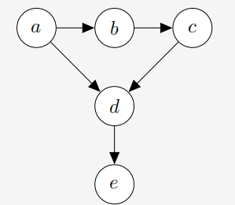
>
> **图8.11D-分离示例。**
>
> 观察图8.11中的图模型。视觉信息告诉我们：
>
> $$\begin{array}{l}b\perp d\mid a,c\\a\perp c\mid b\\b\not\perp d\mid c\\a\not\perp c\mid b,e\end{array}$$

有向图模型允许对概率模型进行紧凑的表示，我们将在第9、10和11章中看到有向图模型的例子。这种表示方式，结合条件独立性的概念，使我们能够将相应的概率模型分解为更容易优化的表达式。

概率模型的图形表示使我们能够直观地看到我们所做的设计选择对模型结构的影响。我们通常需要对模型的结构做出高级假设。这些建模假设（超参数）会影响预测性能，但无法直接使用我们目前所看到的方法来选择。我们将在第8.6节中讨论选择结构的不同方法。

### 8.5.3 进阶阅读

Bishop（2006，第8章）提供了概率图模型的入门介绍，而Koller和Friedman（2009）的书籍则对不同应用及其相应的算法影响进行了详尽描述。概率图模型主要分为以下三种类型：

$\bullet$ 有向图模型（贝叶斯网络）；见图8.12(a)
$\bullet$ 无向图模型（马尔可夫随机场）；见图8.12(b)
$\bullet$ 因子图；见图8.12(c)

图模型允许使用基于图的算法进行推理和马尔可夫随机学习，例如通过局部消息传递。其应用范围广泛，从在线游戏中的秩因子分解（Herbrich等人，2007）和计算机视觉（如图像分割、语义标注、图像去噪、图像恢复（Kittler和Föglein，1984；Sucar和Gillies，1994；Shotton等人，2006；Szeliski等人，2008））到编码理论（McEliece等人，1998）、线性方程组求解（Shental等人，2008）以及信号处理中的迭代贝叶斯状态估计（Bickson等人，2007；Deisenroth和Mohamed，2012）。

本书未讨论但在实际应用中特别重要的一个话题是结构预测（Bakir等人，2007；Nowozin等人，2014）的概念，它允许机器学习模型处理结构化的预测，例如序列、树和图。神经网络模型的流行使得更灵活的概率模型得以应用，从而产生了许多结构模型的有用应用（Goodfellow等人，2016，第16章）。近年来，概率图模型在因果推断领域也重新获得了关注（Pearl，2009；Imbens和Rubin，2015；Peters等人，2017；Rosenbaum，2017）。

## 8.6 模型选择

在机器学习中，我们往往需要做出高层次的建模决策，这些决策对模型的性能有着至关重要的影响。我们所做的选择（例如，似然函数的形式）会影响模型中自由参数的数量和类型，进而也影响模型的灵活性和表达能力。更复杂的模型在某种意义上更加灵活，因为它们能够用来描述更多的数据集。例如，一个1次多项式（即一条直线$y=a_0+a_1x$）只能用来描述输入$x$和观测值$y$之间的线性关系。而通过将$a_2$设为0（即二次项系数为0），我们可以得到一个2次多项式，它除了能描述线性关系外，还能描述输入和观测值之间的二次关系。

现在，人们可能会认为，由于非常灵活的模型更具表达力，因此它们通常比简单的模型更受青睐。但一个普遍的问题是，在训练时，我们只能使用训练集来评估模型的性能并学习其参数。然而，我们真正关心的并不是模型在训练集上的表现。在第8.3节中，我们已经看到，最大似然估计可能会导致过拟合，尤其是在训练数据集较小时。理想情况下，我们的模型（也）应该在测试集上表现良好（而测试集在训练时是不可用的）。因此，我们需要一些机制来评估模型对未见过的测试数据的泛化能力。模型选择正是关注于这一问题。

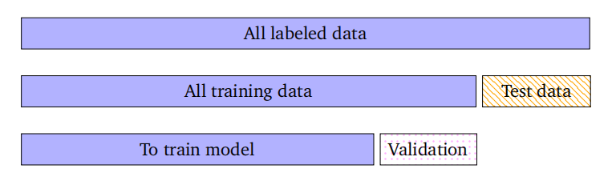

**图8.13：嵌套的交叉验证。我们进行了两个层次的k倍交叉验证。**

### 8.6.1 嵌套交叉验证

我们已经看到了一种（在第8.2.4节中的交叉验证）可用于模型选择的方法。回顾一下，交叉验证通过反复将数据集拆分为训练集和验证集来估计泛化误差。我们可以再次应用这个想法，即对于每次拆分，我们可以再进行一轮交叉验证。这有时被称为嵌套交叉验证；见图8.13。内层用于估计在内部验证集上特定模型或超参数选择的性能。外层则用于估计内层循环选择的最佳模型选择方案的泛化性能。我们可以在内层循环中测试不同的模型和超参数选择。为了区分这两个层次，通常将用于估计泛化性能的集合称为测试集，而将用于选择最佳模型的集合称为验证集。内层循环通过在验证集上的经验误差来近似给定模型的泛化误差的期望值（8.39），即：

$$\mathbb{E}_{\mathcal{V}}[\mathbf{R}(\mathcal{V}\mid M)]\approx\frac{1}{K}\sum_{k=1}^{K}\mathbf{R}(\mathcal{V}^{(k)}\mid M)\:,$$
(8.39)

其中，$\mathbf{R}(\mathcal{V}\mid M)$是模型$M$在验证集$\mathcal{V}$上的经验风险（例如，均方根误差）。我们对所有模型重复此过程，并选择表现最佳的模型。请注意，交叉验证不仅为我们提供了预期的泛化误差，我们还可以获得高阶统计量，例如标准误差，它是对均值估计的不确定性的一种估计。一旦选择了模型，我们就可以在测试集上评估其最终性能。

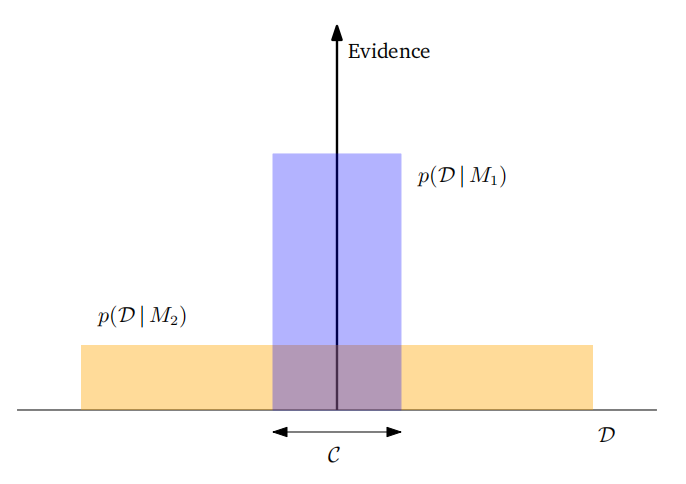

**图8.14贝叶斯推理体现了奥卡姆剃须刀。横轴描述了所有可能的数据集的空间d。证据（纵轴）评估了一个模型对可用数据的预测程度。由于p（D | Mi）需要集成到1中，所以我们应该选择证据最大的模型。改编自MacKay（2003）。**

### 8.6.2 贝叶斯模型选择

模型选择有许多方法，本节将介绍其中一些。一般来说，它们都在尝试在模型复杂性和数据拟合度之间做出权衡。我们假设简单模型比复杂模型更不易过拟合，因此模型选择的目标是找到能够合理解释数据的最简单模型。这个概念也被称为奥卡姆剃刀原则。

**奥卡姆剃刀原则**

备注：如果我们把模型选择视为一个假设检验问题，那么我们正在寻找的是与数据一致的最简单假设（Murphy, 2012）。

$\diamondsuit$

有人可能会考虑在模型上放置一个先验，以偏好更简单的模型。然而，这并非必要：在贝叶斯概率的应用中，“自动奥卡姆剃刀”是定量体现的（Smith 和 Spiegelhalter, 1980; Jefferys 和 Berger, 1992; MacKay, 1992）。图8.14（改编自MacKay, 2003）给出了为什么复杂且极具表达力的模型在建模给定数据集$\mathcal{D}$时可能不是一个高概率选择的基本直觉。让我们将水平轴视为代表所有可能数据集$\mathcal{D}$的空间的预测。如果我们关注的是给定数据$\mathcal{D}$下模型$M_i$的后验概率$p(M_i\mid\mathcal{D})$的量化表示，我们可以使用贝叶斯定理。假设所有模型上的先验$p(M)$是均匀的，贝叶斯定理会根据模型预测已发生数据的程度来奖励模型，即需要整合/求和到1。

给定模型$M_i$下数据$\mathcal{D}$的预测，即$p(\mathcal{D}\mid M_i)$，被称为$M_i$的证据。一个简单的模型$M_1$只能证明一小部分数据集的存在，这由$p(\mathcal{D}\mid M_1)$表示；一个更强大的模型$M_2$（例如，具有比$M_1$更多的自由参数）能够预测更多种类的数据集。然而，这意味着$M_2$在区域$C$中对数据集的预测不如$M_1$。假设这两个模型的先验概率是相等的。那么，如果数据集落在区域$C$中，则较弱的模型$M_1$是更可能的模型。

在本章前面，我们论证了模型需要能够解释数据，即应该有一种方法可以从给定模型中生成数据。此外，如果模型已经从数据中得到了适当的学习，那么我们期望生成的数据应该与经验数据相似。为此，将模型选择表述为分层推理问题是很有帮助的，这允许我们计算模型上的后验分布。

让我们考虑有限数量的模型$M=\{M_1,\ldots,M_K\}$，其中每个模型$M_k$都拥有参数$\theta_k$。在贝叶斯模型选择中，我们在模型集上放置一个先验$p(M)$。允许我们从该模型生成数据的相应生成过程是

$$\begin{array}{c}M_k\sim p(M)\\\theta_k\sim p(\theta\mid M_k)\\\mathcal{D}\sim p(\mathcal{D}\mid\theta_k)\end{array}$$
(8.40) (8.41) (8.42)

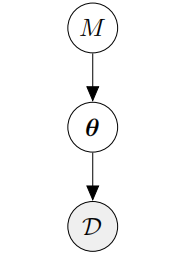

**图8.15贝叶斯模型选择中的层次生成过程说明。我们在一组模型上放置一个先验的p (M)。对于每个模型，在相应的模型参数上都有一个分布p（θ | M），用于生成数据D。**

并且如图8.15所示。给定一个训练集$\mathcal{D}$，我们应用贝叶斯定理并计算模型上的后验分布为

(8.43)
$$p(M_{k}\mid\mathcal{D})\propto p(M_{k})p(\mathcal{D}\mid M_{k})\:.$$
注意，这个后验分布不再依赖于模型参数$\theta_k$，因为在贝叶斯设置中它们已经被积分掉了，即
$$p(\mathcal{D}\mid M_{k})=\int p(\mathcal{D}\mid\boldsymbol{\theta}_{k})p(\boldsymbol{\theta}_{k}\mid M_{k})d\boldsymbol{\theta}_{k}\:,$$
(8.44)

其中$p(\boldsymbol{\theta}_k\mid M_k)$是模型$M_k$的参数$\theta_k$的先验分布。(8.44)项被称为模型证据或边缘似然。从(8.43)中的后验分布中，我们确定最大后验(MAP)估计

(8.45)
$$M^*=\arg\max_{M_k}p(M_k\mid\mathcal{D})\:.$$

如果采用均匀先验$p(M_k)=\frac1K$，即给予每个模型相等的（先验）概率，那么确定模型上的MAP估计就等价于选择使模型证据(8.44)最大化的模型。

**备注（似然与边缘似然）**：似然与边缘似然（证据）之间存在一些重要差异：虽然似然容易过拟合，但边缘似然通常不会，因为模型参数已经被边缘化（即我们不再需要拟合参数）。此外，边缘似然自动体现了模型复杂性和数据拟合度之间的权衡（奥卡姆剃刀原则）。

### **8.6.3 模型比较的贝叶斯因子**

考虑在给定数据集$\mathcal{D}$的情况下，比较两个概率模型$M_1, M_2$的问题。如果我们计算后验概率$p(M_1\mid\mathcal{D})$和$p(M_2\mid\mathcal{D})$，则可以计算后验概率的比率

(8.46)
$$\underbrace{\frac{p(M_1\mid\mathcal{D})}{p(M_2\mid\mathcal{D})}}_{\text{后验赔率}}=\frac{\frac{p(\mathcal{D}\mid M_1)p(M_1)}{p(\mathcal{D})}}{\frac{p(\mathcal{D}\mid M_2)p(M_2)}{p(\mathcal{D})}}=\underbrace{\frac{p(M_1)}{p(M_2)}}_{\text{先验赔率}}\underbrace{\frac{p(\mathcal{D}\mid M_1)}{p(\mathcal{D}\mid M_2)}}_{\text{贝叶斯因子}}\:.$$

后验概率的比率也被称为后验赔率。等式(8.46)右侧的第一个分数，即先验赔率，衡量了我们的先验（初始）信念在多大程度上偏向于$M_1$而非$M_2$。边缘似然（右侧第二个分数）的比率被称为**贝叶斯因子**，它衡量了与$M_2$相比，数据$D$被$M_1$预测得有多好。

**备注**。杰弗里斯-林德利悖论指出，“由于复杂模型在先验分布较为分散的情况下的数据概率将非常小，因此贝叶斯因子总是偏向于更简单的模型”（Murphy, 2012）。这里，分散的先验指的是许多模型在该先验下都是先验上合理的。

$\diamondsuit$

如果我们选择模型上的均匀先验，则(8.46)中的先验赔率项为1，即后验赔率就是边缘似然（贝叶斯因子）的比率

$$\frac{p(\mathcal{D}\mid M_1)}{p(\mathcal{D}\mid M_2)}\:.$$
(8.47)

如果贝叶斯因子大于1，我们选择模型$M_1$，否则选择模型$M_2$。与频率统计类似，对于结果“显著性”的考虑，有关于比率大小的指导原则（Jeffreys, 1961）。

**备注（计算边缘似然）**。边缘似然在模型选择中扮演着重要角色：我们需要计算贝叶斯因子(8.46)和模型上的后验分布(8.43)。不幸的是，计算边缘似然需要我们求解一个积分(8.44)。这个积分通常无法通过分析求解，因此我们必须求助于近似技术，例如数值积分（Stoer and Burlirsch, 2002）、使用Monte Carlo方法的随机近似（Murphy, 2012），或贝叶斯Monte Carlo技术（O'Hagan, 1991; Rasmussen and Ghahramani, 2003）。

然而，也有一些特殊情况可以求解。在6.6.1节中，我们讨论了共轭模型。如果我们选择共轭参数先验$p(\boldsymbol{\theta})$，则可以以闭合形式计算边缘似然。在第9章中，我们将在线性回归的上下文中正是这样做。

$\diamondsuit$

本章我们已经简要介绍了机器学习的基本概念。在本书的其余部分，我们将看到第8.2、8.3和8.4节中三种不同风格的学习如何应用于机器学习的四大支柱（回归、降维、密度估计和分类）。

### 8.6.4 进阶阅读

我们在本节的开头提到，存在一些高级建模选择，它们会影响模型的性能。这些例子包括：

$\bullet$ 回归设置中多项式的度数
$\bullet$ 混合模型中的组件数量
$\bullet$ （深度）神经网络的网络架构
$\bullet$ 支持向量机中的核类型
$\bullet$ 主成分分析（PCA）中潜在空间的维度
$\bullet$ 优化算法中的学习率（计划）

Rasmussen和Ghahramani（2001）指出，自动的奥卡姆剃刀原则并不一定会惩罚模型中的参数数量，但它确实在函数复杂度方面起作用。他们还表明，自动的奥卡姆剃刀原则也适用于具有许多参数的贝叶斯非参数模型，例如高斯过程。

如果我们关注最大似然估计，那么存在许多用于模型选择的启发式方法，这些方法可以阻止过拟合。它们被称为信息准则，我们选择具有最大值的模型。赤池信息量准则（AIC）（Akaike, 1974）

(8.48)
$$\log p(x\mid\boldsymbol{\theta})-M$$

通过添加一个惩罚项来补偿具有大量参数的更复杂模型的过拟合，从而校正最大似然估计的偏差。这里，$M$是模型参数的数量。AIC估计了给定模型所损失的相对信息量。贝叶斯信息准则（BIC）（Schwarz, 1978）

(8.49)
$$\log p(\boldsymbol{x})=\log\int p(\boldsymbol{x}\mid\boldsymbol{\theta})p(\boldsymbol{\theta})\mathrm{d}\boldsymbol{\theta}\approx\log p(\boldsymbol{x}\mid\boldsymbol{\theta})-\frac{1}{2}M\log N$$

可用于指数族分布。这里，$N$是数据点的数量，$M$是参数的数量。BIC对模型复杂度的惩罚比AIC更重。

