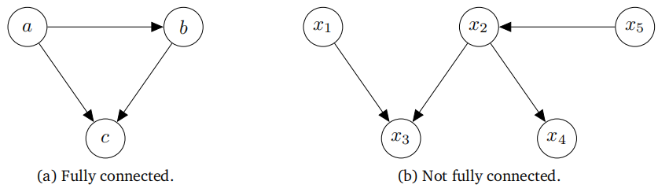
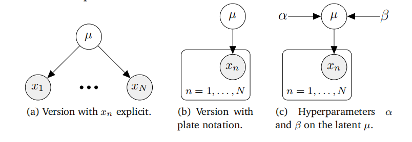
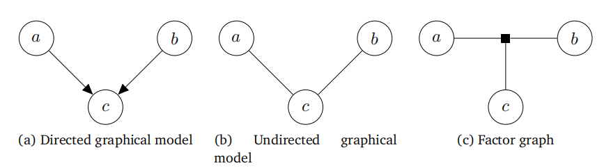
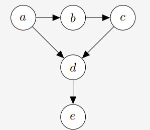

## 8.5 有向图模�?

在本节中，我们介绍了一种用于指定概率模型的图形语言，称为有向图模型。它提供了一种紧凑且简洁的方式来指定概率模型，并允许读者直观地解析随机变量之间的依赖关系。图形模型以可视化的方式捕捉了所有随机变量的联合分布如何被分解为仅依赖于这些变量子集的因子乘积的方式。在�?.4节中，我们将概率模型的联合分布确定为关键关注量，因为它包含了关于先验、似然和后验的信息。然而，联合分布本身可能相当复杂，并且它没有告诉我们关于概率模型结构特性的任何信息。例如，联合分布$p(a,b,c)$并没有告诉我们关于独立关系的信息。这正是图形模型发挥作用的地方。本节依赖于�?.4.5节中描述的独立性和条件独立性的概念�?

在图形模型中，节点是随机变量。在�?.9(a)中，节点代表随机变量$a,b,c$。边代表变量之间的概率关系，例如条件概率�?

备注：并非每个分布都可以用特定类型的图形模型来表示。关于此点的讨论可以在Bishop�?006）中找到�?

概率图形模型具有一些方便的特性：

- 它们是可视化概率模型结构的一种简单方式�?

- 它们可用于设计或激励新型统计模型�?

- 仅通过检查图形，我们就可以洞察其属性，例如条件独立性�?

- 统计模型中推断和学习的复杂计算可以表达为图形操作�?

### 8.5.1 图形语义

有向图模�?贝叶斯网络是一种在概率模型中表示条件依赖性的方法。它们通过图形化的方式描述条件概率，从而为描述复杂的相互依赖关系提供了一种简洁的语言。模块化的描述也带来了计算上的简化。假设之间（即两个节点或随机变量之间）的有向链接（箭头）表示条件概率。例如，在图8.9(a)中，$a$�?b$之间的箭头给出了在给�?a$的条件下$b$的条件概�?p(b\mid a)$�?

�?.9有向图形化模型的示例�?/center>

如果我们知道联合分布的因式分解情况，那么就可以从联合分布推导出有向图模型�?

> **示例 8.7**
>
> 考虑三个随机变量$a,b,c$的联合分�?
>
> $$p(a,b,c)=p(c\mid a,b)p(b\mid a)p(a) \tag{8.29}$$
>
> 联合分布�?8.29)中的因式分解告诉我们随机变量之间的关系：
>
> * $c$直接依赖�?a$�?b$�?
>
> * $b$直接依赖�?a$�?
>
> * $a$既不依赖�?b$也不依赖�?c$�?
>
> 根据(8.29)中的因式分解，我们得到了�?.9(a)中的有向图模型�?

一般来说，我们可以从联合分布的因式分解中构造出相应的有向图模型，具体步骤如下：

1. 为所有随机变量创建一个节点�?
2. 对于每个条件分布，我们在图中从该分布所依赖的变量对应的节点出发，添加一个有向链接（箭头）�?

图的布局取决于联合分布的因式分解的选择�?

我们讨论了如何从已知的联合分布因式分解得到相应的有向图模型。现在，我们将做完全相反的事情，并描述如何从给定的图形模型中提取一组随机变量的联合分布�?

> **示例 8.8**
>
> 观察�?.9(b)中的图形模型，我们利用了两个属性：
>
> * 我们所寻求的联合分�?p(x_1,\ldots,x_5)$是一组条件概率的乘积，图中每个节点对应一个条件概率。在这个特定示例中，我们需要五个条件概率�?
>
> * 每个条件概率仅依赖于图中对应节点的父节点。例如，$x_4$将依赖于$x_2$�?
>
> 这两个属性给出了联合分布的所需因式分解�?
>
> $$p(x_1,x_2,x_3,x_4,x_5)=p(x_1)p(x_5)p(x_2\mid x_5)p(x_3\mid x_1,x_2)p(x_4\mid x_2)\:. \tag{8.30}$$

一般来说，联合分布$p(\boldsymbol x)=p(x_1,\ldots,x_K)$可以表示�?

$$p(\boldsymbol{x})=\prod_{k=1}^Kp(x_k\mid\boldsymbol{Pa}_k)\:, \tag{8.31}$$
其中Pa$_k$表示�?x_k$的父节点”�?x_k$的父节点是指有箭头指�?x_k$的节点�?

我们以抛硬币实验的具体示例来结束这一小节。考虑一个伯努利实验（示�?.8），其中该实验的结果$x$为“正面”的概率�?

$$p(x\mid\mu)=\mathrm{Ber}(\mu)\:. \tag{8.32}$$

现在我们重复这个实验$N$次，并观察结�?x_1,\ldots,x_N$，从而得到联合分�?

$$p(x_1,\dots,x_N\mid\mu)=\prod_{n=1}^Np(x_n\mid\mu)\:. \tag{8.33}$$

由于实验是独立的，因此等式右侧是每个单独结果的伯努利分布的乘积。回�?.4.5节，统计独立性意味着分布可以因式分解。为了为这种情况编写图形模型，我们需要区分未观测/潜在变量和观测变量。在图形上，观测变量用阴影节点表示，因此我们得到�?.10(a)中的图形模型。我们看到，单个参数$\mu$对于所�?x_n,n=1,\ldots,N$都是相同的，因为结果$x_n$是同分布的。对于这种情况，一个更紧凑但等效的图形模型如图8.10(b)所示，其中我们使用了板块符号。板块（框）重复其内部的所有内容（在本例中，重复观�?x_n)N$次。因此，这两个图形模型是等效的，但板块符号更为紧凑。图形模型使我们能够立即�?\mu$上放置一个超先验。超先验是第一层先验参数上的先验分布的第二层超先验。图8.10(c)在潜在变�?\mu$上放置了一个Beta$(\alpha,\beta)$先验。如果我们将$\alpha$�?\beta$视为确定性参数（即不是随机变量），则省略其周围的圆圈�?

�?.10重复伯努利实验的图形模型�?/center>

### 8.5.2 条件独立性和d-分离

有向图模型允许我们仅通过查看图形来找到联合分布的条件独立性（�?.4.5节）关系属性。这其中的关键是一个称为d-分离（Pearl, 1988）的概念�?

考虑一个一般的有向图，其中$\mathcal{A}$�?\mathcal{B}$�?\mathcal{C}$是节点的不相交集合（它们的并集可能小于图中节点的完整集合）。我们希望确定给定的有向无环图是否隐含了特定的条件独立性陈述，“给�?\mathcal{C}$�?\mathcal{A}$�?\mathcal{B}$条件独立”，表示�?

$$\mathcal{A}\perp\mathcal{B}\:|\:\mathcal{C}\:, \tag{8.34}$$

为此，我们考虑�?\mathcal{A}$中的任何节点�?\mathcal{B}$中任何节点的所有可能的轨迹（忽略箭头方向的路径）。如果这样的路径包含任何节点，使得以下任一条件为真，则该路径被认为是被阻塞的：

- 路径上的箭头在节点处相遇，要么是头到尾，要么是尾到尾，并且该节点在集�?\mathcal{C}$中�?

- 箭头在节点处头到头相遇，并且该节点及其任何后代都不在集合$C$中（注意这里原文中集合名称应�?\mathcal{C}$，可能是笔误）�?

�?.12三种类型的图形模型： (a)有向图形模型（贝叶斯网络）；(b)无向图形模型（马尔可夫随机场）；(c)因子图�?/center>

如果所有路径都被阻塞，则称$\mathcal{A}$�?\mathcal{B}$�?\mathcal{C}$ d-分离，图中所有变量的联合分布将满�?\mathcal{A}\perp\mathcal{B}\mid\mathcal{C}$�?

> **�?.9 条件独立�?*
>
> 

>
> 
�?.11D-分离示例�?/center>
>
> 观察�?.11中的图模型。视觉信息告诉我们：
>
> $$\begin{array}{l}b\perp d\mid a,c\\a\perp c\mid b\\b\not\perp d\mid c\\a\not\perp c\mid b,e\end{array}$$

有向图模型允许对概率模型进行紧凑的表示，我们将在�?�?0�?1章中看到有向图模型的例子。这种表示方式，结合条件独立性的概念，使我们能够将相应的概率模型分解为更容易优化的表达式�?

概率模型的图形表示使我们能够直观地看到我们所做的设计选择对模型结构的影响。我们通常需要对模型的结构做出高级假设。这些建模假设（超参数）会影响预测性能，但无法直接使用我们目前所看到的方法来选择。我们将在第8.6节中讨论选择结构的不同方法�?

### 8.5.3 拓展阅读

Bishop�?006，第8章）提供了概率图模型的入门介绍，而Koller和Friedman�?009）的书籍则对不同应用及其相应的算法影响进行了详尽描述。概率图模型主要分为以下三种类型�?

* 有向图模型（贝叶斯网络）；见�?.12(a)
* 无向图模型（马尔可夫随机场）；见�?.12(b)
* 因子图；见图8.12(c)

图模型允许使用基于图的算法进行推理和马尔可夫随机学习，例如通过局部消息传递。其应用范围广泛，从在线游戏中的秩因子分解（Herbrich et al.�?007）和计算机视觉（如图像分割、语义标注、图像去噪、图像恢复（Kittler和Föglein�?984；Sucar和Gillies�?994；Shotton et al.�?006；Szeliski et al.�?008））到编码理论（McEliece et al.�?998）、线性方程组求解（Shental et al.�?008）以及信号处理中的迭代贝叶斯状态估计（Bickson et al.�?007；Deisenroth和Mohamed�?012）�?

本书未讨论但在实际应用中特别重要的一个话题是结构预测（Bakir et al.�?007；Nowozin et al.�?014）的概念，它允许机器学习模型处理结构化的预测，例如序列、树和图。神经网络模型的流行使得更灵活的概率模型得以应用，从而产生了许多结构模型的有用应用（Goodfellow et al.�?016，第16章）。近年来，概率图模型在因果推断领域也重新获得了关注（Pearl�?009；Imbens和Rubin�?015；Peters et al.�?017；Rosenbaum�?017）�?

