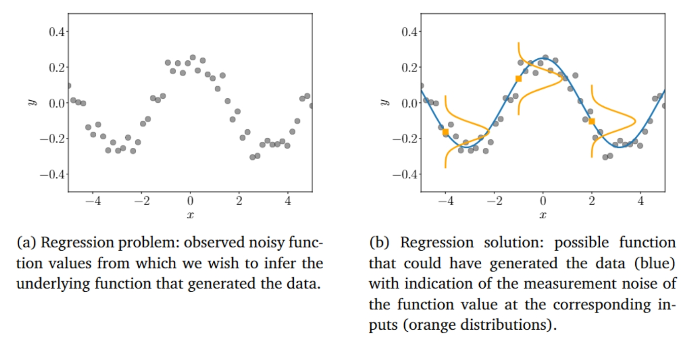

# 第9章 线性回归

在接下来的内容中，我们将应用第 2 章、第 5 章、第 6 章和第 7 章中的数学概念来解决线性回归（曲线拟合）问题。在线性回归中，我们的目标是找到一个函数 $ f $，它将输入 $ \boldsymbol{x} \in \mathbb{R}^D $ 映射到对应的函数值 $ f(\boldsymbol{x}) \in \mathbb{R} $。

我们假设给定一组训练输入 $ \boldsymbol{x}_n $ 以及对应的带噪声观测值：$ y_n = f(\boldsymbol{x}_n) + \epsilon $, 其中，$ \epsilon $ 是一个独立同分布（i.i.d.）的随机变量，用于描述测量/观测噪声以及可能未被建模的过程（在本章中我们不会再进一步讨论这些）。
在本章中，我们假设噪声是零均值高斯噪声。我们的任务是找到一个函数，该函数不仅能够拟合训练数据，而且能够很好地推广到预测训练数据之外的输入位置处的函数值（参见第8章）。图9.1展示了这样一个回归问题的示例。

典型的回归设置如图9.1(a)所示：对于某些输入值  $ x_n $ ，我们观测到带噪声的函数值  $ y_n = f(x_n) + \epsilon $ 。任务是从这些数据中推断出生成数据的函数  $ f $ ，并使其能够很好地推广到新的输入位置处的函数值。图9.1(b)给出了一个可能的解决方案，我们还在其中展示了三个以函数值  $ f(x) $  为中心的分布，这些分布表示数据中的噪声。

**图 9.1：(a) 数据集；(b) 回归问题可能的解决方法**

回归是机器学习中的一个基础问题，回归问题出现在多种研究领域和应用中，包括时间序列分析（例如系统辨识）、控制与机器人学（例如强化学习、正向/逆向模型学习）、优化（例如线搜索、全局优化）以及深度学习应用（例如电脑游戏、语音转文本翻译、图像识别、自动视频标注）。回归也是分类算法的关键组成部分。

寻找回归函数需要解决以下多种问题：

- **模型（类型）的选择以及回归函数的参数化**。给定一个数据集，哪些函数类别（例如多项式）是建模数据的良好候选，以及我们应该选择什么样的特定参数化（例如多项式的阶数）？正如第8.6节中讨论的模型选择那样，它允许我们比较各种模型，以找到能够合理地解释训练数据的最简单模型。
- **寻找良好的参数**。在选择了回归函数的模型之后，我们如何找到良好的模型参数？在这里，我们需要查看不同的损失/目标函数（它们决定了什么是“良好”的拟合）以及优化算法，这些算法允许我们最小化这个损失。
- **过拟合和模型选择**。当回归函数“过于完美”地拟合训练数据，但无法推广到未见的测试数据时，就会出现过拟合问题。过拟合通常发生在底层模型（或其参数化）过于灵活和富有表现力时；参见第8.6节。我们将探讨其背后的原因，并讨论如何减轻过拟合的影响。
- **损失函数与参数先验之间的关系**。损失函数（优化目标）通常是由概率模型激发并诱导的。我们将探讨损失函数与诱导这些损失的底层先验假设之间的联系。
- **不确定性建模**。在任何实际设置中，我们只有有限的（可能数量很大）训练数据用于选择模型类别和对应的参数。由于这有限的训练数据无法涵盖所有可能的情况，我们可能希望描述剩余的参数不确定性，以在测试时获得模型预测的置信度量；训练集越小，不确定性建模就越重要。一致的不确定性建模为模型预测提供了置信区间。

在接下来的内容中，我们将使用第3章、第5章、第6章和第7章中的数学工具来解决线性回归问题。我们将讨论最大似然估计和最大后验（MAP）估计，以找到最优的模型参数。利用这些参数估计，我们将简要探讨泛化误差和过拟合。在本章的最后，我们将讨论贝叶斯线性回归，它允许我们从更高层次上对模型参数进行推理，从而解决最大似然和MAP估计中遇到的一些问题。
