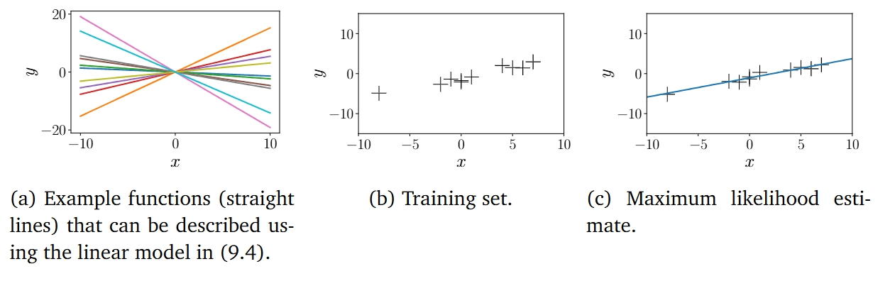

## 9.1 问题形式化

由于观测噪声的存在，我们将采用概率方法，并明确使用似然函数来建模噪声。更具体地说，在本章中，我们考虑一个具有似然函数的回归问题：

 $$ p(y | \boldsymbol{x}) = \mathcal{N}(y | f(\boldsymbol{x}), \sigma^2) \tag{9.1}$$ 

其中， $ x \in \mathbb{R}^D $  是输入， $ y \in \mathbb{R} $  是带噪声的函数值（目标值）。根据式(9.1)， $ x $  和  $ y $  之间的函数关系可以表示为：

 $$ y = f(\boldsymbol{x}) + \epsilon \tag{9.2}$$ 

其中， $ \epsilon \sim \mathcal{N}(0, \sigma^2) $  是独立同分布（i.i.d.）的高斯测量噪声，其均值为0，方差为  $ \sigma^2 $ 。我们的目标是找到一个函数，使其尽可能接近生成数据的未知函数  $ f $ ，并且能够很好地推广。

在本章中，我们专注于参数化模型，即我们选择一个参数化的函数，并找到能够“良好”拟合数据的参数 $ \boldsymbol{\theta} $。暂时假设噪声方差 $ \sigma^2 $ 是已知的，专注于学习模型参数 $ \boldsymbol{\theta} $。在线性回归中，我们考虑参数 $ \boldsymbol{\theta} $ 线性出现在模型中的特殊情况。线性回归的一个例子是：

$$
p(y | \boldsymbol{x}, \boldsymbol{\theta}) = \mathcal{N}(y | \boldsymbol{x}^\top \boldsymbol{\theta}, \sigma^2) \tag{9.3}
$$

$$
\Longleftrightarrow y = \boldsymbol{x}^\top \boldsymbol{\theta} + \epsilon, \quad \epsilon \sim \mathcal{N}(0, \sigma^2), \tag{9.4}
$$

其中，$ \boldsymbol{\theta} \in \mathbb{R}^D $ 是我们要求的参数。式 (9.4) 中描述的函数类别是通过原点的直线。在式 (9.4) 中，我们选择参数化 $ f(\boldsymbol{x}) = \boldsymbol{x}^\top \boldsymbol{\theta} $。狄拉克 δ 函数（δ 函数）在除一个点之外的所有地方都为零，其积分值为 1。它可以被视为高斯分布的极限情况，当 $ \sigma^2 \to 0 $ 时。

似然函数 $ p(y | \boldsymbol{x}, \boldsymbol{\theta}) $ 是在 $ \boldsymbol{x}^\top \boldsymbol{\theta} $ 处评估的 $ y $ 的概率密度函数。注意，唯一的不确定性来源来自于观测噪声（因为 $ \boldsymbol{x} $ 和 $ \boldsymbol{\theta} $ 在式 (9.3) 中被认为是已知的）。如果没有观测噪声，$ \boldsymbol{x} $ 和 $ y $ 之间的关系将是确定性的，而式 (9.3) 将是一个狄拉克 δ 函数。

> **例9.1** 对于  $ x, \theta \in \mathbb{R} $ ，式(9.4)中的线性回归模型描述了直线（线性函数），参数  $ \theta $  是直线的斜率。图9.2(a)展示了不同  $ \theta $  值对应的示例函数。

**图 9.2 线性回归示例。(a) 属于此类别的示例函数；(b) 训练集；(c) 极大似然估计。**

式 (9.3)–(9.4) 中的线性回归模型不仅在参数上是线性的，而且在输入 $ \boldsymbol{x} $ 上也是线性的。图 9.2(a) 展示了这类函数的示例。我们稍后会看到，$ y = \boldsymbol{\phi}^\top(\boldsymbol{x}) \boldsymbol{\theta} $ 对于非线性变换 $ \boldsymbol{\phi} $ 也是一个线性回归模型，因为“线性回归”指的是“参数线性”的模型，即通过输入特征的线性组合来描述函数。在这里，“特征”是输入 $ \boldsymbol{x} $ 的表示 $ \boldsymbol{\phi}(\boldsymbol{x}) $。

在接下来的内容中，我们将更详细地讨论如何找到良好的参数 $ \boldsymbol{\theta} $，以及如何评估一组参数是否“有效”。暂时假设噪声方差 $ \sigma^2 $ 是已知的。

