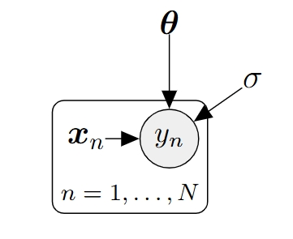
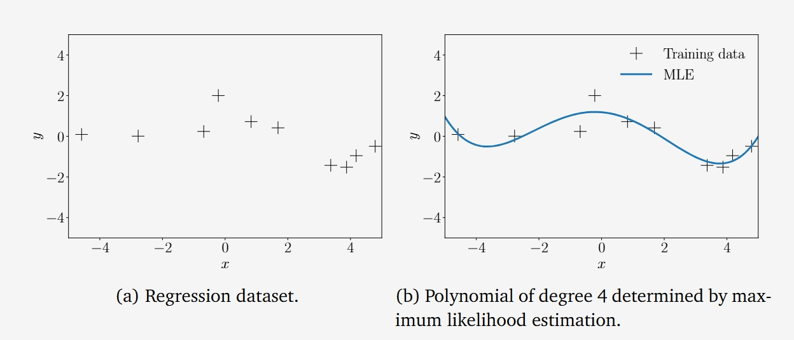
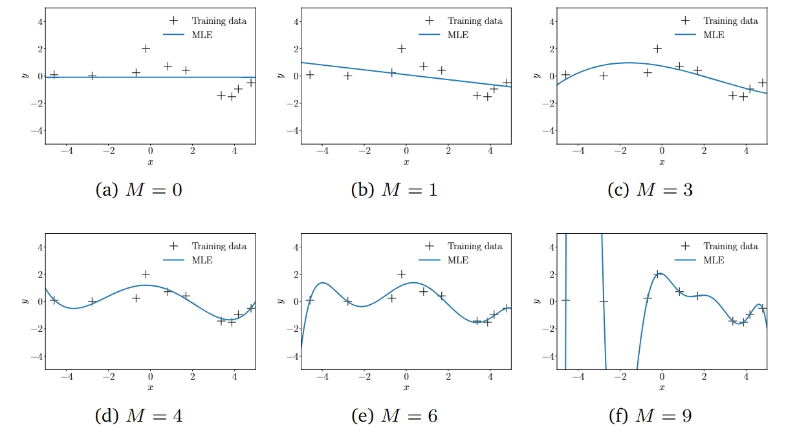
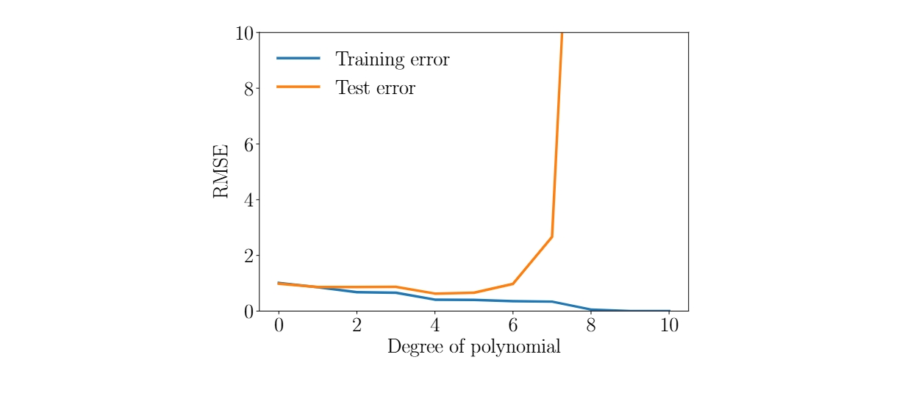
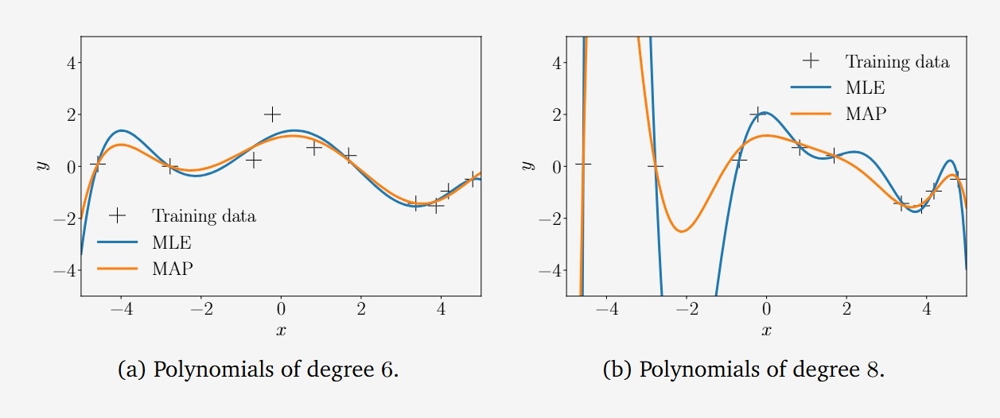

## 9.2 参数估计

考虑线性回归设置（式 (9.4)），假设我们有一个训练集 $ \mathcal{D} := \{(\boldsymbol{x}_1, y_1), \ldots, (\boldsymbol{x}_N, y_N)\} $，其中包含 $ N $ 个输入 $ \boldsymbol{x}_n \in \mathbb{R}^D $ 和对应的观测值/目标值 $ y_n \in \mathbb{R} $，$ n = 1, \ldots, N $。对应的概率图模型如图 9.3 所示。注意，给定各自的输入 $ \boldsymbol{x}_i, \boldsymbol{x}_j $，$ y_i $ 和 $ y_j $ 是条件独立的，因此似然函数可以分解为：

$$
p(\mathcal{Y} | \mathcal{X}, \boldsymbol{\theta}) = p(y_1, \ldots, y_N | \boldsymbol{x}_1, \ldots, \boldsymbol{x}_N, \boldsymbol{\theta}) \tag{9.5a}
$$ 

$$
= \prod_{n=1}^N p(y_n | \boldsymbol{x}_n, \boldsymbol{\theta}) = \prod_{n=1}^N \mathcal{N}(y_n | \boldsymbol{x}_n^\top \boldsymbol{\theta}, \sigma^2) \tag{9.5b}
$$ 

其中，我们定义 $ \boldsymbol{X} := \{\boldsymbol{x}_1, \ldots, \boldsymbol{x}_N\} $ 和 $ \boldsymbol{Y} := \{y_1, \ldots, y_N\} $ 分别为训练输入和对应的目标值集合。由于噪声分布，似然函数和因子 $ p(y_n | \boldsymbol{x}_n, \boldsymbol{\theta}) $ 是高斯分布的；见式 (9.3)。

**图 9.3 线性回归的概率图模型。已观测的随机变量用阴影表示，确定性/已知值则无圆圈标记。**

在接下来的内容中，我们将讨论如何找到线性回归模型（式(9.4)）的最优参数  $ \theta^* \in \mathbb{R}^D $ 。一旦找到参数  $ \theta^* $ ，我们就可以使用这个参数估计值在式(9.4)中预测函数值，这样在任意测试输入  $ x^* $  处，对应目标值  $ y^* $  的分布为：

 $$
p(y^* | x^*, \theta^*) = \mathcal{N}(y^* | x^{*\top} \theta^*, \sigma^2) \tag{9.6}
$$ 

在接下来的内容中，我们将研究通过最大化似然来估计参数，我们在第8.3节中已经部分涉及了这个主题。

### 9.2.1 最大似然估计

一种广泛用于找到期望参数  $ \theta_{\text{ML}} $  的方法是**最大似然估计**，我们寻找能够最大化似然（式(9.5b)）的参数  $ \theta_{\text{ML}} $ 。直观上，最大化似然意味着最大化给定模型参数时训练数据的预测分布。我们得到的最大似然参数为：

 $$
\theta_{\text{ML}} = \arg \max_\theta p(Y | X, \theta) \tag{9.7}
$$ 

似然函数在参数上不是概率分布。

**注释**。似然  $ p(y | x, \theta) $  在  $ \theta $  上不是概率分布：它仅仅是参数  $ \theta $  的一个函数，但它并没有归一化（即，它不积分为1），并且可能甚至无法相对于  $ \theta $  进行积分。然而，式(9.7)中的似然是  $ y $  的一个归一化概率分布。

为了找到能够最大化似然的期望参数  $ \theta_{\text{ML}} $ ，我们通常执行梯度上升（或对负似然进行梯度下降）。然而，在我们这里考虑的线性回归中，存在一个闭式解，这使得迭代梯度下降变得不必要。实际上，我们不是直接最大化似然，而是对似然函数进行对数变换，并最小化负对数似然。

**注释（对数变换）**。由于似然（式(9.5b)）是  $ N $  个高斯分布的乘积，对数变换很有用，因为（a）它不会受到数值下溢的影响，（b）微分规则将变得更简单。更具体地说，当我们将  $ N $  个概率相乘时，数值下溢会成为一个问题，因为当  $ N $  是数据点的数量时，我们无法表示非常小的数字，例如  $ 10^{-256} $ 。此外，对数变换将乘积转换为对数概率之和，使得对应的梯度是对数概率的和，而不是应用乘积规则（式(5.46)）来计算  $ N $  项乘积的梯度。

为了找到我们线性回归问题的最优参数  $ \theta_{\text{ML}} $ ，我们最小化负对数似然：

 $$
- \log p(Y | X, \theta) = - \log \prod_{n=1}^N p(y_n | x_n, \theta) = - \sum_{n=1}^N \log p(y_n | x_n, \theta) \tag{9.8}
$$ 

其中，我们利用了由于对训练集的独立性假设，似然（式(9.5b)）在数据点数量上是可分解的。在线性回归模型（式(9.4)）中，由于高斯加性噪声项，似然是高斯的，因此我们得到：

 $$
\log p(y_n | x_n, \theta) = -\frac{1}{2\sigma^2}(y_n - x_n^\top \theta)^2 + \text{常数} \tag{9.9}
$$ 

其中常数包括所有与  $ \theta $  无关的项。将式(9.9)代入负对数似然（式(9.8)），我们得到（忽略常数项）：

 $$
\mathcal{L}(\theta) := \frac{1}{2\sigma^2} \sum_{n=1}^N (y_n - x_n^\top \theta)^2 \tag{9.10a}
$$ 

 $$
= \frac{1}{2\sigma^2} \| y - X \theta \|^2 \tag{9.10b}
$$ 

其中，我们定义设计矩阵  $ X := [x_1, \ldots, x_N]^\top \in \mathbb{R}^{N \times D} $  作为训练输入的集合， $ y := [y_1, \ldots, y_N]^\top \in \mathbb{R}^N $  作为收集所有训练目标值的向量。注意，设计矩阵  $ X $  的第  $ n $  行对应于训练输入  $ x_n $ 。在式(9.10b)中，我们利用了观测值  $ y_n $  与对应模型预测  $ x_n^\top \theta $  之间的平方误差之和等于  $ y $  和  $ X \theta $  之间的平方距离这一事实。

回忆第3.1节的内容，如果选择点积作为内积，则  $ \| x \|^2 = x^\top x $ 。有了式(9.10b)，我们现在有了一个具体的负对数似然函数形式，需要对其进行优化。我们立即可以看出，式(9.10b)在  $ \theta $  上是二次的。这意味着我们可以找到一个唯一的全局解  $ \theta_{\text{ML}} $ ，用于最小化负对数似然  $ \mathcal{L} $ 。我们可以通过计算  $ \mathcal{L} $  关于参数的梯度，将其设置为0，并求解  $ \theta $  来找到全局最优值。利用第5章的结果，我们计算  $ \mathcal{L} $  关于参数的梯度为：

 $$
\frac{d\mathcal{L}}{d\theta} = \frac{d}{d\theta} \left( \frac{1}{2\sigma^2} (y - X \theta)^\top (y - X \theta) \right) \tag{9.11a}
$$ 

 $$
= \frac{1}{2\sigma^2} \frac{d}{d\theta} \left( y^\top y - 2 y^\top X \theta + \theta^\top X^\top X \theta \right) \tag{9.11b}
$$ 

 $$
= \frac{1}{\sigma^2} (- y^\top X + \theta^\top X^\top X) \in \mathbb{R}^{1 \times D} \tag{9.11c}
$$ 

最大似然估计  $ \theta_{\text{ML}} $  解决了  $ \frac{d\mathcal{L}}{d\theta} = 0^\top $ （必要最优性条件），我们得到：

$$
\frac{d\mathcal{L}}{d\theta} = 0^\top \tag{9.11c}
$$

$$
 \Leftrightarrow \theta_{\text{ML}}^\top X^\top X = y^\top X \tag{9.12a}
$$

 $$
\Leftrightarrow \theta_{\text{ML}}^\top = y^\top X (X^\top X)^{-1} \tag{9.12b}
$$ 

 $$
\Leftrightarrow \theta_{\text{ML}} = (X^\top X)^{-1} X^\top y \tag{9.12c}
$$ 

我们可以将  $ X^\top X $  的第一方程右侧乘以  $ (X^\top X)^{-1} $ ，因为如果  $ \text{rank}(X) = D $ ，则  $ X^\top X $  是正定的，其中  $ \text{rank}(X) $  表示  $ X $  的秩。

**注释**。将梯度设为  $ 0^\top $  是一个必要且充分的条件，我们得到一个全局最小值，因为海森矩阵  $ \nabla^2_\theta \mathcal{L}(\theta) = X^\top X \in \mathbb{R}^{D \times D} $  是正定的。

**注释**。最大似然解（式(9.12c)）要求我们解一个形式为  $ A\theta = b $  的线性方程组，其中  $ A = (X^\top X) $ ， $ b = X^\top y $ 。

> **示例 9.2（拟合直线）**
> 让我们看看图9.2，我们试图用最大似然估计拟合一条直线  $ f(x) = \theta x $ ，其中  $ \theta $  是一个未知的斜率。图9.2(a)展示了这个模型类别的示例函数（直线）。对于图9.2(b)中的数据集，我们使用式(9.12c)找到斜率参数  $ \theta $  的最大似然估计，并在图9.2(c)中得到了最大似然线性函数。

#### 最大似然估计与特征

到目前为止，我们考虑的线性回归设置如式(9.4)所示，允许我们用最大似然估计拟合直线。然而，直线在拟合更有趣的数据时表达能力不足。幸运的是，线性回归为我们提供了一种在不离开线性回归框架的情况下拟合非线性函数的方法：由于“线性回归”仅指“参数线性”，我们可以在输入  $ x $  上执行任意非线性变换  $ \phi(x) $ ，然后线性组合这个变换的各个分量。对应的线性回归模型为：

 $$
p(y | x, \theta) = \mathcal{N}(y | \phi(x)^\top \theta, \sigma^2) \\
\Longleftrightarrow
y = \phi(x)^\top \theta + \epsilon = \sum_{k=0}^{K-1} \theta_k \phi_k(x) + \epsilon \tag{9.13}
$$ 

其中， $ \phi: \mathbb{R}^D \to \mathbb{R}^K $  是输入  $ x $  的（非线性）变换， $ \phi_k: \mathbb{R}^D \to \mathbb{R} $  是特征向量  $ \phi $  的第  $ k $  个分量。注意，特征向量的模型参数  $ \theta $  仍然仅线性出现。

> **示例 9.3（多项式回归）**
> 我们关注一个回归问题  $ y = \phi(x)^\top \theta + \epsilon $ ，其中  $ x \in \mathbb{R} $ ， $ \theta \in \mathbb{R}^K $ 。在这种情况下常用的一个变换是：
>  $$
\phi(x) =
\begin{bmatrix}
\phi_0(x) & \phi_1(x) & \cdots & \phi_{K-1}(x)
\end{bmatrix}^\top =
\begin{bmatrix}
1 & x & x^2 & \cdots & x^{K-1}
\end{bmatrix}^\top \in \mathbb{R}^K \tag{9.14}
> $$ 
> 这意味着我们将原始的一维输入空间“提升”到一个  $ K $  维特征空间，包含所有单项式  $ x^k $ ， $ k = 0, \ldots, K-1 $ 。通过这些特征，我们可以在线性回归框架内建模  $ K-1 $  阶多项式：一个  $ K-1 $  阶多项式为：
>  $$
f(x) = \sum_{k=0}^{K-1} \theta_k x^k = \phi(x)^\top \theta \tag{9.15}
> $$ 
> 其中  $ \phi $  定义在式(9.14)中， $ \theta = [\theta_0, \ldots, \theta_{K-1}]^\top \in \mathbb{R}^K $  包含线性参数  $ \theta_k $ 。

现在，让我们看看在线性回归模型（式(9.13)）中，如何用最大似然估计来估计参数  $ \theta $ 。我们考虑训练输入  $ x_n \in \mathbb{R}^D $  和目标值  $ y_n \in \mathbb{R} $ ， $ n = 1, \ldots, N $ ，并定义特征矩阵（设计矩阵）为：

 $$
\Phi :=
\begin{bmatrix}
\phi(x_1)^\top \\
\phi(x_2)^\top \\
\vdots \\
\phi(x_N)^\top
\end{bmatrix} =
\begin{bmatrix}
\phi_0(x_1) & \cdots & \phi_{K-1}(x_1) \\
\phi_0(x_2) & \cdots & \phi_{K-1}(x_2) \\
\vdots & \ddots & \vdots \\
\phi_0(x_N) & \cdots & \phi_{K-1}(x_N)
\end{bmatrix} \in \mathbb{R}^{N \times K} \tag{9.16}
$$ 

其中  $ \Phi_{ij} = \phi_j(x_i) $ ， $ \phi_j: \mathbb{R}^D \to \mathbb{R} $ 。

> **示例 9.4（二阶多项式的特征矩阵）**
> 对于一个二阶多项式和  $ N $  个训练点  $ x_n \in \mathbb{R} $ ， $ n = 1, \ldots, N $ ，特征矩阵为：
>  $$
\Phi =
\begin{bmatrix}
1 & x_1 & x_1^2 \\
1 & x_2 & x_2^2 \\
\vdots & \vdots & \vdots \\
1 & x_N & x_N^2
\end{bmatrix} \tag{9.17}
> $$ 

有了式(9.16)定义的特征矩阵  $ \Phi $ ，线性回归模型（式(9.13)）的负对数似然可以写为：

 $$
- \log p(Y | X, \theta) = \frac{1}{2\sigma^2} \| y - \Phi \theta \|^2 + \text{常数} \tag{9.18}
$$ 

将式(9.18)与没有特征的模型的负对数似然（式(9.10b)）进行比较，我们立即可以看出，我们只需要将  $ X $  替换为  $ \Phi $ 。由于  $ X $  和  $ \Phi $  都独立于我们希望优化的参数  $ \theta $ ，我们立即得到最大似然估计：

 $$
\theta_{\text{ML}} = (\Phi^\top \Phi)^{-1} \Phi^\top y \tag{9.19}
$$ 

对于具有非线性特征的线性回归问题。

**注释**。当我们不使用特征时，我们要求  $ X^\top X $  可逆，这在  $ \text{rank}(X) = D $  时成立，即  $ X $  的列\mathbb{R}^{K \times K} $  可逆。这在  $ \text{rank}(\Phi) = K $  时成立。

> **示例 9.5（最大似然多项式拟合）**
> 
> *图 9.4: 多项式回归：(a) 包含 \((x_n, y_n)\) 对的数据集，其中 \( n = 1, \dots, 10 \)；(b) 四阶最大似然多项式。* 
> 考虑图9.4(a)中的数据集。该数据集包含  $ N = 10 $  对  $ (x_n, y_n) $ ，其中  $ x_n \sim \mathcal{U}[-5, 5] $ ， $ y_n = -\sin(x_n/5) + \cos(x_n) + \epsilon $ ，且  $ \epsilon \sim \mathcal{N}(0, 0.2^2) $ 。我们使用最大似然估计拟合一个4阶多项式，即参数  $ \theta_{\text{ML}} $  由式(9.19)给出。最大似然估计在任意测试位置  $ x^* $  处得到的函数值为  $ \phi(x^*)^\top \theta_{\text{ML}} $ 。结果如图9.4(b)所示。

#### 估计噪声方差

到目前为止，我们假设噪声方差  $ \sigma^2 $  是已知的。然而，我们也可以使用最大似然估计的原理来获得噪声方差的最大似然估计  $ \sigma_{\text{ML}}^2 $ 。为此，我们遵循标准程序：写出对数似然，对其关于  $ \sigma^2 > 0 $  求导，将其设为0，并求解。对数似然为：

 $$
\begin{align}
    \log p(\mathcal{Y} \mid \mathcal{X}, \boldsymbol{\theta}, \sigma^2) &= \sum_{n=1}^{N} \log \mathcal{N} \left( y_n \mid \boldsymbol{\phi}^{\top} (x_n) \boldsymbol{\theta}, \sigma^2 \right) \tag{9.20a} \\
    &= \sum_{n=1}^{N} \left( -\frac{1}{2} \log (2\pi) - \frac{1}{2} \log \sigma^2 - \frac{1}{2\sigma^2} \left( y_n - \boldsymbol{\phi}^{\top} (x_n) \boldsymbol{\theta} \right)^2 \right) \tag{9.20b} \\
    &= -\frac{N}{2} \log \sigma^2 - \frac{1}{2\sigma^2} \sum_{n=1}^{N} \underbrace{\left( y_n - \boldsymbol{\phi}^{\top} (x_n) \boldsymbol{\theta} \right)^2}_{=: s} + \text{const.} \tag{9.20c}
\end{align}

$$ 

其中  $ s := \sum_{n=1}^N (y_n - \phi(x_n)^\top \theta)^2 $ 。

对数似然关于  $ \sigma^2 $  的偏导数为：

 $$
\frac{\partial \log p(Y | X, \theta, \sigma^2)}{\partial \sigma^2} = -\frac{N}{2\sigma^2} + \frac{s}{2\sigma^4} = 0 \tag{9.21a}
$$ 

 $$
\Rightarrow \frac{N}{2\sigma^2} = \frac{s}{2\sigma^4} \tag{9.21b}
$$ 

因此，我们得到：

 $$
\sigma_{\text{ML}}^2 = \frac{s}{N} = \frac{1}{N} \sum_{n=1}^N (y_n - \phi(x_n)^\top \theta)^2 \tag{9.22}
$$ 

因此，噪声方差的最大似然估计是噪声自由函数值  $ \phi(x_n)^\top \theta $  与对应噪声观测值  $ y_n $  在输入位置  $ x_n $  处的平方距离的均值。

## 9.2.2 线性回归中的过拟合

我们刚刚讨论了如何使用最大似然估计来拟合线性模型（例如多项式）到数据。我们可以通过计算误差/损失来评估模型的质量。一种方法是计算负对数似然（式(9.10b)），我们最小化它以确定最大似然估计器。或者，鉴于噪声参数  $ \sigma^2 $  不是自由模型参数，我们可以忽略  $ \frac{1}{\sigma^2} $  这一因子，因此我们得到一个平方误差损失函数  $ \| y - \Phi \theta \|^2 $ 。与其使用这个平方损失，我们通常使用均方根误差（RMSE）：

 $$
 \sqrt{\frac{1}{N} \| y - \Phi \theta \|^2} = \sqrt{\frac{1}{N} \sum_{n=1}^N (y_n - \phi(x_n)^\top \theta)^2} \tag{9.23}
$$ 

它（a）允许我们比较不同大小数据集的误差，（b）与观测函数值  $ y_n $  具有相同的量纲和单位。例如，如果我们拟合一个模型，将邮编（ $ x $  以纬度和经度表示）映射到房价（ $ y $  以欧元表示），那么 RMSE 也以欧元为单位，而平方误差则以欧元平方为单位。如果我们选择包括原始负对数似然（式(9.10b)）中的  $ \sigma^2 $  因子，那么我们得到的是无量纲的目标，即在前面的例子中，我们的目标不再以欧元或欧元平方为单位。对于模型选择（见第8.6节），我们可以使用 RMSE（或负对数似然）来确定最佳多项式的阶数，通过找到使目标最小化的多项式阶数  $ M $ 。鉴于多项式的阶数是自然数，我们可以进行穷举搜索，并枚举所有（合理的）  $ M $  值。对于大小为  $ N $  的训练集，测试  $ 0 \leq M \leq N - 1 $  是足够的。对于  $ M < N $ ，最大似然估计器是唯一的。对于  $ M \geq N $ ，我们有更多的参数比数据点多，我们需要解一个欠定的线性方程组（在式(9.19)中  $ \Phi^\top \Phi $  也将不可逆），因此有无数个可能的最大似然估计器。

*图 9.5: 不同多项式阶数 \( M \) 的最大似然拟合。*

图9.5展示了使用最大似然为图9.4(a)中的数据集确定的不同阶数多项式的拟合结果，该数据集包含  $ N = 10 $  个观测值。我们注意到，低阶多项式（例如常数  $ M = 0 $  或线性  $ M = 1 $ ）拟合数据较差，因此是对真实底层函数的糟糕表示。对于阶数为  $ M = 3, \ldots, 6 $  的多项式，拟合结果看起来是合理的，并且能够平滑地插值数据。当我们转向更高阶多项式时，我们注意到它们对数据的拟合越来越好。在  $ M = N - 1 = 9 $  的极端情况下，函数将通过每一个数据点。然而，这些高阶多项式会剧烈振荡，并且是对生成数据的真实函数的糟糕表示，因此我们遭受了过拟合。

**注释**。噪声方差  $ \sigma^2 > 0 $ 。

目标是通过在新（未见）数据上做出准确预测来实现良好的泛化。我们通过考虑一个单独的测试集来获得关于泛化性能对阶数为  $ M $  的多项式依赖性的定量见解，该测试集包含200个数据点，这些数据点是使用生成训练集的确切相同程序生成的。作为测试输入，我们在  $[-5, 5]$  区间内选择了一个线性网格的200个点。对于每个  $ M $  的选择，我们使用均方根误差（RMSE，式(9.23)）来评估训练数据和测试数据的误差。

*图 9.6: 训练误差与测试误差。*

现在来看测试误差，它是对应多项式泛化性能的定性度量，我们注意到最初测试误差会降低；见图9.6（橙色）。对于四阶多项式，测试误差相对较低，并且在阶数为5之前保持相对稳定。然而，从阶数6开始，测试误差显著增加，高阶多项式的泛化性能非常差。在这个特定例子中，这也从图9.5中对应的多项式拟合中显而易见。注意，训练误差（图9.6中的蓝色训练误差曲线）在多项式的阶数增加时永远不会增加。在我们的例子中，最佳泛化（最小测试误差的点）是对于阶数为  $ M = 4 $  的多项式获得的。

## 9.2.3 最大后验估计

我们刚刚看到，最大似然估计容易过拟合。我们通常观察到，当出现过拟合时，参数值的幅度会变得相对较大（Bishop, 2006）。为了减轻参数值过大的影响，我们可以在参数上放置一个先验分布  $ p(\theta) $ 。先验分布明确地编码了哪些参数值是合理的（在看到任何数据之前）。例如，一个高斯先验  $ p(\theta) = \mathcal{N}(0, b^2 I) $  对于单个参数  $ \theta $  表示参数值预期位于区间  $[-2b, 2b]$  内（均值周围的两个标准差）。

一旦有了数据集  $ X $  和  $ Y $ ，我们不是最大化似然，而是寻找最大化后验分布  $ p(\theta | X, Y) $  的参数。这个过程称为**最大后验（MAP）估计**。后验分布  $ p(\theta | X, Y) $  可以通过贝叶斯定理（第6.3节）得到：

 $$
p(\theta | X, Y) = \frac{p(Y | X, \theta) p(\theta)}{p(Y | X)} \tag{9.24}
$$ 

由于后验分布明确依赖于参数先验  $ p(\theta) $ ，先验将对后验的最大值产生影响。我们将在后面更明确地看到这一点。参数向量  $ \theta_{\text{MAP}} $  是最大化后验（式(9.24)）的值，称为MAP估计。为了找到MAP估计，我们遵循与最大似然估计类似的步骤。我们从对数变换开始，并计算对数后验：

 $$
\log p(\theta | X, Y) = \log p(Y | X, \theta) + \log p(\theta) + \text{常数} \tag{9.25}
$$ 

其中常数包括与  $ \theta $  无关的项。我们看到式(9.25)中的对数后验是似然  $ p(Y | X, \theta) $  的对数和先验  $ \log p(\theta) $  的和，因此MAP估计将是似然（数据依赖部分）和先验（我们对参数值的先验假设）之间的“折中”。

为了找到MAP估计  $ \theta_{\text{MAP}} $ ，我们通过最小化负对数后验分布来求解：

 $$
\theta_{\text{MAP}} \in \arg \min_\theta \left\{ -\log p(Y | X, \theta) - \log p(\theta) \right\} \tag{9.26}
$$ 

负对数后验关于  $ \theta $  的梯度为：

 $$
-\frac{d \log p(\theta | X, Y)}{d\theta} = -\frac{d \log p(Y | X, \theta)}{d\theta} - \frac{d \log p(\theta)}{d\theta} \tag{9.27}
$$ 

其中，右侧的第一项是式(9.11c)中的负对数似然的梯度。对于线性回归设置（式(9.13)），假设参数  $ \theta $  的先验为高斯分布  $ p(\theta) = \mathcal{N}(0, b^2 I) $ ，我们得到负对数后验：

 $$
-\log p(\theta | X, Y) = \frac{1}{2\sigma^2} \| y - \Phi \theta \|^2 + \frac{1}{2b^2} \theta^\top \theta + \text{常数} \tag{9.28}
$$ 

这里，第一项来自似然的贡献，第二项来自先验。负对数后验关于参数  $ \theta $  的梯度为：

 $$
-\frac{d \log p(\theta | X, Y)}{d\theta} = \frac{1}{\sigma^2} (\theta^\top \Phi^\top \Phi - y^\top \Phi) + \frac{1}{b^2} \theta^\top \tag{9.29}
$$ 

我们通过将这个梯度设为  $ 0^\top $  来找到MAP估计  $ \theta_{\text{MAP}} $ ：

 $$
\frac{1}{\sigma^2} (\theta_{\text{MAP}}^\top \Phi^\top \Phi - y^\top \Phi) + \frac{1}{b^2} \theta_{\text{MAP}}^\top = 0^\top \tag{9.30a}
$$ 

 $$
\Leftrightarrow \theta_{\text{MAP}}^\top \left( \frac{1}{\sigma^2} \Phi^\top \Phi + \frac{1}{b^2} I \right) = \frac{1}{\sigma^2} y^\top \Phi \tag{9.30b}
$$ 

 $$
\Leftrightarrow \theta_{\text{MAP}}^\top = y^\top \Phi \left( \Phi^\top \Phi + \frac{\sigma^2}{b^2} I \right)^{-1} \tag{9.30c}
$$ 

因此，MAP估计为（通过转置上式两边）：

 $$
\theta_{\text{MAP}} = \left( \Phi^\top \Phi + \frac{\sigma^2}{b^2} I \right)^{-1} \Phi^\top y \tag{9.31}
$$ 

将式(9.31)中的MAP估计与式(9.19)中的最大似然估计进行比较，我们看到两种解之间的唯一区别是逆矩阵中的额外项  $ \frac{\sigma^2}{b^2} I $ 。这个项确保了  $ \Phi^\top \Phi + \frac{\sigma^2}{b^2} I $  是对称且严格正定的（即其逆存在，MAP估计是线性方程组的唯一解）。此外，它反映了正则化器的影响。

> **示例 9.6（多项式回归的MAP估计）**
> 在第9.2.1节的多项式回归示例中，我们在参数  $ \theta $  上放置一个高斯先验  $ p(\theta) = \mathcal{N}(0, I) $ ，并根据式(9.31)确定MAP估计。在图9.7中，我们展示了6阶和8阶多项式的最大似然估计和MAP估计。先验（正则化器）对于低阶多项式没有显著作用，但对于高阶多项式，它使函数保持相对平滑。尽管MAP估计可以限制过拟合的影响，但它并不是解决这个问题的通用方法，因此我们需要一个更合理的方法来处理过拟合。
> 
>*图9.7 多项式回归：最大似然和MAP估计。 (a) 6阶多项式；(b) 8阶多项式。*

## 9.2.4 MAP估计作为正则化

除了在参数  $ \theta $  上放置先验分布外，我们还可以通过正则化来减轻过拟合的影响。在正则化最小二乘法中，我们考虑损失函数：

 $$
\| y - \Phi \theta \|^2 + \lambda \| \theta \|^2_2 \tag{9.32}
$$ 

其中，第一项是数据拟合项（也称为拟合误差项），与负对数似然成正比（见式(9.10b)）。第二项称为正则化项，正则化参数  $ \lambda \geq 0 $  控制正则化的严格程度。

**注释**。在式(9.32)中，除了欧几里得范数  $ \| \cdot \|_2 $  外，我们还可以选择任意  $ p $ -范数  $ \| \cdot \|_p $ 。在实践中，较小的  $ p $  值会导致更稀疏的解。这里，“稀疏”意味着许多参数值  $ \theta_d = 0 $ ，这对于变量选择也很有用。对于  $ p = 1 $ ，正则化项称为LASSO（最小绝对收缩和选择算子），由Tibshirani（1996）提出。

正则化项  $ \lambda \| \theta \|^2_2 $  在式(9.32)中可以被解释为负高斯先验的对数。更具体地说，对于高斯先验  $ p(\theta) = \mathcal{N}(0, b^2 I) $ ，我们得到负高斯先验的对数：

 $$
-\log p(\theta) = \frac{1}{2b^2} \| \theta \|^2_2 + \text{常数} \tag{9.33}
$$ 

因此，当  $ \lambda = \frac{1}{2b^2} $  时，正则化项和负高斯先验的对数是相同的。鉴于正则化最小二乘法的损失函数（式(9.32)）由与负对数似然和负先验相关的项组成，当我们最小化这个损失时，得到的解与式(9.31)中的MAP估计非常相似。更具体地说，最小化正则化最小二乘法的损失函数得到：

 $$
\theta_{\text{RLS}} = (\Phi^\top \Phi + \lambda I)^{-1} \Phi^\top y \tag{9.34}
$$ 

这与式(9.31)中的MAP估计完全相同，其中  $ \lambda = \frac{\sigma^2}{b^2} $ ， $ \sigma^2 $  是噪声方差， $ b^2 $  是各向同性高斯先验  $ p(\theta) = \mathcal{N}(0, b^2 I) $  的方差。一个点估计是一个特定的参数值，与参数设置的分布不同。

到目前为止，我们已经讨论了使用最大似然和MAP估计进行参数估计，我们找到了优化目标函数（似然或后验）的点估计  $ \theta^* $ 。我们发现最大似然和MAP估计都可能导致过拟合。在下一节中，我们将讨论贝叶斯线性回归，我们将使用贝叶斯推断（第8.4节）来找到参数的后验分布，然后用它来进行预测。更具体地说，对于预测，我们将对所有合理的参数设置进行平均，而不是专注于一个点估计。
