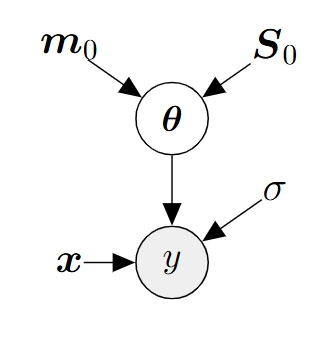
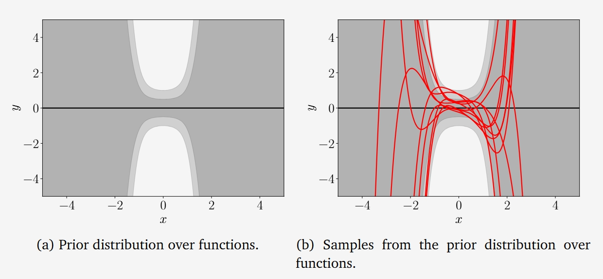
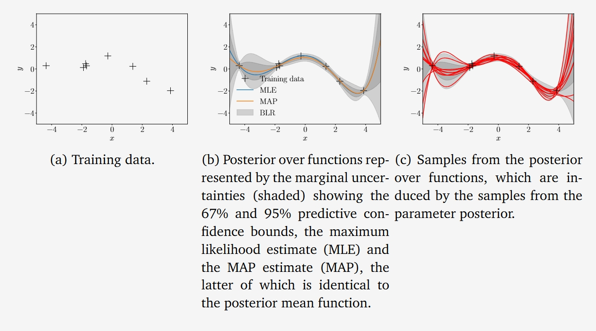
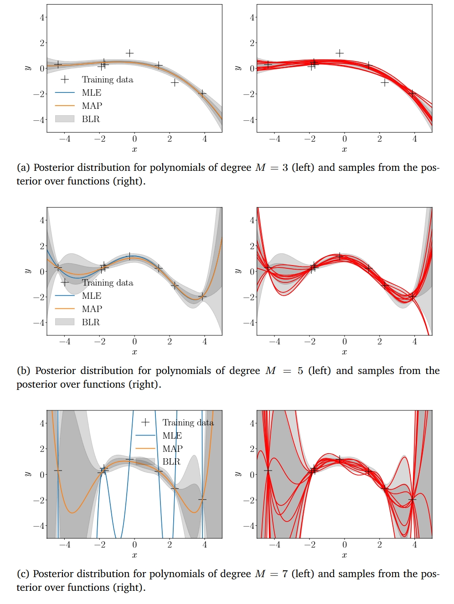
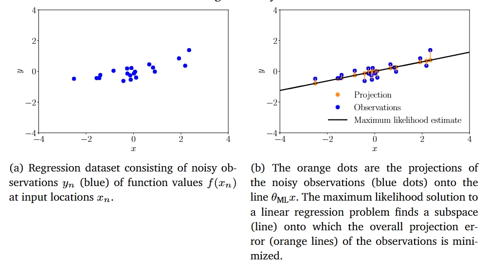

## 9.3 贝叶斯线性回归

在前面的内容中，我们讨论了线性回归模型，其中我们通过最大似然估计或MAP估计来估计模型参数  $ \theta $ 。我们发现，最大似然估计可能会导致严重的过拟合，尤其是在小数据情况下。MAP估计通过在参数上放置先验分布来缓解这一问题，起到了正则化的作用。贝叶斯线性回归（Bayesian Linear Regression）将参数先验的概念进一步推进，不再尝试计算参数的点估计，而是考虑参数的完整后验分布，并在进行预测时将其纳入考虑。这意味着我们不拟合任何参数，而是对所有合理的参数设置（根据后验分布）进行平均。

### 9.3.1 模型

在贝叶斯线性回归中，我们考虑以下模型：

$$ 
\text{先验分布}：  p(\theta) = \mathcal{N}(\theta | m_0, S_0) \\
\text{似然函数}： p(y | x, \theta) = \mathcal{N}(y | \phi(x)^\top \theta, \sigma^2) \tag{9.35}
 $$ 

其中，我们明确地在  $ \theta $  上放置了一个高斯先验  $ p(\theta) = \mathcal{N}(\theta | m_0, S_0) $ ，这使得参数向量成为一个随机变量。这允许我们写出对应的概率图模型，如图9.8所示，其中我们将高斯先验的参数明确表示出来。

  
*图9.8: 贝叶斯线性回归的概率图模型。*

完整的概率模型，即观测和未观测随机变量  $ y $  和  $ \theta $  的联合分布为：

 $$
p(y, \theta | x) = p(y | x, \theta) p(\theta) \tag{9.36}
$$ 

### 9.3.2 先验预测

在实践中，我们通常对参数值  $ \theta $  本身并不感兴趣。相反，我们的关注点往往在于使用这些参数值进行的预测。在贝叶斯设置中，我们取参数分布，并在进行预测时对所有合理的参数设置进行平均。具体来说，为了在输入  $ x^* $  处进行预测，我们对  $ \theta $  进行积分，得到：

 $$
p(y^* | x^*) = \int p(y^* | x^*, \theta) p(\theta) d\theta = \mathbb{E}_{\theta}[p(y^* | x^*, \theta)] \tag{9.37}
$$ 

这可以被解释为对所有合理的参数  $ \theta $ （根据先验分布  $ p(\theta) $ ）的平均预测  $ y^* | x^*, \theta $ 。注意，使用先验分布进行预测仅需要我们指定输入  $ x^* $ ，而不需要训练数据。在我们的模型（式(9.35)）中，我们选择了一个共轭（高斯）先验  $ p(\theta) = \mathcal{N}(\theta | m_0, S_0) $ ，因此预测分布也是高斯的（并且可以以闭形式计算）：

 $$
p(y^* | x^*) = \mathcal{N}(y^* | \phi(x^*)^\top m_0, \phi(x^*)^\top S_0 \phi(x^*) + \sigma^2) \tag{9.38}
$$ 

其中，我们利用了以下事实：（i）由于共轭性（见第6.6节）和高斯分布的边缘化性质（见第6.5节），预测是高斯的；（ii）高斯噪声是独立的，因此

 $$
\text{Var}[y^*] = \text{Var}_{\theta}[\phi(x^*)^\top \theta] + \text{Var}_{\epsilon}[\epsilon] \tag{9.39}
$$ 

（iii） $ y^* $  是  $ \theta $  的线性变换，因此我们可以利用（6.50）和（6.51）的规则，分别计算预测的均值和协方差。在式(9.38)中，预测方差中的  $ \phi(x^*)^\top S_0 \phi(x^*) $  项明确地考虑了与参数  $ \theta $  相关的不确定性，而  $ \sigma^2 $  是由于测量噪声导致的不确定性贡献。如果我们感兴趣的是预测无噪声函数值  $ f(x^*) = \phi(x^*)^\top \theta $ ，而不是噪声干扰的目标  $ y^* $ ，我们得到：

 $$
p(f(x^*)) = \mathcal{N}(f(x^*) | \phi(x^*)^\top m_0, \phi(x^*)^\top S_0 \phi(x^*)) \tag{9.40}
$$ 

这与式(9.38)的区别仅在于省略了噪声方差  $ \sigma^2 $ 。

**注释（函数分布）**。由于我们可以使用一组样本  $ \theta_i $  来表示分布  $ p(\theta) $ ，并且每个样本  $ \theta_i $  都产生一个函数  $ f_i(\cdot) = \theta_i^\top \phi(\cdot) $ ，因此参数分布  $ p(\theta) $  诱导了一个函数分布  $ p(f(\cdot)) $ 。这里我们使用  $ (\cdot) $  明确表示函数关系。

> **示例 9.7（先验函数分布）**
考虑一个贝叶斯线性回归问题，其中多项式的阶数为5。我们选择参数先验  $ p(\theta) = \mathcal{N}(\theta | 0, \frac{1}{4} I) $ 。图9.9展示了由该参数先验诱导的先验函数分布（阴影区域：深灰色表示67\%置信区间；浅灰色表示95\%置信区间），以及从该先验中采样得到的一些函数样本。函数样本是通过首先从参数先验  $ p(\theta) $  中采样一个参数向量  $ \theta_i $ ，然后计算  $ f_i(\cdot) = \theta_i^\top \phi(\cdot) $  得到的。我们使用了200个输入位置  $ x^* \in [-5, 5] $ ，并将特征函数  $ \phi(\cdot) $  应用于这些位置。图9.9中的不确定性（由阴影区域表示）仅由于参数不确定性引起，因为我们考虑的是无噪声的预测分布（式(9.40)）。
>   
> *图9.9: 先验函数分布。 (a) 由均值函数（黑线）和边缘不确定性（阴影区域）表示的分布，分别表示67\%和95\%置信区间； (b) 从先验函数分布中采样的样本，这些样本由参数先验的样本诱导。*
> 到目前为止，我们讨论了如何使用参数先验  $ p(\theta) $  进行预测。然而，当我们有一个参数后验（给定一些训练数据  $ X, Y $ ）时，预测和推理的原则与式(9.37)相同——我们只需要将先验  $ p(\theta) $  替换为后验  $ p(\theta | X, Y) $ 。在接下来的内容中，我们将详细推导后验分布，然后使用它进行预测。

### 9.3.3 后验分布

给定一组训练输入  $ x_n \in \mathbb{R}^D $  和对应的观测值  $ y_n \in \mathbb{R} $ ， $ n = 1, \ldots, N $ ，我们使用贝叶斯定理计算参数的后验分布：

 $$
p(\theta | X, Y) = \frac{p(Y | X, \theta) p(\theta)}{p(Y | X)} \tag{9.41}
$$ 

其中， $ X $  是训练输入的集合， $ Y $  是对应的训练目标值的集合。此外， $ p(Y | X, \theta) $  是似然函数， $ p(\theta) $  是参数先验，而

 $$
p(Y | X) = \int p(Y | X, \theta) p(\theta) d\theta = \mathbb{E}_{\theta}[p(Y | X, \theta)] \tag{9.42}
$$ 

是边际似然（证据），它与参数  $ \theta $  无关，并确保后验分布是归一化的，即它积分等于1。我们可以将边际似然视为在先验分布  $ p(\theta) $  下的期望似然。

**定理 9.1（参数后验）** 在我们的模型（式(9.35)）中，参数后验（式(9.41)）可以以闭形式计算为：

 $$
p(\theta | X, Y) = \mathcal{N}(\theta | m_N, S_N) \tag{9.43a}
$$ 

其中

 $$
S_N = (S_0^{-1} + \sigma^{-2} \Phi^\top \Phi)^{-1} \tag{9.43b}
$$ 

 $$
m_N = S_N (S_0^{-1} m_0 + \sigma^{-2} \Phi^\top y) \tag{9.43c}
$$ 

这里，下标  $ N $  表示训练集的大小。

**证明** 贝叶斯定理告诉我们，后验  $ p(\theta | X, Y) $  与似然  $ p(Y | X, \theta) $  和先验  $ p(\theta) $  的乘积成比例：

 $$
\text{后验 } p(\theta | X, Y) = \frac{p(Y | X, \theta) p(\theta)}{p(Y | X)} \tag{9.44a}
$$ 

 $$
\text{似然 } p(Y | X, \theta) = \mathcal{N}(y | \Phi \theta, \sigma^2 I) \tag{9.44b}
$$ 

 $$
\text{先验 } p(\theta) = \mathcal{N}(\theta | m_0, S_0) \tag{9.44c}
$$ 

与其考虑似然和先验的乘积，我们可以在对数空间中进行变换，并通过对数似然和对数先验的和来求解后验的均值和协方差。对数似然和对数先验的和为：

 $$
\log \mathcal{N}(y | \Phi \theta, \sigma^2 I) + \log \mathcal{N}(\theta | m_0, S_0) \tag{9.45a}
$$ 

 $$
= -\frac{1}{2} \left( \sigma^{-2} (y - \Phi \theta)^\top (y - \Phi \theta) + (\theta - m_0)^\top S_0^{-1} (\theta - m_0) \right) + \text{常数} \tag{9.45b}
$$ 

其中常数包含与  $ \theta $  无关的项。在接下来的推导中，我们忽略这些常数项。现在我们对式(9.45b)进行因式分解，得到：

 $$
-\frac{1}{2} \left( \sigma^{-2} y^\top y - 2 \sigma^{-2} y^\top \Phi \theta + \theta^\top \sigma^{-2} \Phi^\top \Phi \theta + \theta^\top S_0^{-1} \theta - 2 m_0^\top S_0^{-1} \theta + m_0^\top S_0^{-1} m_0 \right) \tag{9.46a}
$$ 

 $$
= -\frac{1}{2} \left( \theta^\top (\sigma^{-2} \Phi^\top \Phi + S_0^{-1}) \theta - 2 (\sigma^{-2} \Phi^\top y + S_0^{-1} m_0)^\top \theta \right) + \text{常数} \tag{9.46b}
$$ 

其中，橙色部分是与  $ \theta $  线性相关的项，蓝色部分是与  $ \theta $  二次相关的项。观察式(9.46b)，我们发现这个表达式是关于  $ \theta $  的二次形式。未归一化的对数后验分布是负的二次形式这一事实表明，后验分布是高斯的，即：

 $$
p(\theta | X, Y) = \exp(\log p(\theta | X, Y)) \propto \exp(\log p(Y | X, \theta) + \log p(\theta)) \tag{9.47a}
$$ 

 $$
\propto \exp \left( -\frac{1}{2} \left( \theta^\top (\sigma^{-2} \Phi^\top \Phi + S_0^{-1}) \theta - 2 (\sigma^{-2} \Phi^\top y + S_0^{-1} m_0)^\top \theta \right) \right) \tag{9.47b}
$$ 

接下来的任务是将这个未归一化的高斯分布转换为与  $ \mathcal{N}(\theta | m_N, S_N) $  成比例的形式，即我们需要确定均值  $ m_N $  和协方差矩阵  $ S_N $ 。为此，我们使用“补全平方”的方法。期望的对数后验形式为：

 $$
\log \mathcal{N}(\theta | m_N, S_N) = -\frac{1}{2} (\theta - m_N)^\top S_N^{-1} (\theta - m_N) + \text{常数} \tag{9.48a}
$$ 

 $$
= -\frac{1}{2} \left( \theta^\top S_N^{-1} \theta - 2 m_N^\top S_N^{-1} \theta + m_N^\top S_N^{-1} m_N \right) \tag{9.48b}
$$ 

这里，我们将二次项  $ (\theta - m_N)^\top S_N^{-1} (\theta - m_N) $  分解为仅与  $ \theta $  二次相关的项（蓝色）、与  $ \theta $  线性相关的项（橙色）和常数项（黑色）。这使我们能够通过匹配式(9.46b)和式(9.48b)中的彩色表达式来确定  $ S_N $  和  $ m_N $ ，从而得到：

 $$
S_N^{-1} = \sigma^{-2} \Phi^\top \Phi + S_0^{-1} \tag{9.49a}
$$ 

 $$
\Longleftrightarrow S_N = (\sigma^{-2} \Phi^\top \Phi + S_0^{-1})^{-1} \tag{9.49b}
$$ 

以及

 $$
m_N^\top S_N^{-1} = (\sigma^{-2} \Phi^\top y + S_0^{-1} m_0)^\top \tag{9.50a}
$$ 

 $$
\Longleftrightarrow m_N = S_N (\sigma^{-2} \Phi^\top y + S_0^{-1} m_0) \tag{9.50b}
$$ 

**注释（补全平方的一般方法）** 如果我们有一个方程

 $$
x^\top A x - 2 a^\top x + \text{常数}_1 \tag{9.51}
$$ 

其中  $ A $  是对称且正定的矩阵，我们希望将其转换为以下形式：

 $$
(x - \mu)^\top \Sigma (x - \mu) + \text{常数}_2 \tag{9.52}
$$ 

我们可以通过以下方式实现：

 $$
\Sigma := A \tag{9.53}
$$ 

 $$
\mu := \Sigma^{-1} a \tag{9.54}
$$ 

以及

 $$
\text{常数}_2 = \text{常数}_1 - \mu^\top \Sigma \mu
$$ 

**注释** 由于  $ p(\theta | X, Y) = \mathcal{N}(\theta | m_N, S_N) $ ，因此  $ \theta_{\text{MAP}} = m_N $ 。在我们的模型中， $ \Phi $  和  $ S_0 $  是已知的，因此  $ S_N $  和  $ m_N $  可以直接计算得到。这表明，贝叶斯线性回归的后验均值  $ m_N $  与最大后验估计  $ \theta_{\text{MAP}} $  是一致的。然而，贝叶斯方法不仅提供了一个点估计，还提供了一个完整的后验分布，这使得我们可以对参数的不确定性进行量化。这种不确定性在预测新数据时尤其重要，因为它允许我们评估模型预测的置信度。接下来，我们将利用这个后验分布来进行预测。

### 9.3.4 后验预测

在式(9.37)中，我们使用参数先验  $ p(\theta) $  在测试输入  $ x^* $  处计算预测分布  $ p(y^* | x^*) $ 。从原理上讲，使用参数后验  $ p(\theta | X, Y) $  进行预测与使用先验并无本质区别，因为在我们的共轭模型中，先验和后验都是高斯分布（只是参数不同）。因此，按照与第9.3.2节相同的推理，我们得到（后验）预测分布：

 $$
p(y^* | X, Y, x^*) = \int p(y^* | x^*, \theta) p(\theta | X, Y) d\theta \tag{9.57a}
$$ 

 $$
= \int \mathcal{N}(y^* | \phi(x^*)^\top \theta, \sigma^2) \mathcal{N}(\theta | m_N, S_N) d\theta \tag{9.57b}
$$ 

 $$
= \mathcal{N}(y^* | \phi(x^*)^\top m_N, \phi(x^*)^\top S_N \phi(x^*) + \sigma^2) \tag{9.57c}
$$ 

其中， $ \phi(x^*)^\top S_N \phi(x^*) $  反映了与参数  $ \theta $  相关的后验不确定性。注意， $ S_N $  依赖于训练输入，通过  $ \Phi $  体现；见式(9.43b)。预测均值  $ \phi(x^*)^\top m_N $  与使用MAP估计  $ \theta_{\text{MAP}} $  进行预测的结果一致。

**注释（边际似然与后验预测分布）** 通过替换式(9.57a)中的积分，预测分布也可以等价地表示为  $ \mathbb{E}_{\theta | X, Y}[p(y^* | x^*, \theta)] $ ，其中期望是相对于参数后验  $ p(\theta | X, Y) $  取的。以这种方式写出后验预测分布，突显了它与边际似然（式(9.42)）之间的密切相似性。边际似然与后验预测分布之间的关键区别在于：（i）边际似然可以被认为是在先验下对训练目标  $ y $  的预测，而不是对测试目标  $ y^* $  的预测；（ii）边际似然是对参数先验的平均，而不是对参数后验的平均。

**注释（无噪声函数值的均值和方差）** 在许多情况下，我们感兴趣的不是带噪声观测  $ y^* $  的预测分布  $ p(y^* | X, Y, x^*) $ ，而是无噪声函数值  $ f(x^*) = \phi(x^*)^\top \theta $  的分布。我们可以通过利用均值和方差的性质来确定相应的矩：

 $$
\mathbb{E}[f(x^*) | X, Y] = \mathbb{E}_{\theta}[\phi(x^*)^\top \theta | X, Y] = \phi(x^*)^\top \mathbb{E}_{\theta}[\theta | X, Y] = \phi(x^*)^\top m_N = m_N^\top \phi(x^*) \tag{9.58}
$$ 

 $$
\text{Var}_{\theta}[f(x^*) | X, Y] = \text{Var}_{\theta}[\phi(x^*)^\top \theta | X, Y] = \phi(x^*)^\top \text{Var}_{\theta}[\theta | X, Y] \phi(x^*) = \phi(x^*)^\top S_N \phi(x^*) \tag{9.59}
$$ 

我们看到，预测均值与带噪声观测的预测均值相同，因为噪声的均值为0。预测方差仅在包含  $ \sigma^2 $  时有所不同，这是测量噪声的方差。当我们预测带噪声的函数值时，需要将  $ \sigma^2 $  作为不确定性的一个来源包括在内，但对于无噪声预测，这个项是不需要的。这里，唯一的剩余不确定性来自于参数后验。

**注释（函数分布）** 由于我们对参数  $ \theta $  进行了积分，这诱导了一个函数分布：如果我们从参数后验  $ p(\theta | X, Y) $  中采样  $ \theta_i $ ，我们得到一个函数实现  $ \theta_i^\top \phi(\cdot) $ 。这个函数分布的均值函数，即所有期望函数值  $ \mathbb{E}_{\theta}[f(\cdot) | \theta, X, Y] $  的集合，是  $ m_N^\top \phi(\cdot) $ 。函数  $ f(\cdot) $  的（边缘）方差由  $ \phi(\cdot)^\top S_N \phi(\cdot) $  给出。

### 示例 9.8（后验函数分布）

让我们重新审视多项式阶数为5的贝叶斯线性回归问题。我们选择参数先验  $ p(\theta) = \mathcal{N}(0, \frac{1}{4} I) $ 。图9.9展示了由参数先验诱导的先验函数分布，并从该先验中采样得到的函数样本。

> 图9.10展示了通过贝叶斯线性回归得到的后验函数分布。训练数据集如图(a)所示；图(b)展示了后验函数分布，包括通过最大似然和MAP估计得到的函数。MAP估计也对应于贝叶斯线性回归设置中的后验均值函数。图(c)展示了从后验函数分布中采样的函数样本。
> 
> *图9.10 贝叶斯线性回归和后验函数分布。 (a) 训练数据；(b) 后验函数分布，包括通过最大似然和MAP估计得到的函数。MAP估计也对应于贝叶斯线性回归设置中的后验均值函数。 (c) 从后验函数分布中采样的函数样本。*

*图9.11 不同多项式阶数的贝叶斯线性回归。左侧图：阴影区域表示67\%（深灰色）和95\%（浅灰色）预测置信区间。贝叶斯线性回归模型的均值与MAP估计一致。右侧图：从后验函数分布中采样的函数样本。*

图9.11展示了不同多项式阶数  $ M $  下的后验函数分布。左侧图展示了最大似然函数  $ \theta_{\text{ML}}^\top \phi(\cdot) $ 、MAP函数  $ \theta_{\text{MAP}}^\top \phi(\cdot) $ （与后验均值函数相同），以及由贝叶斯线性回归得到的67\%和95\%预测置信区间，用阴影区域表示。右侧图展示了从后验函数分布中采样的函数样本：我们从参数后验中采样参数  $ \theta_i $ ，并计算函数  $ \phi(x^*)^\top \theta_i $ ，这是在后验分布下函数的一个实现。对于低阶多项式，参数后验对参数的约束较弱：采样得到的函数几乎相同。当我们通过增加参数数量使模型更灵活（即得到更高阶的多项式）时，这些参数没有被后验充分约束，采样得到的函数可以很容易地区分开来。我们也可以从对应的左侧图中看到，不确定性在边界处尤其增大。尽管对于7阶多项式，MAP估计得到了一个合理的拟合，但贝叶斯线性回归模型还告诉我们，后验不确定性是巨大的。当我们将这些预测用于决策系统时，这种信息可能至关重要，因为错误的决策可能会产生严重的后果（例如在强化学习或机器人学中）。

### 9.3.5 计算边际似然

在第8.6.2节中，我们强调了边际似然在贝叶斯模型选择中的重要性。接下来，我们将计算贝叶斯线性回归的边际似然，其中参数具有共轭高斯先验，这正是我们在本章中讨论的设置。回顾一下，我们考虑以下生成过程：

 $$
\theta \sim \mathcal{N}(m_0, S_0) \tag{9.60a}
$$ 

 $$
y_n | x_n, \theta \sim \mathcal{N}(x_n^\top \theta, \sigma^2), \quad n = 1, \ldots, N \tag{9.60b}
$$ 

边际似然是

 $$
p(Y | X) = \int p(Y | X, \theta) p(\theta) d\theta \tag{9.61a}
$$ 

 $$
= \int \mathcal{N}(y | X \theta, \sigma^2 I) \mathcal{N}(\theta | m_0, S_0) d\theta \tag{9.61b}
$$ 

其中，我们对模型参数  $ \theta $  进行了积分。我们分两步计算边际似然：首先，我们证明边际似然是高斯分布（作为  $ y $  的分布）；其次，我们计算这个高斯分布的均值和协方差矩阵。

1. **边际似然是高斯分布**：从第6.5.2节中，我们知道（i）两个高斯随机变量的乘积是一个（未归一化的）高斯分布，以及（ii）高斯随机变量的线性变换也是高斯分布的。在式(9.61b)中，我们需要一个线性变换，将  $ \mathcal{N}(y | X \theta, \sigma^2 I) $  转换为  $ \mathcal{N}(\theta | \mu, \Sigma) $  的形式，其中  $ \mu $  和  $ \Sigma $  是某些参数。一旦完成这一转换，积分就可以用闭形式求解。结果是两个高斯分布乘积的归一化常数。归一化常数本身具有高斯形状；见式(6.76)。

2. **均值和协方差矩阵**：我们通过利用第6.4.4节中关于随机变量的仿射变换的均值和协方差的标准结果来计算边际似然的均值和协方差矩阵。边际似然的均值计算如下：

 $$
\mathbb{E}[Y | X] = \mathbb{E}_{\theta, \epsilon}[X \theta + \epsilon] = X \mathbb{E}_{\theta}[\theta] = X m_0 \tag{9.62}
$$ 

注意， $ \epsilon \sim \mathcal{N}(0, \sigma^2 I) $  是一个独立同分布的随机变量向量。协方差矩阵为：

 $$
\text{Cov}[Y | X] = \text{Cov}_{\theta, \epsilon}[X \theta + \epsilon] = \text{Cov}_{\theta}[X \theta] + \sigma^2 I \tag{9.63a}
$$ 

 $$
= X \text{Cov}_{\theta}[\theta] X^\top + \sigma^2 I = X S_0 X^\top + \sigma^2 I \tag{9.63b}
$$ 

*### 图 9.12: 最小二乘的几何解释。(a) 数据集；(b) 最大似然解的投影解释。*

因此，边际似然是

 $$
p(Y | X) = (2\pi)^{-\frac{N}{2}} \det(X S_0 X^\top + \sigma^2 I)^{-\frac{1}{2}} \tag{9.64a}
$$ 

 $$
\cdot \exp \left( -\frac{1}{2}(y - X m_0)^\top (X S_0 X^\top + \sigma^2 I)^{-1}(y - X m_0) \right)
$$ 

 $$
= \mathcal{N}(y | X m_0, X S_0 X^\top + \sigma^2 I) \tag{9.64b}
$$ 

鉴于与后验预测分布（见前面关于边际似然和后验预测分布的注释）的密切联系，边际似然的形式并不令人意外。

